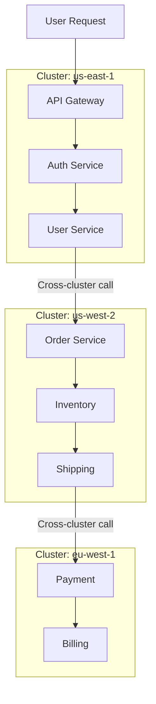

# Multi-Cluster Tracing with OpenTelemetry

[Nawaz Dhandala](https://github.com/nicksocial129) - December 17, 2025

**Tags:** OpenTelemetry, Kubernetes, Multi-Cluster, Distributed Tracing, Cloud Native, Federation

**Description:** Implement distributed tracing across multiple Kubernetes clusters using OpenTelemetry, handling cross-cluster context propagation, collector federation, and unified observability.

---

> Modern architectures span multiple clusters for high availability, geographic distribution, and workload isolation. OpenTelemetry enables unified observability across all of them.

Multi-cluster deployments introduce unique observability challenges. Traces cross cluster boundaries, telemetry must be aggregated from multiple sources, and maintaining context becomes complex. This guide shows you how to implement comprehensive multi-cluster tracing with OpenTelemetry.

## Table of Contents

1. [Multi-Cluster Architecture Patterns](#1-multi-cluster-architecture-patterns)
2. [Cross-Cluster Context Propagation](#2-cross-cluster-context-propagation)
3. [Collector Federation Strategies](#3-collector-federation-strategies)
4. [Cluster Identification and Tagging](#4-cluster-identification-and-tagging)
5. [Service Mesh Integration](#5-service-mesh-integration)
6. [Centralized vs Distributed Collection](#6-centralized-vs-distributed-collection)
7. [Handling Network Partitions](#7-handling-network-partitions)
8. [Best Practices](#8-best-practices)

## 1. Multi-Cluster Architecture Patterns

### Common Multi-Cluster Scenarios

| Pattern | Use Case | Tracing Challenge |
|---------|----------|-------------------|
| Active-Active | High availability | Correlating parallel requests |
| Active-Passive | Disaster recovery | Tracing during failover |
| Geographic | Latency optimization | Cross-region traces |
| Workload Isolation | Security/compliance | Unified view with separation |
| Hybrid Cloud | Cloud + on-prem | Different network policies |

### Multi-Cluster Trace Flow



## 2. Cross-Cluster Context Propagation

### HTTP Context Propagation

```typescript
// cross-cluster-client.ts
import { trace, context, propagation, SpanKind } from '@opentelemetry/api';

const tracer = trace.getTracer('cross-cluster-client');

interface CrossClusterRequest {
  targetCluster: string;
  targetService: string;
  path: string;
  method: string;
  body?: any;
}

async function makeClusterRequest(request: CrossClusterRequest): Promise<Response> {
  const span = tracer.startSpan(`cross-cluster.${request.targetCluster}`, {
    kind: SpanKind.CLIENT,
    attributes: {
      'rpc.system': 'http',
      'rpc.method': request.method,
      'server.address': request.targetService,
      'k8s.cluster.name': request.targetCluster,
      'cross_cluster.source': process.env.CLUSTER_NAME,
      'cross_cluster.target': request.targetCluster,
    },
  });

  // Prepare headers with trace context
  const headers: Record<string, string> = {
    'Content-Type': 'application/json',
    'X-Source-Cluster': process.env.CLUSTER_NAME || '',
    'X-Target-Cluster': request.targetCluster,
  };

  // Inject W3C trace context
  context.with(trace.setSpan(context.active(), span), () => {
    propagation.inject(context.active(), headers);
  });

  try {
    const url = resolveClusterEndpoint(request.targetCluster, request.targetService, request.path);

    const response = await fetch(url, {
      method: request.method,
      headers,
      body: request.body ? JSON.stringify(request.body) : undefined,
    });

    span.setAttribute('http.response.status_code', response.status);

    if (!response.ok) {
      span.setStatus({ code: 2, message: `HTTP ${response.status}` });
    }

    return response;
  } catch (error) {
    span.setStatus({ code: 2, message: (error as Error).message });
    span.recordException(error as Error);
    throw error;
  } finally {
    span.end();
  }
}

function resolveClusterEndpoint(cluster: string, service: string, path: string): string {
  // Could use service mesh, DNS, or custom service discovery
  const clusterEndpoints: Record<string, string> = {
    'us-east-1': 'https://api.us-east-1.example.com',
    'us-west-2': 'https://api.us-west-2.example.com',
    'eu-west-1': 'https://api.eu-west-1.example.com',
  };

  return `${clusterEndpoints[cluster]}/${service}${path}`;
}
```

### gRPC Cross-Cluster Propagation

```go
// cross_cluster_grpc.go
package main

import (
    "context"
    "google.golang.org/grpc"
    "google.golang.org/grpc/metadata"
    "go.opentelemetry.io/otel"
    "go.opentelemetry.io/otel/propagation"
    "go.opentelemetry.io/otel/trace"
)

var tracer = otel.Tracer("cross-cluster-grpc")

// Outgoing interceptor - adds trace context to cross-cluster calls
func CrossClusterUnaryClientInterceptor(
    ctx context.Context,
    method string,
    req, reply interface{},
    cc *grpc.ClientConn,
    invoker grpc.UnaryInvoker,
    opts ...grpc.CallOption,
) error {
    targetCluster := extractClusterFromAddress(cc.Target())
    sourceCluster := os.Getenv("CLUSTER_NAME")

    ctx, span := tracer.Start(ctx, "cross-cluster.grpc."+method,
        trace.WithSpanKind(trace.SpanKindClient),
        trace.WithAttributes(
            attribute.String("rpc.system", "grpc"),
            attribute.String("rpc.method", method),
            attribute.String("cross_cluster.source", sourceCluster),
            attribute.String("cross_cluster.target", targetCluster),
        ),
    )
    defer span.End()

    // Inject context into gRPC metadata
    md, ok := metadata.FromOutgoingContext(ctx)
    if !ok {
        md = metadata.New(nil)
    }

    // Add cluster identification
    md.Set("x-source-cluster", sourceCluster)
    md.Set("x-target-cluster", targetCluster)

    // Inject trace context
    otel.GetTextMapPropagator().Inject(ctx, &metadataCarrier{md})

    ctx = metadata.NewOutgoingContext(ctx, md)

    err := invoker(ctx, method, req, reply, cc, opts...)
    if err != nil {
        span.RecordError(err)
        span.SetStatus(codes.Error, err.Error())
    }

    return err
}

// Incoming interceptor - extracts trace context from cross-cluster calls
func CrossClusterUnaryServerInterceptor(
    ctx context.Context,
    req interface{},
    info *grpc.UnaryServerInfo,
    handler grpc.UnaryHandler,
) (interface{}, error) {
    md, ok := metadata.FromIncomingContext(ctx)
    if ok {
        // Extract trace context
        ctx = otel.GetTextMapPropagator().Extract(ctx, &metadataCarrier{md})

        // Get cluster info
        sourceCluster := ""
        if values := md.Get("x-source-cluster"); len(values) > 0 {
            sourceCluster = values[0]
        }

        // Start span with cross-cluster attributes
        ctx, span := tracer.Start(ctx, info.FullMethod,
            trace.WithSpanKind(trace.SpanKindServer),
            trace.WithAttributes(
                attribute.String("cross_cluster.source", sourceCluster),
                attribute.String("cross_cluster.target", os.Getenv("CLUSTER_NAME")),
            ),
        )
        defer span.End()

        return handler(ctx, req)
    }

    return handler(ctx, req)
}

type metadataCarrier struct {
    md metadata.MD
}

func (c *metadataCarrier) Get(key string) string {
    if values := c.md.Get(key); len(values) > 0 {
        return values[0]
    }
    return ""
}

func (c *metadataCarrier) Set(key, value string) {
    c.md.Set(key, value)
}

func (c *metadataCarrier) Keys() []string {
    keys := make([]string, 0, len(c.md))
    for k := range c.md {
        keys = append(keys, k)
    }
    return keys
}
```

## 3. Collector Federation Strategies

### Hub and Spoke Architecture

```yaml
# Spoke collector (per cluster)
# spoke-collector.yaml
apiVersion: v1
kind: ConfigMap
metadata:
  name: otel-collector-config
  namespace: observability
data:
  config.yaml: |
    receivers:
      otlp:
        protocols:
          grpc:
            endpoint: 0.0.0.0:4317
          http:
            endpoint: 0.0.0.0:4318

    processors:
      batch:
        timeout: 5s
        send_batch_size: 1024

      # Add cluster identification
      resource:
        attributes:
        - key: k8s.cluster.name
          value: ${CLUSTER_NAME}
          action: upsert
        - key: k8s.cluster.region
          value: ${CLUSTER_REGION}
          action: upsert
        - key: deployment.environment
          value: ${ENVIRONMENT}
          action: upsert

      # Memory management for local buffering
      memory_limiter:
        check_interval: 1s
        limit_percentage: 75
        spike_limit_percentage: 25

    exporters:
      # Forward to hub collector
      otlp/hub:
        endpoint: otel-hub-collector.central-observability.svc.cluster.local:4317
        tls:
          insecure: true
        retry_on_failure:
          enabled: true
          initial_interval: 5s
          max_interval: 30s
          max_elapsed_time: 300s

      # Local backup during hub unavailability
      file/backup:
        path: /data/traces-backup.json
        rotation:
          max_megabytes: 100
          max_days: 1

    service:
      pipelines:
        traces:
          receivers: [otlp]
          processors: [memory_limiter, resource, batch]
          exporters: [otlp/hub, file/backup]

---
# Hub collector (central)
# hub-collector.yaml
apiVersion: v1
kind: ConfigMap
metadata:
  name: otel-hub-collector-config
  namespace: central-observability
data:
  config.yaml: |
    receivers:
      otlp:
        protocols:
          grpc:
            endpoint: 0.0.0.0:4317

    processors:
      batch:
        timeout: 10s
        send_batch_size: 2048

      # Aggregate cross-cluster traces
      groupbytrace:
        wait_duration: 30s
        num_traces: 10000

      # Tail-based sampling across clusters
      tail_sampling:
        decision_wait: 30s
        num_traces: 50000
        policies:
        - name: errors
          type: status_code
          status_code:
            status_codes: [ERROR]
        - name: slow-traces
          type: latency
          latency:
            threshold_ms: 2000
        - name: cross-cluster
          type: string_attribute
          string_attribute:
            key: cross_cluster.target
            values: [".*"]
            enabled_regex_matching: true
        - name: sample-remainder
          type: probabilistic
          probabilistic:
            sampling_percentage: 10

    exporters:
      otlphttp:
        endpoint: https://otlp.oneuptime.com
        headers:
          x-oneuptime-token: ${ONEUPTIME_TOKEN}

    service:
      pipelines:
        traces:
          receivers: [otlp]
          processors: [groupbytrace, tail_sampling, batch]
          exporters: [otlphttp]
```

### Peer-to-Peer Federation

```yaml
# peer-collector.yaml
apiVersion: v1
kind: ConfigMap
metadata:
  name: otel-peer-collector-config
data:
  config.yaml: |
    receivers:
      otlp:
        protocols:
          grpc:
            endpoint: 0.0.0.0:4317

      # Receive from peer clusters
      otlp/peers:
        protocols:
          grpc:
            endpoint: 0.0.0.0:4318

    processors:
      batch: {}

      resource:
        attributes:
        - key: k8s.cluster.name
          value: ${CLUSTER_NAME}
          action: upsert

      # Deduplicate spans received from multiple paths
      span_dedup:
        wait_duration: 10s

    exporters:
      # Send to backend
      otlphttp:
        endpoint: https://otlp.oneuptime.com

      # Send to peer clusters for trace completion
      loadbalancing:
        protocol:
          otlp:
            tls:
              insecure: true
        resolver:
          dns:
            hostname: otel-collector-peers.${CLUSTER_NAME}
            port: 4318

    service:
      pipelines:
        traces/local:
          receivers: [otlp]
          processors: [resource, batch]
          exporters: [otlphttp, loadbalancing]

        traces/peers:
          receivers: [otlp/peers]
          processors: [span_dedup, batch]
          exporters: [otlphttp]
```

## 4. Cluster Identification and Tagging

### Automatic Cluster Detection

```yaml
# cluster-detector-deployment.yaml
apiVersion: apps/v1
kind: DaemonSet
metadata:
  name: otel-cluster-detector
  namespace: observability
spec:
  selector:
    matchLabels:
      app: otel-cluster-detector
  template:
    spec:
      serviceAccountName: otel-collector
      containers:
      - name: collector
        image: otel/opentelemetry-collector-contrib:latest
        env:
        - name: CLUSTER_NAME
          valueFrom:
            configMapKeyRef:
              name: cluster-info
              key: cluster-name
        - name: CLUSTER_REGION
          valueFrom:
            configMapKeyRef:
              name: cluster-info
              key: region
        - name: NODE_NAME
          valueFrom:
            fieldRef:
              fieldPath: spec.nodeName
        - name: POD_NAMESPACE
          valueFrom:
            fieldRef:
              fieldPath: metadata.namespace
```

### Resource Detection Configuration

```yaml
# collector-with-detection.yaml
processors:
  resourcedetection:
    detectors:
    - env
    - system
    - docker
    - kubernetes_node

    # Kubernetes detection
    k8snode:
      auth_type: serviceAccount
      context: ""
      node_from_env_var: NODE_NAME

  resource:
    attributes:
    # Add cluster name from environment
    - key: k8s.cluster.name
      value: ${CLUSTER_NAME}
      action: upsert

    # Add region
    - key: cloud.region
      value: ${CLUSTER_REGION}
      action: upsert

    # Add availability zone from node labels
    - key: cloud.availability_zone
      from_attribute: k8s.node.labels.topology.kubernetes.io/zone
      action: insert

    # Add cloud provider
    - key: cloud.provider
      value: ${CLOUD_PROVIDER}
      action: upsert

  k8sattributes:
    auth_type: serviceAccount
    passthrough: false
    extract:
      metadata:
      - k8s.pod.name
      - k8s.pod.uid
      - k8s.deployment.name
      - k8s.namespace.name
      - k8s.node.name
      - k8s.pod.start_time
      labels:
      - tag_name: app.kubernetes.io/name
        key: app.kubernetes.io/name
      - tag_name: app.kubernetes.io/version
        key: app.kubernetes.io/version
```

### Application-Level Cluster Context

```typescript
// cluster-context.ts
import { trace, context } from '@opentelemetry/api';
import { Resource } from '@opentelemetry/resources';
import { SemanticResourceAttributes } from '@opentelemetry/semantic-conventions';

// Create resource with cluster info
function createClusterResource(): Resource {
  return new Resource({
    [SemanticResourceAttributes.SERVICE_NAME]: process.env.SERVICE_NAME,
    [SemanticResourceAttributes.SERVICE_VERSION]: process.env.SERVICE_VERSION,
    'k8s.cluster.name': process.env.CLUSTER_NAME,
    'k8s.cluster.region': process.env.CLUSTER_REGION,
    'k8s.namespace.name': process.env.POD_NAMESPACE,
    'k8s.pod.name': process.env.POD_NAME,
    'cloud.provider': process.env.CLOUD_PROVIDER,
    'cloud.region': process.env.CLOUD_REGION,
    'deployment.environment': process.env.ENVIRONMENT,
  });
}

// Add cluster context to spans
function addClusterContext(span: any) {
  span.setAttribute('k8s.cluster.name', process.env.CLUSTER_NAME);

  // Add cross-cluster info if applicable
  const sourceCluster = context.active().getValue(Symbol.for('source_cluster'));
  if (sourceCluster) {
    span.setAttribute('cross_cluster.source', sourceCluster);
    span.setAttribute('cross_cluster.target', process.env.CLUSTER_NAME);
  }
}
```

## 5. Service Mesh Integration

### Istio Multi-Cluster Tracing

```yaml
# istio-multicluster-tracing.yaml
apiVersion: install.istio.io/v1alpha1
kind: IstioOperator
metadata:
  name: istio-multicluster
spec:
  meshConfig:
    enableTracing: true
    defaultConfig:
      tracing:
        sampling: 100.0
        zipkin:
          address: otel-collector.observability:9411

    # Enable cross-cluster context propagation
    defaultProviders:
      tracing:
      - name: otel-tracing

  values:
    global:
      # Multi-cluster settings
      multiCluster:
        enabled: true
        clusterName: ${CLUSTER_NAME}

      # Network for multi-cluster
      network: ${CLUSTER_NETWORK}

      # Mesh ID for federation
      meshID: global-mesh

---
# Telemetry configuration for multi-cluster
apiVersion: telemetry.istio.io/v1alpha1
kind: Telemetry
metadata:
  name: multicluster-tracing
  namespace: istio-system
spec:
  tracing:
  - providers:
    - name: otel-tracing
    customTags:
      cluster:
        literal:
          value: ${CLUSTER_NAME}
      mesh:
        literal:
          value: global-mesh
```

### Linkerd Multi-Cluster Tracing

```yaml
# linkerd-multicluster.yaml
apiVersion: v1
kind: ConfigMap
metadata:
  name: linkerd-config
  namespace: linkerd
data:
  values: |
    tracing:
      enabled: true
      collector:
        name: otel-collector
        namespace: observability

    # Multi-cluster configuration
    multicluster:
      enabled: true
      remoteClusters:
      - name: cluster-us-west-2
        domain: us-west-2.example.com
      - name: cluster-eu-west-1
        domain: eu-west-1.example.com
```

## 6. Centralized vs Distributed Collection

### Comparison

| Approach | Pros | Cons |
|----------|------|------|
| Centralized Hub | Simple management, unified sampling | Single point of failure, network dependency |
| Distributed Peers | Resilient, local processing | Complex configuration, data duplication |
| Hybrid | Best of both | More complex to set up |

### Hybrid Architecture

```yaml
# hybrid-collector.yaml
apiVersion: v1
kind: ConfigMap
metadata:
  name: hybrid-collector-config
data:
  config.yaml: |
    receivers:
      otlp:
        protocols:
          grpc:
            endpoint: 0.0.0.0:4317

    processors:
      batch: {}

      # Local sampling for high-volume data
      probabilistic_sampler:
        sampling_percentage: 50

      resource:
        attributes:
        - key: k8s.cluster.name
          value: ${CLUSTER_NAME}
          action: upsert

    exporters:
      # Primary: Send to regional hub
      otlp/regional-hub:
        endpoint: otel-hub-${REGION}.example.com:4317
        tls:
          insecure: false

      # Backup: Direct to backend during hub failure
      otlphttp/direct:
        endpoint: https://otlp.oneuptime.com
        headers:
          x-oneuptime-token: ${ONEUPTIME_TOKEN}

      # Local storage for buffering
      file:
        path: /data/traces.json

    extensions:
      health_check:
        endpoint: 0.0.0.0:13133

      # Circuit breaker for failover
      pprof:
        endpoint: 0.0.0.0:1777

    connectors:
      failover:
        primary: otlp/regional-hub
        fallback:
        - otlphttp/direct

    service:
      extensions: [health_check, pprof]
      pipelines:
        traces:
          receivers: [otlp]
          processors: [probabilistic_sampler, resource, batch]
          exporters: [failover]
```

## 7. Handling Network Partitions

### Local Buffering Configuration

```yaml
# buffered-collector.yaml
processors:
  memory_limiter:
    check_interval: 1s
    limit_percentage: 80
    spike_limit_percentage: 20

exporters:
  otlp/primary:
    endpoint: otel-hub.example.com:4317
    timeout: 10s
    retry_on_failure:
      enabled: true
      initial_interval: 5s
      max_interval: 60s
      max_elapsed_time: 3600s  # 1 hour retry
    sending_queue:
      enabled: true
      num_consumers: 10
      queue_size: 10000
      storage: file_storage

  # Persistent queue storage
  file_storage:
    directory: /var/lib/otelcol/storage
    timeout: 10s
    compaction:
      on_start: true
      directory: /var/lib/otelcol/storage/compaction
      max_transaction_size: 65536

extensions:
  file_storage:
    directory: /var/lib/otelcol/storage
```

### Failover Strategy

```typescript
// failover-exporter.ts
import { trace, context } from '@opentelemetry/api';

interface ExporterConfig {
  primary: string;
  fallback: string[];
  healthCheckInterval: number;
}

class FailoverExporter {
  private config: ExporterConfig;
  private primaryHealthy: boolean = true;
  private currentFallbackIndex: number = -1;
  private buffer: any[] = [];
  private maxBufferSize: number = 10000;

  constructor(config: ExporterConfig) {
    this.config = config;
    this.startHealthCheck();
  }

  async export(spans: any[]): Promise<void> {
    const endpoint = this.getActiveEndpoint();

    try {
      await this.sendToEndpoint(endpoint, spans);

      // If using fallback and primary is back, flush buffer
      if (this.currentFallbackIndex >= 0 && this.primaryHealthy) {
        await this.flushBuffer();
        this.currentFallbackIndex = -1;
      }
    } catch (error) {
      // Buffer spans and try fallback
      this.bufferSpans(spans);
      await this.tryFallback(spans);
    }
  }

  private getActiveEndpoint(): string {
    if (this.primaryHealthy && this.currentFallbackIndex === -1) {
      return this.config.primary;
    }
    return this.config.fallback[this.currentFallbackIndex] || this.config.primary;
  }

  private async tryFallback(spans: any[]): Promise<void> {
    for (let i = 0; i < this.config.fallback.length; i++) {
      try {
        await this.sendToEndpoint(this.config.fallback[i], spans);
        this.currentFallbackIndex = i;
        return;
      } catch {
        continue;
      }
    }

    // All fallbacks failed, keep in buffer
    console.error('All exporters failed, spans buffered');
  }

  private bufferSpans(spans: any[]): void {
    this.buffer.push(...spans);

    // Limit buffer size
    if (this.buffer.length > this.maxBufferSize) {
      this.buffer = this.buffer.slice(-this.maxBufferSize);
    }
  }

  private async flushBuffer(): Promise<void> {
    if (this.buffer.length === 0) return;

    try {
      await this.sendToEndpoint(this.config.primary, this.buffer);
      this.buffer = [];
    } catch {
      // Keep buffer for next attempt
    }
  }

  private startHealthCheck(): void {
    setInterval(async () => {
      try {
        await fetch(`${this.config.primary}/health`);
        this.primaryHealthy = true;
      } catch {
        this.primaryHealthy = false;
      }
    }, this.config.healthCheckInterval);
  }
}
```

## 8. Best Practices

### Multi-Cluster Tracing Checklist

| Practice | Description | Priority |
|----------|-------------|----------|
| Consistent cluster naming | Use same naming convention | Critical |
| Context propagation | Ensure headers cross boundaries | Critical |
| Resource attribution | Add cluster to all spans | High |
| Sampling coordination | Consistent sampling across clusters | High |
| Time synchronization | NTP on all clusters | High |
| Failover handling | Buffer during partitions | Medium |
| Cross-cluster latency | Monitor inter-cluster calls | Medium |

### Naming Conventions

```yaml
# Recommended cluster naming
clusters:
  # Format: <provider>-<region>-<purpose>-<number>
  - name: aws-us-east-1-prod-01
    region: us-east-1
    environment: production

  - name: aws-us-west-2-prod-01
    region: us-west-2
    environment: production

  - name: gcp-europe-west1-staging-01
    region: europe-west1
    environment: staging

# Service naming across clusters
services:
  # Format: <service-name>.<namespace>.<cluster>
  - api-gateway.default.aws-us-east-1-prod-01
  - order-service.orders.aws-us-west-2-prod-01
```

### Alerting for Cross-Cluster Issues

```yaml
# prometheus-alerts.yaml
groups:
- name: multi-cluster-alerts
  rules:
  - alert: CrossClusterLatencyHigh
    expr: |
      histogram_quantile(0.99,
        sum(rate(cross_cluster_request_duration_seconds_bucket[5m])) by (le, source_cluster, target_cluster)
      ) > 1
    for: 5m
    labels:
      severity: warning
    annotations:
      summary: High cross-cluster latency

  - alert: ClusterTracesPropagationFailure
    expr: |
      sum(rate(spans_without_parent_context_total[5m])) by (cluster)
      /
      sum(rate(spans_total[5m])) by (cluster)
      > 0.1
    for: 5m
    labels:
      severity: warning
    annotations:
      summary: Context propagation failing

  - alert: CollectorFederationDown
    expr: |
      up{job="otel-hub-collector"} == 0
    for: 2m
    labels:
      severity: critical
    annotations:
      summary: Hub collector unreachable
```

## Summary

Multi-cluster tracing with OpenTelemetry requires:

- **Consistent context propagation**: W3C trace context across all boundaries
- **Cluster identification**: Resource attributes on every span
- **Collector federation**: Hub-spoke, peer-to-peer, or hybrid
- **Resilience**: Handle network partitions gracefully
- **Service mesh integration**: Leverage existing mesh infrastructure

With proper setup, you can trace requests seamlessly across any number of clusters while maintaining a unified view of your distributed system.

## Trace Across Clusters with OneUptime

OneUptime provides native support for multi-cluster tracing, automatically correlating traces across cluster boundaries and providing unified dashboards for global visibility.

[Start Free Trial](https://oneuptime.com/signup) - Unified multi-cluster observability.

## See Also

- [OpenTelemetry for Kubernetes](/blog/opentelemetry-kubernetes-monitoring)
- [Service Mesh Integration](/blog/opentelemetry-service-mesh)
- [OpenTelemetry Collector Deep Dive](/blog/opentelemetry-collector)
