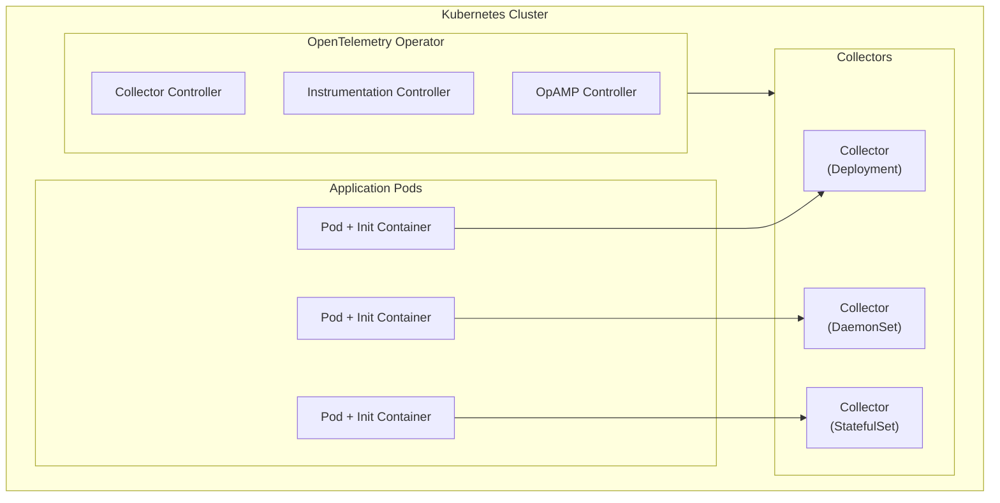

# OpenTelemetry Operator for Kubernetes: Automated Instrumentation at Scale

[Nawaz Dhandala](https://github.com/nicksocial129) - December 17, 2025

**Tags:** OpenTelemetry, Kubernetes, Operator, Auto-instrumentation, Cloud Native, DevOps

**Description:** Master the OpenTelemetry Operator for Kubernetes to achieve zero-code instrumentation, automatic sidecar injection, and scalable observability management.

---

> The OpenTelemetry Operator transforms Kubernetes observability from a manual, error-prone process into an automated, declarative experience that scales with your infrastructure.

Managing OpenTelemetry across hundreds of services in Kubernetes can be overwhelming. The OpenTelemetry Operator solves this by providing Kubernetes-native resources for deploying collectors and auto-instrumenting applications without code changes.

## Table of Contents

1. [Understanding the OpenTelemetry Operator](#1-understanding-the-opentelemetry-operator)
2. [Installation and Setup](#2-installation-and-setup)
3. [Deploying OpenTelemetry Collectors](#3-deploying-opentelemetry-collectors)
4. [Auto-Instrumentation Configuration](#4-auto-instrumentation-configuration)
5. [Language-Specific Auto-Instrumentation](#5-language-specific-auto-instrumentation)
6. [Advanced Operator Patterns](#6-advanced-operator-patterns)
7. [Multi-Tenancy and RBAC](#7-multi-tenancy-and-rbac)
8. [Production Operations](#8-production-operations)

## 1. Understanding the OpenTelemetry Operator

The OpenTelemetry Operator extends Kubernetes with custom resources for managing observability infrastructure.

### Custom Resource Definitions (CRDs)

| CRD | Purpose | Use Case |
|-----|---------|----------|
| OpenTelemetryCollector | Deploy and manage collectors | Centralized telemetry processing |
| Instrumentation | Configure auto-instrumentation | Zero-code instrumentation |
| OpAMPBridge | Remote management | Dynamic configuration |

### Architecture Overview



### How Auto-Instrumentation Works

1. **Admission Webhook**: Intercepts pod creation requests
2. **Init Container Injection**: Adds instrumentation agent as init container
3. **Environment Variables**: Configures SDK via environment variables
4. **Volume Mounts**: Shares agent libraries with application container
5. **Automatic Export**: Telemetry sent to configured collector

## 2. Installation and Setup

### Prerequisites

```bash
# Ensure cert-manager is installed (required for webhooks)
kubectl apply -f https://github.com/cert-manager/cert-manager/releases/download/v1.13.0/cert-manager.yaml

# Wait for cert-manager to be ready
kubectl wait --for=condition=available --timeout=300s deployment/cert-manager -n cert-manager
kubectl wait --for=condition=available --timeout=300s deployment/cert-manager-webhook -n cert-manager
```

### Install via Helm

```bash
# Add the OpenTelemetry Helm repository
helm repo add open-telemetry https://open-telemetry.github.io/opentelemetry-helm-charts
helm repo update

# Install the operator
helm install opentelemetry-operator open-telemetry/opentelemetry-operator \
  --namespace opentelemetry-operator-system \
  --create-namespace \
  --set admissionWebhooks.certManager.enabled=true \
  --set manager.collectorImage.repository=otel/opentelemetry-collector-contrib
```

### Install via kubectl

```bash
# Install the latest version
kubectl apply -f https://github.com/open-telemetry/opentelemetry-operator/releases/latest/download/opentelemetry-operator.yaml
```

### Verify Installation

```bash
# Check operator deployment
kubectl get deployment -n opentelemetry-operator-system

# Verify CRDs are installed
kubectl get crd | grep opentelemetry

# Check webhook configuration
kubectl get validatingwebhookconfigurations | grep opentelemetry
kubectl get mutatingwebhookconfigurations | grep opentelemetry
```

## 3. Deploying OpenTelemetry Collectors

### Collector Deployment Modes

| Mode | CRD Field | Use Case | Scaling |
|------|-----------|----------|---------|
| Deployment | `mode: deployment` | Centralized collection | HPA-based |
| DaemonSet | `mode: daemonset` | Per-node collection | Node count |
| StatefulSet | `mode: statefulset` | Stateful processing | Manual |
| Sidecar | `mode: sidecar` | Per-pod collection | Pod count |

### Deployment Mode Collector

```yaml
# collector-deployment.yaml
apiVersion: opentelemetry.io/v1alpha1
kind: OpenTelemetryCollector
metadata:
  name: otel-collector
  namespace: observability
spec:
  mode: deployment
  replicas: 3

  config: |
    receivers:
      otlp:
        protocols:
          grpc:
            endpoint: 0.0.0.0:4317
          http:
            endpoint: 0.0.0.0:4318

    processors:
      batch:
        timeout: 1s
        send_batch_size: 1024

      memory_limiter:
        check_interval: 1s
        limit_percentage: 75
        spike_limit_percentage: 25

      resource:
        attributes:
        - key: k8s.cluster.name
          value: production
          action: upsert

    exporters:
      otlphttp:
        endpoint: https://otlp.oneuptime.com
        headers:
          x-oneuptime-token: ${ONEUPTIME_TOKEN}

    service:
      pipelines:
        traces:
          receivers: [otlp]
          processors: [memory_limiter, batch, resource]
          exporters: [otlphttp]
        metrics:
          receivers: [otlp]
          processors: [memory_limiter, batch, resource]
          exporters: [otlphttp]
        logs:
          receivers: [otlp]
          processors: [memory_limiter, batch, resource]
          exporters: [otlphttp]

  env:
  - name: ONEUPTIME_TOKEN
    valueFrom:
      secretKeyRef:
        name: oneuptime-credentials
        key: token

  resources:
    requests:
      memory: "256Mi"
      cpu: "200m"
    limits:
      memory: "512Mi"
      cpu: "500m"

  autoscaler:
    minReplicas: 2
    maxReplicas: 10
    targetCPUUtilization: 80
```

### DaemonSet Mode Collector

```yaml
# collector-daemonset.yaml
apiVersion: opentelemetry.io/v1alpha1
kind: OpenTelemetryCollector
metadata:
  name: otel-collector-agent
  namespace: observability
spec:
  mode: daemonset

  config: |
    receivers:
      otlp:
        protocols:
          grpc:
            endpoint: 0.0.0.0:4317
          http:
            endpoint: 0.0.0.0:4318

      # Collect node metrics
      hostmetrics:
        collection_interval: 30s
        scrapers:
          cpu: {}
          memory: {}
          disk: {}
          network: {}

      # Collect container logs
      filelog:
        include:
        - /var/log/pods/*/*/*.log
        operators:
        - type: router
          routes:
          - output: parser-docker
            expr: 'body matches "^\\{"'

        - id: parser-docker
          type: json_parser

    processors:
      batch:
        timeout: 5s

      k8sattributes:
        auth_type: serviceAccount
        passthrough: false
        extract:
          metadata:
          - k8s.pod.name
          - k8s.namespace.name
          - k8s.deployment.name
          - k8s.node.name

    exporters:
      otlp:
        endpoint: otel-collector.observability:4317
        tls:
          insecure: true

    service:
      pipelines:
        traces:
          receivers: [otlp]
          processors: [batch, k8sattributes]
          exporters: [otlp]
        metrics:
          receivers: [otlp, hostmetrics]
          processors: [batch, k8sattributes]
          exporters: [otlp]
        logs:
          receivers: [filelog]
          processors: [batch, k8sattributes]
          exporters: [otlp]

  volumes:
  - name: varlog
    hostPath:
      path: /var/log
  - name: varlibdockercontainers
    hostPath:
      path: /var/lib/docker/containers

  volumeMounts:
  - name: varlog
    mountPath: /var/log
    readOnly: true
  - name: varlibdockercontainers
    mountPath: /var/lib/docker/containers
    readOnly: true

  tolerations:
  - operator: Exists
    effect: NoSchedule

  hostNetwork: true
```

### Sidecar Mode Collector

```yaml
# collector-sidecar.yaml
apiVersion: opentelemetry.io/v1alpha1
kind: OpenTelemetryCollector
metadata:
  name: sidecar-collector
  namespace: default
spec:
  mode: sidecar

  config: |
    receivers:
      otlp:
        protocols:
          grpc:
            endpoint: 0.0.0.0:4317

    processors:
      batch:
        timeout: 1s

    exporters:
      otlp:
        endpoint: otel-collector.observability:4317
        tls:
          insecure: true

    service:
      pipelines:
        traces:
          receivers: [otlp]
          processors: [batch]
          exporters: [otlp]

  resources:
    requests:
      memory: "64Mi"
      cpu: "50m"
    limits:
      memory: "128Mi"
      cpu: "100m"
```

To inject sidecar into pods:

```yaml
# pod-with-sidecar.yaml
apiVersion: v1
kind: Pod
metadata:
  name: my-app
  annotations:
    sidecar.opentelemetry.io/inject: "true"
spec:
  containers:
  - name: app
    image: my-app:latest
```

## 4. Auto-Instrumentation Configuration

### Creating an Instrumentation Resource

```yaml
# instrumentation.yaml
apiVersion: opentelemetry.io/v1alpha1
kind: Instrumentation
metadata:
  name: auto-instrumentation
  namespace: default
spec:
  exporter:
    endpoint: http://otel-collector.observability:4317

  propagators:
  - tracecontext
  - baggage
  - b3

  sampler:
    type: parentbased_traceidratio
    argument: "0.5"

  # Language-specific configurations
  java:
    image: ghcr.io/open-telemetry/opentelemetry-operator/autoinstrumentation-java:latest
    env:
    - name: OTEL_INSTRUMENTATION_JDBC_ENABLED
      value: "true"
    - name: OTEL_INSTRUMENTATION_SPRING_WEBMVC_ENABLED
      value: "true"

  nodejs:
    image: ghcr.io/open-telemetry/opentelemetry-operator/autoinstrumentation-nodejs:latest
    env:
    - name: OTEL_NODE_ENABLED_INSTRUMENTATIONS
      value: "http,express,mongodb,redis"

  python:
    image: ghcr.io/open-telemetry/opentelemetry-operator/autoinstrumentation-python:latest
    env:
    - name: OTEL_PYTHON_DISABLED_INSTRUMENTATIONS
      value: "urllib3"

  dotnet:
    image: ghcr.io/open-telemetry/opentelemetry-operator/autoinstrumentation-dotnet:latest
    env:
    - name: OTEL_DOTNET_AUTO_TRACES_ASPNETCORE_INSTRUMENTATION_ENABLED
      value: "true"

  go:
    image: ghcr.io/open-telemetry/opentelemetry-operator/autoinstrumentation-go:latest

  # Resource attributes for all languages
  resource:
    addK8sUIDAttributes: true
    resourceAttributes:
      environment: production
      team: platform
```

### Annotating Pods for Auto-Instrumentation

```yaml
# deployment-with-instrumentation.yaml
apiVersion: apps/v1
kind: Deployment
metadata:
  name: my-java-app
spec:
  template:
    metadata:
      annotations:
        # For Java applications
        instrumentation.opentelemetry.io/inject-java: "true"

        # For Node.js applications
        # instrumentation.opentelemetry.io/inject-nodejs: "true"

        # For Python applications
        # instrumentation.opentelemetry.io/inject-python: "true"

        # For .NET applications
        # instrumentation.opentelemetry.io/inject-dotnet: "true"

        # For Go applications (requires eBPF)
        # instrumentation.opentelemetry.io/inject-go: "true"
    spec:
      containers:
      - name: app
        image: my-java-app:latest
```

### Namespace-Level Auto-Instrumentation

```yaml
# Annotate namespace for all pods
apiVersion: v1
kind: Namespace
metadata:
  name: api-services
  annotations:
    instrumentation.opentelemetry.io/inject-java: "auto-instrumentation"
```

## 5. Language-Specific Auto-Instrumentation

### Java Auto-Instrumentation

```yaml
# java-instrumentation.yaml
apiVersion: opentelemetry.io/v1alpha1
kind: Instrumentation
metadata:
  name: java-instrumentation
  namespace: default
spec:
  exporter:
    endpoint: http://otel-collector.observability:4317

  java:
    image: ghcr.io/open-telemetry/opentelemetry-operator/autoinstrumentation-java:latest

    env:
    # Enable specific instrumentations
    - name: OTEL_INSTRUMENTATION_JDBC_ENABLED
      value: "true"
    - name: OTEL_INSTRUMENTATION_SPRING_WEBMVC_ENABLED
      value: "true"
    - name: OTEL_INSTRUMENTATION_SPRING_WEBFLUX_ENABLED
      value: "true"
    - name: OTEL_INSTRUMENTATION_KAFKA_ENABLED
      value: "true"

    # Performance tuning
    - name: OTEL_INSTRUMENTATION_COMMON_EXPERIMENTAL_CONTROLLER_TELEMETRY_ENABLED
      value: "false"
    - name: OTEL_INSTRUMENTATION_MICROMETER_ENABLED
      value: "true"

    # Resource detection
    - name: OTEL_RESOURCE_PROVIDERS_AWS_ENABLED
      value: "true"

    resources:
      limits:
        memory: "128Mi"
```

### Node.js Auto-Instrumentation

```yaml
# nodejs-instrumentation.yaml
apiVersion: opentelemetry.io/v1alpha1
kind: Instrumentation
metadata:
  name: nodejs-instrumentation
  namespace: default
spec:
  exporter:
    endpoint: http://otel-collector.observability:4317

  nodejs:
    image: ghcr.io/open-telemetry/opentelemetry-operator/autoinstrumentation-nodejs:latest

    env:
    # Enable specific instrumentations
    - name: OTEL_NODE_ENABLED_INSTRUMENTATIONS
      value: "http,express,fastify,mongodb,pg,redis,ioredis,aws-sdk"

    # Disable problematic instrumentations
    - name: OTEL_NODE_DISABLED_INSTRUMENTATIONS
      value: "fs"

    # Resource detection
    - name: OTEL_NODE_RESOURCE_DETECTORS
      value: "env,host,os,process,container"

    resources:
      limits:
        memory: "64Mi"
```

### Python Auto-Instrumentation

```yaml
# python-instrumentation.yaml
apiVersion: opentelemetry.io/v1alpha1
kind: Instrumentation
metadata:
  name: python-instrumentation
  namespace: default
spec:
  exporter:
    endpoint: http://otel-collector.observability:4317

  python:
    image: ghcr.io/open-telemetry/opentelemetry-operator/autoinstrumentation-python:latest

    env:
    # Framework-specific settings
    - name: OTEL_PYTHON_DJANGO_INSTRUMENT
      value: "true"
    - name: OTEL_PYTHON_FASTAPI_INSTRUMENT
      value: "true"
    - name: OTEL_PYTHON_FLASK_INSTRUMENT
      value: "true"

    # Database instrumentation
    - name: OTEL_PYTHON_SQLALCHEMY_INSTRUMENT
      value: "true"
    - name: OTEL_PYTHON_PSYCOPG2_INSTRUMENT
      value: "true"

    # Async support
    - name: OTEL_PYTHON_ASYNCIO_INSTRUMENT
      value: "true"

    resources:
      limits:
        memory: "64Mi"
```

### .NET Auto-Instrumentation

```yaml
# dotnet-instrumentation.yaml
apiVersion: opentelemetry.io/v1alpha1
kind: Instrumentation
metadata:
  name: dotnet-instrumentation
  namespace: default
spec:
  exporter:
    endpoint: http://otel-collector.observability:4317

  dotnet:
    image: ghcr.io/open-telemetry/opentelemetry-operator/autoinstrumentation-dotnet:latest

    env:
    # ASP.NET Core
    - name: OTEL_DOTNET_AUTO_TRACES_ASPNETCORE_INSTRUMENTATION_ENABLED
      value: "true"

    # Database clients
    - name: OTEL_DOTNET_AUTO_TRACES_SQLCLIENT_INSTRUMENTATION_ENABLED
      value: "true"
    - name: OTEL_DOTNET_AUTO_TRACES_ENTITYFRAMEWORKCORE_INSTRUMENTATION_ENABLED
      value: "true"

    # HTTP clients
    - name: OTEL_DOTNET_AUTO_TRACES_HTTPCLIENT_INSTRUMENTATION_ENABLED
      value: "true"

    # Messaging
    - name: OTEL_DOTNET_AUTO_TRACES_MASSTRANSIT_INSTRUMENTATION_ENABLED
      value: "true"

    resources:
      limits:
        memory: "128Mi"
```

## 6. Advanced Operator Patterns

### Multi-Pipeline Collector

```yaml
# multi-pipeline-collector.yaml
apiVersion: opentelemetry.io/v1alpha1
kind: OpenTelemetryCollector
metadata:
  name: multi-pipeline-collector
spec:
  mode: deployment
  replicas: 3

  config: |
    receivers:
      otlp:
        protocols:
          grpc:
            endpoint: 0.0.0.0:4317

    processors:
      batch/traces:
        timeout: 1s
        send_batch_size: 512

      batch/metrics:
        timeout: 10s
        send_batch_size: 1024

      batch/logs:
        timeout: 5s
        send_batch_size: 2048

      # Filter high-cardinality metrics
      filter/metrics:
        metrics:
          exclude:
            match_type: regexp
            metric_names:
            - ".*_bucket"
            - "go_.*"

      # Sample traces
      probabilistic_sampler:
        sampling_percentage: 10

      # Tail-based sampling
      tail_sampling:
        decision_wait: 10s
        policies:
        - name: errors
          type: status_code
          status_code:
            status_codes: [ERROR]
        - name: slow-traces
          type: latency
          latency:
            threshold_ms: 1000

    exporters:
      otlphttp/traces:
        endpoint: https://traces.oneuptime.com
        headers:
          x-oneuptime-token: ${ONEUPTIME_TOKEN}

      otlphttp/metrics:
        endpoint: https://metrics.oneuptime.com
        headers:
          x-oneuptime-token: ${ONEUPTIME_TOKEN}

      otlphttp/logs:
        endpoint: https://logs.oneuptime.com
        headers:
          x-oneuptime-token: ${ONEUPTIME_TOKEN}

    service:
      pipelines:
        traces:
          receivers: [otlp]
          processors: [tail_sampling, batch/traces]
          exporters: [otlphttp/traces]

        metrics:
          receivers: [otlp]
          processors: [filter/metrics, batch/metrics]
          exporters: [otlphttp/metrics]

        logs:
          receivers: [otlp]
          processors: [batch/logs]
          exporters: [otlphttp/logs]
```

### Target Allocator for Prometheus

```yaml
# collector-with-target-allocator.yaml
apiVersion: opentelemetry.io/v1alpha1
kind: OpenTelemetryCollector
metadata:
  name: prometheus-collector
spec:
  mode: statefulset
  replicas: 3

  targetAllocator:
    enabled: true
    serviceAccount: prometheus-collector
    prometheusCR:
      enabled: true
      serviceMonitorSelector: {}
      podMonitorSelector: {}

  config: |
    receivers:
      prometheus:
        config:
          scrape_configs:
          - job_name: 'otel-collector'
            scrape_interval: 30s
            static_configs:
            - targets: ['0.0.0.0:8888']
        target_allocator:
          endpoint: http://prometheus-collector-targetallocator
          interval: 30s
          collector_id: "${POD_NAME}"

    processors:
      batch: {}

    exporters:
      otlphttp:
        endpoint: https://otlp.oneuptime.com

    service:
      pipelines:
        metrics:
          receivers: [prometheus]
          processors: [batch]
          exporters: [otlphttp]
```

### OpAMP Bridge for Remote Management

```yaml
# opamp-bridge.yaml
apiVersion: opentelemetry.io/v1alpha1
kind: OpAMPBridge
metadata:
  name: opamp-bridge
  namespace: observability
spec:
  endpoint: wss://opamp-server.example.com/v1/opamp
  headers:
    Authorization: Bearer ${OPAMP_TOKEN}

  capabilities:
    AcceptsRemoteConfig: true
    ReportsEffectiveConfig: true
    ReportsHealth: true
    ReportsRemoteConfig: true

  componentsAllowed:
    receivers:
    - otlp
    - prometheus
    processors:
    - batch
    - memory_limiter
    exporters:
    - otlp
    - otlphttp
```

## 7. Multi-Tenancy and RBAC

### Namespace-Scoped Collectors

```yaml
# team-a-collector.yaml
apiVersion: opentelemetry.io/v1alpha1
kind: OpenTelemetryCollector
metadata:
  name: team-a-collector
  namespace: team-a
spec:
  mode: deployment

  config: |
    receivers:
      otlp:
        protocols:
          grpc:
            endpoint: 0.0.0.0:4317

    processors:
      batch: {}

      resource:
        attributes:
        - key: team
          value: team-a
          action: upsert

    exporters:
      otlp:
        endpoint: central-collector.observability:4317
        tls:
          insecure: true

    service:
      pipelines:
        traces:
          receivers: [otlp]
          processors: [batch, resource]
          exporters: [otlp]
```

### RBAC Configuration

```yaml
# otel-operator-rbac.yaml
apiVersion: rbac.authorization.k8s.io/v1
kind: ClusterRole
metadata:
  name: otel-collector-admin
rules:
- apiGroups: ["opentelemetry.io"]
  resources: ["opentelemetrycollectors"]
  verbs: ["get", "list", "watch", "create", "update", "patch", "delete"]
- apiGroups: ["opentelemetry.io"]
  resources: ["instrumentations"]
  verbs: ["get", "list", "watch", "create", "update", "patch", "delete"]

---
apiVersion: rbac.authorization.k8s.io/v1
kind: RoleBinding
metadata:
  name: team-a-otel-admin
  namespace: team-a
subjects:
- kind: Group
  name: team-a-admins
  apiGroup: rbac.authorization.k8s.io
roleRef:
  kind: ClusterRole
  name: otel-collector-admin
  apiGroup: rbac.authorization.k8s.io
```

### Tenant Isolation with Labels

```yaml
# tenant-instrumentation.yaml
apiVersion: opentelemetry.io/v1alpha1
kind: Instrumentation
metadata:
  name: tenant-instrumentation
  namespace: tenant-namespace
spec:
  exporter:
    endpoint: http://tenant-collector:4317

  resource:
    resourceAttributes:
      tenant.id: tenant-123
      tenant.name: acme-corp
      environment: production

  # Restrict to specific pods
  selector:
    matchLabels:
      app.kubernetes.io/managed-by: tenant-123
```

## 8. Production Operations

### Health Monitoring

```yaml
# collector-with-monitoring.yaml
apiVersion: opentelemetry.io/v1alpha1
kind: OpenTelemetryCollector
metadata:
  name: monitored-collector
spec:
  mode: deployment

  config: |
    extensions:
      health_check:
        endpoint: 0.0.0.0:13133

      pprof:
        endpoint: 0.0.0.0:1777

      zpages:
        endpoint: 0.0.0.0:55679

    receivers:
      otlp:
        protocols:
          grpc:
            endpoint: 0.0.0.0:4317

    processors:
      batch: {}

    exporters:
      otlphttp:
        endpoint: https://otlp.oneuptime.com

    service:
      extensions: [health_check, pprof, zpages]
      telemetry:
        metrics:
          level: detailed
          address: 0.0.0.0:8888
      pipelines:
        traces:
          receivers: [otlp]
          processors: [batch]
          exporters: [otlphttp]

  # Kubernetes probes
  livenessProbe:
    httpGet:
      path: /
      port: 13133

  readinessProbe:
    httpGet:
      path: /
      port: 13133
```

### Collector Metrics ServiceMonitor

```yaml
# collector-servicemonitor.yaml
apiVersion: monitoring.coreos.com/v1
kind: ServiceMonitor
metadata:
  name: otel-collector-metrics
  namespace: observability
spec:
  selector:
    matchLabels:
      app.kubernetes.io/name: otel-collector
  endpoints:
  - port: monitoring
    interval: 30s
    path: /metrics
```

### Upgrade Strategy

```yaml
# collector-upgrade-strategy.yaml
apiVersion: opentelemetry.io/v1alpha1
kind: OpenTelemetryCollector
metadata:
  name: production-collector
spec:
  mode: deployment
  replicas: 3

  upgradeStrategy: automatic  # or "none" for manual

  podDisruptionBudget:
    minAvailable: 2

  # Rolling update configuration
  deploymentUpdateStrategy:
    type: RollingUpdate
    rollingUpdate:
      maxSurge: 1
      maxUnavailable: 0
```

### Troubleshooting Commands

```bash
# Check operator logs
kubectl logs -n opentelemetry-operator-system deployment/opentelemetry-operator-controller-manager

# Check collector status
kubectl get opentelemetrycollectors -A
kubectl describe opentelemetrycollector <name>

# Check instrumentation status
kubectl get instrumentations -A
kubectl describe instrumentation <name>

# Check injected pods
kubectl get pods -o jsonpath='{range .items[*]}{.metadata.name}{"\t"}{.metadata.annotations}{"\n"}{end}'

# Debug auto-instrumentation
kubectl logs <pod-name> -c opentelemetry-auto-instrumentation

# Check webhook logs
kubectl logs -n opentelemetry-operator-system deployment/opentelemetry-operator-controller-manager | grep webhook
```

## Summary

The OpenTelemetry Operator provides:

- **Zero-code instrumentation**: Auto-instrument applications via annotations
- **Declarative management**: Define collectors as Kubernetes resources
- **Flexible deployment**: Choose from deployment, daemonset, statefulset, or sidecar modes
- **Multi-tenancy support**: Namespace-scoped resources with RBAC
- **Production-ready features**: Auto-scaling, health checks, and upgrade strategies

The operator transforms observability from a manual configuration task into a declarative, GitOps-friendly workflow.

## Get Started with OpenTelemetry on Kubernetes

OneUptime provides seamless integration with the OpenTelemetry Operator. Deploy auto-instrumented applications and send telemetry to OneUptime with minimal configuration.

[Start Free Trial](https://oneuptime.com/signup) - Kubernetes-native observability made easy.

## See Also

- [OpenTelemetry Collector Deep Dive](/blog/opentelemetry-collector)
- [Kubernetes Monitoring with OpenTelemetry](/blog/opentelemetry-kubernetes-monitoring)
- [Auto-Instrumentation Best Practices](/blog/opentelemetry-best-practices)
