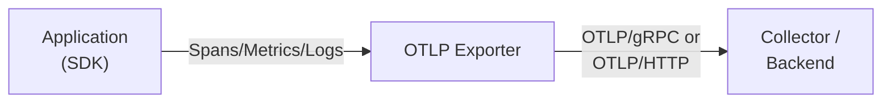
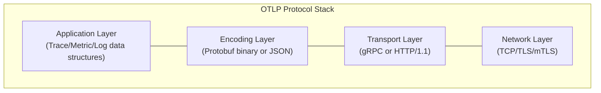

# OTLP Protocol Explained: The OpenTelemetry Wire Format Deep Dive

Author: [nawazdhandala](https://www.github.com/nawazdhandala)

Tags: OpenTelemetry, OTLP, Protocol, Observability, Tracing, Metrics, Logs

Description: A comprehensive guide to the OpenTelemetry Protocol (OTLP)- how it works, message formats, transport options, and when to use gRPC vs HTTP for exporting telemetry data.

---

> OTLP is the lingua franca of modern observability. Understanding how it works helps you optimize performance, debug export issues, and build custom integrations.

This guide covers the OpenTelemetry Protocol (OTLP) in depth- message structures, transport mechanisms, encoding formats, and practical considerations for production deployments.

---

## Table of Contents

1. What is OTLP?
2. Protocol Architecture
3. Message Formats
4. Transport Options
5. Encoding: Protobuf vs JSON
6. Request/Response Flow
7. Batching and Compression
8. Error Handling and Retry
9. Configuration Options
10. Performance Considerations
11. Debugging OTLP Traffic
12. Custom Exporters
13. Common Issues and Solutions

---

## 1. What is OTLP?

OTLP (OpenTelemetry Protocol) is the native wire protocol for transmitting telemetry data in the OpenTelemetry ecosystem. It provides:

| Feature | Description |
|---------|-------------|
| Unified format | Single protocol for traces, metrics, and logs |
| Efficient encoding | Protocol Buffers for compact binary representation |
| Multiple transports | gRPC and HTTP support |
| Streaming capable | Bidirectional streaming for high-volume scenarios |
| Vendor neutral | Standard format accepted by all OTLP-compatible backends |

### Why OTLP matters

Before OTLP, each observability vendor had proprietary formats:
- Jaeger used Thrift
- Zipkin used its own JSON format
- Prometheus used its exposition format
- Each APM vendor had different APIs

OTLP standardizes this, enabling:
- Instrument once, export anywhere
- No vendor lock-in
- Consistent tooling across ecosystems

---

## 2. Protocol Architecture

### High-level flow



### Protocol layers



---

## 3. Message Formats

### Trace message structure

```protobuf
// Simplified OTLP Trace protobuf structure
message TracesData {
  repeated ResourceSpans resource_spans = 1;
}

message ResourceSpans {
  Resource resource = 1;
  repeated ScopeSpans scope_spans = 2;
}

message ScopeSpans {
  InstrumentationScope scope = 1;
  repeated Span spans = 2;
}

message Span {
  bytes trace_id = 1;           // 16 bytes
  bytes span_id = 2;            // 8 bytes
  string trace_state = 3;
  bytes parent_span_id = 4;
  string name = 5;
  SpanKind kind = 6;
  fixed64 start_time_unix_nano = 7;
  fixed64 end_time_unix_nano = 8;
  repeated KeyValue attributes = 9;
  uint32 dropped_attributes_count = 10;
  repeated Event events = 11;
  repeated Link links = 13;
  Status status = 15;
}
```

### JSON representation (OTLP/HTTP)

```json
{
  "resourceSpans": [{
    "resource": {
      "attributes": [{
        "key": "service.name",
        "value": { "stringValue": "my-service" }
      }, {
        "key": "service.version",
        "value": { "stringValue": "1.0.0" }
      }]
    },
    "scopeSpans": [{
      "scope": {
        "name": "my-tracer",
        "version": "1.0.0"
      },
      "spans": [{
        "traceId": "5b8aa5a2d2c872e8321cf37308d69df2",
        "spanId": "051581bf3cb55c13",
        "parentSpanId": "ab1c7d5893a21f9e",
        "name": "GET /api/users",
        "kind": 2,
        "startTimeUnixNano": "1704067200000000000",
        "endTimeUnixNano": "1704067200100000000",
        "attributes": [{
          "key": "http.method",
          "value": { "stringValue": "GET" }
        }, {
          "key": "http.status_code",
          "value": { "intValue": "200" }
        }],
        "status": { "code": 1 }
      }]
    }]
  }]
}
```

### Metrics message structure

```protobuf
message MetricsData {
  repeated ResourceMetrics resource_metrics = 1;
}

message ResourceMetrics {
  Resource resource = 1;
  repeated ScopeMetrics scope_metrics = 2;
}

message ScopeMetrics {
  InstrumentationScope scope = 1;
  repeated Metric metrics = 2;
}

message Metric {
  string name = 1;
  string description = 2;
  string unit = 3;
  oneof data {
    Gauge gauge = 5;
    Sum sum = 7;
    Histogram histogram = 9;
    ExponentialHistogram exponential_histogram = 10;
    Summary summary = 11;
  }
}
```

### Logs message structure

```protobuf
message LogsData {
  repeated ResourceLogs resource_logs = 1;
}

message ResourceLogs {
  Resource resource = 1;
  repeated ScopeLogs scope_logs = 2;
}

message ScopeLogs {
  InstrumentationScope scope = 1;
  repeated LogRecord log_records = 2;
}

message LogRecord {
  fixed64 time_unix_nano = 1;
  fixed64 observed_time_unix_nano = 11;
  SeverityNumber severity_number = 2;
  string severity_text = 3;
  AnyValue body = 5;
  repeated KeyValue attributes = 6;
  bytes trace_id = 9;
  bytes span_id = 10;
}
```

---

## 4. Transport Options

### OTLP/gRPC

Default and recommended for most scenarios:

```
Endpoint: https://collector:4317
Protocol: HTTP/2 (gRPC)
Default port: 4317
```

**Advantages:**
- Bidirectional streaming
- HTTP/2 multiplexing
- Efficient binary framing
- Built-in flow control

**Configuration:**
```yaml
# Collector receiver
receivers:
  otlp:
    protocols:
      grpc:
        endpoint: 0.0.0.0:4317
        max_recv_msg_size_mib: 4
        max_concurrent_streams: 100
```

```typescript
// Node.js exporter
import { OTLPTraceExporter } from '@opentelemetry/exporter-otlp-grpc';

const exporter = new OTLPTraceExporter({
  url: 'https://collector:4317',
  credentials: credentials.createSsl(),
});
```

### OTLP/HTTP

Firewall-friendly alternative:

```
Endpoint: https://collector:4318/v1/traces
Protocol: HTTP/1.1 or HTTP/2
Default port: 4318
```

**Advantages:**
- Simpler firewall traversal
- Works with HTTP/1.1 proxies
- Easier debugging with standard HTTP tools

**Endpoints:**
- Traces: `/v1/traces`
- Metrics: `/v1/metrics`
- Logs: `/v1/logs`

**Configuration:**
```yaml
# Collector receiver
receivers:
  otlp:
    protocols:
      http:
        endpoint: 0.0.0.0:4318
        cors:
          allowed_origins: ["*"]
```

```typescript
// Node.js exporter
import { OTLPTraceExporter } from '@opentelemetry/exporter-otlp-http';

const exporter = new OTLPTraceExporter({
  url: 'https://collector:4318/v1/traces',
  headers: {
    'x-api-key': 'your-api-key',
  },
});
```

### Comparison

| Aspect | OTLP/gRPC | OTLP/HTTP |
|--------|-----------|-----------|
| Default port | 4317 | 4318 |
| Protocol | HTTP/2 | HTTP/1.1 or HTTP/2 |
| Encoding | Protobuf | Protobuf or JSON |
| Streaming | Yes | No |
| Proxy support | Limited | Excellent |
| Browser support | No | Yes |
| Performance | Higher | Slightly lower |

---

## 5. Encoding: Protobuf vs JSON

### Protocol Buffers (default)

Binary encoding- compact and fast:

```
Content-Type: application/x-protobuf
```

**Advantages:**
- Smallest payload size
- Fastest serialization
- Schema-enforced types

**Size comparison:**
```
Same trace data:
- Protobuf: ~150 bytes
- JSON: ~450 bytes
- Ratio: ~3x smaller
```

### JSON encoding

Human-readable, useful for debugging:

```
Content-Type: application/json
```

**Advantages:**
- Readable in logs
- Easier debugging
- No protobuf dependency

**Configuration:**
```typescript
// Force JSON encoding
const exporter = new OTLPTraceExporter({
  url: 'https://collector:4318/v1/traces',
  headers: {
    'Content-Type': 'application/json',
  },
});
```

---

## 6. Request/Response Flow

### Export request

```
POST /v1/traces HTTP/1.1
Host: collector:4318
Content-Type: application/x-protobuf
Content-Encoding: gzip
x-api-key: your-token

<binary protobuf payload>
```

### Success response

```
HTTP/1.1 200 OK
Content-Type: application/x-protobuf

message ExportTraceServiceResponse {
  ExportTracePartialSuccess partial_success = 1;
}
```

### Partial success response

When some spans are rejected:

```json
{
  "partialSuccess": {
    "rejectedSpans": 5,
    "errorMessage": "Rate limit exceeded"
  }
}
```

### Error responses

| HTTP Code | gRPC Code | Meaning | Retry? |
|-----------|-----------|---------|--------|
| 200 | OK | Success | No |
| 400 | INVALID_ARGUMENT | Bad request | No |
| 401 | UNAUTHENTICATED | Auth failure | No |
| 403 | PERMISSION_DENIED | Not authorized | No |
| 429 | RESOURCE_EXHAUSTED | Rate limited | Yes (backoff) |
| 500 | INTERNAL | Server error | Yes |
| 502 | UNAVAILABLE | Gateway error | Yes |
| 503 | UNAVAILABLE | Service unavailable | Yes |
| 504 | DEADLINE_EXCEEDED | Timeout | Yes |

---

## 7. Batching and Compression

### Batch processor configuration

```typescript
import { BatchSpanProcessor } from '@opentelemetry/sdk-trace-base';

const processor = new BatchSpanProcessor(exporter, {
  maxQueueSize: 2048,        // Max spans in queue
  maxExportBatchSize: 512,   // Max spans per export
  scheduledDelayMillis: 5000, // Export interval
  exportTimeoutMillis: 30000, // Export timeout
});
```

### Compression

Enable gzip for reduced bandwidth:

```typescript
// Node.js
const exporter = new OTLPTraceExporter({
  url: 'https://collector:4318/v1/traces',
  compression: 'gzip', // or 'none'
});
```

```yaml
# Collector exporter
exporters:
  otlp:
    endpoint: https://backend:4317
    compression: gzip
```

### Compression impact

| Payload | Uncompressed | Gzip | Reduction |
|---------|--------------|------|-----------|
| 100 spans | ~15 KB | ~3 KB | 80% |
| 1000 spans | ~150 KB | ~25 KB | 83% |
| Typical batch | ~50 KB | ~8 KB | 84% |

---

## 8. Error Handling and Retry

### Retry configuration

```typescript
import { OTLPTraceExporter } from '@opentelemetry/exporter-otlp-http';

const exporter = new OTLPTraceExporter({
  url: 'https://collector:4318/v1/traces',
  // Retry is handled by the batch processor
});

// Configure retry in collector
exporters:
  otlp:
    endpoint: https://backend:4317
    retry_on_failure:
      enabled: true
      initial_interval: 5s
      max_interval: 30s
      max_elapsed_time: 300s
```

### Exponential backoff

```
Attempt 1: Wait 1s
Attempt 2: Wait 2s
Attempt 3: Wait 4s
Attempt 4: Wait 8s
Attempt 5: Wait 16s (capped at max_interval)
```

### Queue management

```yaml
# Collector sending queue
exporters:
  otlp:
    sending_queue:
      enabled: true
      num_consumers: 10
      queue_size: 5000
    retry_on_failure:
      enabled: true
```

---

## 9. Configuration Options

### Environment variables

```bash
# Common configuration
export OTEL_EXPORTER_OTLP_ENDPOINT=https://collector:4318
export OTEL_EXPORTER_OTLP_HEADERS="x-api-key=token,x-tenant=myorg"
export OTEL_EXPORTER_OTLP_PROTOCOL=http/protobuf  # or grpc
export OTEL_EXPORTER_OTLP_TIMEOUT=30000
export OTEL_EXPORTER_OTLP_COMPRESSION=gzip

# Signal-specific endpoints
export OTEL_EXPORTER_OTLP_TRACES_ENDPOINT=https://traces:4318/v1/traces
export OTEL_EXPORTER_OTLP_METRICS_ENDPOINT=https://metrics:4318/v1/metrics
export OTEL_EXPORTER_OTLP_LOGS_ENDPOINT=https://logs:4318/v1/logs
```

### Protocol selection

```bash
# gRPC (default)
export OTEL_EXPORTER_OTLP_PROTOCOL=grpc

# HTTP with Protobuf
export OTEL_EXPORTER_OTLP_PROTOCOL=http/protobuf

# HTTP with JSON
export OTEL_EXPORTER_OTLP_PROTOCOL=http/json
```

### TLS configuration

```typescript
// Node.js with custom CA
import * as fs from 'fs';

const exporter = new OTLPTraceExporter({
  url: 'https://collector:4317',
  credentials: credentials.createSsl(
    fs.readFileSync('/path/to/ca.crt'),
    fs.readFileSync('/path/to/client.key'),
    fs.readFileSync('/path/to/client.crt')
  ),
});
```

---

## 10. Performance Considerations

### Batching tuning

| Scenario | Batch Size | Delay | Queue Size |
|----------|------------|-------|------------|
| Low volume | 128 | 10s | 512 |
| Medium volume | 512 | 5s | 2048 |
| High volume | 1024 | 1s | 8192 |
| Burst traffic | 2048 | 500ms | 16384 |

### Memory usage

```
Memory per span ≈ 1-2 KB (varies by attributes)
Queue of 2048 spans ≈ 2-4 MB
Peak during export ≈ 2x queue size
```

### Network optimization

1. **Use compression** - 80%+ reduction in bandwidth
2. **Batch appropriately** - Balance latency vs efficiency
3. **Use gRPC** - HTTP/2 multiplexing reduces connections
4. **Deploy collectors locally** - Reduce network hops

### Benchmark data

```
OTLP/gRPC (uncompressed):
- 10,000 spans/sec: ~15 MB/s network
- CPU overhead: ~5% on modern hardware

OTLP/gRPC (gzip):
- 10,000 spans/sec: ~3 MB/s network
- CPU overhead: ~8% (compression cost)

OTLP/HTTP (gzip):
- 10,000 spans/sec: ~4 MB/s network
- CPU overhead: ~10%
```

---

## 11. Debugging OTLP Traffic

### Using curl for HTTP/JSON

```bash
# Test connectivity
curl -X POST https://collector:4318/v1/traces \
  -H "Content-Type: application/json" \
  -d '{
    "resourceSpans": [{
      "resource": {
        "attributes": [{
          "key": "service.name",
          "value": {"stringValue": "test"}
        }]
      },
      "scopeSpans": [{
        "spans": [{
          "traceId": "5b8aa5a2d2c872e8321cf37308d69df2",
          "spanId": "051581bf3cb55c13",
          "name": "test-span",
          "kind": 1,
          "startTimeUnixNano": "1704067200000000000",
          "endTimeUnixNano": "1704067200100000000",
          "status": {}
        }]
      }]
    }]
  }'
```

### Using grpcurl for gRPC

```bash
# List services
grpcurl -plaintext collector:4317 list

# Describe trace service
grpcurl -plaintext collector:4317 describe opentelemetry.proto.collector.trace.v1.TraceService

# Send test data
grpcurl -plaintext \
  -d '{"resourceSpans":[]}' \
  collector:4317 \
  opentelemetry.proto.collector.trace.v1.TraceService/Export
```

### Collector debug logging

```yaml
# collector-config.yaml
service:
  telemetry:
    logs:
      level: debug  # Enable debug logs

processors:
  logging:
    loglevel: debug

service:
  pipelines:
    traces:
      processors: [logging]  # Log all spans
```

### Network capture

```bash
# Capture OTLP traffic
tcpdump -i any -w otlp-traffic.pcap port 4317 or port 4318

# Analyze with tshark
tshark -r otlp-traffic.pcap -Y "http2" -V
```

---

## 12. Custom Exporters

### Node.js custom exporter

```typescript
import { SpanExporter, ReadableSpan } from '@opentelemetry/sdk-trace-base';
import { ExportResult, ExportResultCode } from '@opentelemetry/core';

export class CustomOTLPExporter implements SpanExporter {
  private endpoint: string;
  private headers: Record<string, string>;

  constructor(config: { endpoint: string; headers?: Record<string, string> }) {
    this.endpoint = config.endpoint;
    this.headers = config.headers || {};
  }

  async export(
    spans: ReadableSpan[],
    resultCallback: (result: ExportResult) => void
  ): Promise<void> {
    try {
      const payload = this.serializeSpans(spans);

      const response = await fetch(`${this.endpoint}/v1/traces`, {
        method: 'POST',
        headers: {
          'Content-Type': 'application/json',
          ...this.headers,
        },
        body: JSON.stringify(payload),
      });

      if (response.ok) {
        resultCallback({ code: ExportResultCode.SUCCESS });
      } else {
        resultCallback({
          code: ExportResultCode.FAILED,
          error: new Error(`HTTP ${response.status}`),
        });
      }
    } catch (error) {
      resultCallback({
        code: ExportResultCode.FAILED,
        error: error as Error,
      });
    }
  }

  private serializeSpans(spans: ReadableSpan[]): object {
    return {
      resourceSpans: [{
        resource: {
          attributes: this.serializeAttributes(spans[0]?.resource.attributes || {}),
        },
        scopeSpans: [{
          scope: {
            name: spans[0]?.instrumentationLibrary.name || 'unknown',
            version: spans[0]?.instrumentationLibrary.version || '',
          },
          spans: spans.map(span => ({
            traceId: span.spanContext().traceId,
            spanId: span.spanContext().spanId,
            parentSpanId: span.parentSpanId || undefined,
            name: span.name,
            kind: span.kind,
            startTimeUnixNano: this.hrTimeToNano(span.startTime),
            endTimeUnixNano: this.hrTimeToNano(span.endTime),
            attributes: this.serializeAttributes(span.attributes),
            status: {
              code: span.status.code,
              message: span.status.message,
            },
          })),
        }],
      }],
    };
  }

  private serializeAttributes(attrs: Record<string, unknown>): object[] {
    return Object.entries(attrs).map(([key, value]) => ({
      key,
      value: this.serializeValue(value),
    }));
  }

  private serializeValue(value: unknown): object {
    if (typeof value === 'string') return { stringValue: value };
    if (typeof value === 'number') {
      return Number.isInteger(value) ? { intValue: value } : { doubleValue: value };
    }
    if (typeof value === 'boolean') return { boolValue: value };
    if (Array.isArray(value)) return { arrayValue: { values: value.map(v => this.serializeValue(v)) } };
    return { stringValue: String(value) };
  }

  private hrTimeToNano(hrTime: [number, number]): string {
    return String(hrTime[0] * 1e9 + hrTime[1]);
  }

  async shutdown(): Promise<void> {
    // Cleanup resources
  }
}
```

### Go custom exporter

```go
package exporter

import (
    "bytes"
    "context"
    "encoding/json"
    "net/http"

    "go.opentelemetry.io/otel/sdk/trace"
)

type CustomExporter struct {
    endpoint string
    client   *http.Client
    headers  map[string]string
}

func NewCustomExporter(endpoint string, headers map[string]string) *CustomExporter {
    return &CustomExporter{
        endpoint: endpoint,
        client:   &http.Client{},
        headers:  headers,
    }
}

func (e *CustomExporter) ExportSpans(ctx context.Context, spans []trace.ReadOnlySpan) error {
    if len(spans) == 0 {
        return nil
    }

    payload := e.serializeSpans(spans)
    body, err := json.Marshal(payload)
    if err != nil {
        return err
    }

    req, err := http.NewRequestWithContext(ctx, "POST", e.endpoint+"/v1/traces", bytes.NewReader(body))
    if err != nil {
        return err
    }

    req.Header.Set("Content-Type", "application/json")
    for k, v := range e.headers {
        req.Header.Set(k, v)
    }

    resp, err := e.client.Do(req)
    if err != nil {
        return err
    }
    defer resp.Body.Close()

    if resp.StatusCode >= 400 {
        return fmt.Errorf("export failed: HTTP %d", resp.StatusCode)
    }

    return nil
}

func (e *CustomExporter) Shutdown(ctx context.Context) error {
    return nil
}
```

---

## 13. Common Issues and Solutions

### Issue: Connection refused

```
Error: connect ECONNREFUSED 127.0.0.1:4317
```

**Solutions:**
1. Verify collector is running: `docker ps | grep collector`
2. Check endpoint URL includes protocol: `http://` or `https://`
3. Verify port mapping in Docker/Kubernetes

### Issue: TLS certificate errors

```
Error: unable to verify the first certificate
```

**Solutions:**
1. Use correct CA certificate
2. For testing: `NODE_TLS_REJECT_UNAUTHORIZED=0` (not for production)
3. Verify certificate chain is complete

### Issue: Rate limiting (429)

```
Error: 429 Too Many Requests
```

**Solutions:**
1. Increase batch size to reduce request frequency
2. Enable compression to reduce payload size
3. Implement exponential backoff
4. Consider deploying local collector to buffer

### Issue: Payload too large

```
Error: received message larger than max
```

**Solutions:**
1. Reduce batch size
2. Increase collector's `max_recv_msg_size_mib`
3. Enable compression

### Issue: Timeout errors

```
Error: deadline exceeded
```

**Solutions:**
1. Increase `exportTimeoutMillis`
2. Reduce batch size
3. Check network latency to collector
4. Use local collector to reduce network hops

---

## Summary

| Aspect | Recommendation |
|--------|----------------|
| Transport | gRPC for performance, HTTP for simplicity |
| Encoding | Protobuf (default) for production |
| Compression | Always enable gzip |
| Batching | 512 spans, 5s delay as starting point |
| Retry | Enable with exponential backoff |

OTLP provides a robust, efficient foundation for telemetry export. Understanding its internals helps you optimize performance and troubleshoot issues in production.

---

*Ready to export telemetry? Configure OTLP export to [OneUptime](https://oneuptime.com) and unify your observability data.*

---

### See Also

- [OpenTelemetry Collector](/blog/post/2025-09-18-what-is-opentelemetry-collector-and-why-use-one/)
- [What are Traces and Spans in OpenTelemetry](/blog/post/2025-08-27-traces-and-spans-in-opentelemetry/)
- [OpenTelemetry Collector Pipelines Deep Dive](/blog/post/2025-12-17-opentelemetry-collector-pipelines/)
