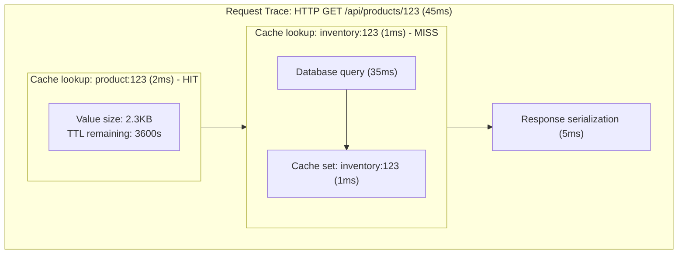

# Redis and Cache Instrumentation with OpenTelemetry

[Nawaz Dhandala](https://github.com/nicksocial129) - December 17, 2025

**Tags:** OpenTelemetry, Redis, Caching, Memcached, Performance, Distributed Tracing

**Description:** Learn how to instrument Redis, Memcached, and other caching systems with OpenTelemetry for complete visibility into cache performance and hit rates.

---

> Caching is often the difference between a fast application and a slow one. Yet cache behavior is frequently a black box in production systems. OpenTelemetry brings visibility to your caching layer.

Caching improves application performance, but without proper observability, you can't tell if your caches are actually helping. This guide shows you how to instrument Redis, Memcached, and application-level caches with OpenTelemetry.

## Table of Contents

1. [Why Cache Instrumentation Matters](#1-why-cache-instrumentation-matters)
2. [Redis Instrumentation](#2-redis-instrumentation)
3. [Memcached Instrumentation](#3-memcached-instrumentation)
4. [Application-Level Cache Tracing](#4-application-level-cache-tracing)
5. [Cache Hit/Miss Metrics](#5-cache-hitmiss-metrics)
6. [Connection Pool Monitoring](#6-connection-pool-monitoring)
7. [Distributed Cache Patterns](#7-distributed-cache-patterns)
8. [Production Best Practices](#8-production-best-practices)

## 1. Why Cache Instrumentation Matters

### The Hidden Costs of Caching

| Issue | Symptom | Root Cause |
|-------|---------|------------|
| Low hit rate | Slow response times | Poor cache key design |
| Thundering herd | Database spikes | Cache expiry storms |
| Memory pressure | Evictions, OOM | Oversized values |
| Network latency | Slow cache reads | Remote cache location |
| Stale data | Incorrect responses | TTL misconfiguration |

### What Cache Instrumentation Reveals



## 2. Redis Instrumentation

### Node.js with ioredis

```typescript
// redis-tracing.ts
import Redis from 'ioredis';
import { trace, context, SpanKind, SpanStatusCode, Span } from '@opentelemetry/api';

const tracer = trace.getTracer('redis-client');

class TracedRedis {
  private client: Redis;
  private connectionAttributes: Record<string, string>;

  constructor(options: Redis.RedisOptions) {
    this.client = new Redis(options);
    this.connectionAttributes = {
      'db.system': 'redis',
      'db.name': String(options.db || 0),
      'net.peer.name': options.host || 'localhost',
      'net.peer.port': String(options.port || 6379),
    };
  }

  private async trace<T>(
    operation: string,
    key: string | string[],
    fn: () => Promise<T>
  ): Promise<T> {
    const span = tracer.startSpan(`redis ${operation}`, {
      kind: SpanKind.CLIENT,
      attributes: {
        ...this.connectionAttributes,
        'db.operation': operation,
        'db.redis.key': Array.isArray(key) ? key.join(', ') : key,
      },
    });

    try {
      const result = await fn();

      // Record cache hit/miss for GET operations
      if (operation === 'GET' || operation === 'HGET') {
        span.setAttribute('cache.hit', result !== null);
      }

      span.setStatus({ code: SpanStatusCode.OK });
      return result;
    } catch (error) {
      span.setStatus({ code: SpanStatusCode.ERROR, message: (error as Error).message });
      span.recordException(error as Error);
      throw error;
    } finally {
      span.end();
    }
  }

  async get(key: string): Promise<string | null> {
    return this.trace('GET', key, () => this.client.get(key));
  }

  async set(key: string, value: string, ttl?: number): Promise<'OK'> {
    return this.trace('SET', key, async () => {
      if (ttl) {
        return this.client.set(key, value, 'EX', ttl);
      }
      return this.client.set(key, value);
    });
  }

  async del(key: string | string[]): Promise<number> {
    return this.trace('DEL', key, () => this.client.del(...(Array.isArray(key) ? key : [key])));
  }

  async hget(key: string, field: string): Promise<string | null> {
    return this.trace('HGET', `${key}:${field}`, () => this.client.hget(key, field));
  }

  async hset(key: string, field: string, value: string): Promise<number> {
    return this.trace('HSET', `${key}:${field}`, () => this.client.hset(key, field, value));
  }

  async mget(...keys: string[]): Promise<(string | null)[]> {
    return this.trace('MGET', keys, async () => {
      const results = await this.client.mget(...keys);
      return results;
    });
  }

  async pipeline(): TracedPipeline {
    return new TracedPipeline(this.client.pipeline(), this.connectionAttributes);
  }
}

class TracedPipeline {
  private pipeline: Redis.Pipeline;
  private operations: string[] = [];
  private connectionAttributes: Record<string, string>;

  constructor(pipeline: Redis.Pipeline, connectionAttributes: Record<string, string>) {
    this.pipeline = pipeline;
    this.connectionAttributes = connectionAttributes;
  }

  get(key: string): this {
    this.pipeline.get(key);
    this.operations.push(`GET ${key}`);
    return this;
  }

  set(key: string, value: string): this {
    this.pipeline.set(key, value);
    this.operations.push(`SET ${key}`);
    return this;
  }

  async exec(): Promise<[Error | null, any][]> {
    const span = tracer.startSpan('redis PIPELINE', {
      kind: SpanKind.CLIENT,
      attributes: {
        ...this.connectionAttributes,
        'db.operation': 'PIPELINE',
        'db.redis.pipeline_length': this.operations.length,
        'db.statement': this.operations.join('; '),
      },
    });

    try {
      const results = await this.pipeline.exec();
      span.setStatus({ code: SpanStatusCode.OK });
      return results || [];
    } catch (error) {
      span.setStatus({ code: SpanStatusCode.ERROR, message: (error as Error).message });
      span.recordException(error as Error);
      throw error;
    } finally {
      span.end();
    }
  }
}
```

### Automatic Instrumentation with @opentelemetry/instrumentation-ioredis

```typescript
// auto-instrumentation.ts
import { NodeTracerProvider } from '@opentelemetry/sdk-trace-node';
import { registerInstrumentations } from '@opentelemetry/instrumentation';
import { IORedisInstrumentation } from '@opentelemetry/instrumentation-ioredis';

const provider = new NodeTracerProvider();
provider.register();

registerInstrumentations({
  instrumentations: [
    new IORedisInstrumentation({
      // Add custom attributes to spans
      requestHook: (span, { cmdName, cmdArgs }) => {
        span.setAttribute('db.redis.command', cmdName);

        // Track key patterns for analysis
        if (cmdArgs[0]) {
          const keyPattern = getKeyPattern(String(cmdArgs[0]));
          span.setAttribute('db.redis.key_pattern', keyPattern);
        }
      },

      // Capture response info
      responseHook: (span, { cmdName, response }) => {
        if (cmdName === 'GET' || cmdName === 'HGET') {
          span.setAttribute('cache.hit', response !== null);
          if (response) {
            span.setAttribute('cache.value_size', String(response).length);
          }
        }
      },

      // Filter out health checks
      requireParentSpan: false,
    }),
  ],
});

function getKeyPattern(key: string): string {
  // Convert "user:123:profile" to "user:*:profile"
  return key.replace(/:\d+:/g, ':*:').replace(/:\d+$/, ':*');
}
```

### Python with redis-py

```python
# redis_tracing.py
import redis
from opentelemetry import trace
from opentelemetry.trace import SpanKind, StatusCode
from functools import wraps
from typing import Any, Callable, Optional

tracer = trace.get_tracer("redis-client")


class TracedRedis:
    def __init__(self, host: str = "localhost", port: int = 6379, db: int = 0):
        self.client = redis.Redis(host=host, port=port, db=db)
        self.connection_attrs = {
            "db.system": "redis",
            "db.name": str(db),
            "net.peer.name": host,
            "net.peer.port": str(port),
        }

    def _trace(
        self,
        operation: str,
        key: str,
        fn: Callable[[], Any],
        is_read: bool = False,
    ) -> Any:
        with tracer.start_as_current_span(
            f"redis {operation}",
            kind=SpanKind.CLIENT,
            attributes={
                **self.connection_attrs,
                "db.operation": operation,
                "db.redis.key": key,
            },
        ) as span:
            try:
                result = fn()

                # Track cache hits/misses
                if is_read:
                    span.set_attribute("cache.hit", result is not None)
                    if result is not None:
                        span.set_attribute("cache.value_size", len(str(result)))

                span.set_status(StatusCode.OK)
                return result

            except Exception as e:
                span.set_status(StatusCode.ERROR, str(e))
                span.record_exception(e)
                raise

    def get(self, key: str) -> Optional[bytes]:
        return self._trace("GET", key, lambda: self.client.get(key), is_read=True)

    def set(
        self, key: str, value: str, ex: Optional[int] = None
    ) -> bool:
        return self._trace(
            "SET",
            key,
            lambda: self.client.set(key, value, ex=ex),
        )

    def delete(self, *keys: str) -> int:
        return self._trace(
            "DEL",
            ", ".join(keys),
            lambda: self.client.delete(*keys),
        )

    def hget(self, name: str, key: str) -> Optional[bytes]:
        return self._trace(
            "HGET",
            f"{name}:{key}",
            lambda: self.client.hget(name, key),
            is_read=True,
        )

    def hset(self, name: str, key: str, value: str) -> int:
        return self._trace(
            "HSET",
            f"{name}:{key}",
            lambda: self.client.hset(name, key, value),
        )

    def mget(self, *keys: str) -> list:
        with tracer.start_as_current_span(
            "redis MGET",
            kind=SpanKind.CLIENT,
            attributes={
                **self.connection_attrs,
                "db.operation": "MGET",
                "db.redis.key_count": len(keys),
            },
        ) as span:
            try:
                results = self.client.mget(*keys)

                # Calculate hit rate
                hits = sum(1 for r in results if r is not None)
                span.set_attribute("cache.hits", hits)
                span.set_attribute("cache.misses", len(keys) - hits)
                span.set_attribute("cache.hit_rate", hits / len(keys))

                span.set_status(StatusCode.OK)
                return results

            except Exception as e:
                span.set_status(StatusCode.ERROR, str(e))
                span.record_exception(e)
                raise

    def pipeline(self):
        return TracedPipeline(self.client.pipeline(), self.connection_attrs)


class TracedPipeline:
    def __init__(self, pipeline, connection_attrs: dict):
        self.pipeline = pipeline
        self.connection_attrs = connection_attrs
        self.operations = []

    def get(self, key: str):
        self.pipeline.get(key)
        self.operations.append(f"GET {key}")
        return self

    def set(self, key: str, value: str):
        self.pipeline.set(key, value)
        self.operations.append(f"SET {key}")
        return self

    def execute(self) -> list:
        with tracer.start_as_current_span(
            "redis PIPELINE",
            kind=SpanKind.CLIENT,
            attributes={
                **self.connection_attrs,
                "db.operation": "PIPELINE",
                "db.redis.pipeline_length": len(self.operations),
            },
        ) as span:
            try:
                results = self.pipeline.execute()
                span.set_status(StatusCode.OK)
                return results
            except Exception as e:
                span.set_status(StatusCode.ERROR, str(e))
                span.record_exception(e)
                raise
```

### Go with go-redis

```go
// redis_tracing.go
package cache

import (
    "context"
    "time"

    "github.com/go-redis/redis/v8"
    "go.opentelemetry.io/otel"
    "go.opentelemetry.io/otel/attribute"
    "go.opentelemetry.io/otel/codes"
    semconv "go.opentelemetry.io/otel/semconv/v1.21.0"
    "go.opentelemetry.io/otel/trace"
)

var tracer = otel.Tracer("redis-client")

type TracedRedis struct {
    client *redis.Client
    attrs  []attribute.KeyValue
}

func NewTracedRedis(opts *redis.Options) *TracedRedis {
    client := redis.NewClient(opts)

    return &TracedRedis{
        client: client,
        attrs: []attribute.KeyValue{
            semconv.DBSystemRedis,
            semconv.DBName(string(rune(opts.DB))),
            semconv.NetPeerName(opts.Addr),
        },
    }
}

func (r *TracedRedis) Get(ctx context.Context, key string) (string, error) {
    ctx, span := tracer.Start(ctx, "redis GET",
        trace.WithSpanKind(trace.SpanKindClient),
        trace.WithAttributes(r.attrs...),
        trace.WithAttributes(
            semconv.DBOperation("GET"),
            attribute.String("db.redis.key", key),
        ),
    )
    defer span.End()

    result, err := r.client.Get(ctx, key).Result()

    if err == redis.Nil {
        span.SetAttributes(attribute.Bool("cache.hit", false))
        span.SetStatus(codes.Ok, "cache miss")
        return "", nil
    }

    if err != nil {
        span.SetStatus(codes.Error, err.Error())
        span.RecordError(err)
        return "", err
    }

    span.SetAttributes(
        attribute.Bool("cache.hit", true),
        attribute.Int("cache.value_size", len(result)),
    )
    span.SetStatus(codes.Ok, "")

    return result, nil
}

func (r *TracedRedis) Set(ctx context.Context, key string, value interface{}, expiration time.Duration) error {
    ctx, span := tracer.Start(ctx, "redis SET",
        trace.WithSpanKind(trace.SpanKindClient),
        trace.WithAttributes(r.attrs...),
        trace.WithAttributes(
            semconv.DBOperation("SET"),
            attribute.String("db.redis.key", key),
            attribute.Int64("db.redis.ttl_seconds", int64(expiration.Seconds())),
        ),
    )
    defer span.End()

    err := r.client.Set(ctx, key, value, expiration).Err()

    if err != nil {
        span.SetStatus(codes.Error, err.Error())
        span.RecordError(err)
        return err
    }

    span.SetStatus(codes.Ok, "")
    return nil
}

func (r *TracedRedis) MGet(ctx context.Context, keys ...string) ([]interface{}, error) {
    ctx, span := tracer.Start(ctx, "redis MGET",
        trace.WithSpanKind(trace.SpanKindClient),
        trace.WithAttributes(r.attrs...),
        trace.WithAttributes(
            semconv.DBOperation("MGET"),
            attribute.Int("db.redis.key_count", len(keys)),
        ),
    )
    defer span.End()

    results, err := r.client.MGet(ctx, keys...).Result()

    if err != nil {
        span.SetStatus(codes.Error, err.Error())
        span.RecordError(err)
        return nil, err
    }

    // Calculate hit rate
    hits := 0
    for _, r := range results {
        if r != nil {
            hits++
        }
    }

    span.SetAttributes(
        attribute.Int("cache.hits", hits),
        attribute.Int("cache.misses", len(keys)-hits),
        attribute.Float64("cache.hit_rate", float64(hits)/float64(len(keys))),
    )
    span.SetStatus(codes.Ok, "")

    return results, nil
}

func (r *TracedRedis) Del(ctx context.Context, keys ...string) (int64, error) {
    ctx, span := tracer.Start(ctx, "redis DEL",
        trace.WithSpanKind(trace.SpanKindClient),
        trace.WithAttributes(r.attrs...),
        trace.WithAttributes(
            semconv.DBOperation("DEL"),
            attribute.Int("db.redis.key_count", len(keys)),
        ),
    )
    defer span.End()

    deleted, err := r.client.Del(ctx, keys...).Result()

    if err != nil {
        span.SetStatus(codes.Error, err.Error())
        span.RecordError(err)
        return 0, err
    }

    span.SetAttributes(attribute.Int64("db.redis.deleted_count", deleted))
    span.SetStatus(codes.Ok, "")

    return deleted, nil
}
```

## 3. Memcached Instrumentation

### Node.js with memjs

```typescript
// memcached-tracing.ts
import * as memjs from 'memjs';
import { trace, SpanKind, SpanStatusCode } from '@opentelemetry/api';

const tracer = trace.getTracer('memcached-client');

class TracedMemcached {
  private client: memjs.Client;
  private servers: string;

  constructor(servers: string) {
    this.client = memjs.Client.create(servers);
    this.servers = servers;
  }

  async get(key: string): Promise<{ value: Buffer | null; flags: any }> {
    const span = tracer.startSpan('memcached GET', {
      kind: SpanKind.CLIENT,
      attributes: {
        'db.system': 'memcached',
        'db.operation': 'GET',
        'db.memcached.key': key,
        'net.peer.name': this.servers,
      },
    });

    return new Promise((resolve, reject) => {
      this.client.get(key, (err, value, flags) => {
        if (err) {
          span.setStatus({ code: SpanStatusCode.ERROR, message: err.message });
          span.recordException(err);
          span.end();
          reject(err);
          return;
        }

        span.setAttribute('cache.hit', value !== null);
        if (value) {
          span.setAttribute('cache.value_size', value.length);
        }

        span.setStatus({ code: SpanStatusCode.OK });
        span.end();
        resolve({ value, flags });
      });
    });
  }

  async set(key: string, value: string | Buffer, options?: { expires?: number }): Promise<boolean> {
    const span = tracer.startSpan('memcached SET', {
      kind: SpanKind.CLIENT,
      attributes: {
        'db.system': 'memcached',
        'db.operation': 'SET',
        'db.memcached.key': key,
        'db.memcached.ttl': options?.expires || 0,
        'net.peer.name': this.servers,
      },
    });

    return new Promise((resolve, reject) => {
      this.client.set(key, value, options || {}, (err, success) => {
        if (err) {
          span.setStatus({ code: SpanStatusCode.ERROR, message: err.message });
          span.recordException(err);
          span.end();
          reject(err);
          return;
        }

        span.setStatus({ code: SpanStatusCode.OK });
        span.end();
        resolve(success || false);
      });
    });
  }

  async delete(key: string): Promise<boolean> {
    const span = tracer.startSpan('memcached DELETE', {
      kind: SpanKind.CLIENT,
      attributes: {
        'db.system': 'memcached',
        'db.operation': 'DELETE',
        'db.memcached.key': key,
        'net.peer.name': this.servers,
      },
    });

    return new Promise((resolve, reject) => {
      this.client.delete(key, (err, success) => {
        if (err) {
          span.setStatus({ code: SpanStatusCode.ERROR, message: err.message });
          span.recordException(err);
          span.end();
          reject(err);
          return;
        }

        span.setStatus({ code: SpanStatusCode.OK });
        span.end();
        resolve(success || false);
      });
    });
  }
}
```

## 4. Application-Level Cache Tracing

### Generic Cache Wrapper

```typescript
// cache-wrapper.ts
import { trace, SpanKind, SpanStatusCode } from '@opentelemetry/api';

const tracer = trace.getTracer('application-cache');

interface CacheProvider<T> {
  get(key: string): Promise<T | null>;
  set(key: string, value: T, ttl?: number): Promise<void>;
  delete(key: string): Promise<void>;
}

interface CacheOptions {
  ttl?: number;
  prefix?: string;
  serialize?: (value: any) => string;
  deserialize?: (value: string) => any;
}

class TracedCache<T> {
  private provider: CacheProvider<string>;
  private options: CacheOptions;
  private name: string;

  constructor(name: string, provider: CacheProvider<string>, options: CacheOptions = {}) {
    this.provider = provider;
    this.options = {
      ttl: 3600,
      prefix: '',
      serialize: JSON.stringify,
      deserialize: JSON.parse,
      ...options,
    };
    this.name = name;
  }

  private getFullKey(key: string): string {
    return this.options.prefix ? `${this.options.prefix}:${key}` : key;
  }

  async get(key: string): Promise<T | null> {
    const fullKey = this.getFullKey(key);

    const span = tracer.startSpan(`cache.get ${this.name}`, {
      kind: SpanKind.CLIENT,
      attributes: {
        'cache.name': this.name,
        'cache.operation': 'get',
        'cache.key': fullKey,
      },
    });

    try {
      const startTime = Date.now();
      const cached = await this.provider.get(fullKey);
      const duration = Date.now() - startTime;

      span.setAttribute('cache.latency_ms', duration);

      if (cached === null) {
        span.setAttribute('cache.hit', false);
        span.setStatus({ code: SpanStatusCode.OK });
        return null;
      }

      const value = this.options.deserialize!(cached);
      span.setAttribute('cache.hit', true);
      span.setAttribute('cache.value_size', cached.length);
      span.setStatus({ code: SpanStatusCode.OK });

      return value as T;
    } catch (error) {
      span.setStatus({ code: SpanStatusCode.ERROR, message: (error as Error).message });
      span.recordException(error as Error);
      throw error;
    } finally {
      span.end();
    }
  }

  async set(key: string, value: T, ttl?: number): Promise<void> {
    const fullKey = this.getFullKey(key);
    const serialized = this.options.serialize!(value);

    const span = tracer.startSpan(`cache.set ${this.name}`, {
      kind: SpanKind.CLIENT,
      attributes: {
        'cache.name': this.name,
        'cache.operation': 'set',
        'cache.key': fullKey,
        'cache.ttl': ttl || this.options.ttl,
        'cache.value_size': serialized.length,
      },
    });

    try {
      await this.provider.set(fullKey, serialized, ttl || this.options.ttl);
      span.setStatus({ code: SpanStatusCode.OK });
    } catch (error) {
      span.setStatus({ code: SpanStatusCode.ERROR, message: (error as Error).message });
      span.recordException(error as Error);
      throw error;
    } finally {
      span.end();
    }
  }

  async getOrSet(key: string, factory: () => Promise<T>, ttl?: number): Promise<T> {
    const span = tracer.startSpan(`cache.getOrSet ${this.name}`, {
      attributes: {
        'cache.name': this.name,
        'cache.operation': 'getOrSet',
        'cache.key': this.getFullKey(key),
      },
    });

    try {
      // Try cache first
      const cached = await this.get(key);

      if (cached !== null) {
        span.setAttribute('cache.hit', true);
        span.setStatus({ code: SpanStatusCode.OK });
        return cached;
      }

      span.setAttribute('cache.hit', false);

      // Generate value
      const value = await factory();

      // Store in cache
      await this.set(key, value, ttl);

      span.setStatus({ code: SpanStatusCode.OK });
      return value;
    } catch (error) {
      span.setStatus({ code: SpanStatusCode.ERROR, message: (error as Error).message });
      span.recordException(error as Error);
      throw error;
    } finally {
      span.end();
    }
  }

  async invalidate(key: string): Promise<void> {
    const fullKey = this.getFullKey(key);

    const span = tracer.startSpan(`cache.invalidate ${this.name}`, {
      kind: SpanKind.CLIENT,
      attributes: {
        'cache.name': this.name,
        'cache.operation': 'invalidate',
        'cache.key': fullKey,
      },
    });

    try {
      await this.provider.delete(fullKey);
      span.setStatus({ code: SpanStatusCode.OK });
    } catch (error) {
      span.setStatus({ code: SpanStatusCode.ERROR, message: (error as Error).message });
      span.recordException(error as Error);
      throw error;
    } finally {
      span.end();
    }
  }
}
```

### Multi-Level Cache

```typescript
// multi-level-cache.ts
import { trace, SpanKind, SpanStatusCode } from '@opentelemetry/api';

const tracer = trace.getTracer('multi-level-cache');

interface CacheLevel {
  name: string;
  get(key: string): Promise<string | null>;
  set(key: string, value: string, ttl?: number): Promise<void>;
}

class MultiLevelCache {
  private levels: CacheLevel[];

  constructor(levels: CacheLevel[]) {
    this.levels = levels;
  }

  async get(key: string): Promise<string | null> {
    const span = tracer.startSpan('multilevel-cache.get', {
      attributes: {
        'cache.key': key,
        'cache.levels': this.levels.map((l) => l.name).join(', '),
      },
    });

    try {
      for (let i = 0; i < this.levels.length; i++) {
        const level = this.levels[i];

        const levelSpan = tracer.startSpan(`cache.get ${level.name}`, {
          kind: SpanKind.CLIENT,
          attributes: {
            'cache.level': i,
            'cache.level_name': level.name,
          },
        });

        try {
          const value = await level.get(key);

          if (value !== null) {
            levelSpan.setAttribute('cache.hit', true);
            levelSpan.setStatus({ code: SpanStatusCode.OK });
            levelSpan.end();

            // Backfill higher-priority caches
            span.addEvent('cache-hit', { 'cache.level': level.name });

            for (let j = 0; j < i; j++) {
              await this.levels[j].set(key, value);
            }

            span.setAttribute('cache.hit_level', level.name);
            span.setStatus({ code: SpanStatusCode.OK });
            return value;
          }

          levelSpan.setAttribute('cache.hit', false);
          levelSpan.setStatus({ code: SpanStatusCode.OK });
        } finally {
          levelSpan.end();
        }
      }

      span.setAttribute('cache.hit', false);
      span.setStatus({ code: SpanStatusCode.OK });
      return null;
    } catch (error) {
      span.setStatus({ code: SpanStatusCode.ERROR, message: (error as Error).message });
      span.recordException(error as Error);
      throw error;
    } finally {
      span.end();
    }
  }

  async set(key: string, value: string, ttl?: number): Promise<void> {
    const span = tracer.startSpan('multilevel-cache.set', {
      attributes: {
        'cache.key': key,
        'cache.levels': this.levels.map((l) => l.name).join(', '),
      },
    });

    try {
      await Promise.all(this.levels.map((level) => level.set(key, value, ttl)));
      span.setStatus({ code: SpanStatusCode.OK });
    } catch (error) {
      span.setStatus({ code: SpanStatusCode.ERROR, message: (error as Error).message });
      span.recordException(error as Error);
      throw error;
    } finally {
      span.end();
    }
  }
}
```

## 5. Cache Hit/Miss Metrics

### Metrics Collection

```typescript
// cache-metrics.ts
import { metrics } from '@opentelemetry/api';

const meter = metrics.getMeter('cache-metrics');

// Cache operation counter
const cacheOperations = meter.createCounter('cache.operations', {
  description: 'Number of cache operations',
  unit: '1',
});

// Cache hit/miss counter
const cacheHits = meter.createCounter('cache.hits', {
  description: 'Number of cache hits',
});

const cacheMisses = meter.createCounter('cache.misses', {
  description: 'Number of cache misses',
});

// Cache latency histogram
const cacheLatency = meter.createHistogram('cache.latency', {
  description: 'Cache operation latency',
  unit: 'ms',
});

// Cache value size histogram
const cacheValueSize = meter.createHistogram('cache.value_size', {
  description: 'Size of cached values',
  unit: 'bytes',
});

// Hit rate gauge (calculated)
const hitRateGauge = meter.createObservableGauge('cache.hit_rate', {
  description: 'Cache hit rate',
});

class CacheMetrics {
  private hitCounts: Map<string, number> = new Map();
  private missCounts: Map<string, number> = new Map();

  constructor() {
    // Observable callback for hit rate
    hitRateGauge.addCallback((result) => {
      for (const [cache, hits] of this.hitCounts.entries()) {
        const misses = this.missCounts.get(cache) || 0;
        const total = hits + misses;
        if (total > 0) {
          result.observe(hits / total, { 'cache.name': cache });
        }
      }
    });
  }

  recordOperation(
    cacheName: string,
    operation: 'get' | 'set' | 'delete',
    hit: boolean | null,
    latencyMs: number,
    valueSize?: number
  ) {
    const attrs = {
      'cache.name': cacheName,
      'cache.operation': operation,
    };

    cacheOperations.add(1, attrs);
    cacheLatency.record(latencyMs, attrs);

    if (operation === 'get' && hit !== null) {
      if (hit) {
        cacheHits.add(1, attrs);
        this.hitCounts.set(cacheName, (this.hitCounts.get(cacheName) || 0) + 1);
      } else {
        cacheMisses.add(1, attrs);
        this.missCounts.set(cacheName, (this.missCounts.get(cacheName) || 0) + 1);
      }
    }

    if (valueSize !== undefined) {
      cacheValueSize.record(valueSize, attrs);
    }
  }
}

export const cacheMetrics = new CacheMetrics();
```

## 6. Connection Pool Monitoring

### Redis Connection Pool Tracing

```typescript
// redis-pool.ts
import { createPool, Pool } from 'generic-pool';
import Redis from 'ioredis';
import { metrics, trace } from '@opentelemetry/api';

const meter = metrics.getMeter('redis-pool');
const tracer = trace.getTracer('redis-pool');

// Pool metrics
const poolSize = meter.createObservableGauge('redis.pool.size', {
  description: 'Current pool size',
});

const poolAvailable = meter.createObservableGauge('redis.pool.available', {
  description: 'Available connections in pool',
});

const poolPending = meter.createObservableGauge('redis.pool.pending', {
  description: 'Pending connection requests',
});

const acquireTime = meter.createHistogram('redis.pool.acquire_time', {
  description: 'Time to acquire connection from pool',
  unit: 'ms',
});

class TracedRedisPool {
  private pool: Pool<Redis>;

  constructor(options: Redis.RedisOptions, poolOptions?: { min?: number; max?: number }) {
    this.pool = createPool(
      {
        create: async () => {
          const span = tracer.startSpan('redis.pool.create');
          try {
            const client = new Redis(options);
            await client.ping();
            span.setStatus({ code: 0 });
            return client;
          } catch (error) {
            span.setStatus({ code: 2, message: (error as Error).message });
            throw error;
          } finally {
            span.end();
          }
        },
        destroy: async (client) => {
          const span = tracer.startSpan('redis.pool.destroy');
          try {
            await client.quit();
            span.setStatus({ code: 0 });
          } finally {
            span.end();
          }
        },
        validate: async (client) => {
          try {
            await client.ping();
            return true;
          } catch {
            return false;
          }
        },
      },
      {
        min: poolOptions?.min || 2,
        max: poolOptions?.max || 10,
        testOnBorrow: true,
      }
    );

    // Set up metrics callbacks
    poolSize.addCallback((result) => {
      result.observe(this.pool.size);
    });

    poolAvailable.addCallback((result) => {
      result.observe(this.pool.available);
    });

    poolPending.addCallback((result) => {
      result.observe(this.pool.pending);
    });
  }

  async execute<T>(fn: (client: Redis) => Promise<T>): Promise<T> {
    const startTime = Date.now();
    const client = await this.pool.acquire();
    acquireTime.record(Date.now() - startTime);

    try {
      return await fn(client);
    } finally {
      await this.pool.release(client);
    }
  }

  async shutdown() {
    await this.pool.drain();
    await this.pool.clear();
  }
}
```

## 7. Distributed Cache Patterns

### Cache-Aside with Tracing

```typescript
// cache-aside.ts
import { trace, context, SpanKind, SpanStatusCode } from '@opentelemetry/api';

const tracer = trace.getTracer('cache-aside');

interface CacheClient {
  get(key: string): Promise<string | null>;
  set(key: string, value: string, ttl: number): Promise<void>;
  delete(key: string): Promise<void>;
}

interface DataSource<T> {
  fetch(id: string): Promise<T | null>;
}

class CacheAsidePattern<T> {
  private cache: CacheClient;
  private dataSource: DataSource<T>;
  private ttl: number;
  private prefix: string;

  constructor(
    cache: CacheClient,
    dataSource: DataSource<T>,
    options: { ttl: number; prefix: string }
  ) {
    this.cache = cache;
    this.dataSource = dataSource;
    this.ttl = options.ttl;
    this.prefix = options.prefix;
  }

  async get(id: string): Promise<T | null> {
    const cacheKey = `${this.prefix}:${id}`;

    const span = tracer.startSpan('cache-aside.get', {
      attributes: {
        'cache.pattern': 'cache-aside',
        'cache.key': cacheKey,
      },
    });

    try {
      // Try cache
      const cacheSpan = tracer.startSpan('cache.get', { kind: SpanKind.CLIENT });
      const cached = await this.cache.get(cacheKey);
      cacheSpan.setAttribute('cache.hit', cached !== null);
      cacheSpan.end();

      if (cached !== null) {
        span.setAttribute('cache.hit', true);
        span.setStatus({ code: SpanStatusCode.OK });
        return JSON.parse(cached);
      }

      // Cache miss - fetch from source
      span.setAttribute('cache.hit', false);

      const dataSpan = tracer.startSpan('datasource.fetch', { kind: SpanKind.CLIENT });
      const data = await this.dataSource.fetch(id);
      dataSpan.end();

      if (data !== null) {
        // Populate cache
        const setSpan = tracer.startSpan('cache.set', { kind: SpanKind.CLIENT });
        await this.cache.set(cacheKey, JSON.stringify(data), this.ttl);
        setSpan.end();
      }

      span.setStatus({ code: SpanStatusCode.OK });
      return data;
    } catch (error) {
      span.setStatus({ code: SpanStatusCode.ERROR, message: (error as Error).message });
      span.recordException(error as Error);
      throw error;
    } finally {
      span.end();
    }
  }

  async invalidate(id: string): Promise<void> {
    const cacheKey = `${this.prefix}:${id}`;

    const span = tracer.startSpan('cache-aside.invalidate', {
      attributes: {
        'cache.pattern': 'cache-aside',
        'cache.key': cacheKey,
      },
    });

    try {
      await this.cache.delete(cacheKey);
      span.setStatus({ code: SpanStatusCode.OK });
    } catch (error) {
      span.setStatus({ code: SpanStatusCode.ERROR, message: (error as Error).message });
      span.recordException(error as Error);
      throw error;
    } finally {
      span.end();
    }
  }
}
```

### Write-Through Cache

```typescript
// write-through.ts
class WriteThroughCache<T> {
  private cache: CacheClient;
  private dataSource: {
    fetch(id: string): Promise<T | null>;
    save(id: string, data: T): Promise<void>;
  };
  private ttl: number;
  private prefix: string;

  async save(id: string, data: T): Promise<void> {
    const cacheKey = `${this.prefix}:${id}`;

    const span = tracer.startSpan('write-through.save', {
      attributes: {
        'cache.pattern': 'write-through',
        'cache.key': cacheKey,
      },
    });

    try {
      // Write to data source first
      const dataSpan = tracer.startSpan('datasource.save', { kind: SpanKind.CLIENT });
      await this.dataSource.save(id, data);
      dataSpan.end();

      // Then update cache
      const cacheSpan = tracer.startSpan('cache.set', { kind: SpanKind.CLIENT });
      await this.cache.set(cacheKey, JSON.stringify(data), this.ttl);
      cacheSpan.end();

      span.setStatus({ code: SpanStatusCode.OK });
    } catch (error) {
      span.setStatus({ code: SpanStatusCode.ERROR, message: (error as Error).message });
      span.recordException(error as Error);
      throw error;
    } finally {
      span.end();
    }
  }
}
```

## 8. Production Best Practices

### Cache Instrumentation Checklist

| Practice | Description | Priority |
|----------|-------------|----------|
| Track hit/miss rates | Essential for cache effectiveness | Critical |
| Monitor latency | Detect slow cache operations | High |
| Record value sizes | Identify oversized values | High |
| Track key patterns | Understand cache usage | Medium |
| Monitor pool health | Prevent connection exhaustion | High |
| Alert on low hit rates | Proactive problem detection | Medium |

### Collector Configuration

```yaml
# otel-collector-cache.yaml
receivers:
  otlp:
    protocols:
      grpc:
        endpoint: 0.0.0.0:4317

processors:
  batch:
    timeout: 1s

  # Calculate hit rate
  metricstransform:
    transforms:
    - include: cache.hits
      action: insert
      new_name: cache.hit_rate
      operations:
      - action: divide
        value: cache.operations

  # Filter high-frequency cache operations
  filter:
    spans:
      include:
        match_type: regexp
        attributes:
        - key: cache.hit
          value: "false"  # Only keep cache misses

exporters:
  otlphttp:
    endpoint: https://otlp.oneuptime.com

service:
  pipelines:
    traces:
      receivers: [otlp]
      processors: [batch]
      exporters: [otlphttp]
    metrics:
      receivers: [otlp]
      processors: [batch, metricstransform]
      exporters: [otlphttp]
```

### Alerting Rules

```yaml
# cache-alerts.yaml
groups:
- name: cache-alerts
  rules:
  - alert: LowCacheHitRate
    expr: |
      sum(rate(cache_hits_total[5m])) by (cache_name)
      /
      sum(rate(cache_operations_total{operation="get"}[5m])) by (cache_name)
      < 0.8
    for: 5m
    labels:
      severity: warning
    annotations:
      summary: Cache hit rate below 80%

  - alert: HighCacheLatency
    expr: |
      histogram_quantile(0.99, rate(cache_latency_bucket[5m])) > 50
    for: 5m
    labels:
      severity: warning
    annotations:
      summary: Cache P99 latency above 50ms

  - alert: CacheConnectionPoolExhausted
    expr: |
      redis_pool_available == 0 and redis_pool_pending > 0
    for: 1m
    labels:
      severity: critical
    annotations:
      summary: Redis connection pool exhausted
```

## Summary

Cache instrumentation with OpenTelemetry provides:

- **Hit/miss visibility**: Understand cache effectiveness
- **Latency tracking**: Identify slow cache operations
- **Pattern analysis**: Discover cache usage patterns
- **Pool monitoring**: Prevent connection issues
- **Multi-level support**: Trace through cache hierarchies

Proper cache instrumentation is essential for maintaining application performance and identifying optimization opportunities.

## Monitor Your Caches with OneUptime

OneUptime provides comprehensive cache monitoring with OpenTelemetry. Track hit rates, visualize latency distributions, and get alerted when cache performance degrades.

[Start Free Trial](https://oneuptime.com/signup) - Complete cache observability.

## See Also

- [Database Tracing with OpenTelemetry](/blog/opentelemetry-database-tracing)
- [Performance Best Practices](/blog/opentelemetry-best-practices)
- [OpenTelemetry Metrics Guide](/blog/opentelemetry-metrics-guide)
