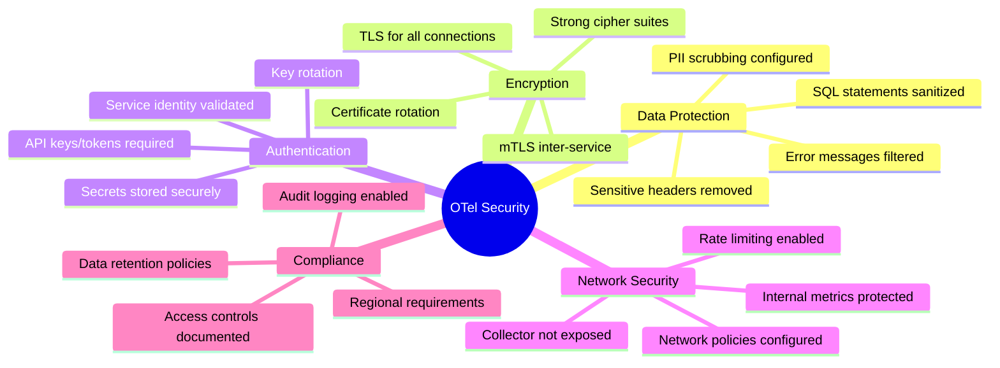

# Security Considerations in OpenTelemetry: Protecting Your Telemetry Data

[Nawaz Dhandala](https://github.com/nicksocial129) - December 17, 2025

**Tags:** OpenTelemetry, Security, Data Privacy, PII, Encryption, Authentication, Best Practices

**Description:** Learn how to secure your OpenTelemetry implementation. Cover PII scrubbing, data encryption, authentication, authorization, and security best practices for telemetry pipelines.

---

> Telemetry data can reveal sensitive information about your systems and users. Securing your observability pipeline is as critical as securing your application.

OpenTelemetry collects detailed information about your application's behavior, which can inadvertently include sensitive data. This guide covers security best practices for protecting your telemetry pipeline from collection to storage.

## Table of Contents

1. [Security Risks in Telemetry](#1-security-risks-in-telemetry)
2. [PII and Sensitive Data Handling](#2-pii-and-sensitive-data-handling)
3. [Encryption in Transit and at Rest](#3-encryption-in-transit-and-at-rest)
4. [Authentication and Authorization](#4-authentication-and-authorization)
5. [Collector Security](#5-collector-security)
6. [Network Security](#6-network-security)
7. [Compliance Considerations](#7-compliance-considerations)
8. [Security Monitoring](#8-security-monitoring)

## 1. Security Risks in Telemetry

### Common Exposure Vectors

```mermaid
flowchart TB
    subgraph Risks["Telemetry Security Risks"]
        subgraph Collection["Data in Collection"]
            C1[PII in spans]
            C2[Secrets in logs]
            C3[SQL queries]
            C4[HTTP headers]
            C5[Error messages]
        end

        subgraph Transit["Data in Transit"]
            T1[Unencrypted connections]
            T2[MITM attacks]
            T3[Spoofed sources]
            T4[Data tampering]
        end

        subgraph Rest["Data at Rest"]
            R1[Exposed storage]
            R2[Weak access control]
            R3[Data retention]
            R4[Backup exposure]
            R5[Log aggregation]
        end
    end

    Collection --> Transit --> Rest
```



### What Can Be Exposed

| Data Type | Risk Level | Common Sources |
|-----------|------------|----------------|
| Passwords | Critical | Logs, span attributes |
| API keys | Critical | HTTP headers, errors |
| PII (emails, SSN) | High | Request parameters |
| Credit cards | Critical | Payment processing spans |
| Session tokens | High | Cookie headers |
| Internal IPs | Medium | Network spans |
| Query patterns | Medium | Database spans |

### Real-World Example

```typescript
// DANGEROUS: Unfiltered span attributes
span.setAttribute('http.request.body', JSON.stringify({
  username: 'john@example.com',
  password: 'secret123',  // Password in telemetry!
  ssn: '123-45-6789'      // PII in telemetry!
}));

// DANGEROUS: SQL with values in span
span.setAttribute('db.statement',
  `SELECT * FROM users WHERE email='john@example.com' AND password='secret123'`
);
```

## 2. PII and Sensitive Data Handling

### Attribute Scrubbing with Processors

```yaml
# OpenTelemetry Collector: attributes processor for PII removal
processors:
  attributes:
    actions:
      # Remove sensitive headers
      - key: http.request.header.authorization
        action: delete
      - key: http.request.header.cookie
        action: delete
      - key: http.request.header.x-api-key
        action: delete

      # Hash email addresses
      - key: user.email
        action: hash

      # Redact credit card patterns
      - key: http.request.body
        pattern: '\b\d{4}[- ]?\d{4}[- ]?\d{4}[- ]?\d{4}\b'
        replacement: '[REDACTED-CC]'
        action: update

      # Redact SSN patterns
      - key: http.request.body
        pattern: '\b\d{3}-\d{2}-\d{4}\b'
        replacement: '[REDACTED-SSN]'
        action: update
```

### Custom Scrubbing Processor

```go
// Go: Custom processor for sensitive data scrubbing
package scrubber

import (
    "context"
    "regexp"
    "go.opentelemetry.io/collector/pdata/ptrace"
    "go.opentelemetry.io/collector/processor"
)

type Config struct {
    Patterns      []PatternConfig `mapstructure:"patterns"`
    HashFields    []string        `mapstructure:"hash_fields"`
    RemoveFields  []string        `mapstructure:"remove_fields"`
}

type PatternConfig struct {
    Name        string `mapstructure:"name"`
    Pattern     string `mapstructure:"pattern"`
    Replacement string `mapstructure:"replacement"`
}

type scrubberProcessor struct {
    config   *Config
    patterns []*regexp.Regexp
}

func (p *scrubberProcessor) processTraces(
    ctx context.Context,
    td ptrace.Traces,
) (ptrace.Traces, error) {

    for i := 0; i < td.ResourceSpans().Len(); i++ {
        rs := td.ResourceSpans().At(i)
        for j := 0; j < rs.ScopeSpans().Len(); j++ {
            ss := rs.ScopeSpans().At(j)
            for k := 0; k < ss.Spans().Len(); k++ {
                span := ss.Spans().At(k)
                p.scrubAttributes(span.Attributes())
            }
        }
    }
    return td, nil
}

func (p *scrubberProcessor) scrubAttributes(attrs pdata.Map) {
    // Remove sensitive fields
    for _, field := range p.config.RemoveFields {
        attrs.Remove(field)
    }

    // Apply pattern-based scrubbing
    attrs.Range(func(key string, value pdata.Value) bool {
        if value.Type() == pdata.ValueTypeStr {
            scrubbed := p.scrubValue(value.Str())
            value.SetStr(scrubbed)
        }
        return true
    })
}

func (p *scrubberProcessor) scrubValue(input string) string {
    result := input
    for i, pattern := range p.patterns {
        replacement := p.config.Patterns[i].Replacement
        result = pattern.ReplaceAllString(result, replacement)
    }
    return result
}
```

### SDK-Level Filtering

```typescript
// TypeScript: Filter sensitive data at SDK level
import { SpanProcessor, ReadableSpan, Span } from '@opentelemetry/sdk-trace-base';

class SensitiveDataFilterProcessor implements SpanProcessor {
  private sensitiveKeys = [
    'password', 'secret', 'token', 'api_key', 'apikey',
    'authorization', 'credit_card', 'ssn', 'social_security'
  ];

  private patterns = [
    { regex: /\b[A-Za-z0-9._%+-]+@[A-Za-z0-9.-]+\.[A-Z|a-z]{2,}\b/g, replacement: '[EMAIL]' },
    { regex: /\b\d{4}[- ]?\d{4}[- ]?\d{4}[- ]?\d{4}\b/g, replacement: '[CC]' },
    { regex: /\b\d{3}-\d{2}-\d{4}\b/g, replacement: '[SSN]' },
    { regex: /bearer\s+[a-zA-Z0-9\-_.]+/gi, replacement: 'Bearer [REDACTED]' },
  ];

  onStart(span: Span): void {
    // Can modify span during creation
  }

  onEnd(span: ReadableSpan): void {
    // Filter attributes before export
    const attributes = span.attributes;

    for (const [key, value] of Object.entries(attributes)) {
      // Remove sensitive keys
      if (this.isSensitiveKey(key)) {
        delete attributes[key];
        continue;
      }

      // Scrub sensitive patterns in values
      if (typeof value === 'string') {
        attributes[key] = this.scrubValue(value);
      }
    }
  }

  private isSensitiveKey(key: string): boolean {
    const lowerKey = key.toLowerCase();
    return this.sensitiveKeys.some(sensitive =>
      lowerKey.includes(sensitive)
    );
  }

  private scrubValue(value: string): string {
    let result = value;
    for (const { regex, replacement } of this.patterns) {
      result = result.replace(regex, replacement);
    }
    return result;
  }

  forceFlush(): Promise<void> {
    return Promise.resolve();
  }

  shutdown(): Promise<void> {
    return Promise.resolve();
  }
}

// Register the processor
import { NodeTracerProvider } from '@opentelemetry/sdk-trace-node';

const provider = new NodeTracerProvider();
provider.addSpanProcessor(new SensitiveDataFilterProcessor());
provider.addSpanProcessor(new BatchSpanProcessor(exporter));
```

### SQL Statement Sanitization

```python
# Python: Sanitize SQL queries before adding to spans
import re
from opentelemetry.instrumentation.sqlalchemy import SQLAlchemyInstrumentor

def sanitize_sql(sql: str) -> str:
    """Remove literal values from SQL statements."""
    # Replace string literals
    sql = re.sub(r"'[^']*'", "'?'", sql)
    # Replace numeric literals
    sql = re.sub(r'\b\d+\b', '?', sql)
    # Replace IN clauses
    sql = re.sub(r'\bIN\s*\([^)]+\)', 'IN (?)', sql, flags=re.IGNORECASE)
    return sql

def query_hook(span, statement):
    """Hook to sanitize SQL before adding to span."""
    sanitized = sanitize_sql(statement)
    span.set_attribute('db.statement', sanitized)

# Use with SQLAlchemy instrumentation
SQLAlchemyInstrumentor().instrument(
    query_hook=query_hook
)
```

## 3. Encryption in Transit and at Rest

### TLS Configuration for OTLP

```yaml
# Collector: TLS for receivers
receivers:
  otlp:
    protocols:
      grpc:
        endpoint: 0.0.0.0:4317
        tls:
          cert_file: /certs/collector.crt
          key_file: /certs/collector.key
          ca_file: /certs/ca.crt
          # Require client certificates (mTLS)
          client_ca_file: /certs/client-ca.crt

      http:
        endpoint: 0.0.0.0:4318
        tls:
          cert_file: /certs/collector.crt
          key_file: /certs/collector.key

# TLS for exporters
exporters:
  otlphttp:
    endpoint: https://backend.example.com:443
    tls:
      cert_file: /certs/client.crt
      key_file: /certs/client.key
      ca_file: /certs/backend-ca.crt
      insecure_skip_verify: false  # Never set to true in production
```

### mTLS Setup

```bash
#!/bin/bash
# Generate certificates for mTLS

# Create CA
openssl genrsa -out ca.key 4096
openssl req -new -x509 -days 365 -key ca.key -out ca.crt \
  -subj "/CN=OTel CA/O=MyOrg"

# Create collector certificate
openssl genrsa -out collector.key 2048
openssl req -new -key collector.key -out collector.csr \
  -subj "/CN=collector.otel.svc/O=MyOrg"
openssl x509 -req -days 365 -in collector.csr \
  -CA ca.crt -CAkey ca.key -CAcreateserial \
  -out collector.crt \
  -extfile <(echo "subjectAltName=DNS:collector.otel.svc,DNS:localhost")

# Create client certificate for SDKs
openssl genrsa -out client.key 2048
openssl req -new -key client.key -out client.csr \
  -subj "/CN=otel-client/O=MyOrg"
openssl x509 -req -days 365 -in client.csr \
  -CA ca.crt -CAkey ca.key -CAcreateserial \
  -out client.crt
```

### SDK TLS Configuration

```typescript
// TypeScript: Configure TLS for SDK exporter
import { OTLPTraceExporter } from '@opentelemetry/exporter-trace-otlp-grpc';
import { credentials } from '@grpc/grpc-js';
import * as fs from 'fs';

const rootCert = fs.readFileSync('/certs/ca.crt');
const clientCert = fs.readFileSync('/certs/client.crt');
const clientKey = fs.readFileSync('/certs/client.key');

const exporter = new OTLPTraceExporter({
  url: 'https://collector.example.com:4317',
  credentials: credentials.createSsl(
    rootCert,
    clientKey,
    clientCert
  ),
});
```

```go
// Go: TLS configuration
package main

import (
    "crypto/tls"
    "crypto/x509"
    "os"

    "go.opentelemetry.io/otel/exporters/otlp/otlptrace/otlptracegrpc"
    "google.golang.org/grpc/credentials"
)

func createSecureExporter() (*otlptracegrpc.Exporter, error) {
    // Load CA cert
    caCert, err := os.ReadFile("/certs/ca.crt")
    if err != nil {
        return nil, err
    }

    certPool := x509.NewCertPool()
    certPool.AppendCertsFromPEM(caCert)

    // Load client cert for mTLS
    clientCert, err := tls.LoadX509KeyPair(
        "/certs/client.crt",
        "/certs/client.key",
    )
    if err != nil {
        return nil, err
    }

    tlsConfig := &tls.Config{
        RootCAs:      certPool,
        Certificates: []tls.Certificate{clientCert},
        MinVersion:   tls.VersionTLS12,
    }

    return otlptracegrpc.New(
        context.Background(),
        otlptracegrpc.WithEndpoint("collector.example.com:4317"),
        otlptracegrpc.WithTLSCredentials(
            credentials.NewTLS(tlsConfig),
        ),
    )
}
```

## 4. Authentication and Authorization

### API Key Authentication

```yaml
# Collector: API key authentication
extensions:
  bearertokenauth:
    token: ${OTEL_AUTH_TOKEN}

receivers:
  otlp:
    protocols:
      grpc:
        auth:
          authenticator: bearertokenauth
      http:
        auth:
          authenticator: bearertokenauth

exporters:
  otlphttp:
    endpoint: https://backend.example.com
    headers:
      Authorization: "Bearer ${BACKEND_API_KEY}"
```

### OIDC Authentication

```yaml
# Collector: OIDC authentication
extensions:
  oidc:
    issuer_url: https://auth.example.com
    audience: otel-collector
    username_claim: preferred_username

receivers:
  otlp:
    protocols:
      grpc:
        auth:
          authenticator: oidc
```

### Custom Authentication Processor

```go
// Go: Custom authentication extension
package authext

import (
    "context"
    "crypto/subtle"
    "errors"

    "go.opentelemetry.io/collector/component"
    "go.opentelemetry.io/collector/extension/auth"
    "google.golang.org/grpc/metadata"
)

type Config struct {
    APIKeys map[string]string `mapstructure:"api_keys"` // service -> key
}

type apiKeyAuth struct {
    config *Config
}

func (a *apiKeyAuth) Authenticate(ctx context.Context, headers map[string][]string) (context.Context, error) {
    // Extract API key from headers
    apiKeyHeader := headers["x-api-key"]
    if len(apiKeyHeader) == 0 {
        return ctx, errors.New("missing API key")
    }

    apiKey := apiKeyHeader[0]

    // Extract service name
    serviceHeader := headers["x-service-name"]
    if len(serviceHeader) == 0 {
        return ctx, errors.New("missing service name")
    }

    serviceName := serviceHeader[0]

    // Validate API key for service
    expectedKey, exists := a.config.APIKeys[serviceName]
    if !exists {
        return ctx, errors.New("unknown service")
    }

    if subtle.ConstantTimeCompare([]byte(apiKey), []byte(expectedKey)) != 1 {
        return ctx, errors.New("invalid API key")
    }

    // Add authenticated service to context
    return context.WithValue(ctx, "authenticated_service", serviceName), nil
}
```

### Role-Based Access Control

```yaml
# Collector: RBAC with routing
processors:
  routing:
    from_attribute: service.name
    table:
      - value: payment-service
        exporters: [otlp/secure]  # High-security backend
      - value: frontend
        exporters: [otlp/standard]
    default_exporters: [otlp/standard]

exporters:
  otlp/secure:
    endpoint: https://secure-backend.example.com:4317
    tls:
      cert_file: /certs/high-security-client.crt
      key_file: /certs/high-security-client.key

  otlp/standard:
    endpoint: https://standard-backend.example.com:4317
```

## 5. Collector Security

### Hardened Collector Configuration

```yaml
# Secure collector deployment
extensions:
  health_check:
    endpoint: localhost:13133  # Only local access
  zpages:
    endpoint: localhost:55679  # Debug pages local only
  memory_ballast:
    size_mib: 512

receivers:
  otlp:
    protocols:
      grpc:
        endpoint: 0.0.0.0:4317
        max_recv_msg_size_mib: 4
        max_concurrent_streams: 100
        read_buffer_size: 512
        write_buffer_size: 512
        tls:
          cert_file: /certs/collector.crt
          key_file: /certs/collector.key
          client_ca_file: /certs/client-ca.crt

processors:
  memory_limiter:
    check_interval: 1s
    limit_mib: 1800
    spike_limit_mib: 500

  batch:
    timeout: 1s
    send_batch_size: 1024
    send_batch_max_size: 2048

service:
  extensions: [health_check, memory_ballast]
  telemetry:
    logs:
      level: warn  # Reduce log verbosity in production
      encoding: json
    metrics:
      address: localhost:8888  # Internal metrics
```

### Kubernetes Security Context

```yaml
# Kubernetes: Secure collector deployment
apiVersion: apps/v1
kind: Deployment
metadata:
  name: otel-collector
spec:
  template:
    spec:
      securityContext:
        runAsNonRoot: true
        runAsUser: 10001
        runAsGroup: 10001
        fsGroup: 10001
        seccompProfile:
          type: RuntimeDefault

      containers:
        - name: collector
          image: otel/opentelemetry-collector:latest
          securityContext:
            allowPrivilegeEscalation: false
            readOnlyRootFilesystem: true
            capabilities:
              drop:
                - ALL

          resources:
            limits:
              memory: 2Gi
              cpu: 1000m
            requests:
              memory: 512Mi
              cpu: 200m

          volumeMounts:
            - name: config
              mountPath: /etc/otelcol
              readOnly: true
            - name: certs
              mountPath: /certs
              readOnly: true
            - name: tmp
              mountPath: /tmp

      volumes:
        - name: config
          configMap:
            name: otel-collector-config
        - name: certs
          secret:
            secretName: otel-collector-certs
        - name: tmp
          emptyDir: {}
```

### Secret Management

```yaml
# Kubernetes: Using external secrets
apiVersion: external-secrets.io/v1beta1
kind: ExternalSecret
metadata:
  name: otel-collector-secrets
spec:
  refreshInterval: 1h
  secretStoreRef:
    kind: SecretStore
    name: vault-backend
  target:
    name: otel-collector-secrets
    creationPolicy: Owner
  data:
    - secretKey: api-key
      remoteRef:
        key: otel/collector
        property: api_key
    - secretKey: tls-cert
      remoteRef:
        key: otel/collector
        property: tls_cert
---
# Reference in collector config via environment
apiVersion: v1
kind: ConfigMap
metadata:
  name: otel-collector-config
data:
  config.yaml: |
    exporters:
      otlphttp:
        endpoint: https://backend.example.com
        headers:
          Authorization: "Bearer ${env:API_KEY}"
```

## 6. Network Security

### Network Policies

```yaml
# Kubernetes: Network policy for collector
apiVersion: networking.k8s.io/v1
kind: NetworkPolicy
metadata:
  name: otel-collector-policy
spec:
  podSelector:
    matchLabels:
      app: otel-collector
  policyTypes:
    - Ingress
    - Egress

  ingress:
    # Allow OTLP from application pods
    - from:
        - podSelector:
            matchLabels:
              otel-enabled: "true"
      ports:
        - protocol: TCP
          port: 4317
        - protocol: TCP
          port: 4318

  egress:
    # Allow export to backend
    - to:
        - namespaceSelector:
            matchLabels:
              name: observability
      ports:
        - protocol: TCP
          port: 4317
    # Allow DNS
    - to:
        - namespaceSelector: {}
      ports:
        - protocol: UDP
          port: 53
```

### Rate Limiting

```yaml
# Collector: Rate limiting extension
extensions:
  rate_limiter:
    # Limit requests per service
    per_service_limits:
      - service_pattern: "payment-*"
        requests_per_second: 1000
        burst_size: 2000
      - service_pattern: "*"
        requests_per_second: 5000
        burst_size: 10000

processors:
  # Additional span-level rate limiting
  probabilistic_sampler:
    sampling_percentage: 10  # Sample 10% when overloaded
```

### Service Mesh Integration

```yaml
# Istio: Secure collector with service mesh
apiVersion: security.istio.io/v1beta1
kind: PeerAuthentication
metadata:
  name: otel-collector-mtls
spec:
  selector:
    matchLabels:
      app: otel-collector
  mtls:
    mode: STRICT
---
apiVersion: security.istio.io/v1beta1
kind: AuthorizationPolicy
metadata:
  name: otel-collector-authz
spec:
  selector:
    matchLabels:
      app: otel-collector
  rules:
    - from:
        - source:
            principals:
              - cluster.local/ns/*/sa/app-service-account
      to:
        - operation:
            ports: ["4317", "4318"]
```

## 7. Compliance Considerations

### GDPR Compliance

```yaml
# Collector pipeline for GDPR compliance
processors:
  # Remove all PII
  transform:
    trace_statements:
      - context: span
        statements:
          # Remove user identifiers
          - delete_key(attributes, "user.id")
          - delete_key(attributes, "user.email")
          - delete_key(attributes, "enduser.id")

          # Anonymize IP addresses
          - replace_pattern(attributes["net.peer.ip"],
              "\\d+\\.\\d+\\.\\d+\\.(\\d+)", "xxx.xxx.xxx.$1")

  # Data retention control
  attributes:
    actions:
      - key: data.retention
        value: "30d"
        action: upsert

exporters:
  # Export to EU-based backend only
  otlphttp:
    endpoint: https://eu.backend.example.com
```

### PCI-DSS Compliance

```typescript
// TypeScript: PCI-DSS compliant instrumentation
import { Span } from '@opentelemetry/api';

class PCICompliantInstrumentation {
  private cardNumberPattern = /\b\d{4}[- ]?\d{4}[- ]?\d{4}[- ]?\d{4}\b/g;
  private cvvPattern = /\b\d{3,4}\b/g;

  instrumentPayment(span: Span, paymentData: any): void {
    // Never log full card numbers
    span.setAttribute('payment.card_type', paymentData.cardType);
    span.setAttribute('payment.last_four', paymentData.cardNumber.slice(-4));
    span.setAttribute('payment.amount', paymentData.amount);
    span.setAttribute('payment.currency', paymentData.currency);

    // Never add CVV, full card number, or expiry to spans
    // These fields should not exist in telemetry
  }

  sanitizeError(error: Error): string {
    let message = error.message;
    message = message.replace(this.cardNumberPattern, '[CARD-REDACTED]');
    return message;
  }
}
```

### SOC 2 Requirements

```yaml
# Audit logging configuration
processors:
  # Add audit metadata
  resource:
    attributes:
      - key: audit.timestamp
        action: upsert
        value: ${CURRENT_TIMESTAMP}
      - key: audit.collector_id
        action: upsert
        value: ${COLLECTOR_ID}

  # Ensure all spans have required fields
  transform:
    trace_statements:
      - context: span
        statements:
          - set(attributes["audit.processed"], true)
          - set(attributes["audit.pipeline_version"], "1.0.0")

exporters:
  # Primary backend
  otlphttp/primary:
    endpoint: https://backend.example.com

  # Audit log archive (immutable storage)
  otlphttp/audit:
    endpoint: https://audit-archive.example.com
    compression: gzip

service:
  pipelines:
    traces:
      receivers: [otlp]
      processors: [resource, transform, batch]
      exporters: [otlphttp/primary, otlphttp/audit]  # Dual export
```

## 8. Security Monitoring

### Monitoring Collector Security

```yaml
# Prometheus alerts for security monitoring
groups:
  - name: otel-security
    rules:
      - alert: OTelAuthenticationFailures
        expr: rate(otelcol_receiver_refused_spans{reason="auth_failed"}[5m]) > 10
        for: 2m
        labels:
          severity: warning
        annotations:
          summary: "High rate of authentication failures"

      - alert: OTelUnauthorizedSource
        expr: increase(otelcol_receiver_refused_spans{reason="unauthorized"}[1h]) > 100
        for: 5m
        labels:
          severity: critical
        annotations:
          summary: "Unauthorized telemetry source detected"

      - alert: OTelTLSErrors
        expr: rate(otelcol_exporter_send_failed_spans{reason="tls_error"}[5m]) > 0
        for: 1m
        labels:
          severity: critical
        annotations:
          summary: "TLS errors in exporter"
```

### Security Event Logging

```go
// Go: Security event logging processor
package securitylog

import (
    "context"
    "log/slog"
    "time"

    "go.opentelemetry.io/collector/pdata/ptrace"
)

type securityLogger struct {
    logger *slog.Logger
}

func (s *securityLogger) processTraces(
    ctx context.Context,
    td ptrace.Traces,
) (ptrace.Traces, error) {

    for i := 0; i < td.ResourceSpans().Len(); i++ {
        rs := td.ResourceSpans().At(i)

        // Log resource details for audit
        serviceName, _ := rs.Resource().Attributes().Get("service.name")

        for j := 0; j < rs.ScopeSpans().Len(); j++ {
            ss := rs.ScopeSpans().At(j)

            for k := 0; k < ss.Spans().Len(); k++ {
                span := ss.Spans().At(k)

                // Check for suspicious patterns
                if s.isSuspicious(span) {
                    s.logger.Warn("suspicious telemetry detected",
                        slog.String("service", serviceName.Str()),
                        slog.String("span_name", span.Name()),
                        slog.Time("timestamp", time.Now()),
                    )
                }
            }
        }
    }

    return td, nil
}

func (s *securityLogger) isSuspicious(span ptrace.Span) bool {
    // Check for potential data exfiltration patterns
    attrs := span.Attributes()

    // Large attribute values might indicate data stuffing
    var totalSize int
    attrs.Range(func(key string, value pdata.Value) bool {
        if value.Type() == pdata.ValueTypeStr {
            totalSize += len(value.Str())
        }
        return true
    })

    if totalSize > 10000 {
        return true
    }

    return false
}
```

### Intrusion Detection

```python
# Python: Anomaly detection for telemetry security
from collections import defaultdict
from datetime import datetime, timedelta
import statistics

class TelemetryAnomalyDetector:
    def __init__(self):
        self.service_baselines = defaultdict(list)
        self.window_size = timedelta(hours=1)

    def record_metrics(self, service: str, span_count: int, data_size: int):
        """Record baseline metrics for service."""
        now = datetime.utcnow()
        self.service_baselines[service].append({
            'timestamp': now,
            'span_count': span_count,
            'data_size': data_size
        })

        # Clean old entries
        self.service_baselines[service] = [
            m for m in self.service_baselines[service]
            if now - m['timestamp'] < self.window_size
        ]

    def detect_anomaly(self, service: str, span_count: int, data_size: int) -> dict:
        """Detect anomalies in telemetry patterns."""
        baseline = self.service_baselines.get(service, [])

        if len(baseline) < 10:
            return {'anomaly': False, 'reason': 'insufficient_baseline'}

        # Calculate statistics
        span_counts = [m['span_count'] for m in baseline]
        data_sizes = [m['data_size'] for m in baseline]

        span_mean = statistics.mean(span_counts)
        span_std = statistics.stdev(span_counts) or 1

        data_mean = statistics.mean(data_sizes)
        data_std = statistics.stdev(data_sizes) or 1

        # Z-score based detection
        span_zscore = (span_count - span_mean) / span_std
        data_zscore = (data_size - data_mean) / data_std

        anomalies = []

        if abs(span_zscore) > 3:
            anomalies.append(f"span_count_deviation: {span_zscore:.2f}")

        if abs(data_zscore) > 3:
            anomalies.append(f"data_size_deviation: {data_zscore:.2f}")

        return {
            'anomaly': len(anomalies) > 0,
            'reasons': anomalies,
            'service': service
        }
```

## Security Checklist



## Summary

Securing your OpenTelemetry implementation requires attention to:

- **Data Protection**: Scrub PII and sensitive data at collection and processing
- **Encryption**: Use TLS/mTLS for all telemetry transport
- **Authentication**: Validate all telemetry sources
- **Access Control**: Implement RBAC for different data sensitivity levels
- **Compliance**: Meet regulatory requirements for data handling
- **Monitoring**: Detect and respond to security anomalies

Security should be built into your observability pipeline from the start, not added as an afterthought.

## Secure Your Telemetry with OneUptime

OneUptime provides secure, compliant observability with built-in PII protection, encryption, and access controls. Enterprise-ready security for your OpenTelemetry data.

[Start Free Trial](https://oneuptime.com/signup) - Secure observability platform.

## See Also

- [OpenTelemetry Collector Configuration](/blog/opentelemetry-collector-configuration)
- [OpenTelemetry in Production](/blog/opentelemetry-production-deployment)
- [Compliance with OpenTelemetry](/blog/opentelemetry-compliance-guide)
