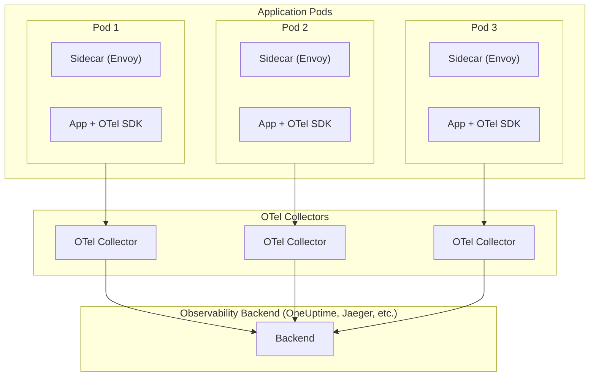

# OpenTelemetry with Service Mesh: Istio, Linkerd, and Beyond

[Nawaz Dhandala](https://github.com/nicksocial129) - December 17, 2025

**Tags:** OpenTelemetry, Service Mesh, Istio, Linkerd, Distributed Tracing, Kubernetes, Envoy

**Description:** Learn how to integrate OpenTelemetry with service meshes like Istio and Linkerd for comprehensive distributed tracing in microservices architectures.

---

> Service meshes provide automatic observability at the infrastructure layer, but combining them with OpenTelemetry unlocks application-level insights that transform how you understand your distributed systems.

Service meshes have become essential infrastructure for managing microservices communication, providing features like traffic management, security, and observability out of the box. When combined with OpenTelemetry, you get a complete picture—from infrastructure-level network metrics to application-level business traces.

## Table of Contents

1. [Understanding Service Mesh Observability](#1-understanding-service-mesh-observability)
2. [Istio and OpenTelemetry Integration](#2-istio-and-opentelemetry-integration)
3. [Linkerd and OpenTelemetry Integration](#3-linkerd-and-opentelemetry-integration)
4. [Envoy Proxy Tracing Configuration](#4-envoy-proxy-tracing-configuration)
5. [Context Propagation Across Mesh](#5-context-propagation-across-mesh)
6. [Correlating Mesh and Application Traces](#6-correlating-mesh-and-application-traces)
7. [Advanced Configuration Patterns](#7-advanced-configuration-patterns)
8. [Production Best Practices](#8-production-best-practices)

## 1. Understanding Service Mesh Observability

Service meshes intercept all network traffic between services, providing automatic observability without code changes.

### What Service Meshes Capture

| Data Type | Description | Example |
|-----------|-------------|---------|
| Request latency | Time between request/response | P99 latency: 45ms |
| Success rates | HTTP status code distribution | 99.2% success rate |
| Request volume | Requests per second | 1,200 RPS |
| Connection metrics | TCP connections, bytes transferred | 500 active connections |
| mTLS status | Encryption verification | TLS 1.3 enabled |

### The Observability Gap

Service meshes provide infrastructure-level metrics, but they can't see:
- Business logic execution time
- Database query details
- Cache hit/miss ratios
- Custom application events
- Error context and stack traces

OpenTelemetry fills this gap by providing application-level instrumentation.

### Architecture Overview



## 2. Istio and OpenTelemetry Integration

Istio provides native support for distributed tracing through its Envoy sidecars.

### Enabling Tracing in Istio

Configure Istio's mesh-wide tracing settings:

```yaml
# istio-config.yaml
apiVersion: install.istio.io/v1alpha1
kind: IstioOperator
metadata:
  name: istio-control-plane
spec:
  meshConfig:
    enableTracing: true
    defaultConfig:
      tracing:
        sampling: 100.0
        zipkin:
          address: otel-collector.observability:9411
    extensionProviders:
    - name: otel-tracing
      opentelemetry:
        service: otel-collector.observability.svc.cluster.local
        port: 4317
```

### Configuring OpenTelemetry Provider

```yaml
# telemetry.yaml
apiVersion: telemetry.istio.io/v1alpha1
kind: Telemetry
metadata:
  name: mesh-tracing
  namespace: istio-system
spec:
  tracing:
  - providers:
    - name: otel-tracing
    randomSamplingPercentage: 100.0
    customTags:
      environment:
        literal:
          value: production
      cluster:
        literal:
          value: us-west-2
```

### Per-Namespace Configuration

```yaml
# namespace-telemetry.yaml
apiVersion: telemetry.istio.io/v1alpha1
kind: Telemetry
metadata:
  name: api-tracing
  namespace: api-services
spec:
  tracing:
  - providers:
    - name: otel-tracing
    randomSamplingPercentage: 50.0
    disableSpanReporting: false
    customTags:
      team:
        literal:
          value: platform
```

### OpenTelemetry Collector for Istio

```yaml
# otel-collector-config.yaml
apiVersion: v1
kind: ConfigMap
metadata:
  name: otel-collector-config
  namespace: observability
data:
  config.yaml: |
    receivers:
      otlp:
        protocols:
          grpc:
            endpoint: 0.0.0.0:4317
          http:
            endpoint: 0.0.0.0:4318
      zipkin:
        endpoint: 0.0.0.0:9411

    processors:
      batch:
        timeout: 1s
        send_batch_size: 1024

      resource:
        attributes:
        - key: mesh.name
          value: istio
          action: upsert

      attributes:
        actions:
        - key: upstream_cluster
          action: delete
        - key: downstream_cluster
          action: delete

    exporters:
      otlphttp:
        endpoint: https://otlp.oneuptime.com
        headers:
          x-oneuptime-token: "${ONEUPTIME_TOKEN}"

    service:
      pipelines:
        traces:
          receivers: [otlp, zipkin]
          processors: [batch, resource, attributes]
          exporters: [otlphttp]
```

## 3. Linkerd and OpenTelemetry Integration

Linkerd uses a different approach with its own proxy, but provides similar tracing capabilities.

### Installing Linkerd with Tracing

```bash
# Install Linkerd CLI
curl --proto '=https' --tlsv1.2 -sSfL https://run.linkerd.io/install | sh

# Install Linkerd with tracing enabled
linkerd install --set proxyInit.runAsRoot=true | kubectl apply -f -

# Install Linkerd-Jaeger extension for tracing
linkerd jaeger install | kubectl apply -f -
```

### Configuring OpenTelemetry Collector

```yaml
# linkerd-otel-collector.yaml
apiVersion: v1
kind: ConfigMap
metadata:
  name: collector-config
  namespace: linkerd-jaeger
data:
  config.yaml: |
    receivers:
      otlp:
        protocols:
          grpc:
            endpoint: 0.0.0.0:4317

    processors:
      batch:
        timeout: 1s

      resource:
        attributes:
        - key: mesh.name
          value: linkerd
          action: upsert

    exporters:
      otlphttp:
        endpoint: https://otlp.oneuptime.com
        headers:
          x-oneuptime-token: "${ONEUPTIME_TOKEN}"

    service:
      pipelines:
        traces:
          receivers: [otlp]
          processors: [batch, resource]
          exporters: [otlphttp]
```

### Linkerd Tracing Annotation

```yaml
# deployment-with-linkerd.yaml
apiVersion: apps/v1
kind: Deployment
metadata:
  name: api-server
  annotations:
    linkerd.io/inject: enabled
spec:
  template:
    metadata:
      annotations:
        config.linkerd.io/trace-collector: otel-collector.linkerd-jaeger:4317
        config.linkerd.io/trace-collector-service-account: otel-collector
    spec:
      containers:
      - name: api-server
        image: api-server:latest
        env:
        - name: OTEL_EXPORTER_OTLP_ENDPOINT
          value: "http://otel-collector.linkerd-jaeger:4317"
```

## 4. Envoy Proxy Tracing Configuration

Both Istio and other service meshes use Envoy proxy. Understanding Envoy's tracing configuration helps with customization.

### Envoy Tracing Configuration

```yaml
# envoy-tracing-config.yaml
static_resources:
  listeners:
  - name: listener_0
    address:
      socket_address:
        address: 0.0.0.0
        port_value: 8080
    filter_chains:
    - filters:
      - name: envoy.filters.network.http_connection_manager
        typed_config:
          "@type": type.googleapis.com/envoy.extensions.filters.network.http_connection_manager.v3.HttpConnectionManager
          stat_prefix: ingress_http
          tracing:
            provider:
              name: envoy.tracers.opentelemetry
              typed_config:
                "@type": type.googleapis.com/envoy.config.trace.v3.OpenTelemetryConfig
                grpc_service:
                  envoy_grpc:
                    cluster_name: opentelemetry_collector
                  timeout: 0.250s
                service_name: envoy-proxy
          route_config:
            name: local_route
            virtual_hosts:
            - name: local_service
              domains: ["*"]
              routes:
              - match:
                  prefix: "/"
                route:
                  cluster: local_service
                decorator:
                  operation: ingress

  clusters:
  - name: opentelemetry_collector
    type: STRICT_DNS
    lb_policy: ROUND_ROBIN
    typed_extension_protocol_options:
      envoy.extensions.upstreams.http.v3.HttpProtocolOptions:
        "@type": type.googleapis.com/envoy.extensions.upstreams.http.v3.HttpProtocolOptions
        explicit_http_config:
          http2_protocol_options: {}
    load_assignment:
      cluster_name: opentelemetry_collector
      endpoints:
      - lb_endpoints:
        - endpoint:
            address:
              socket_address:
                address: otel-collector
                port_value: 4317
```

### Custom Span Attributes from Headers

```yaml
# envoy-custom-tags.yaml
tracing:
  custom_tags:
  - tag: user.id
    request_header:
      name: x-user-id
  - tag: tenant.id
    request_header:
      name: x-tenant-id
  - tag: request.id
    request_header:
      name: x-request-id
  - tag: environment
    literal:
      value: production
```

## 5. Context Propagation Across Mesh

Proper context propagation ensures traces span across service boundaries.

### Application-Side Propagation (Node.js)

```javascript
// tracing.js
const { NodeTracerProvider } = require('@opentelemetry/sdk-trace-node');
const { BatchSpanProcessor } = require('@opentelemetry/sdk-trace-base');
const { OTLPTraceExporter } = require('@opentelemetry/exporter-trace-otlp-grpc');
const { W3CTraceContextPropagator } = require('@opentelemetry/core');
const { registerInstrumentations } = require('@opentelemetry/instrumentation');
const { HttpInstrumentation } = require('@opentelemetry/instrumentation-http');
const { ExpressInstrumentation } = require('@opentelemetry/instrumentation-express');

const provider = new NodeTracerProvider();

// Use W3C Trace Context for mesh compatibility
const propagator = new W3CTraceContextPropagator();
provider.register({ propagator });

provider.addSpanProcessor(
  new BatchSpanProcessor(
    new OTLPTraceExporter({
      url: process.env.OTEL_EXPORTER_OTLP_ENDPOINT || 'grpc://localhost:4317',
    })
  )
);

registerInstrumentations({
  instrumentations: [
    new HttpInstrumentation({
      // Propagate trace headers through mesh
      requestHook: (span, request) => {
        // Headers added by service mesh
        const meshRequestId = request.headers['x-request-id'];
        if (meshRequestId) {
          span.setAttribute('mesh.request_id', meshRequestId);
        }
      },
    }),
    new ExpressInstrumentation(),
  ],
});
```

### Handling Multiple Propagation Formats

```javascript
// multi-propagator.js
const { CompositePropagator } = require('@opentelemetry/core');
const { W3CTraceContextPropagator } = require('@opentelemetry/core');
const { W3CBaggagePropagator } = require('@opentelemetry/core');
const { B3Propagator, B3InjectEncoding } = require('@opentelemetry/propagator-b3');

// Support multiple formats for backward compatibility
const propagator = new CompositePropagator({
  propagators: [
    new W3CTraceContextPropagator(),
    new W3CBaggagePropagator(),
    new B3Propagator({
      injectEncoding: B3InjectEncoding.MULTI_HEADER,
    }),
  ],
});

// Register with provider
provider.register({ propagator });
```

### Go Service with Context Propagation

```go
// main.go
package main

import (
    "context"
    "net/http"

    "go.opentelemetry.io/contrib/instrumentation/net/http/otelhttp"
    "go.opentelemetry.io/contrib/propagators/b3"
    "go.opentelemetry.io/otel"
    "go.opentelemetry.io/otel/propagation"
    "go.opentelemetry.io/otel/sdk/trace"
    "go.opentelemetry.io/otel/exporters/otlp/otlptrace/otlptracegrpc"
)

func initTracer() (*trace.TracerProvider, error) {
    exporter, err := otlptracegrpc.New(context.Background())
    if err != nil {
        return nil, err
    }

    tp := trace.NewTracerProvider(
        trace.WithBatcher(exporter),
    )

    // Set up propagators for service mesh compatibility
    otel.SetTextMapPropagator(
        propagation.NewCompositeTextMapPropagator(
            propagation.TraceContext{},
            propagation.Baggage{},
            b3.New(b3.WithInjectEncoding(b3.B3MultipleHeader)),
        ),
    )

    otel.SetTracerProvider(tp)
    return tp, nil
}

func main() {
    tp, _ := initTracer()
    defer tp.Shutdown(context.Background())

    // Wrap handler with OpenTelemetry
    handler := http.HandlerFunc(func(w http.ResponseWriter, r *http.Request) {
        // Extract mesh headers
        ctx := r.Context()
        span := otel.Tracer("service").SpanFromContext(ctx)

        // Add mesh-specific attributes
        if requestID := r.Header.Get("x-request-id"); requestID != "" {
            span.SetAttributes(attribute.String("mesh.request_id", requestID))
        }

        w.Write([]byte("OK"))
    })

    http.Handle("/", otelhttp.NewHandler(handler, "server"))
    http.ListenAndServe(":8080", nil)
}
```

## 6. Correlating Mesh and Application Traces

Combine infrastructure and application traces for complete visibility.

### Trace Correlation Strategy

```yaml
# otel-collector-correlation.yaml
processors:
  # Add mesh-specific attributes
  resource:
    attributes:
    - key: k8s.pod.name
      from_attribute: POD_NAME
      action: upsert
    - key: k8s.namespace.name
      from_attribute: NAMESPACE
      action: upsert

  # Transform mesh spans
  transform:
    trace_statements:
    - context: span
      statements:
      # Extract service name from Istio span name
      - set(attributes["service.name"], Split(name, ".")[0])
        where attributes["component"] == "proxy"

      # Mark mesh-generated spans
      - set(attributes["span.source"], "mesh")
        where attributes["component"] == "proxy"

      # Mark application spans
      - set(attributes["span.source"], "application")
        where attributes["component"] != "proxy"
```

### Application-Side Mesh Context Extraction

```python
# mesh_context.py
from opentelemetry import trace
from opentelemetry.propagate import extract
from flask import request

def extract_mesh_context():
    """Extract and enrich span with mesh context."""
    tracer = trace.get_tracer(__name__)

    # Extract standard trace context
    ctx = extract(request.headers)

    with tracer.start_as_current_span("process_request", context=ctx) as span:
        # Add mesh-specific headers as attributes
        mesh_headers = {
            'x-request-id': 'mesh.request_id',
            'x-b3-traceid': 'mesh.b3.trace_id',
            'x-envoy-external-address': 'mesh.client_ip',
            'x-forwarded-for': 'http.forwarded_for',
            'x-envoy-attempt-count': 'mesh.retry_count',
        }

        for header, attr in mesh_headers.items():
            value = request.headers.get(header)
            if value:
                span.set_attribute(attr, value)

        return span
```

### Creating Unified Dashboards

```yaml
# grafana-dashboard-query.yaml
# PromQL queries combining mesh and application metrics

# Service latency (mesh perspective)
histogram_quantile(0.99,
  sum(rate(istio_request_duration_milliseconds_bucket{
    destination_service=~"$service"
  }[5m])) by (le, destination_service)
)

# Service latency (application perspective)
histogram_quantile(0.99,
  sum(rate(http_server_duration_bucket{
    service_name=~"$service"
  }[5m])) by (le, service_name)
)

# Error correlation
sum(rate(istio_requests_total{
  response_code=~"5.*",
  destination_service=~"$service"
}[5m]))
/
sum(rate(istio_requests_total{
  destination_service=~"$service"
}[5m]))
```

## 7. Advanced Configuration Patterns

### Selective Tracing by Path

```yaml
# istio-selective-tracing.yaml
apiVersion: networking.istio.io/v1alpha3
kind: EnvoyFilter
metadata:
  name: selective-tracing
  namespace: istio-system
spec:
  workloadSelector:
    labels:
      app: api-gateway
  configPatches:
  - applyTo: HTTP_ROUTE
    match:
      context: SIDECAR_INBOUND
      routeConfiguration:
        vhost:
          route:
            action: ANY
    patch:
      operation: MERGE
      value:
        decorator:
          propagate: false
        route:
          # Disable tracing for health checks
          metadata:
            filter_metadata:
              envoy.filters.http.router:
                disable_tracing: true

  - applyTo: HTTP_ROUTE
    match:
      context: SIDECAR_INBOUND
      routeConfiguration:
        vhost:
          route:
            name: "api-v1"
    patch:
      operation: MERGE
      value:
        decorator:
          operation: "api-v1-request"
          propagate: true
```

### Dynamic Sampling Based on Headers

```yaml
# dynamic-sampling.yaml
apiVersion: networking.istio.io/v1alpha3
kind: EnvoyFilter
metadata:
  name: dynamic-sampling
spec:
  configPatches:
  - applyTo: HTTP_FILTER
    match:
      context: SIDECAR_INBOUND
      listener:
        filterChain:
          filter:
            name: envoy.filters.network.http_connection_manager
    patch:
      operation: INSERT_BEFORE
      value:
        name: envoy.filters.http.lua
        typed_config:
          "@type": type.googleapis.com/envoy.extensions.filters.http.lua.v3.Lua
          inline_code: |
            function envoy_on_request(request_handle)
              -- Always trace requests with debug header
              local debug = request_handle:headers():get("x-debug-trace")
              if debug == "true" then
                request_handle:headers():add("x-envoy-force-trace", "true")
              end

              -- Always trace error responses
              local priority = request_handle:headers():get("x-priority")
              if priority == "high" then
                request_handle:headers():add("x-envoy-force-trace", "true")
              end
            end
```

### Multi-Cluster Mesh Tracing

```yaml
# multi-cluster-collector.yaml
apiVersion: v1
kind: ConfigMap
metadata:
  name: otel-collector-config
data:
  config.yaml: |
    receivers:
      otlp:
        protocols:
          grpc:
            endpoint: 0.0.0.0:4317

    processors:
      batch: {}

      resource:
        attributes:
        - key: k8s.cluster.name
          value: ${CLUSTER_NAME}
          action: upsert
        - key: mesh.cluster
          value: ${CLUSTER_NAME}
          action: upsert

      # Add cluster prefix to service names
      transform:
        trace_statements:
        - context: resource
          statements:
          - set(attributes["service.name"],
              Concat([attributes["k8s.cluster.name"], "/", attributes["service.name"]], ""))

    exporters:
      otlphttp:
        endpoint: https://otlp.oneuptime.com
        headers:
          x-oneuptime-token: "${ONEUPTIME_TOKEN}"

    service:
      pipelines:
        traces:
          receivers: [otlp]
          processors: [batch, resource, transform]
          exporters: [otlphttp]
```

## 8. Production Best Practices

### Sampling Strategy

| Environment | Mesh Sampling | App Sampling | Notes |
|-------------|---------------|--------------|-------|
| Development | 100% | 100% | Full visibility |
| Staging | 50% | 100% | Reduced mesh, full app |
| Production | 10% | 100%* | Tail-based at collector |
| High-traffic | 1% | Head-based | Cost management |

*With tail-based sampling for errors

### Resource Allocation

```yaml
# otel-collector-resources.yaml
apiVersion: apps/v1
kind: Deployment
metadata:
  name: otel-collector
spec:
  replicas: 3
  template:
    spec:
      containers:
      - name: collector
        resources:
          requests:
            memory: "512Mi"
            cpu: "500m"
          limits:
            memory: "2Gi"
            cpu: "2000m"
        env:
        - name: GOGC
          value: "80"
        - name: GOMEMLIMIT
          value: "1750MiB"
```

### Health Monitoring

```yaml
# collector-health.yaml
extensions:
  health_check:
    endpoint: 0.0.0.0:13133
    path: /health
    check_collector_pipeline:
      enabled: true
      interval: 5s
      exporter_failure_threshold: 5

  pprof:
    endpoint: 0.0.0.0:1777

  zpages:
    endpoint: 0.0.0.0:55679

service:
  extensions: [health_check, pprof, zpages]
```

### Troubleshooting Checklist

| Issue | Check | Solution |
|-------|-------|----------|
| Missing traces | Sampling rate | Increase sampling or use force-trace header |
| Broken trace chains | Propagation headers | Ensure W3C/B3 headers passed |
| Duplicate spans | Multiple collectors | Deduplicate in backend |
| High latency | Batch settings | Tune batch size and timeout |
| Memory issues | Queue limits | Configure bounded queues |

## Summary

Integrating OpenTelemetry with service meshes provides:

- **Complete visibility**: Infrastructure and application-level insights
- **Automatic instrumentation**: Mesh captures network-level data without code changes
- **Flexible sampling**: Control costs while maintaining visibility
- **Unified tracing**: Correlate mesh and application spans

The combination of service mesh observability and OpenTelemetry instrumentation gives you the full picture of your distributed system's behavior.

## Start Monitoring Your Service Mesh

OneUptime provides native support for OpenTelemetry traces from service meshes like Istio and Linkerd. Get comprehensive distributed tracing with automatic correlation between mesh and application spans.

[Start Free Trial](https://oneuptime.com/signup) - Full-featured observability for your service mesh.

## See Also

- [OpenTelemetry for Kubernetes](/blog/opentelemetry-kubernetes-monitoring)
- [Context Propagation in OpenTelemetry](/blog/opentelemetry-baggage-propagation)
- [OpenTelemetry Collector Deep Dive](/blog/opentelemetry-collector)
