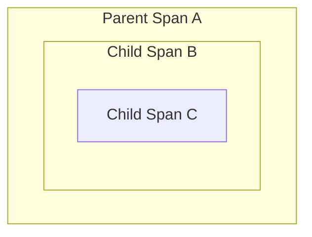
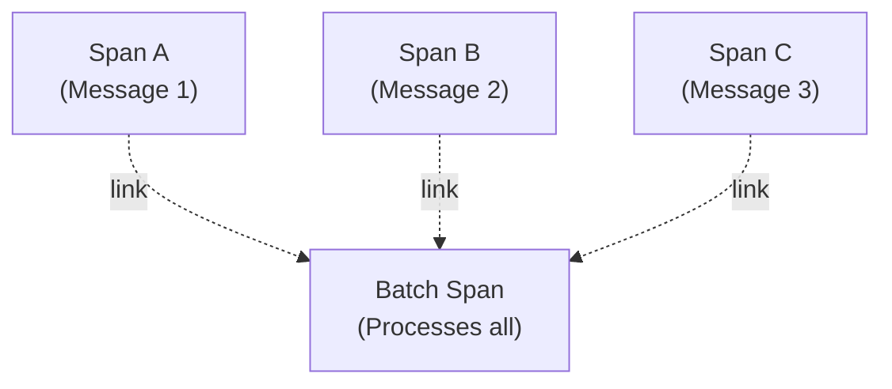
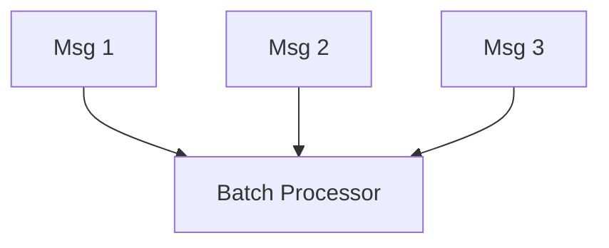
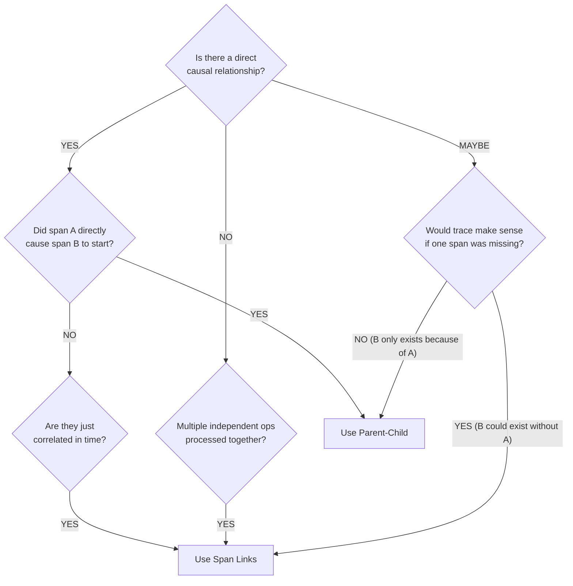

# Span Links vs Parent-Child Relationships in OpenTelemetry

[Nawaz Dhandala](https://github.com/nicksocial129) - December 17, 2025

**Tags:** OpenTelemetry, Distributed Tracing, Span Links, Trace Context, Architecture Patterns

**Description:** Understand when to use span links versus parent-child relationships in OpenTelemetry for accurate trace modeling in complex distributed systems.

---

> The difference between span links and parent-child relationships can mean the difference between a clear trace visualization and a confusing mess. Choosing correctly is essential for accurate distributed tracing.

OpenTelemetry provides two ways to relate spans: parent-child relationships and span links. Understanding when to use each is crucial for building accurate, meaningful traces in complex architectures.

## Table of Contents

1. [Understanding Span Relationships](#1-understanding-span-relationships)
2. [Parent-Child Relationships](#2-parent-child-relationships)
3. [Span Links Explained](#3-span-links-explained)
4. [When to Use Each Approach](#4-when-to-use-each-approach)
5. [Implementation Patterns](#5-implementation-patterns)
6. [Real-World Scenarios](#6-real-world-scenarios)
7. [Visualization and Analysis](#7-visualization-and-analysis)
8. [Best Practices](#8-best-practices)

## 1. Understanding Span Relationships

### The Two Relationship Types

| Relationship | Meaning | Use Case |
|--------------|---------|----------|
| Parent-Child | Causal, synchronous | Request → subrequest |
| Span Link | Related, not causal | Batch processing, fan-out |

### Visual Comparison

**Parent-Child Relationship:**



*Timeline: A contains B contains C*

**Span Links:**



*Timeline: A, B, C happened before Batch, but not causally*

## 2. Parent-Child Relationships

### When Parent-Child is Correct

Parent-child relationships indicate direct causation—the parent span directly caused the child span to exist.

```typescript
// parent-child-example.ts
import { trace, context, SpanKind } from '@opentelemetry/api';

const tracer = trace.getTracer('order-service');

async function processOrder(orderId: string) {
  // Parent span - the order processing
  const orderSpan = tracer.startSpan('process-order', {
    attributes: { 'order.id': orderId },
  });

  try {
    await context.with(trace.setSpan(context.active(), orderSpan), async () => {
      // Child span - validating the order
      // This ONLY exists because processOrder was called
      const validateSpan = tracer.startSpan('validate-order');
      await validateOrder(orderId);
      validateSpan.end();

      // Child span - processing payment
      // Direct causal relationship: order processing causes payment
      const paymentSpan = tracer.startSpan('process-payment');
      await processPayment(orderId);
      paymentSpan.end();

      // Child span - sending confirmation
      const confirmSpan = tracer.startSpan('send-confirmation');
      await sendConfirmation(orderId);
      confirmSpan.end();
    });
  } finally {
    orderSpan.end();
  }
}
```

### Characteristics of Parent-Child

1. **Temporal containment**: Child starts after parent, ends before parent
2. **Direct causation**: Parent directly initiated the child operation
3. **Synchronous execution**: Child executes within parent's context
4. **Single parent**: Each span has exactly one parent (or none for root)

### HTTP Request Chain Example

```typescript
// http-chain.ts
// Service A calls Service B calls Service C
// This is a perfect parent-child scenario

// Service A
async function handleUserRequest(req: Request) {
  const span = tracer.startSpan('handle-user-request', {
    kind: SpanKind.SERVER,
  });

  await context.with(trace.setSpan(context.active(), span), async () => {
    // Context propagation ensures Service B's span is a child
    const response = await fetch('http://service-b/api/data', {
      headers: getTracingHeaders(), // Propagates trace context
    });
  });

  span.end();
}

// Service B - span automatically becomes child of Service A's span
async function handleDataRequest(req: Request) {
  const parentContext = extractContext(req.headers);

  const span = tracer.startSpan(
    'handle-data-request',
    { kind: SpanKind.SERVER },
    parentContext // Makes this a child span
  );

  // Further calls become grandchildren
  await context.with(trace.setSpan(parentContext, span), async () => {
    await fetch('http://service-c/api/enrich');
  });

  span.end();
}
```

## 3. Span Links Explained

### What Are Span Links?

Span links connect spans that are related but don't have a direct causal relationship. They represent "this span is related to these other spans."

```typescript
// span-link-basics.ts
import { trace, Link, SpanContext } from '@opentelemetry/api';

const tracer = trace.getTracer('batch-processor');

function createSpanWithLinks(linkedSpanContexts: SpanContext[]) {
  // Create links to related spans
  const links: Link[] = linkedSpanContexts.map((ctx) => ({
    context: ctx,
    attributes: {
      'link.type': 'batch-source',
    },
  }));

  // Create span with links
  const span = tracer.startSpan('batch-process', {
    links,
    attributes: {
      'batch.size': linkedSpanContexts.length,
    },
  });

  return span;
}
```

### Link Attributes

Links can carry attributes that describe the relationship:

```typescript
// link-attributes.ts
const links: Link[] = [
  {
    context: sourceSpanContext,
    attributes: {
      'link.type': 'caused_by',
      'link.source': 'message-queue',
    },
  },
  {
    context: triggerSpanContext,
    attributes: {
      'link.type': 'triggered_by',
      'link.trigger': 'scheduled-job',
    },
  },
];
```

## 4. When to Use Each Approach

### Decision Matrix

| Scenario | Relationship | Reason |
|----------|--------------|--------|
| HTTP request → subrequest | Parent-Child | Direct causation |
| Database query within request | Parent-Child | Synchronous, contained |
| Message publish → single consume | Parent-Child | Direct causation |
| Batch consume multiple messages | Links | Multiple origins |
| Scheduled job processing items | Links | Items existed independently |
| Fan-out to multiple services | Both | Parent-child for call, links for aggregation |
| Retry of failed operation | Links | New trace, related to original |

### Use Parent-Child When

```typescript
// parent-child-scenarios.ts

// 1. Synchronous request handling
async function handleRequest() {
  const span = tracer.startSpan('handle-request');

  await context.with(trace.setSpan(context.active(), span), async () => {
    // All of these are parent-child - they happen because of the request
    await validateInput();    // Child
    await processData();      // Child
    await saveToDatabase();   // Child
    await sendResponse();     // Child
  });

  span.end();
}

// 2. Single message consumption
async function consumeMessage(message: Message) {
  // Extract parent context from message
  const parentContext = extractContext(message.headers);

  // This span is a child of the producer span
  const span = tracer.startSpan('consume-message', {}, parentContext);
  // ...
}

// 3. Sequential workflow steps
async function executeWorkflow() {
  const span = tracer.startSpan('workflow');

  await context.with(trace.setSpan(context.active(), span), async () => {
    await step1(); // Child - caused by workflow
    await step2(); // Child - caused by workflow (and implicitly by step1)
    await step3(); // Child - caused by workflow
  });

  span.end();
}
```

### Use Span Links When

```typescript
// span-link-scenarios.ts

// 1. Batch processing multiple messages
async function processBatch(messages: Message[]) {
  // Collect span contexts from all messages
  const links: Link[] = messages.map((msg) => ({
    context: extractSpanContext(msg.headers),
    attributes: { 'message.id': msg.id },
  }));

  // Create batch span with links to all source messages
  const span = tracer.startSpan('process-batch', {
    links,
    attributes: { 'batch.size': messages.length },
  });

  // Process all messages
  for (const msg of messages) {
    await processMessage(msg);
  }

  span.end();
}

// 2. Scheduled job processing existing items
async function scheduledCleanup() {
  // This job wasn't caused by any single request
  const span = tracer.startSpan('scheduled-cleanup');

  const items = await getItemsToClean();

  // Link to the spans that created these items (if available)
  const links = items
    .filter((item) => item.createdByTraceId)
    .map((item) => ({
      context: {
        traceId: item.createdByTraceId,
        spanId: item.createdBySpanId,
        traceFlags: 1,
      },
    }));

  if (links.length > 0) {
    span.addLink(links);
  }

  span.end();
}

// 3. Aggregation from multiple sources
async function aggregateResults(sources: Source[]) {
  // Collect results from multiple independent operations
  const results = await Promise.all(
    sources.map((source) => fetchFromSource(source))
  );

  // Link to all source operations
  const links = results.map((r) => ({
    context: r.spanContext,
    attributes: { 'source.name': r.sourceName },
  }));

  const aggregateSpan = tracer.startSpan('aggregate-results', { links });

  // Combine results
  const combined = combineResults(results);

  aggregateSpan.end();
  return combined;
}
```

## 5. Implementation Patterns

### Pattern 1: Message Queue with Batch Consumer

```typescript
// batch-consumer-pattern.ts
import { trace, context, propagation, Link, SpanKind } from '@opentelemetry/api';

const tracer = trace.getTracer('message-consumer');

interface QueueMessage {
  id: string;
  body: any;
  headers: Record<string, string>;
}

// Producer - creates individual spans
async function produceMessage(topic: string, body: any) {
  const span = tracer.startSpan(`produce ${topic}`, {
    kind: SpanKind.PRODUCER,
  });

  const headers: Record<string, string> = {};
  context.with(trace.setSpan(context.active(), span), () => {
    propagation.inject(context.active(), headers);
  });

  await sendToQueue(topic, body, headers);
  span.end();
}

// Consumer - batch processing with links
async function consumeBatch(messages: QueueMessage[]) {
  // Extract span contexts from all messages
  const links: Link[] = messages.map((msg) => {
    const ctx = propagation.extract(context.active(), msg.headers);
    const spanContext = trace.getSpanContext(ctx);
    return {
      context: spanContext!,
      attributes: {
        'messaging.message_id': msg.id,
      },
    };
  }).filter((link) => link.context);

  // Create batch processing span with links
  const batchSpan = tracer.startSpan('process-message-batch', {
    kind: SpanKind.CONSUMER,
    links,
    attributes: {
      'messaging.batch_size': messages.length,
      'messaging.operation': 'process',
    },
  });

  try {
    await context.with(trace.setSpan(context.active(), batchSpan), async () => {
      // Process each message - these ARE parent-child with batchSpan
      for (const msg of messages) {
        const msgSpan = tracer.startSpan(`process-message ${msg.id}`);
        await processMessage(msg);
        msgSpan.end();
      }
    });
  } finally {
    batchSpan.end();
  }
}
```

### Pattern 2: Fan-Out with Aggregation

```typescript
// fan-out-aggregation.ts
const tracer = trace.getTracer('orchestrator');

async function fanOutAndAggregate(request: Request) {
  const orchestratorSpan = tracer.startSpan('orchestrate-request');

  const childSpanContexts: SpanContext[] = [];

  try {
    await context.with(trace.setSpan(context.active(), orchestratorSpan), async () => {
      // Fan-out: parallel requests to multiple services
      // Each is a child of the orchestrator span
      const results = await Promise.all([
        callServiceA().then((r) => {
          childSpanContexts.push(r.spanContext);
          return r;
        }),
        callServiceB().then((r) => {
          childSpanContexts.push(r.spanContext);
          return r;
        }),
        callServiceC().then((r) => {
          childSpanContexts.push(r.spanContext);
          return r;
        }),
      ]);

      // Aggregation span links to all fan-out results
      const aggregateSpan = tracer.startSpan('aggregate-results', {
        links: childSpanContexts.map((ctx) => ({
          context: ctx,
          attributes: { 'link.type': 'aggregation-source' },
        })),
      });

      const finalResult = aggregate(results);
      aggregateSpan.end();

      return finalResult;
    });
  } finally {
    orchestratorSpan.end();
  }
}

async function callServiceA(): Promise<{ data: any; spanContext: SpanContext }> {
  const span = tracer.startSpan('call-service-a', { kind: SpanKind.CLIENT });

  try {
    const data = await fetch('http://service-a/api/data');
    return {
      data: await data.json(),
      spanContext: span.spanContext(),
    };
  } finally {
    span.end();
  }
}
```

### Pattern 3: Retry with Link to Original

```typescript
// retry-with-links.ts
const tracer = trace.getTracer('retry-handler');

interface RetryContext {
  originalTraceId: string;
  originalSpanId: string;
  attemptNumber: number;
  lastError: string;
}

async function executeWithRetry<T>(
  operation: () => Promise<T>,
  maxRetries: number = 3
): Promise<T> {
  let lastError: Error | null = null;
  let originalSpanContext: SpanContext | null = null;

  for (let attempt = 1; attempt <= maxRetries; attempt++) {
    const links: Link[] = [];

    // Link to original attempt (not parent-child, because this is a new attempt)
    if (originalSpanContext) {
      links.push({
        context: originalSpanContext,
        attributes: {
          'link.type': 'retry-of',
          'retry.original_attempt': 1,
        },
      });
    }

    const span = tracer.startSpan('operation-attempt', {
      links,
      attributes: {
        'retry.attempt': attempt,
        'retry.max_attempts': maxRetries,
      },
    });

    // Save first attempt's context for linking
    if (attempt === 1) {
      originalSpanContext = span.spanContext();
    }

    try {
      const result = await context.with(
        trace.setSpan(context.active(), span),
        operation
      );
      span.setAttribute('retry.success', true);
      span.end();
      return result;
    } catch (error) {
      lastError = error as Error;
      span.setAttribute('retry.success', false);
      span.setAttribute('retry.error', lastError.message);
      span.recordException(lastError);
      span.end();

      if (attempt < maxRetries) {
        await delay(Math.pow(2, attempt) * 1000); // Exponential backoff
      }
    }
  }

  throw lastError;
}
```

## 6. Real-World Scenarios

### Scenario 1: E-Commerce Order Processing

```typescript
// ecommerce-scenario.ts

// User places order (creates root span)
// → Inventory check (child)
// → Payment processing (child)
//   → External payment gateway (child of payment)
// → Order saved to database (child)
// → Email notification (child) - but async!

async function placeOrder(order: Order) {
  const orderSpan = tracer.startSpan('place-order');

  await context.with(trace.setSpan(context.active(), orderSpan), async () => {
    // All synchronous steps are parent-child
    await checkInventory(order);  // Child
    await processPayment(order);  // Child (has its own children)
    await saveOrder(order);       // Child

    // Async notification - should this be child or link?
    // If we wait for it: child
    // If we fire-and-forget: link (or no relationship)
    const notificationSpanContext = await queueNotification(order);

    // Store for potential linking by notification processor
    order.originSpanContext = orderSpan.spanContext();
  });

  orderSpan.end();
}

// Notification processor (runs async, potentially batched)
async function processNotifications(notifications: Notification[]) {
  // Links to all order spans that triggered notifications
  const links = notifications
    .filter((n) => n.originSpanContext)
    .map((n) => ({
      context: n.originSpanContext,
      attributes: { 'notification.order_id': n.orderId },
    }));

  const span = tracer.startSpan('process-notifications', { links });
  // ...
  span.end();
}
```

### Scenario 2: Data Pipeline

```typescript
// data-pipeline-scenario.ts

// Multiple data sources → ETL process → Single output
// Each source produces data independently
// ETL job processes all of them together

// Source 1 writes data
async function source1Export() {
  const span = tracer.startSpan('source1-export');
  const data = await exportData();
  await writeToStaging(data, span.spanContext());
  span.end();
}

// Source 2 writes data (independent of source 1)
async function source2Export() {
  const span = tracer.startSpan('source2-export');
  const data = await exportData();
  await writeToStaging(data, span.spanContext());
  span.end();
}

// ETL job processes all staged data
async function etlProcess() {
  const stagedFiles = await listStagedFiles();

  // Collect span contexts from all source exports
  const sourceLinks = stagedFiles.map((file) => ({
    context: file.sourceSpanContext,
    attributes: {
      'etl.source': file.sourceName,
      'etl.file': file.filename,
    },
  }));

  // ETL span links to all sources (not child of any)
  const etlSpan = tracer.startSpan('etl-process', {
    links: sourceLinks,
    attributes: {
      'etl.source_count': stagedFiles.length,
    },
  });

  await context.with(trace.setSpan(context.active(), etlSpan), async () => {
    // These ARE children of ETL span
    await extract();    // Child
    await transform();  // Child
    await load();       // Child
  });

  etlSpan.end();
}
```

### Scenario 3: Saga Pattern

```typescript
// saga-pattern.ts

// Saga coordinator links to all participating services
// Each service's action might span multiple traces

interface SagaStep {
  serviceName: string;
  action: string;
  spanContext?: SpanContext;
  compensatingAction?: string;
}

async function executeSaga(sagaId: string, steps: SagaStep[]) {
  const executedSteps: SagaStep[] = [];
  const stepLinks: Link[] = [];

  const sagaSpan = tracer.startSpan('saga-execution', {
    attributes: { 'saga.id': sagaId },
  });

  try {
    for (const step of steps) {
      const stepSpan = tracer.startSpan(`saga-step:${step.action}`, {
        attributes: {
          'saga.step.service': step.serviceName,
          'saga.step.action': step.action,
        },
      });

      try {
        // Execute step (might be async, different trace)
        const result = await executeStep(step);

        // Collect link to step execution
        stepLinks.push({
          context: result.spanContext,
          attributes: {
            'saga.step.service': step.serviceName,
            'saga.step.result': 'success',
          },
        });

        executedSteps.push({ ...step, spanContext: result.spanContext });
        stepSpan.end();
      } catch (error) {
        stepSpan.recordException(error as Error);
        stepSpan.end();

        // Compensate all executed steps
        await compensateSaga(sagaId, executedSteps, stepLinks);
        throw error;
      }
    }

    // Add all step links to saga span
    sagaSpan.setAttribute('saga.steps_completed', steps.length);
  } finally {
    sagaSpan.end();
  }
}

async function compensateSaga(
  sagaId: string,
  executedSteps: SagaStep[],
  originalLinks: Link[]
) {
  // Compensation span links to all original step spans
  const compensationSpan = tracer.startSpan('saga-compensation', {
    links: originalLinks,
    attributes: {
      'saga.id': sagaId,
      'saga.compensation_steps': executedSteps.length,
    },
  });

  // Execute compensating actions in reverse order
  for (const step of executedSteps.reverse()) {
    if (step.compensatingAction) {
      await executeCompensation(step);
    }
  }

  compensationSpan.end();
}
```

## 7. Visualization and Analysis

### How Tools Display Relationships

**Parent-Child (Waterfall View)**:

```mermaid
gantt
    title Request Trace (100ms total)
    dateFormat X
    axisFormat %Lms
    section Request
    Request (100ms)     :0, 100
    section Children
    Validate (10ms)     :0, 10
    Process (50ms)      :10, 60
    DB Query (30ms)     :15, 45
    Respond (5ms)       :60, 65
```



**Span Links (Graph View)**:



### Querying Linked Spans

```sql
-- Find all spans linked to a specific span
SELECT linked.*
FROM spans AS linked
JOIN span_links AS link ON link.linked_span_id = linked.span_id
WHERE link.source_span_id = 'abc123'

-- Find spans with multiple links (batch processing)
SELECT s.span_id, s.name, COUNT(l.linked_span_id) as link_count
FROM spans s
JOIN span_links l ON l.source_span_id = s.span_id
GROUP BY s.span_id, s.name
HAVING COUNT(l.linked_span_id) > 1
ORDER BY link_count DESC
```

## 8. Best Practices

### Decision Flowchart



### Guidelines Summary

| Scenario | Use | Rationale |
|----------|-----|-----------|
| Sync HTTP call | Parent-Child | Direct causation |
| Async message publish→consume | Parent-Child | Direct causation (async) |
| Batch message consumption | Links | Multiple independent origins |
| Scheduled job | Links (or none) | No causal trigger |
| Retry attempt | Links | New execution, related to original |
| Fan-out requests | Parent-Child | Each call caused by orchestrator |
| Fan-in aggregation | Links | Combining independent results |
| Saga steps | Parent-Child + Links | Steps are children, compensation links |

### Common Mistakes to Avoid

1. **Using parent-child for batch processing**: Creates artificially deep traces
2. **Not using links at all**: Loses important relationships
3. **Too many links**: Makes traces hard to understand (limit to meaningful relationships)
4. **Forgetting link attributes**: Links without context are confusing

## Summary

Choosing between span links and parent-child relationships:

- **Parent-Child**: Direct causation, synchronous or async but single-origin
- **Span Links**: Related but not causal, multiple origins, retry scenarios

The key question is: "Did span A directly cause span B to exist?" If yes, parent-child. If spans are related but independent, use links.

## Visualize Complex Traces with OneUptime

OneUptime provides advanced trace visualization that handles both parent-child relationships and span links, giving you clear visibility into complex distributed architectures.

[Start Free Trial](https://oneuptime.com/signup) - See your traces the right way.

## See Also

- [Message Queue Tracing](/blog/opentelemetry-message-queue-tracing)
- [Distributed Tracing Fundamentals](/blog/distributed-tracing-spans)
- [Context Propagation](/blog/opentelemetry-baggage-propagation)
