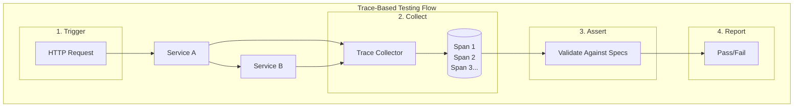

# Trace-Based Testing with OpenTelemetry

[Nawaz Dhandala](https://github.com/nicksocial129) - December 17, 2025

**Tags:** OpenTelemetry, Testing, Tracetest, Quality Assurance, CI/CD, Observability-Driven Development

**Description:** Learn how to use OpenTelemetry traces for automated testing, validating distributed system behavior, and ensuring observability in your CI/CD pipeline.

---

> What if your observability data could automatically verify that your system behaves correctly? Trace-based testing transforms your telemetry into a powerful testing framework.

Trace-based testing uses OpenTelemetry traces to validate system behavior, making your observability investment work double duty. Instead of just monitoring production, you can use traces to automatically verify correctness in development and CI/CD.

## Table of Contents

1. [What is Trace-Based Testing](#1-what-is-trace-based-testing)
2. [Setting Up Tracetest](#2-setting-up-tracetest)
3. [Writing Trace Assertions](#3-writing-trace-assertions)
4. [Testing Distributed Workflows](#4-testing-distributed-workflows)
5. [CI/CD Integration](#5-cicd-integration)
6. [Advanced Testing Patterns](#6-advanced-testing-patterns)
7. [Contract Testing with Traces](#7-contract-testing-with-traces)
8. [Best Practices](#8-best-practices)

## 1. What is Trace-Based Testing

### Traditional Testing vs Trace-Based Testing

| Aspect | Traditional Testing | Trace-Based Testing |
|--------|--------------------|--------------------|
| Scope | Single service | End-to-end distributed |
| Assertions | Response body | Response + all spans |
| Visibility | External behavior | Internal behavior |
| Setup | Mock dependencies | Real or synthetic traces |
| Maintenance | Manual updates | Auto-discovery |

### How It Works



### What You Can Test

- **Service interactions**: Verify correct service-to-service calls
- **Database operations**: Check query patterns and counts
- **Error handling**: Ensure errors are properly recorded
- **Performance**: Assert on span durations
- **Attributes**: Validate custom attributes are set correctly
- **Trace structure**: Verify expected spans exist

## 2. Setting Up Tracetest

### Installation

```bash
# Install Tracetest CLI
curl -L https://get.tracetest.io | bash

# Or via Homebrew
brew install kubeshop/tracetest/tracetest

# Or via npm
npm install -g @tracetest/cli
```

### Docker Compose Setup

```yaml
# docker-compose.yaml
version: '3.8'

services:
  tracetest:
    image: kubeshop/tracetest:latest
    platform: linux/amd64
    ports:
      - "11633:11633"
    environment:
      TRACETEST_DEV: "true"
    volumes:
      - ./tracetest-config.yaml:/app/tracetest.yaml
    depends_on:
      - otel-collector

  otel-collector:
    image: otel/opentelemetry-collector-contrib:latest
    command: ["--config=/etc/otel-collector-config.yaml"]
    volumes:
      - ./otel-collector-config.yaml:/etc/otel-collector-config.yaml
    ports:
      - "4317:4317"
      - "4318:4318"

  # Your application services
  api:
    build: ./api
    environment:
      OTEL_EXPORTER_OTLP_ENDPOINT: http://otel-collector:4317
      OTEL_SERVICE_NAME: api-service
    depends_on:
      - otel-collector
```

### Tracetest Configuration

```yaml
# tracetest-config.yaml
postgres:
  host: postgres
  port: 5432
  user: tracetest
  password: tracetest
  dbname: tracetest

telemetry:
  exporters:
    collector:
      serviceName: tracetest
      sampling: 100
      exporter:
        type: collector
        collector:
          endpoint: otel-collector:4317

server:
  httpPort: 11633
```

### OpenTelemetry Collector for Testing

```yaml
# otel-collector-config.yaml
receivers:
  otlp:
    protocols:
      grpc:
        endpoint: 0.0.0.0:4317
      http:
        endpoint: 0.0.0.0:4318

exporters:
  # Export to Tracetest
  otlp/tracetest:
    endpoint: tracetest:4317
    tls:
      insecure: true

  # Also export to your observability backend
  otlphttp:
    endpoint: https://otlp.oneuptime.com
    headers:
      x-oneuptime-token: ${ONEUPTIME_TOKEN}

service:
  pipelines:
    traces:
      receivers: [otlp]
      exporters: [otlp/tracetest, otlphttp]
```

## 3. Writing Trace Assertions

### Basic Test Definition

```yaml
# tests/order-api.yaml
type: Test
spec:
  id: order-creation-test
  name: Order Creation Flow
  description: Verify complete order creation workflow

  trigger:
    type: http
    httpRequest:
      url: http://api:8080/api/orders
      method: POST
      headers:
        - key: Content-Type
          value: application/json
      body: |
        {
          "customerId": "customer-123",
          "items": [
            {"productId": "prod-1", "quantity": 2}
          ]
        }

  specs:
    # Assert on HTTP response
    - selector: span[tracetest.span.type="http"]
      name: HTTP response is successful
      assertions:
        - attr:http.status_code = 201

    # Assert database was called
    - selector: span[db.system="postgresql"]
      name: Order was saved to database
      assertions:
        - attr:db.operation = "INSERT"
        - attr:db.sql.table = "orders"

    # Assert downstream service was called
    - selector: span[name="inventory-check"]
      name: Inventory service was called
      assertions:
        - attr:inventory.status = "available"

    # Assert on duration
    - selector: span[name="process-order"]
      name: Order processing under 500ms
      assertions:
        - attr:tracetest.span.duration < 500ms
```

### Selector Syntax

```yaml
# Selecting spans by various criteria
specs:
  # By span name
  - selector: span[name="http.request"]

  # By attribute value
  - selector: span[http.method="POST"]

  # By service name
  - selector: span[service.name="order-service"]

  # By span kind
  - selector: span[tracetest.span.type="http"]

  # Combining selectors
  - selector: span[service.name="api"][http.method="GET"]

  # By parent relationship
  - selector: span[name="db.query" parent.name="process-order"]

  # First/last of multiple spans
  - selector: span[name="db.query"]:first
  - selector: span[name="db.query"]:last

  # Nth span
  - selector: span[name="retry-attempt"]:nth_child(3)
```

### Assertion Types

```yaml
specs:
  # Equality
  - assertions:
      - attr:http.status_code = 200
      - attr:user.id = "user-123"

  # Comparison
  - assertions:
      - attr:tracetest.span.duration < 1s
      - attr:db.row_count >= 1
      - attr:retry.count <= 3

  # Contains
  - assertions:
      - attr:http.url contains "/api/"
      - attr:error.message contains "timeout"

  # Regex
  - assertions:
      - attr:http.url matches "^/api/v[0-9]+/"

  # Existence
  - assertions:
      - attr:user.id exists
      - attr:error.message not exists

  # Type checking
  - assertions:
      - attr:http.status_code is_number
      - attr:user.authenticated is_boolean
```

## 4. Testing Distributed Workflows

### Multi-Service Test

```yaml
# tests/checkout-flow.yaml
type: Test
spec:
  id: checkout-flow-test
  name: Complete Checkout Flow
  description: Test entire checkout process across services

  trigger:
    type: http
    httpRequest:
      url: http://api-gateway:8080/api/checkout
      method: POST
      body: |
        {
          "cartId": "cart-456",
          "paymentMethod": "credit_card"
        }

  specs:
    # Gateway received request
    - selector: span[service.name="api-gateway"][name="POST /api/checkout"]
      name: Gateway handles request
      assertions:
        - attr:http.status_code = 200

    # Cart service called
    - selector: span[service.name="cart-service"][name="get-cart"]
      name: Cart retrieved
      assertions:
        - attr:cart.id = "cart-456"
        - attr:cart.items.count >= 1

    # Inventory reserved
    - selector: span[service.name="inventory-service"][name="reserve-items"]
      name: Inventory reserved
      assertions:
        - attr:inventory.reservation.status = "success"

    # Payment processed
    - selector: span[service.name="payment-service"][name="process-payment"]
      name: Payment successful
      assertions:
        - attr:payment.status = "completed"
        - attr:payment.method = "credit_card"

    # Order created
    - selector: span[service.name="order-service"][name="create-order"]
      name: Order created
      assertions:
        - attr:order.id exists
        - attr:order.status = "confirmed"

    # Notification sent
    - selector: span[service.name="notification-service"][name="send-email"]
      name: Confirmation email sent
      assertions:
        - attr:email.type = "order_confirmation"
        - attr:email.sent = true

    # Overall duration
    - selector: span[name="POST /api/checkout"]
      name: Checkout completes under 2 seconds
      assertions:
        - attr:tracetest.span.duration < 2s
```

### Testing Async Workflows

```yaml
# tests/async-order-processing.yaml
type: Test
spec:
  id: async-order-test
  name: Async Order Processing
  description: Test message queue-based order processing

  trigger:
    type: http
    httpRequest:
      url: http://api:8080/api/orders
      method: POST
      body: |
        {"customerId": "cust-789", "items": [{"productId": "p1", "qty": 1}]}

  # Wait for async processing to complete
  pollingProfile:
    strategy: periodic
    periodic:
      retryDelay: 1s
      timeout: 30s

  specs:
    # API accepted the order
    - selector: span[name="POST /api/orders"]
      name: Order accepted
      assertions:
        - attr:http.status_code = 202  # Accepted

    # Message published
    - selector: span[messaging.system="kafka"][messaging.operation="send"]
      name: Order event published
      assertions:
        - attr:messaging.destination = "orders"

    # Message consumed
    - selector: span[messaging.system="kafka"][messaging.operation="receive"]
      name: Order event consumed
      assertions:
        - attr:messaging.kafka.consumer_group = "order-processor"

    # Order processed
    - selector: span[name="process-order-event"]
      name: Order processed
      assertions:
        - attr:order.status = "processed"

    # Database updated
    - selector: span[db.system="postgresql"][db.operation="UPDATE"]
      name: Order status updated
      assertions:
        - attr:db.sql.table = "orders"
```

## 5. CI/CD Integration

### GitHub Actions

```yaml
# .github/workflows/trace-tests.yaml
name: Trace-Based Tests

on:
  push:
    branches: [main]
  pull_request:
    branches: [main]

jobs:
  trace-tests:
    runs-on: ubuntu-latest

    steps:
      - uses: actions/checkout@v4

      - name: Start services
        run: docker-compose up -d

      - name: Wait for services
        run: |
          sleep 30
          curl --retry 10 --retry-delay 5 --retry-connrefused http://localhost:8080/health

      - name: Install Tracetest CLI
        run: curl -L https://get.tracetest.io | bash

      - name: Configure Tracetest
        run: |
          tracetest configure -e http://localhost:11633

      - name: Run trace tests
        run: |
          tracetest run test -f tests/order-api.yaml
          tracetest run test -f tests/checkout-flow.yaml
          tracetest run test -f tests/async-order-processing.yaml

      - name: Export test results
        if: always()
        run: |
          tracetest export test-results --format junit > test-results.xml

      - name: Upload test results
        if: always()
        uses: actions/upload-artifact@v3
        with:
          name: trace-test-results
          path: test-results.xml

      - name: Stop services
        if: always()
        run: docker-compose down -v
```

### Running Tests Programmatically

```typescript
// tests/trace-tests.spec.ts
import { Tracetest } from '@tracetest/client';

describe('Order API Trace Tests', () => {
  let tracetest: Tracetest;

  beforeAll(async () => {
    tracetest = await Tracetest.init({
      serverUrl: process.env.TRACETEST_URL || 'http://localhost:11633',
    });
  });

  it('should create order with correct trace structure', async () => {
    const test = await tracetest.runTest({
      trigger: {
        type: 'http',
        httpRequest: {
          url: `${process.env.API_URL}/api/orders`,
          method: 'POST',
          headers: [{ key: 'Content-Type', value: 'application/json' }],
          body: JSON.stringify({
            customerId: 'test-customer',
            items: [{ productId: 'prod-1', quantity: 1 }],
          }),
        },
      },
      specs: [
        {
          selector: 'span[name="POST /api/orders"]',
          assertions: ['attr:http.status_code = 201'],
        },
        {
          selector: 'span[db.system="postgresql"]',
          assertions: ['attr:db.operation = "INSERT"'],
        },
      ],
    });

    expect(test.result.allPassed).toBe(true);
  });

  it('should handle invalid input gracefully', async () => {
    const test = await tracetest.runTest({
      trigger: {
        type: 'http',
        httpRequest: {
          url: `${process.env.API_URL}/api/orders`,
          method: 'POST',
          body: '{}', // Invalid order
        },
      },
      specs: [
        {
          selector: 'span[name="POST /api/orders"]',
          assertions: ['attr:http.status_code = 400'],
        },
        {
          selector: 'span[name="validate-order"]',
          assertions: [
            'attr:validation.success = false',
            'attr:validation.errors exists',
          ],
        },
        // Ensure no database call was made
        {
          selector: 'span[db.system="postgresql"]',
          assertions: ['attr:tracetest.selected_spans.count = 0'],
        },
      ],
    });

    expect(test.result.allPassed).toBe(true);
  });
});
```

### Test Suites

```yaml
# test-suites/api-suite.yaml
type: TestSuite
spec:
  id: api-test-suite
  name: API Test Suite
  description: All API endpoint tests

  steps:
    - testId: order-creation-test
    - testId: order-retrieval-test
    - testId: order-update-test
    - testId: order-cancellation-test

  # Run tests in order, stop on failure
  executionMode: sequential

  # Environment variables for the suite
  env:
    API_URL: http://api:8080
    DB_NAME: test_db
```

## 6. Advanced Testing Patterns

### Data-Driven Tests

```yaml
# tests/parameterized-test.yaml
type: Test
spec:
  id: product-search-test
  name: Product Search

  trigger:
    type: http
    httpRequest:
      url: http://api:8080/api/products/search?q=${var:searchTerm}
      method: GET

  specs:
    - selector: span[name="search-products"]
      assertions:
        - attr:search.term = "${var:searchTerm}"
        - attr:search.results.count >= ${var:minResults}

---
# Run with different parameters
type: Transaction
spec:
  id: search-tests
  name: Search Test Cases
  steps:
    - testId: product-search-test
      variables:
        - key: searchTerm
          value: "laptop"
        - key: minResults
          value: "10"

    - testId: product-search-test
      variables:
        - key: searchTerm
          value: "xyz123nonexistent"
        - key: minResults
          value: "0"
```

### Testing Error Scenarios

```yaml
# tests/error-handling.yaml
type: Test
spec:
  id: service-unavailable-test
  name: Handle Downstream Service Failure

  # Assumes you can trigger error via header or param
  trigger:
    type: http
    httpRequest:
      url: http://api:8080/api/orders
      method: POST
      headers:
        - key: X-Test-Scenario
          value: payment-service-down
      body: |
        {"customerId": "cust-1", "items": [{"productId": "p1", "qty": 1}]}

  specs:
    # Request should fail gracefully
    - selector: span[name="POST /api/orders"]
      name: Returns service unavailable
      assertions:
        - attr:http.status_code = 503

    # Payment service call should have error
    - selector: span[name="call-payment-service"]
      name: Payment service error recorded
      assertions:
        - attr:error = true
        - attr:error.type = "ServiceUnavailable"

    # Circuit breaker should activate
    - selector: span[name="circuit-breaker"]
      name: Circuit breaker triggered
      assertions:
        - attr:circuit_breaker.state = "open"

    # Retry attempts recorded
    - selector: span[name="payment-retry"]
      name: Retries attempted
      assertions:
        - attr:tracetest.selected_spans.count = 3  # Max retries
```

### Performance Regression Testing

```yaml
# tests/performance-baseline.yaml
type: Test
spec:
  id: performance-baseline
  name: Performance Baseline Test

  trigger:
    type: http
    httpRequest:
      url: http://api:8080/api/products
      method: GET

  specs:
    # Overall response time
    - selector: span[name="GET /api/products"]
      name: Response under 200ms
      assertions:
        - attr:tracetest.span.duration < 200ms

    # Database query time
    - selector: span[db.system="postgresql"]
      name: DB query under 50ms
      assertions:
        - attr:tracetest.span.duration < 50ms

    # Cache lookup time
    - selector: span[name="cache-lookup"]
      name: Cache lookup under 5ms
      assertions:
        - attr:tracetest.span.duration < 5ms

    # No more than 2 DB queries
    - selector: span[db.system="postgresql"]
      name: Maximum 2 DB queries
      assertions:
        - attr:tracetest.selected_spans.count <= 2
```

## 7. Contract Testing with Traces

### Producer Contract

```yaml
# contracts/order-service-producer.yaml
type: Test
spec:
  id: order-service-contract
  name: Order Service Producer Contract
  description: Verifies order service emits correct events

  trigger:
    type: http
    httpRequest:
      url: http://order-service:8080/api/orders
      method: POST
      body: |
        {"customerId": "c1", "items": [{"productId": "p1", "quantity": 1}]}

  specs:
    # Verify event structure
    - selector: span[messaging.operation="send"][messaging.destination="order-events"]
      name: Order created event published
      assertions:
        - attr:messaging.message.type = "OrderCreated"

    # Verify event payload (if captured in attributes)
    - selector: span[messaging.operation="send"]
      name: Event has required fields
      assertions:
        - attr:event.order_id exists
        - attr:event.customer_id = "c1"
        - attr:event.total_amount exists
        - attr:event.timestamp exists
```

### Consumer Contract

```yaml
# contracts/inventory-service-consumer.yaml
type: Test
spec:
  id: inventory-consumer-contract
  name: Inventory Service Consumer Contract
  description: Verifies inventory service correctly consumes order events

  trigger:
    type: kafka  # Or grpc to send test message
    kafka:
      brokerUrl: kafka:9092
      topic: order-events
      message: |
        {
          "type": "OrderCreated",
          "orderId": "order-123",
          "customerId": "c1",
          "items": [{"productId": "p1", "quantity": 2}]
        }

  specs:
    # Event consumed
    - selector: span[messaging.operation="receive"][messaging.destination="order-events"]
      name: Event consumed
      assertions:
        - attr:messaging.message.type = "OrderCreated"

    # Inventory updated
    - selector: span[name="update-inventory"]
      name: Inventory updated correctly
      assertions:
        - attr:product.id = "p1"
        - attr:inventory.change = -2

    # Database updated
    - selector: span[db.operation="UPDATE"][db.sql.table="inventory"]
      name: Database updated
      assertions:
        - attr:db.row_count = 1
```

## 8. Best Practices

### Test Organization

```
tests/
├── unit/                    # Traditional unit tests
├── integration/             # Service integration tests
├── trace-tests/
│   ├── contracts/          # Contract tests
│   │   ├── producer/
│   │   └── consumer/
│   ├── workflows/          # End-to-end workflow tests
│   │   ├── checkout.yaml
│   │   └── returns.yaml
│   ├── performance/        # Performance baseline tests
│   │   └── api-baseline.yaml
│   └── error-handling/     # Error scenario tests
│       └── service-failures.yaml
└── test-suites/
    ├── smoke.yaml          # Quick smoke tests
    ├── regression.yaml     # Full regression suite
    └── performance.yaml    # Performance test suite
```

### Naming Conventions

```yaml
# Good: Descriptive, action-oriented names
spec:
  name: "Order creation saves to database and publishes event"

# Bad: Vague names
spec:
  name: "Test 1"

# Good: Clear assertion names
specs:
  - name: "Payment service returns success status"
    assertions:
      - attr:payment.status = "success"

# Bad: No assertion names
specs:
  - assertions:
      - attr:payment.status = "success"
```

### Handling Flaky Tests

```yaml
# Configure retry and polling for async operations
spec:
  pollingProfile:
    strategy: periodic
    periodic:
      retryDelay: 2s
      timeout: 60s

  # Use ranges instead of exact values for timing
  specs:
    - selector: span[name="async-operation"]
      assertions:
        # Allow some variance
        - attr:tracetest.span.duration < 5s
        - attr:tracetest.span.duration > 100ms

    # Use count ranges
    - selector: span[name="retry-attempt"]
      assertions:
        - attr:tracetest.selected_spans.count >= 1
        - attr:tracetest.selected_spans.count <= 3
```

### Test Maintenance

| Practice | Description |
|----------|-------------|
| Version control tests | Store test files alongside code |
| Review test changes | Include in PR reviews |
| Monitor test health | Track pass/fail rates |
| Update with features | Tests change with code |
| Document test purpose | Clear descriptions |

## Summary

Trace-based testing provides:

- **End-to-end validation**: Test complete distributed workflows
- **Deep assertions**: Verify internal behavior, not just responses
- **Living documentation**: Tests document expected system behavior
- **Early detection**: Catch issues before production
- **Observability verification**: Ensure traces are correct

By testing with traces, you validate both correctness and observability simultaneously.

## Test Your Distributed Systems with OneUptime

OneUptime integrates with trace-based testing tools to provide complete visibility into your test results alongside production monitoring.

[Start Free Trial](https://oneuptime.com/signup) - Unified observability and testing.

## See Also

- [OpenTelemetry in CI/CD Pipelines](/blog/opentelemetry-cicd)
- [Distributed Tracing Best Practices](/blog/opentelemetry-best-practices)
- [Contract Testing Strategies](/blog/microservices-contract-testing)
