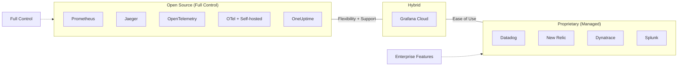
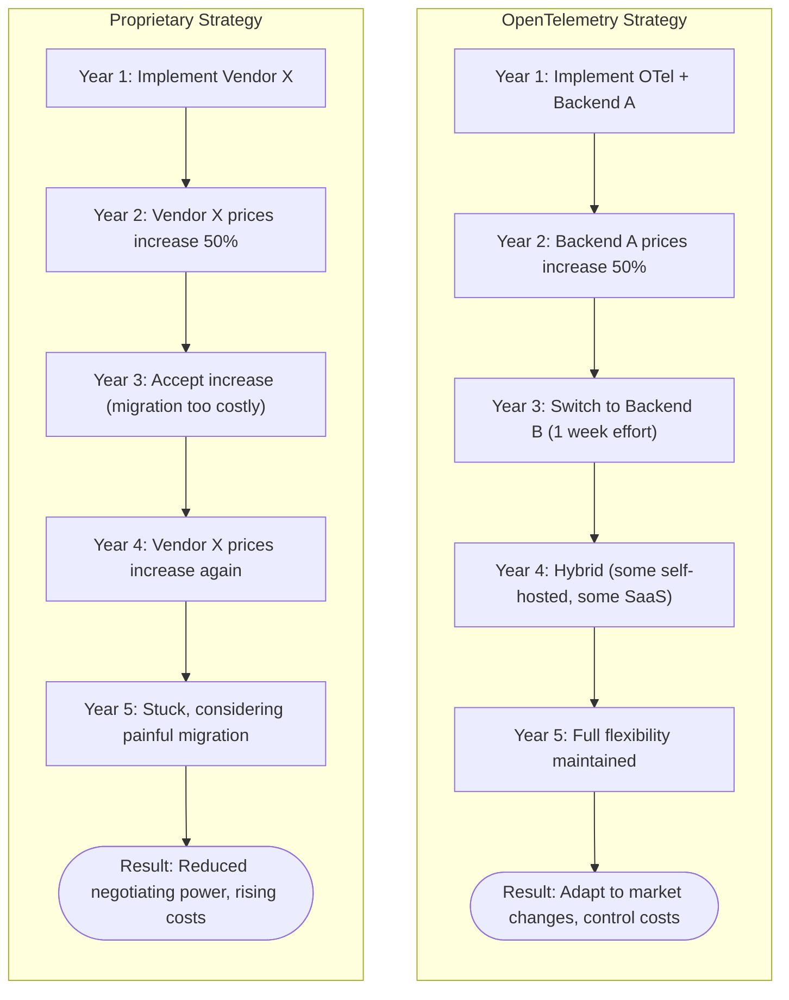

# OpenTelemetry vs Proprietary APM: A Comprehensive Comparison

[Nawaz Dhandala](https://github.com/nicksocial129) - December 17, 2025

**Tags:** OpenTelemetry, APM, Vendor Lock-in, Observability, Comparison, DataDog, New Relic

**Description:** Compare OpenTelemetry with proprietary APM solutions like Datadog, New Relic, and Dynatrace. Understand the trade-offs in cost, flexibility, features, and long-term strategy.

---

> The choice between OpenTelemetry and proprietary APM solutions isn't just technical—it's a strategic decision that affects your organization's flexibility, costs, and long-term observability strategy.

As observability becomes critical infrastructure, organizations must choose between vendor-specific APM solutions and the open standard of OpenTelemetry. This guide provides an objective comparison to help you make an informed decision.

## Table of Contents

1. [Understanding the Landscape](#1-understanding-the-landscape)
2. [Feature Comparison](#2-feature-comparison)
3. [Cost Analysis](#3-cost-analysis)
4. [Implementation Complexity](#4-implementation-complexity)
5. [Vendor Lock-in Considerations](#5-vendor-lock-in-considerations)
6. [Performance Comparison](#6-performance-comparison)
7. [Migration Scenarios](#7-migration-scenarios)
8. [Making the Decision](#8-making-the-decision)

## 1. Understanding the Landscape

### What is OpenTelemetry?

OpenTelemetry is an open-source observability framework providing:
- **Standardized APIs**: Consistent instrumentation across languages
- **Vendor-neutral SDKs**: Collect once, export anywhere
- **Open protocols**: OTLP for data transmission
- **Extensible architecture**: Custom processors and exporters

### What are Proprietary APM Solutions?

Vendor-specific solutions like Datadog, New Relic, Dynatrace provide:
- **Integrated platforms**: One vendor for all observability
- **Proprietary agents**: Vendor-specific instrumentation
- **Managed infrastructure**: SaaS-based backends
- **Advanced features**: AI/ML, custom UIs, integrations

### Market Positioning



## 2. Feature Comparison

### Instrumentation

| Feature | OpenTelemetry | Datadog | New Relic | Dynatrace |
|---------|---------------|---------|-----------|-----------|
| Auto-instrumentation | Yes | Yes | Yes | Yes (OneAgent) |
| Language support | 11+ | 10+ | 8+ | 10+ |
| Custom instrumentation | Full control | Limited | Limited | Limited |
| Code ownership | Your code | Agent code | Agent code | Agent code |
| Framework coverage | Growing | Excellent | Good | Excellent |

### Data Collection

| Capability | OpenTelemetry | Proprietary APM |
|------------|---------------|-----------------|
| Traces | Standard | Proprietary format |
| Metrics | Standard | Proprietary format |
| Logs | Standard | Proprietary format |
| Profiles | Emerging | Mature |
| RUM | Available | Built-in |
| Synthetics | Via backends | Built-in |

### Backend Features

| Aspect | OpenTelemetry + Backend | Proprietary APM |
|--------|------------------------|-----------------|
| Data format | Standard | Proprietary |
| Vendor choice | Full flexibility | Single vendor |
| Deployment options | Self-host or SaaS | SaaS only |
| Cost control | High | Limited |
| Dashboards | Configurable | Integrated |
| AI/ML features | Backend-dependent | Built-in |
| Alerting | Backend-dependent | Built-in |
| UX | Varies | Seamless |
| Vendor lock-in | None | High |
| Integration effort | Required | Minimal |

## 3. Cost Analysis

### Pricing Models

| Solution | Pricing Model | Typical Cost Range |
|----------|---------------|-------------------|
| OpenTelemetry | Free (collection) | $0 for SDK |
| OTel + Self-hosted | Infrastructure | $500-5000/mo |
| OTel + OneUptime | Usage-based | Predictable |
| Datadog | Per-host + ingestion | $15-50/host/mo + |
| New Relic | Per-user + data | $0.35-0.50/GB |
| Dynatrace | Per-host | $21-69/host/mo |

### Total Cost of Ownership (TCO)

**Example: 100 Microservices, 1TB telemetry/month**

#### OpenTelemetry + Self-hosted

| Component | Monthly Cost |
|-----------|-------------|
| OTel SDKs | $0 |
| Collector Infrastructure | $500 (Kubernetes) |
| Storage (Elasticsearch) | $2,000 |
| Visualization (Grafana) | $500 |
| Operations (0.5 FTE) | $5,000 |
| **Total** | **~$8,000/mo** |

#### OpenTelemetry + OneUptime

| Component | Monthly Cost |
|-----------|-------------|
| OTel SDKs | $0 |
| OneUptime SaaS | Usage-based pricing |
| Operations (0.1 FTE) | $1,000 |
| **Total** | **Predictable, scales with usage** |

#### Datadog (Infrastructure + APM + Logs)

| Component | Monthly Cost |
|-----------|-------------|
| Infrastructure | $1,800 (100 hosts × $18) |
| APM | $4,000 (100 hosts × $40) |
| Logs (1TB) | $2,700 ($2.70/GB retained) |
| Custom Metrics | $1,000 (variable) |
| **Total** | **~$9,500/mo (can increase rapidly)** |

### Cost Predictability

| Factor | OpenTelemetry | Proprietary |
|--------|---------------|-------------|
| Pricing model | Clear | Complex |
| Surprise bills | Unlikely | Common |
| Scale economics | Linear | Often exponential |
| Feature upsells | N/A | Constant |
| Contract lock-in | None | 1-3 years typical |

## 4. Implementation Complexity

### Initial Setup

```mermaid
gantt
    title OpenTelemetry Implementation (4-6 weeks)
    dateFormat  X
    axisFormat Week %s
    section SDK Integration
    Add OTel dependencies           :1, 2
    Configure auto-instrumentation  :1, 2
    Set up exporters               :1, 2
    section Collector Deployment
    Deploy OTel Collector          :3, 4
    Configure pipelines            :3, 4
    Set up sampling                :3, 4
    section Backend Integration
    Connect to backend             :5, 6
    Create dashboards              :5, 6
    Set up alerts                  :5, 6
```

```mermaid
gantt
    title Proprietary APM Implementation (1-2 weeks)
    dateFormat  X
    axisFormat Week %s
    section Agent Installation
    Install vendor agent           :1, 1
    Configure API keys             :1, 1
    Auto-discovery kicks in        :1, 1
    section Configuration
    Fine-tune collection           :2, 2
    Set up dashboards              :2, 2
    Configure alerts               :2, 2
```





| Approach | Duration | Trade-off |
|----------|----------|-----------|
| OpenTelemetry | 4-6 weeks | More control, more work |
| Proprietary APM | 1-2 weeks | Faster start, less control |

### Learning Curve

| Aspect | OpenTelemetry | Proprietary |
|--------|---------------|-------------|
| Documentation | Open, community | Vendor-controlled |
| Concepts | Universal (portable skills) | Vendor-specific |
| Troubleshooting | Community + docs | Support tickets |
| Customization | Unlimited | Within vendor limits |

## 5. Vendor Lock-in Considerations

### Data Portability

```typescript
// OpenTelemetry: Change backend with config change
const exporter = new OTLPTraceExporter({
  // Change this to switch vendors
  url: 'https://otlp.oneuptime.com/v1/traces',
  // url: 'https://other-vendor.com/v1/traces',
});

// Proprietary: Requires re-instrumentation
// Datadog → New Relic requires:
// 1. Remove Datadog agent
// 2. Install New Relic agent
// 3. Reconfigure all services
// 4. Rebuild dashboards
// 5. Recreate alerts
// 6. Retrain team
```

### Exit Costs

| Component | OpenTelemetry | Proprietary |
|-----------|---------------|-------------|
| Instrumentation change | None | Complete rewrite |
| Dashboard migration | Export possible | Manual recreation |
| Alert migration | Export possible | Manual recreation |
| Data migration | Standard format | Format conversion |
| Team retraining | Minimal | Significant |
| Estimated time | Days | Months |

### Strategic Implications

**5-Year Scenario Analysis**



## 6. Performance Comparison

### Agent Overhead

| Metric | OpenTelemetry | Datadog | New Relic | Dynatrace |
|--------|---------------|---------|-----------|-----------|
| CPU overhead | 1-3% | 2-5% | 2-4% | 3-5% |
| Memory overhead | 50-100MB | 100-200MB | 80-150MB | 150-300MB |
| Network (typical) | Low | Medium | Medium | Medium |
| Startup latency | Minimal | 1-3s | 1-2s | 2-5s |

### Collection Efficiency

```yaml
# OpenTelemetry: Fine-grained control over collection
processors:
  # Drop unwanted spans early
  filter:
    spans:
      exclude:
        match_type: regexp
        services: ["health-check"]

  # Sample intelligently
  tail_sampling:
    policies:
      - name: errors
        type: status_code
        status_code:
          status_codes: [ERROR]
      - name: slow
        type: latency
        latency:
          threshold_ms: 500
      - name: sample-rest
        type: probabilistic
        probabilistic:
          sampling_percentage: 10

# Result: Collect what matters, reduce costs
```

### Benchmarks (Typical Results)

**Throughput Test: 10,000 spans/second**

| Metric | OpenTelemetry Collector | Proprietary Agents (Averaged) |
|--------|------------------------|------------------------------|
| CPU Usage | 15-20% | 20-30% |
| Memory | 200-300MB | 300-500MB |
| Dropped Spans | 0% (with proper config) | Variable |
| P99 Latency | 5-10ms | 10-20ms |

## 7. Migration Scenarios

### From Proprietary to OpenTelemetry

```typescript
// Step 1: Run OTel alongside existing agent
// Dual-write for validation

// Step 2: Migrate instrumentation
// Before (Datadog)
const tracer = require('dd-trace').init();

// After (OpenTelemetry)
const { NodeTracerProvider } = require('@opentelemetry/sdk-trace-node');
const provider = new NodeTracerProvider();

// Step 3: Compare data
// Ensure parity before removing old agent

// Step 4: Remove old agent
// npm uninstall dd-trace
```

### Hybrid Approach

```yaml
# OpenTelemetry Collector with multiple exporters
exporters:
  # Primary: OpenTelemetry-native backend
  otlphttp:
    endpoint: https://otlp.oneuptime.com

  # Secondary: Keep existing vendor (temporary)
  datadog:
    api:
      key: ${DD_API_KEY}

service:
  pipelines:
    traces:
      receivers: [otlp]
      exporters: [otlphttp, datadog]  # Dual export
```

## 8. Making the Decision

### Decision Framework

| Factor | Choose OpenTelemetry If | Choose Proprietary If |
|--------|------------------------|----------------------|
| Budget | Cost-conscious | Money is no object |
| Team | Strong engineering team | Limited ops capacity |
| Scale | Large, growing scale | Small, stable scale |
| Strategy | Long-term flexibility | Quick time-to-value |
| Control | Data ownership matters | Convenience preferred |
| Compliance | Data residency required | No restrictions |

### Recommendation Matrix

| Team Size | Startup | Growth | Enterprise |
|-----------|---------|--------|------------|
| **Small Team** | OTel + Simple Backend | OTel + Managed Backend | Consider Proprietary |
| **Medium Team** | OTel + OneUptime | OTel + OneUptime or similar | OTel + Enterprise Backend |
| **Large Team** | OTel + Custom Backend | OTel + Hybrid Strategy | OTel + Multi-vendor Strategy |

### Summary Table

| Criteria | OpenTelemetry | Proprietary APM |
|----------|---------------|-----------------|
| Flexibility | Excellent | Limited |
| Initial effort | Higher | Lower |
| Long-term cost | Lower | Higher |
| Vendor lock-in | None | High |
| Feature richness | Backend-dependent | Generally excellent |
| Support | Community + vendor | Vendor |
| Data ownership | Full | Vendor-dependent |
| Future-proofing | Industry standard | Vendor roadmap |

## Summary

The choice between OpenTelemetry and proprietary APM depends on your organization's:

- **Technical capabilities**: Can you manage OTel infrastructure?
- **Cost sensitivity**: How important is long-term cost control?
- **Strategic priorities**: Flexibility vs. convenience?
- **Scale trajectory**: Will you outgrow current pricing?

OpenTelemetry provides long-term flexibility and cost control, while proprietary solutions offer faster initial deployment with vendor lock-in trade-offs.

## Try OpenTelemetry with OneUptime

OneUptime offers the best of both worlds: native OpenTelemetry support with a managed backend experience. No vendor lock-in, predictable costs, and full data ownership.

[Start Free Trial](https://oneuptime.com/signup) - OpenTelemetry-native observability.

## See Also

- [Avoiding Vendor Lock-in with OpenTelemetry](/blog/avoid-vendor-lock-in-opentelemetry)
- [OpenTelemetry Cost Optimization](/blog/opentelemetry-cost-optimization)
- [Migrating from Datadog to OpenTelemetry](/blog/migrating-datadog-opentelemetry)
