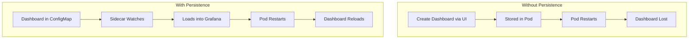

# How to Add Persistent Grafana Dashboards in Kubernetes

Author: [nawazdhandala](https://www.github.com/nawazdhandala)

Tags: Grafana, Kubernetes, Dashboards, ConfigMaps, Helm, GitOps, Monitoring, DevOps, Persistence

Description: Learn how to persist Grafana dashboards in Kubernetes using ConfigMaps, sidecar containers, and persistent volumes. This guide covers dashboard provisioning, GitOps workflows, and preventing dashboard loss during pod restarts.

---

Grafana dashboards created through the UI disappear when pods restart in Kubernetes. This guide shows you how to persist dashboards using ConfigMaps, provisioning, and GitOps patterns so your monitoring configurations survive deployments and restarts.

---

## TL;DR

- Use ConfigMaps with dashboard JSON for declarative management
- Enable the Grafana sidecar for automatic dashboard loading
- Configure dashboard provisioning in Grafana's config
- Store dashboards in Git for version control
- Use Persistent Volumes for UI-created dashboards

---

## The Dashboard Persistence Problem

By default, Grafana stores dashboards in SQLite or its configured database. In Kubernetes:

- Pod restarts lose ephemeral storage
- Dashboards created via UI disappear
- Manual recreation is error-prone
- No version control for changes



---

## Method 1: ConfigMaps with Sidecar Container

The most common approach uses Grafana's sidecar container to watch ConfigMaps.

### Step 1: Enable Sidecar in Helm Values

```yaml
# values.yaml for grafana helm chart
sidecar:
  dashboards:
    enabled: true
    label: grafana_dashboard
    labelValue: "1"
    folder: /tmp/dashboards
    searchNamespace: ALL  # or specific namespace

  datasources:
    enabled: true
    label: grafana_datasource
```

### Step 2: Create Dashboard ConfigMap

```yaml
apiVersion: v1
kind: ConfigMap
metadata:
  name: my-dashboard
  namespace: monitoring
  labels:
    grafana_dashboard: "1"  # Must match sidecar label
data:
  my-dashboard.json: |
    {
      "annotations": {
        "list": []
      },
      "editable": true,
      "fiscalYearStartMonth": 0,
      "graphTooltip": 0,
      "id": null,
      "links": [],
      "liveNow": false,
      "panels": [
        {
          "datasource": {
            "type": "prometheus",
            "uid": "prometheus"
          },
          "fieldConfig": {
            "defaults": {
              "color": {
                "mode": "palette-classic"
              },
              "custom": {
                "axisCenteredZero": false,
                "axisColorMode": "text",
                "axisLabel": "",
                "axisPlacement": "auto",
                "barAlignment": 0,
                "drawStyle": "line",
                "fillOpacity": 10,
                "gradientMode": "none",
                "lineWidth": 1
              },
              "unit": "reqps"
            }
          },
          "gridPos": {
            "h": 8,
            "w": 12,
            "x": 0,
            "y": 0
          },
          "id": 1,
          "targets": [
            {
              "expr": "sum(rate(http_requests_total[5m]))",
              "legendFormat": "Requests/s"
            }
          ],
          "title": "Request Rate",
          "type": "timeseries"
        }
      ],
      "schemaVersion": 38,
      "tags": ["kubernetes", "http"],
      "templating": {
        "list": []
      },
      "time": {
        "from": "now-1h",
        "to": "now"
      },
      "title": "My Application Dashboard",
      "uid": "my-app-dashboard",
      "version": 1
    }
```

### Step 3: Apply ConfigMap

```bash
kubectl apply -f my-dashboard-configmap.yaml
```

The sidecar automatically detects the ConfigMap and loads the dashboard.

---

## Method 2: Dashboard Provisioning

Configure Grafana to load dashboards from a directory at startup.

### Provisioning Configuration

Create a provisioning ConfigMap:

```yaml
apiVersion: v1
kind: ConfigMap
metadata:
  name: grafana-dashboard-provisioning
  namespace: monitoring
data:
  dashboards.yaml: |
    apiVersion: 1
    providers:
      - name: 'default'
        orgId: 1
        folder: ''
        folderUid: ''
        type: file
        disableDeletion: false
        updateIntervalSeconds: 30
        allowUiUpdates: true
        options:
          path: /var/lib/grafana/dashboards
          foldersFromFilesStructure: true
```

### Mount Configuration in Deployment

```yaml
apiVersion: apps/v1
kind: Deployment
metadata:
  name: grafana
  namespace: monitoring
spec:
  template:
    spec:
      containers:
        - name: grafana
          image: grafana/grafana:latest
          volumeMounts:
            - name: dashboard-provisioning
              mountPath: /etc/grafana/provisioning/dashboards
            - name: dashboards
              mountPath: /var/lib/grafana/dashboards
      volumes:
        - name: dashboard-provisioning
          configMap:
            name: grafana-dashboard-provisioning
        - name: dashboards
          configMap:
            name: grafana-dashboards
```

---

## Method 3: Persistent Volume for UI Dashboards

If you prefer creating dashboards through the UI:

### PersistentVolumeClaim

```yaml
apiVersion: v1
kind: PersistentVolumeClaim
metadata:
  name: grafana-storage
  namespace: monitoring
spec:
  accessModes:
    - ReadWriteOnce
  resources:
    requests:
      storage: 10Gi
  storageClassName: standard  # Adjust for your cluster
```

### Helm Values with PVC

```yaml
# values.yaml
persistence:
  enabled: true
  existingClaim: grafana-storage

# Or let Helm create the PVC
persistence:
  enabled: true
  type: pvc
  size: 10Gi
  storageClassName: standard
```

---

## Method 4: GitOps with ArgoCD or Flux

Store dashboards in Git and sync automatically.

### Repository Structure

```
monitoring/
  grafana/
    dashboards/
      application/
        api-dashboard.json
        web-dashboard.json
      infrastructure/
        kubernetes-dashboard.json
        node-dashboard.json
    kustomization.yaml
```

### Kustomization for Dashboard ConfigMaps

```yaml
# kustomization.yaml
apiVersion: kustomize.config.k8s.io/v1beta1
kind: Kustomization

namespace: monitoring

configMapGenerator:
  - name: grafana-dashboards-app
    files:
      - dashboards/application/api-dashboard.json
      - dashboards/application/web-dashboard.json
    options:
      labels:
        grafana_dashboard: "1"

  - name: grafana-dashboards-infra
    files:
      - dashboards/infrastructure/kubernetes-dashboard.json
      - dashboards/infrastructure/node-dashboard.json
    options:
      labels:
        grafana_dashboard: "1"
```

### ArgoCD Application

```yaml
apiVersion: argoproj.io/v1alpha1
kind: Application
metadata:
  name: grafana-dashboards
  namespace: argocd
spec:
  project: default
  source:
    repoURL: https://github.com/your-org/monitoring-config
    targetRevision: main
    path: monitoring/grafana
  destination:
    server: https://kubernetes.default.svc
    namespace: monitoring
  syncPolicy:
    automated:
      prune: true
      selfHeal: true
```

---

## Organizing Dashboards into Folders

### Folder Structure with Sidecar

```yaml
apiVersion: v1
kind: ConfigMap
metadata:
  name: app-dashboards
  namespace: monitoring
  labels:
    grafana_dashboard: "1"
  annotations:
    grafana_folder: "Application Dashboards"  # Creates folder
data:
  api-dashboard.json: |
    { ... }
  web-dashboard.json: |
    { ... }
```

### Multiple Folders

```yaml
# Infrastructure folder
apiVersion: v1
kind: ConfigMap
metadata:
  name: infra-dashboards
  labels:
    grafana_dashboard: "1"
  annotations:
    grafana_folder: "Infrastructure"
data:
  nodes.json: |
    { ... }

---
# Application folder
apiVersion: v1
kind: ConfigMap
metadata:
  name: app-dashboards
  labels:
    grafana_dashboard: "1"
  annotations:
    grafana_folder: "Applications"
data:
  api.json: |
    { ... }
```

---

## Complete Helm Values Example

```yaml
# Complete values.yaml for Grafana Helm chart
grafana:
  replicas: 1

  persistence:
    enabled: true
    size: 5Gi

  sidecar:
    dashboards:
      enabled: true
      label: grafana_dashboard
      labelValue: "1"
      searchNamespace: ALL
      folderAnnotation: grafana_folder
      provider:
        foldersFromFilesStructure: true

    datasources:
      enabled: true
      label: grafana_datasource

  dashboardProviders:
    dashboardproviders.yaml:
      apiVersion: 1
      providers:
        - name: 'sidecar'
          orgId: 1
          folder: ''
          type: file
          disableDeletion: false
          editable: true
          options:
            path: /tmp/dashboards

  datasources:
    datasources.yaml:
      apiVersion: 1
      datasources:
        - name: Prometheus
          type: prometheus
          url: http://prometheus-server.monitoring.svc.cluster.local
          access: proxy
          isDefault: true

  adminPassword: "your-secure-password"

  env:
    GF_DASHBOARDS_DEFAULT_HOME_DASHBOARD_PATH: /tmp/dashboards/home.json
```

---

## Exporting Existing Dashboards

Export dashboards from Grafana for GitOps:

### Via UI

1. Open dashboard
2. Click Dashboard Settings (gear icon)
3. Click "JSON Model"
4. Copy JSON content
5. Save to file

### Via API

```bash
# Get all dashboards
curl -s -H "Authorization: Bearer $GRAFANA_API_KEY" \
  "http://grafana.example.com/api/search?type=dash-db" | jq

# Export specific dashboard
curl -s -H "Authorization: Bearer $GRAFANA_API_KEY" \
  "http://grafana.example.com/api/dashboards/uid/MY_DASHBOARD_UID" | \
  jq '.dashboard' > my-dashboard.json
```

### Bulk Export Script

```bash
#!/bin/bash
GRAFANA_URL="http://grafana.example.com"
API_KEY="your-api-key"
OUTPUT_DIR="./dashboards"

mkdir -p "$OUTPUT_DIR"

# Get all dashboard UIDs
dashboards=$(curl -s -H "Authorization: Bearer $API_KEY" \
  "$GRAFANA_URL/api/search?type=dash-db" | jq -r '.[].uid')

for uid in $dashboards; do
  echo "Exporting dashboard: $uid"
  curl -s -H "Authorization: Bearer $API_KEY" \
    "$GRAFANA_URL/api/dashboards/uid/$uid" | \
    jq '.dashboard' > "$OUTPUT_DIR/$uid.json"
done

echo "Exported $(echo "$dashboards" | wc -w) dashboards"
```

---

## Troubleshooting

### Dashboard Not Loading

Check sidecar logs:

```bash
kubectl logs -n monitoring deployment/grafana -c grafana-sc-dashboard
```

Verify ConfigMap labels:

```bash
kubectl get configmap -n monitoring -l grafana_dashboard=1
```

### Dashboard Shows but Resets

Ensure `editable: true` in dashboard JSON and provisioning config allows UI updates:

```yaml
providers:
  - name: 'default'
    allowUiUpdates: true
```

### Duplicate Dashboard UID

Each dashboard needs a unique `uid`. Check for conflicts:

```bash
grep -r '"uid"' dashboards/ | sort
```

---

## Conclusion

Persistent Grafana dashboards in Kubernetes require intentional configuration:

- **ConfigMaps with Sidecar**: Best for GitOps and declarative management
- **Dashboard Provisioning**: Direct file-based loading
- **Persistent Volumes**: Supports UI-based dashboard creation
- **GitOps**: Version control and automated deployment

Choose the approach that matches your workflow - most teams benefit from the sidecar approach with dashboards stored in Git.

---

*For more Kubernetes monitoring patterns, see our guides on Prometheus histogram visualization and service latency measurement.*
