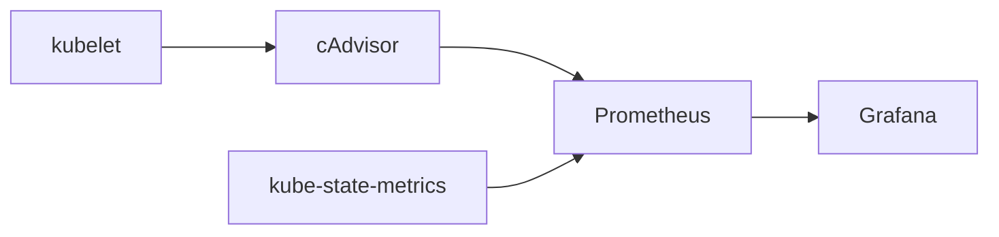

# How to Get CPU and Memory Usage in Kubernetes Pods with Prometheus

Author: [nawazdhandala](https://www.github.com/nawazdhandala)

Tags: Prometheus, Kubernetes, Monitoring, CPU, Memory, Metrics, PromQL

Description: Learn how to query CPU and memory usage for Kubernetes pods using Prometheus. This guide covers essential PromQL queries, understanding container metrics, and building effective resource monitoring dashboards.

Monitoring resource usage in Kubernetes is essential for capacity planning, cost optimization, and ensuring application health. Prometheus, combined with metrics from the kubelet and cAdvisor, provides detailed insights into CPU and memory consumption at the pod and container level. This guide walks you through the essential queries and patterns for effective resource monitoring.

## Understanding Kubernetes Resource Metrics

Kubernetes exposes resource metrics through several components. The kubelet exposes container metrics via its built-in cAdvisor, which Prometheus scrapes to collect CPU, memory, network, and filesystem statistics.



The two primary metric sources are:

1. **cAdvisor metrics** - Real-time resource usage (CPU, memory, network)
2. **kube-state-metrics** - Kubernetes object state (requested resources, limits)

## Essential CPU Metrics

### Current CPU Usage Rate

The `container_cpu_usage_seconds_total` metric tracks cumulative CPU time consumed. To get the current usage rate, use the `rate()` function:

```promql
# CPU usage rate in cores for all containers
rate(container_cpu_usage_seconds_total{
  container!="",
  container!="POD"
}[5m])

# Filter by namespace
rate(container_cpu_usage_seconds_total{
  namespace="production",
  container!="",
  container!="POD"
}[5m])

# Filter by specific pod
rate(container_cpu_usage_seconds_total{
  pod="api-server-7d8f9c6b5d-x2k4m",
  container!=""
}[5m])
```

The `container!=""` filter excludes the pause container, and `container!="POD"` excludes the pod-level cgroup that aggregates all containers.

### CPU Usage as Percentage of Requests

To see how much of the requested CPU a pod is using:

```promql
# CPU usage as percentage of requests
sum(rate(container_cpu_usage_seconds_total{
  namespace="production",
  container!="",
  container!="POD"
}[5m])) by (pod, container)
/
sum(kube_pod_container_resource_requests{
  namespace="production",
  resource="cpu"
}) by (pod, container)
* 100
```

### CPU Usage as Percentage of Limits

```promql
# CPU usage as percentage of limits
sum(rate(container_cpu_usage_seconds_total{
  namespace="production",
  container!="",
  container!="POD"
}[5m])) by (pod, container)
/
sum(kube_pod_container_resource_limits{
  namespace="production",
  resource="cpu"
}) by (pod, container)
* 100
```

### CPU Throttling Detection

When containers hit their CPU limits, they get throttled. Monitor throttling with:

```promql
# CPU throttling percentage
sum(rate(container_cpu_cfs_throttled_seconds_total{
  container!=""
}[5m])) by (pod, container)
/
sum(rate(container_cpu_cfs_periods_total{
  container!=""
}[5m])) by (pod, container)
* 100
```

High throttling rates indicate the container needs higher CPU limits or optimization.

## Essential Memory Metrics

### Current Memory Usage

The `container_memory_working_set_bytes` metric shows the actual memory in use that cannot be evicted:

```promql
# Memory usage for all containers
container_memory_working_set_bytes{
  container!="",
  container!="POD"
}

# Memory usage in MB
container_memory_working_set_bytes{
  namespace="production",
  container!=""
} / 1024 / 1024

# Memory usage by pod
sum(container_memory_working_set_bytes{
  namespace="production",
  container!=""
}) by (pod)
```

### Memory Usage vs. Requests

```promql
# Memory usage as percentage of requests
sum(container_memory_working_set_bytes{
  namespace="production",
  container!=""
}) by (pod, container)
/
sum(kube_pod_container_resource_requests{
  namespace="production",
  resource="memory"
}) by (pod, container)
* 100
```

### Memory Usage vs. Limits

```promql
# Memory usage as percentage of limits
sum(container_memory_working_set_bytes{
  namespace="production",
  container!=""
}) by (pod, container)
/
sum(kube_pod_container_resource_limits{
  namespace="production",
  resource="memory"
}) by (pod, container)
* 100
```

### Detecting Memory Pressure

Pods approaching their memory limits risk OOM kills. Alert on high memory usage:

```promql
# Containers using more than 90% of memory limit
(
  sum(container_memory_working_set_bytes{container!=""}) by (pod, container, namespace)
  /
  sum(kube_pod_container_resource_limits{resource="memory"}) by (pod, container, namespace)
) > 0.9
```

## Aggregated Views

### Namespace-Level Resource Usage

```promql
# Total CPU usage per namespace (in cores)
sum(rate(container_cpu_usage_seconds_total{
  container!="",
  container!="POD"
}[5m])) by (namespace)

# Total memory usage per namespace (in GB)
sum(container_memory_working_set_bytes{
  container!=""
}) by (namespace) / 1024 / 1024 / 1024
```

### Node-Level Pod Resources

```promql
# CPU usage per node
sum(rate(container_cpu_usage_seconds_total{
  container!="",
  container!="POD"
}[5m])) by (node)

# Memory usage per node
sum(container_memory_working_set_bytes{
  container!=""
}) by (node)
```

### Deployment-Level Aggregation

Using kube-state-metrics labels to aggregate by deployment:

```promql
# CPU usage by deployment
sum(
  rate(container_cpu_usage_seconds_total{container!=""}[5m])
  * on(namespace, pod) group_left(owner_name)
  kube_pod_owner{owner_kind="ReplicaSet"}
) by (owner_name)
```

## Practical Recording Rules

For frequently used queries, create recording rules to improve performance:

```yaml
groups:
  - name: kubernetes_resource_usage
    interval: 30s
    rules:
      # CPU usage rate per container
      - record: container:cpu_usage_rate:sum
        expr: |
          sum(rate(container_cpu_usage_seconds_total{
            container!="",
            container!="POD"
          }[5m])) by (namespace, pod, container)

      # Memory usage per container
      - record: container:memory_working_set:sum
        expr: |
          sum(container_memory_working_set_bytes{
            container!=""
          }) by (namespace, pod, container)

      # CPU usage percentage of limit
      - record: container:cpu_usage_limit_percent:ratio
        expr: |
          container:cpu_usage_rate:sum
          / on(namespace, pod, container)
          sum(kube_pod_container_resource_limits{resource="cpu"}) by (namespace, pod, container)
          * 100

      # Memory usage percentage of limit
      - record: container:memory_usage_limit_percent:ratio
        expr: |
          container:memory_working_set:sum
          / on(namespace, pod, container)
          sum(kube_pod_container_resource_limits{resource="memory"}) by (namespace, pod, container)
          * 100
```

## Alerting Rules

Set up alerts for resource issues:

```yaml
groups:
  - name: kubernetes_resource_alerts
    rules:
      # High CPU usage alert
      - alert: ContainerHighCPUUsage
        expr: |
          container:cpu_usage_limit_percent:ratio > 90
        for: 15m
        labels:
          severity: warning
        annotations:
          summary: "Container {{ $labels.container }} high CPU usage"
          description: "Container {{ $labels.container }} in pod {{ $labels.pod }} is using {{ $value | humanize }}% of CPU limit"

      # High memory usage alert
      - alert: ContainerHighMemoryUsage
        expr: |
          container:memory_usage_limit_percent:ratio > 85
        for: 10m
        labels:
          severity: warning
        annotations:
          summary: "Container {{ $labels.container }} high memory usage"
          description: "Container {{ $labels.container }} in pod {{ $labels.pod }} is using {{ $value | humanize }}% of memory limit"

      # CPU throttling alert
      - alert: ContainerCPUThrottling
        expr: |
          sum(rate(container_cpu_cfs_throttled_seconds_total[5m])) by (namespace, pod, container)
          /
          sum(rate(container_cpu_cfs_periods_total[5m])) by (namespace, pod, container)
          > 0.25
        for: 15m
        labels:
          severity: warning
        annotations:
          summary: "Container {{ $labels.container }} CPU throttling"
          description: "Container {{ $labels.container }} is being throttled {{ $value | humanizePercentage }}"
```

## Building a Grafana Dashboard

Create a comprehensive resource monitoring dashboard with these panel queries:

```promql
# Panel 1: Top pods by CPU usage
topk(10, sum(rate(container_cpu_usage_seconds_total{
  container!=""
}[5m])) by (namespace, pod))

# Panel 2: Top pods by memory usage
topk(10, sum(container_memory_working_set_bytes{
  container!=""
}) by (namespace, pod))

# Panel 3: Pods with highest CPU throttling
topk(10,
  sum(rate(container_cpu_cfs_throttled_periods_total[5m])) by (namespace, pod)
  /
  sum(rate(container_cpu_cfs_periods_total[5m])) by (namespace, pod)
)

# Panel 4: Pods closest to memory limit
topk(10,
  sum(container_memory_working_set_bytes{container!=""}) by (namespace, pod)
  /
  sum(kube_pod_container_resource_limits{resource="memory"}) by (namespace, pod)
)
```

## Common Pitfalls and Solutions

### Missing Metrics

If you see missing data, check that:

1. The kubelet metrics endpoint is being scraped
2. kube-state-metrics is deployed and scraped
3. Resource requests and limits are defined on pods

### Label Mismatches

When joining metrics from different sources, ensure label consistency:

```promql
# Use label_replace to fix mismatched labels
label_replace(
  container_memory_working_set_bytes,
  "pod_name", "$1", "pod", "(.*)"
)
```

### High Cardinality

For large clusters, use aggregations to reduce cardinality:

```promql
# Aggregate by namespace instead of individual pods
sum(rate(container_cpu_usage_seconds_total{container!=""}[5m])) by (namespace)
```

## Conclusion

Effective CPU and memory monitoring in Kubernetes requires understanding both the metrics available and how to query them efficiently. Key takeaways:

- Use `rate()` for CPU metrics and direct values for memory
- Filter out pause containers with `container!="POD"`
- Compare usage against both requests and limits
- Monitor throttling to detect CPU constraints
- Create recording rules for frequently used queries
- Set up alerts for proactive issue detection

With these queries and patterns, you can build comprehensive observability into your Kubernetes resource usage and make data-driven decisions about capacity and optimization.
