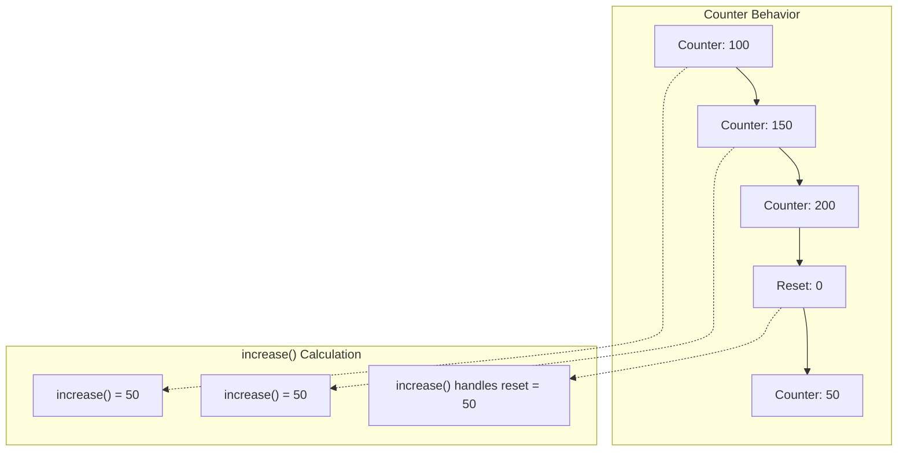
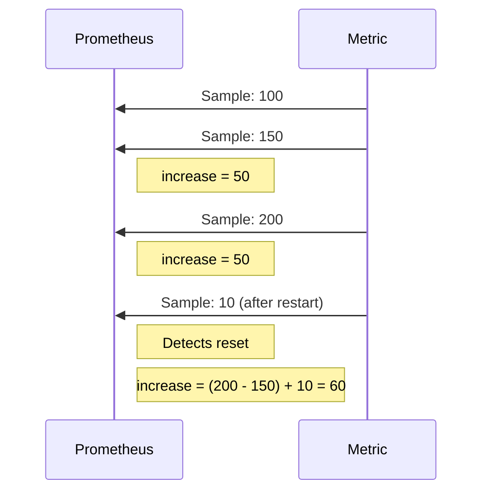

# How to Calculate Cumulative Increase in Prometheus

Author: [nawazdhandala](https://www.github.com/nawazdhandala)

Tags: Prometheus, PromQL, Counters, increase(), Metrics, Time Series, Monitoring, Observability

Description: Learn how to calculate cumulative increase over time in Prometheus using the increase() function, subqueries, and recording rules. This guide covers counter resets, time windows, and practical aggregation patterns.

---

Prometheus counters track cumulative totals that only increase. Calculating the actual increase over a time period requires understanding how `increase()` works and handling edge cases like counter resets. This guide shows you how to calculate cumulative increases accurately.

## Understanding Counters and Increases

Counters in Prometheus start at zero and only go up (or reset to zero on restart). The raw counter value isn't useful for measuring "how much happened" - you need to calculate the difference.



## The increase() Function

`increase()` calculates the increase in a counter over a time range, handling counter resets automatically.

### Basic Syntax

```promql
increase(counter_metric[time_range])
```

### Examples

```promql
# Requests in the last hour
increase(http_requests_total[1h])

# Errors in the last 24 hours
increase(http_errors_total[24h])

# Bytes transferred in the last day
increase(network_bytes_total[1d])
```

## Cumulative Increase Over Custom Time Windows

### Fixed Time Windows

```promql
# Increase over the last 5 minutes
increase(http_requests_total[5m])

# Increase over the last hour
increase(http_requests_total[1h])

# Increase over the last day
increase(http_requests_total[1d])

# Increase over the last week
increase(http_requests_total[7d])
```

### Since a Specific Time

To calculate increase since a specific time, you need a different approach:

```promql
# Current value
http_requests_total

# Value at a point in the past
http_requests_total offset 1h

# Increase since 1 hour ago (doesn't handle resets)
http_requests_total - http_requests_total offset 1h
```

Note: Simple subtraction doesn't handle counter resets. For accurate results, use `increase()` or calculate carefully.

## Aggregating Increases

### Sum Across Labels

```promql
# Total requests across all instances
sum(increase(http_requests_total[1h]))

# Total requests per service
sum by (service) (increase(http_requests_total[1h]))

# Total requests per status code
sum by (status) (increase(http_requests_total[1h]))
```

### Group By Multiple Labels

```promql
# Increase per service and method
sum by (service, method) (increase(http_requests_total[1h]))

# Increase per instance and endpoint
sum by (instance, endpoint) (increase(http_requests_total[1h]))
```

## Running Totals with Subqueries

For a cumulative running total over time (not a single point), use subqueries:

```promql
# Running total over the last 24 hours, calculated every 5 minutes
sum_over_time(
  increase(http_requests_total[5m])[24h:5m]
)
```

This calculates:
1. `increase()` for each 5-minute window
2. Sums all those increases over 24 hours

### Visualization of Cumulative Growth

```promql
# Shows cumulative increase growing over time in a graph
sum_over_time(
  sum(increase(http_requests_total[1m]))[1h:1m]
)
```

## Handling Counter Resets

`increase()` automatically handles counter resets by detecting when a value drops and assuming it reset from zero.

### How Reset Handling Works



### Verifying Reset Handling

```promql
# Check for resets in the last hour
resets(http_requests_total[1h])

# Show instances with resets
resets(http_requests_total[1h]) > 0
```

## Practical Examples

### Daily Request Count

```promql
# Total requests today (assuming 24h range)
sum(increase(http_requests_total[24h]))

# Requests per day for each service
sum by (service) (increase(http_requests_total[24h]))
```

### Error Budget Calculation

```promql
# Total errors this month (30 days)
sum(increase(http_errors_total[30d]))

# Error percentage this month
sum(increase(http_errors_total[30d]))
/
sum(increase(http_requests_total[30d]))
* 100
```

### Data Transfer Calculation

```promql
# Total bytes transferred today
sum(increase(network_transmit_bytes_total[24h]))

# GB transferred per interface
sum by (device) (increase(network_transmit_bytes_total[24h])) / 1024 / 1024 / 1024
```

### Billable Events

```promql
# API calls per customer for billing
sum by (customer_id) (increase(api_calls_total[30d]))

# Storage operations per account
sum by (account) (increase(storage_operations_total[1d]))
```

## Recording Rules for Cumulative Metrics

Pre-compute cumulative values for faster queries:

```yaml
groups:
  - name: cumulative-metrics
    interval: 5m
    rules:
      # Hourly request count
      - record: job:http_requests:increase1h
        expr: sum by (job) (increase(http_requests_total[1h]))

      # Daily request count
      - record: job:http_requests:increase24h
        expr: sum by (job) (increase(http_requests_total[24h]))

      # Hourly error count
      - record: job:http_errors:increase1h
        expr: sum by (job) (increase(http_errors_total[1h]))

      # Rolling 7-day total
      - record: job:http_requests:increase7d
        expr: sum by (job) (increase(http_requests_total[7d]))
```

## increase() vs rate()

Understanding when to use each:

| Function | Returns | Use Case |
|----------|---------|----------|
| `increase()` | Total count over period | Absolute numbers, billing |
| `rate()` | Per-second average | Rate of change, alerting |

### Relationship

```promql
# These are approximately equivalent
increase(metric[5m])
rate(metric[5m]) * 300  # 300 seconds = 5 minutes
```

### Example Comparison

```promql
# Number of requests in the last hour
increase(http_requests_total[1h])
# Result: 3600 (total requests)

# Requests per second averaged over the last hour
rate(http_requests_total[1h])
# Result: 1 (1 request per second on average)

# Verify: 1 req/s * 3600 seconds = 3600 requests
```

## Cumulative Sum Across Time Ranges

### Day-by-Day Breakdown

```promql
# Yesterday's total
sum(increase(http_requests_total[24h] offset 24h))

# Two days ago
sum(increase(http_requests_total[24h] offset 48h))

# This week vs last week
sum(increase(http_requests_total[7d]))
/
sum(increase(http_requests_total[7d] offset 7d))
```

### Hour-by-Hour Breakdown

To get hour-by-hour values, use subqueries:

```promql
# Requests per hour over the last 24 hours
increase(http_requests_total[1h])[24h:1h]
```

## Alerts Based on Cumulative Increase

### Alert on High Daily Errors

```yaml
groups:
  - name: cumulative-alerts
    rules:
      - alert: HighDailyErrors
        expr: sum(increase(http_errors_total[24h])) > 10000
        for: 5m
        labels:
          severity: warning
        annotations:
          summary: "High error count in last 24 hours"
          description: "Total errors: {{ $value }}"

      - alert: ErrorBudgetExhausted
        expr: |
          sum(increase(http_errors_total[30d]))
          /
          sum(increase(http_requests_total[30d]))
          > 0.01
        for: 5m
        labels:
          severity: critical
        annotations:
          summary: "Error budget exceeded 1%"
```

### Alert on Unusual Volume

```yaml
      - alert: UnusuallyHighVolume
        expr: |
          sum(increase(http_requests_total[1h]))
          >
          2 * avg_over_time(sum(increase(http_requests_total[1h]))[7d:1h])
        for: 15m
        labels:
          severity: warning
        annotations:
          summary: "Request volume is 2x normal"
```

## Common Pitfalls

### Pitfall 1: Time Range vs Retention

```promql
# This fails if you only retain 15 days of data
increase(metric[30d])
```

Solution: Use recording rules to store aggregated values.

### Pitfall 2: Sparse Metrics

```promql
# If metric is only updated hourly, 5m window might miss data
increase(sparse_metric[5m])
```

Solution: Use a time range larger than your metric's update interval.

### Pitfall 3: Extrapolation

`increase()` extrapolates based on the samples in the range, which can produce fractional results:

```promql
increase(http_requests_total[5m])
# Might return 99.5 even though requests are integers
```

Solution: Use `ceil()` or `floor()` if you need integers:

```promql
ceil(increase(http_requests_total[5m]))
```

## Summary

| Goal | Query |
|------|-------|
| Simple increase | `increase(metric[1h])` |
| Total across labels | `sum(increase(metric[1h]))` |
| Grouped increase | `sum by (label) (increase(metric[1h]))` |
| Running total | `sum_over_time(increase(metric[5m])[1h:5m])` |
| Daily comparison | `increase(metric[24h]) / increase(metric[24h] offset 24h)` |

---

Calculating cumulative increase in Prometheus requires understanding how counters work and using `increase()` appropriately. For dashboards showing totals, use `increase()` with suitable time ranges. For historical analysis, combine with recording rules to maintain long-term aggregates. Remember that `increase()` handles counter resets automatically, making it reliable for tracking cumulative metrics across service restarts.
