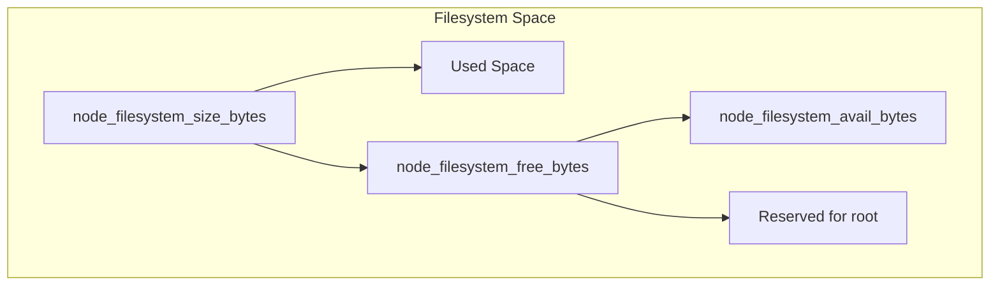

# How to Get Total and Free Disk Space with Prometheus

Author: [nawazdhandala](https://www.github.com/nawazdhandala)

Tags: Prometheus, Node Exporter, Disk Space, Monitoring, PromQL, Storage, Infrastructure, Observability

Description: Learn how to query total and free disk space in Prometheus using Node Exporter metrics. This guide covers filesystem queries, usage calculations, and alerting for disk capacity management.

---

Monitoring disk space is critical for preventing outages. Prometheus with Node Exporter provides comprehensive filesystem metrics. This guide shows you how to query disk space effectively and set up meaningful alerts.

## Understanding Disk Metrics

Node Exporter exposes several filesystem metrics:

| Metric | Description |
|--------|-------------|
| `node_filesystem_size_bytes` | Total size of the filesystem |
| `node_filesystem_free_bytes` | Free space available to non-root users |
| `node_filesystem_avail_bytes` | Free space available (considering reserved blocks) |
| `node_filesystem_files` | Total number of inodes |
| `node_filesystem_files_free` | Free inodes |



## Basic Queries

### Get Total Disk Space

```promql
# Total size per filesystem
node_filesystem_size_bytes

# Total size in GB
node_filesystem_size_bytes / 1024 / 1024 / 1024

# Total size with human-readable labels
node_filesystem_size_bytes{mountpoint="/", fstype!="tmpfs"}
```

### Get Free Disk Space

```promql
# Free space per filesystem
node_filesystem_avail_bytes

# Free space in GB
node_filesystem_avail_bytes / 1024 / 1024 / 1024

# Free space on root filesystem
node_filesystem_avail_bytes{mountpoint="/"}
```

### Get Used Disk Space

```promql
# Used space = Total - Available
node_filesystem_size_bytes - node_filesystem_avail_bytes

# Used space in GB
(node_filesystem_size_bytes - node_filesystem_avail_bytes) / 1024 / 1024 / 1024
```

## Filtering Filesystems

Not all filesystems are relevant for monitoring. Filter out pseudo filesystems:

```promql
# Exclude tmpfs, squashfs, and other pseudo filesystems
node_filesystem_avail_bytes{
  fstype!~"tmpfs|squashfs|overlay|devtmpfs|rootfs",
  mountpoint!~"/run.*|/sys.*|/proc.*|/dev.*"
}

# Only monitor specific mount points
node_filesystem_avail_bytes{mountpoint=~"/|/data|/var|/home"}

# Monitor by filesystem type
node_filesystem_avail_bytes{fstype=~"ext4|xfs|btrfs"}
```

## Calculating Disk Usage Percentage

### Basic Usage Percentage

```promql
# Percentage of disk used
(
  (node_filesystem_size_bytes - node_filesystem_avail_bytes)
  / node_filesystem_size_bytes
) * 100

# As a ratio (0-1)
(node_filesystem_size_bytes - node_filesystem_avail_bytes)
/ node_filesystem_size_bytes
```

### Usage with Filtering

```promql
# Usage percentage for real filesystems only
(
  (node_filesystem_size_bytes{fstype!~"tmpfs|squashfs"}
   - node_filesystem_avail_bytes{fstype!~"tmpfs|squashfs"})
  / node_filesystem_size_bytes{fstype!~"tmpfs|squashfs"}
) * 100
```

### Free Space Percentage

```promql
# Percentage of disk free
(node_filesystem_avail_bytes / node_filesystem_size_bytes) * 100
```

## Aggregating Across Instances

### Total Disk Space per Instance

```promql
# Sum of all filesystem sizes per instance
sum by (instance) (
  node_filesystem_size_bytes{fstype!~"tmpfs|squashfs"}
)

# In TB
sum by (instance) (
  node_filesystem_size_bytes{fstype!~"tmpfs|squashfs"}
) / 1024 / 1024 / 1024 / 1024
```

### Total Free Space per Instance

```promql
sum by (instance) (
  node_filesystem_avail_bytes{fstype!~"tmpfs|squashfs"}
)
```

### Cluster-Wide Totals

```promql
# Total storage across all nodes
sum(node_filesystem_size_bytes{fstype=~"ext4|xfs"})

# Total free storage across all nodes
sum(node_filesystem_avail_bytes{fstype=~"ext4|xfs"})

# Cluster-wide usage percentage
(
  sum(node_filesystem_size_bytes{fstype=~"ext4|xfs"} - node_filesystem_avail_bytes{fstype=~"ext4|xfs"})
  /
  sum(node_filesystem_size_bytes{fstype=~"ext4|xfs"})
) * 100
```

## Monitoring Inodes

Running out of inodes can be as problematic as running out of space:

```promql
# Inode usage percentage
(
  (node_filesystem_files - node_filesystem_files_free)
  / node_filesystem_files
) * 100

# Filesystems with low inode availability
(
  node_filesystem_files_free / node_filesystem_files
) * 100 < 20
```

## Predicting Disk Full

Use linear prediction to estimate when disk will be full:

```promql
# Predict when disk will be full (in seconds)
# Based on last 4 hours of data
predict_linear(
  node_filesystem_avail_bytes{mountpoint="/"}[4h],
  24 * 60 * 60  # Predict 24 hours ahead
)

# Filesystems predicted to fill within 24 hours
predict_linear(
  node_filesystem_avail_bytes{fstype!~"tmpfs|squashfs"}[4h],
  24 * 60 * 60
) < 0

# Days until disk full
node_filesystem_avail_bytes{mountpoint="/"}
/
(
  (
    node_filesystem_avail_bytes{mountpoint="/"} offset 1d
    - node_filesystem_avail_bytes{mountpoint="/"}
  ) / 86400  # bytes consumed per second
)
/ 86400  # convert seconds to days
```

## Alert Rules

### Basic Disk Space Alert

```yaml
groups:
  - name: disk-alerts
    rules:
      # Alert when disk usage exceeds 80%
      - alert: DiskSpaceWarning
        expr: |
          (
            (node_filesystem_size_bytes - node_filesystem_avail_bytes)
            / node_filesystem_size_bytes
          ) * 100 > 80
        for: 5m
        labels:
          severity: warning
        annotations:
          summary: "Disk space warning on {{ $labels.instance }}"
          description: "{{ $labels.mountpoint }} is {{ printf \"%.1f\" $value }}% full"

      # Alert when disk usage exceeds 90%
      - alert: DiskSpaceCritical
        expr: |
          (
            (node_filesystem_size_bytes - node_filesystem_avail_bytes)
            / node_filesystem_size_bytes
          ) * 100 > 90
        for: 5m
        labels:
          severity: critical
        annotations:
          summary: "Critical disk space on {{ $labels.instance }}"
          description: "{{ $labels.mountpoint }} is {{ printf \"%.1f\" $value }}% full"
```

### Predictive Alert

```yaml
      # Alert when disk predicted to fill within 24 hours
      - alert: DiskWillFillIn24Hours
        expr: |
          (
            predict_linear(
              node_filesystem_avail_bytes{fstype!~"tmpfs|squashfs"}[6h],
              24 * 3600
            ) < 0
          )
          and
          (
            (node_filesystem_avail_bytes / node_filesystem_size_bytes) < 0.3
          )
        for: 30m
        labels:
          severity: warning
        annotations:
          summary: "Disk predicted to fill on {{ $labels.instance }}"
          description: "{{ $labels.mountpoint }} will be full within 24 hours"
```

### Inode Alert

```yaml
      # Alert on low inode availability
      - alert: LowInodeAvailability
        expr: |
          (node_filesystem_files_free / node_filesystem_files) * 100 < 10
        for: 5m
        labels:
          severity: warning
        annotations:
          summary: "Low inode availability on {{ $labels.instance }}"
          description: "{{ $labels.mountpoint }} has only {{ printf \"%.1f\" $value }}% inodes free"
```

## Recording Rules for Performance

Pre-compute disk metrics for faster dashboards:

```yaml
groups:
  - name: disk-recording-rules
    interval: 60s
    rules:
      # Disk usage ratio per mountpoint
      - record: instance_mountpoint:node_filesystem_usage:ratio
        expr: |
          (node_filesystem_size_bytes{fstype!~"tmpfs|squashfs"}
           - node_filesystem_avail_bytes{fstype!~"tmpfs|squashfs"})
          / node_filesystem_size_bytes{fstype!~"tmpfs|squashfs"}

      # Total disk per instance
      - record: instance:node_filesystem_size_bytes:sum
        expr: |
          sum by (instance) (
            node_filesystem_size_bytes{fstype!~"tmpfs|squashfs"}
          )

      # Total free per instance
      - record: instance:node_filesystem_avail_bytes:sum
        expr: |
          sum by (instance) (
            node_filesystem_avail_bytes{fstype!~"tmpfs|squashfs"}
          )

      # Instance-level usage ratio
      - record: instance:node_filesystem_usage:ratio
        expr: |
          1 - (
            instance:node_filesystem_avail_bytes:sum
            / instance:node_filesystem_size_bytes:sum
          )
```

## Grafana Dashboard Queries

### Panel: Disk Usage by Mount Point

```promql
# Table showing all filesystems
(node_filesystem_size_bytes{fstype!~"tmpfs|squashfs"} - node_filesystem_avail_bytes{fstype!~"tmpfs|squashfs"})
/ node_filesystem_size_bytes{fstype!~"tmpfs|squashfs"}
* 100
```

### Panel: Disk Space Trend

```promql
# Graph showing available space over time
node_filesystem_avail_bytes{mountpoint="/", instance="$instance"}
```

### Panel: Top 5 Fullest Disks

```promql
topk(5,
  (node_filesystem_size_bytes{fstype!~"tmpfs|squashfs"}
   - node_filesystem_avail_bytes{fstype!~"tmpfs|squashfs"})
  / node_filesystem_size_bytes{fstype!~"tmpfs|squashfs"}
  * 100
)
```

### Panel: Disk Usage Gauge

```promql
# Single stat for specific mount
(
  (node_filesystem_size_bytes{mountpoint="/", instance="$instance"}
   - node_filesystem_avail_bytes{mountpoint="/", instance="$instance"})
  / node_filesystem_size_bytes{mountpoint="/", instance="$instance"}
) * 100
```

## Handling Specific Scenarios

### NFS and Network Filesystems

```promql
# Monitor NFS mounts
node_filesystem_avail_bytes{fstype="nfs4"}

# Exclude network filesystems from local monitoring
node_filesystem_avail_bytes{fstype!~"nfs.*|cifs|smb.*"}
```

### Docker and Container Storage

```promql
# Monitor Docker overlay filesystem
node_filesystem_avail_bytes{mountpoint=~"/var/lib/docker.*"}

# Container storage driver space
node_filesystem_avail_bytes{device=~"/dev/mapper/docker.*"}
```

### Kubernetes Persistent Volumes

```promql
# This requires kubelet metrics, covered in dedicated guide
kubelet_volume_stats_available_bytes
```

## Common Issues and Solutions

### Issue: Missing Filesystems

Some filesystems might not appear in metrics:

```promql
# Check what filesystems are being reported
count by (fstype, mountpoint) (node_filesystem_size_bytes)
```

### Issue: Stale Metrics

Filesystems might unmount but metrics persist:

```promql
# Only show filesystems that had recent reads
node_filesystem_avail_bytes
and on (device, instance)
(rate(node_disk_reads_completed_total[5m]) > 0)
```

### Issue: Wrong Units in Dashboards

Always verify your calculations:

```promql
# Verify with explicit unit conversion
node_filesystem_size_bytes / (1024^3)  # GB
node_filesystem_size_bytes / (1024^4)  # TB
```

## Summary

| Metric | Query |
|--------|-------|
| Total space | `node_filesystem_size_bytes` |
| Free space | `node_filesystem_avail_bytes` |
| Used space | `size - avail` |
| Usage % | `(size - avail) / size * 100` |
| Prediction | `predict_linear(avail[4h], 86400)` |
| Inodes | `node_filesystem_files_free` |

---

Effective disk monitoring requires filtering out pseudo filesystems, setting appropriate thresholds, and using predictive alerts. Node Exporter provides all the metrics you need - the key is writing queries that filter noise and highlight actionable issues. Combine these queries with recording rules for efficient dashboards and alerts.
