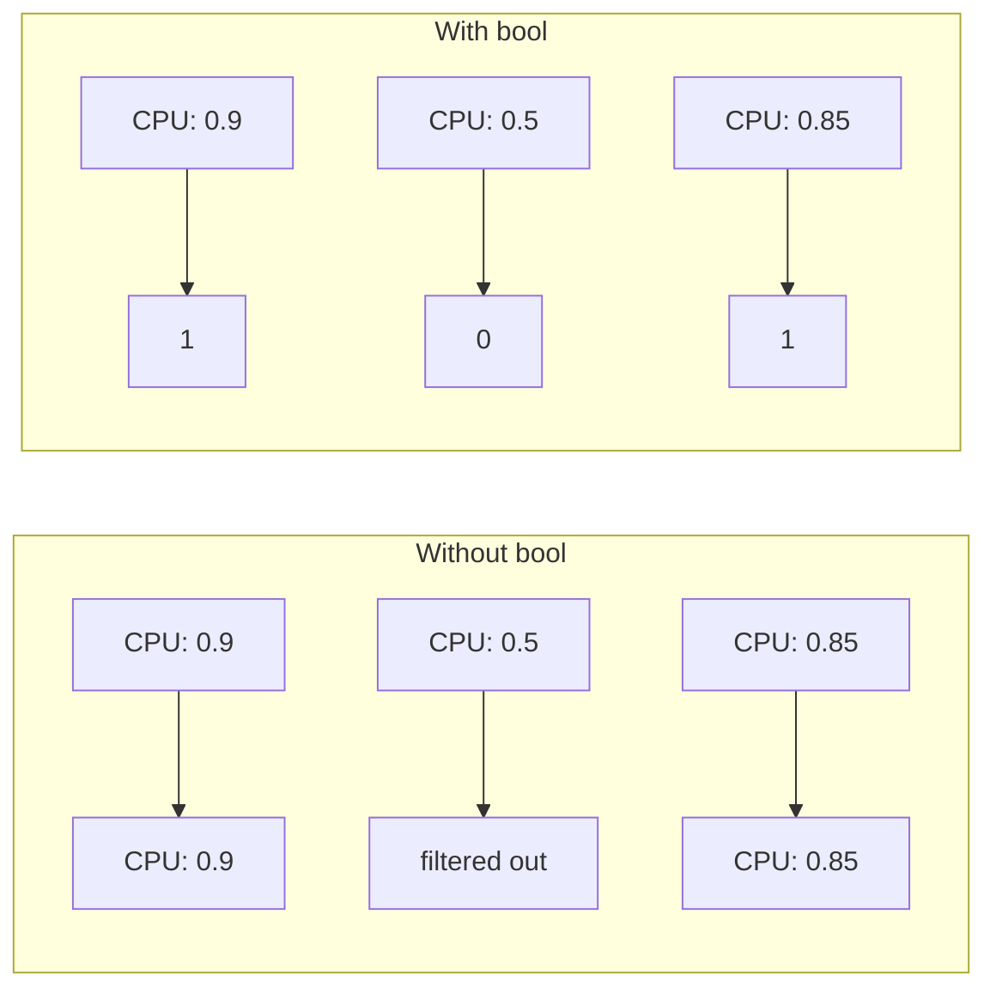

# How to Filter Prometheus Results by Metric Value

Author: [nawazdhandala](https://www.github.com/nawazdhandala)

Tags: Prometheus, PromQL, Filtering, Queries, Monitoring, Metrics, Thresholds, Observability

Description: Learn how to filter Prometheus query results by metric values using comparison operators, topk, bottomk, and threshold filtering. This guide covers practical patterns for finding outliers and anomalies.

---

Filtering Prometheus results by value lets you focus on what matters - high CPU instances, slow requests, or services with error spikes. This guide shows you how to filter metrics based on their values using PromQL operators and functions.

## Basic Comparison Operators

PromQL supports standard comparison operators that filter time series:

| Operator | Description |
|----------|-------------|
| `>` | Greater than |
| `<` | Less than |
| `>=` | Greater than or equal |
| `<=` | Less than or equal |
| `==` | Equal |
| `!=` | Not equal |

### Simple Filtering

```promql
# CPU usage above 80%
node_cpu_utilization > 0.8

# Memory usage above 90%
(node_memory_MemTotal_bytes - node_memory_MemAvailable_bytes)
/ node_memory_MemTotal_bytes > 0.9

# Disk usage above 85%
(node_filesystem_size_bytes - node_filesystem_avail_bytes)
/ node_filesystem_size_bytes > 0.85

# Error rate above 5%
rate(http_errors_total[5m]) / rate(http_requests_total[5m]) > 0.05
```

### Filtering with Exact Values

```promql
# Services that are down
up == 0

# Pods with exactly 0 ready replicas
kube_deployment_status_replicas_ready == 0

# Queues with non-zero items
rabbitmq_queue_messages != 0
```

## Using bool Modifier

By default, comparison operators filter out non-matching series. The `bool` modifier returns 1 or 0 instead:

```promql
# Returns 1 for high CPU, 0 for normal
node_cpu_utilization > bool 0.8

# Useful for creating boolean metrics
sum(up == bool 1)  # Count of up instances
sum(up == bool 0)  # Count of down instances
```



## Top and Bottom K Functions

Find the highest or lowest values across time series:

### topk() - Highest Values

```promql
# Top 5 instances by CPU usage
topk(5, node_cpu_utilization)

# Top 10 slowest endpoints
topk(10, histogram_quantile(0.95,
  sum by (endpoint, le) (rate(http_request_duration_seconds_bucket[5m]))
))

# Top 3 services by error count
topk(3, sum by (service) (increase(http_errors_total[1h])))
```

### bottomk() - Lowest Values

```promql
# 5 instances with lowest memory
bottomk(5, node_memory_MemAvailable_bytes)

# Services with lowest request rate
bottomk(10, sum by (service) (rate(http_requests_total[5m])))

# Pods with fewest restarts (non-zero)
bottomk(5, kube_pod_container_status_restarts_total > 0)
```

## Threshold-Based Filtering

### Above Threshold

```promql
# Response time above 500ms
histogram_quantile(0.95,
  sum by (service, le) (rate(http_request_duration_seconds_bucket[5m]))
) > 0.5

# Queue depth above 1000
rabbitmq_queue_messages > 1000

# Connection count above limit
pg_stat_activity_count > 100
```

### Below Threshold

```promql
# Free disk space below 10GB
node_filesystem_avail_bytes < 10 * 1024 * 1024 * 1024

# Available memory below 1GB
node_memory_MemAvailable_bytes < 1024 * 1024 * 1024

# Success rate below 99%
sum by (service) (rate(http_requests_total{status="200"}[5m]))
/ sum by (service) (rate(http_requests_total[5m])) < 0.99
```

### Between Range

```promql
# CPU between 50% and 80% (normal operating range)
node_cpu_utilization > 0.5 and node_cpu_utilization < 0.8

# Memory between 4GB and 8GB
node_memory_MemAvailable_bytes > 4 * 1024^3
and
node_memory_MemAvailable_bytes < 8 * 1024^3
```

## Filtering with Aggregations

### Filter After Aggregation

```promql
# Services with total error rate above threshold
sum by (service) (rate(http_errors_total[5m])) > 10

# Namespaces using more than 80% CPU quota
sum by (namespace) (rate(container_cpu_usage_seconds_total[5m]))
/
sum by (namespace) (kube_resourcequota{resource="limits.cpu"})
> 0.8
```

### Filter Before Aggregation

```promql
# Sum only high-traffic endpoints
sum by (service) (
  rate(http_requests_total[5m]) > 100
)

# Count instances with high CPU
count(node_cpu_utilization > 0.8)
```

## Percentile-Based Filtering

### Filter by Quantile

```promql
# Instances above 90th percentile CPU
node_cpu_utilization >
  quantile(0.9, node_cpu_utilization)

# Services with latency above 95th percentile
histogram_quantile(0.95,
  sum by (service, le) (rate(http_request_duration_seconds_bucket[5m]))
)
>
quantile(0.95,
  histogram_quantile(0.95,
    sum by (service, le) (rate(http_request_duration_seconds_bucket[5m]))
  )
)
```

### Standard Deviation Filtering

```promql
# CPU more than 2 standard deviations above mean
node_cpu_utilization
>
avg(node_cpu_utilization) + 2 * stddev(node_cpu_utilization)
```

## Practical Filtering Patterns

### Find Anomalies

```promql
# Request rate significantly higher than average
sum by (instance) (rate(http_requests_total[5m]))
>
2 * avg(sum by (instance) (rate(http_requests_total[5m])))

# Error rate spike (current vs historical)
sum by (service) (rate(http_errors_total[5m]))
>
3 * avg_over_time(sum by (service) (rate(http_errors_total[5m]))[1h:5m])
```

### Find Idle Resources

```promql
# Instances with very low CPU (potential waste)
node_cpu_utilization < 0.1

# Services with no traffic
sum by (service) (rate(http_requests_total[1h])) == 0

# Pods not receiving requests
sum by (pod) (rate(http_requests_total[5m])) < 1
```

### Find Saturated Resources

```promql
# Near memory limit
container_memory_usage_bytes
/ container_spec_memory_limit_bytes > 0.9

# Near CPU limit
sum by (pod) (rate(container_cpu_usage_seconds_total[5m]))
/ sum by (pod) (kube_pod_container_resource_limits{resource="cpu"})
> 0.9

# Connection pool near exhaustion
pg_stat_activity_count / pg_settings_max_connections > 0.8
```

## Combining Filters

### AND Logic

```promql
# High CPU AND high memory
(node_cpu_utilization > 0.8)
and
((node_memory_MemTotal_bytes - node_memory_MemAvailable_bytes)
 / node_memory_MemTotal_bytes > 0.8)

# High error rate AND high traffic
(rate(http_errors_total[5m]) / rate(http_requests_total[5m]) > 0.05)
and
(rate(http_requests_total[5m]) > 100)
```

### OR Logic

```promql
# High CPU OR high memory
(node_cpu_utilization > 0.9)
or
((node_memory_MemTotal_bytes - node_memory_MemAvailable_bytes)
 / node_memory_MemTotal_bytes > 0.95)
```

### NOT Logic (unless)

```promql
# All instances except those in maintenance
up == 1 unless on(instance) maintenance_mode == 1

# High CPU unless it's a batch job
(node_cpu_utilization > 0.8)
unless on(instance)
(node_labels{label_workload_type="batch"})
```

## Filtering in Grafana

### Table Panel - Show Only Problematic Items

```promql
# Only show services with errors
sum by (service) (rate(http_errors_total[5m])) > 0
```

### Stat Panel - Count of Items Above Threshold

```promql
# Number of instances with high CPU
count(node_cpu_utilization > 0.8)
```

### Alert Query

```promql
# Alert when any instance exceeds threshold
max(node_cpu_utilization) > 0.9
```

## Recording Rules for Filtered Metrics

Pre-compute filtered metrics for dashboards:

```yaml
groups:
  - name: filtered-metrics
    rules:
      # High CPU instances
      - record: instance:node_cpu:high
        expr: node_cpu_utilization > 0.8

      # Critical services (high error rate)
      - record: service:critical:bool
        expr: |
          sum by (service) (rate(http_errors_total[5m]))
          / sum by (service) (rate(http_requests_total[5m]))
          > bool 0.05

      # Top 10 services by request volume
      - record: service:http_requests:top10
        expr: |
          topk(10, sum by (service) (rate(http_requests_total[5m])))
```

## Alert Rules with Value Filtering

```yaml
groups:
  - name: threshold-alerts
    rules:
      - alert: HighCPUUsage
        expr: node_cpu_utilization > 0.8
        for: 5m
        labels:
          severity: warning
        annotations:
          summary: "High CPU on {{ $labels.instance }}"
          description: "CPU is {{ printf \"%.1f\" $value }}%"

      - alert: CriticalMemoryUsage
        expr: |
          (node_memory_MemTotal_bytes - node_memory_MemAvailable_bytes)
          / node_memory_MemTotal_bytes > 0.95
        for: 5m
        labels:
          severity: critical
        annotations:
          summary: "Critical memory on {{ $labels.instance }}"

      - alert: TopErrorServices
        expr: |
          topk(5,
            sum by (service) (rate(http_errors_total[5m]))
            / sum by (service) (rate(http_requests_total[5m]))
          ) > 0.01
        for: 5m
        labels:
          severity: warning
        annotations:
          summary: "{{ $labels.service }} has high error rate"
```

## Summary

| Goal | Query Pattern |
|------|---------------|
| Above threshold | `metric > value` |
| Below threshold | `metric < value` |
| Exact value | `metric == value` |
| Top N | `topk(N, metric)` |
| Bottom N | `bottomk(N, metric)` |
| Above percentile | `metric > quantile(0.9, metric)` |
| Outliers | `metric > avg + 2*stddev` |
| Combined filters | `(condition1) and (condition2)` |

---

Filtering by metric value is essential for focusing on problems and anomalies. Use comparison operators for simple thresholds, `topk`/`bottomk` for finding extremes, and combined conditions for complex scenarios. Recording rules help pre-compute common filters for faster dashboard loading.
