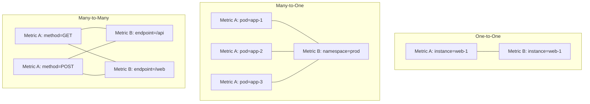
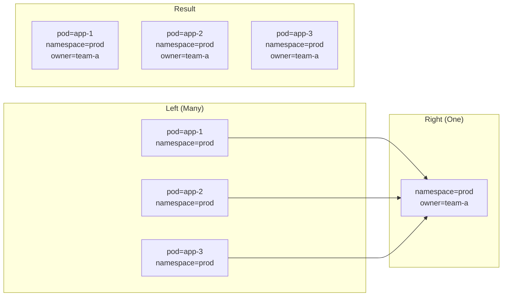

# How to Join Two Metrics in Prometheus Query

Author: [nawazdhandala](https://www.github.com/nawazdhandala)

Tags: Prometheus, PromQL, Vector Matching, Joins, Metrics, Monitoring, Label Matching, Observability

Description: Learn how to join two metrics in Prometheus using vector matching with on(), group_left(), and group_right(). This guide covers one-to-one, many-to-one, and many-to-many joins with practical examples.

---

Prometheus doesn't have traditional SQL-style JOINs, but it provides powerful vector matching operators that let you combine metrics from different sources. This guide shows you how to join metrics effectively using PromQL.

## Understanding Vector Matching

Vector matching combines two instant vectors based on their labels. Prometheus supports three types of matches:



## Basic Vector Matching

### Default Matching (All Labels)

By default, binary operations match on all common labels:

```promql
# Divides metrics that have identical label sets
metric_a / metric_b

# Example: CPU usage percentage
rate(container_cpu_usage_seconds_total[5m])
/
container_spec_cpu_quota
```

### The on() Modifier

Match only on specific labels:

```promql
# Match only on instance label
metric_a / on(instance) metric_b

# Match on multiple labels
metric_a / on(instance, job) metric_b
```

### The ignoring() Modifier

Match on all labels except specified ones:

```promql
# Match on all labels except status
metric_a / ignoring(status) metric_b

# Ignore multiple labels
metric_a / ignoring(method, endpoint) metric_b
```

## One-to-One Matching

One-to-one matching pairs each element from the left side with exactly one element from the right side.

### Example: Calculate Percentage

```promql
# Memory usage percentage
# Both metrics have same labels: instance, job
(
  node_memory_MemTotal_bytes - node_memory_MemAvailable_bytes
)
/
node_memory_MemTotal_bytes
```

### Example: Error Rate per Service

```promql
# Error rate calculation
# Both metrics have: service, instance, job labels
sum by (service) (rate(http_errors_total[5m]))
/
sum by (service) (rate(http_requests_total[5m]))
```

### Example: Resource vs Limit

```promql
# Container memory usage vs limit
container_memory_usage_bytes
/
on(container, pod, namespace)
container_spec_memory_limit_bytes
```

## Many-to-One Matching with group_left()

When the right side has fewer elements (lower cardinality), use `group_left()` to copy labels from the right to the left.



### Syntax

```promql
metric_a * on(labels) group_left(extra_labels) metric_b
```

### Example: Add Namespace Labels to Pods

```promql
# Add owner label from namespace to pod metrics
container_memory_usage_bytes
* on(namespace) group_left(owner)
kube_namespace_labels

# Result has both pod labels AND owner label
```

### Example: Enrich with Service Info

```promql
# Add service info to pod metrics
sum by (pod, namespace) (rate(container_cpu_usage_seconds_total[5m]))
* on(pod, namespace) group_left(service)
kube_pod_labels{label_app!=""}
```

### Example: Calculate Percentage with Info Labels

```promql
# Memory usage with deployment name
(
  container_memory_usage_bytes
  / on(pod, namespace) group_left()
  container_spec_memory_limit_bytes
)
* on(pod, namespace) group_left(deployment)
kube_pod_labels
```

## Many-to-One Matching with group_right()

When the left side has fewer elements, use `group_right()` to copy labels from the left to the right.

### Syntax

```promql
metric_a * on(labels) group_right(extra_labels) metric_b
```

### Example: Apply Weights to Metrics

```promql
# Apply region weights to instance metrics
region_weight
* on(region) group_right(instance)
sum by (region, instance) (rate(http_requests_total[5m]))
```

## Practical Join Patterns

### Pattern 1: Combine Metrics with Info Labels

```promql
# Combine container metrics with kubernetes labels
sum by (pod, namespace) (
  rate(container_network_receive_bytes_total[5m])
)
* on(pod, namespace) group_left(app, version)
kube_pod_labels
```

### Pattern 2: Calculate Ratios Across Different Metrics

```promql
# Queue depth vs worker count
rabbitmq_queue_messages
/ on(queue) group_left()
(rabbitmq_queue_consumers > 0)
```

### Pattern 3: Resource Usage vs Quota

```promql
# Namespace CPU usage vs quota
sum by (namespace) (
  rate(container_cpu_usage_seconds_total[5m])
)
/ on(namespace) group_left()
kube_resourcequota{resource="limits.cpu", type="hard"}
```

### Pattern 4: Compare Current vs Historical

```promql
# Current error rate vs baseline
sum by (service) (rate(http_errors_total[5m]))
/ on(service) group_left()
avg by (service) (sum by (service) (rate(http_errors_total[5m])) offset 1d)
```

### Pattern 5: SLO Calculations

```promql
# Actual availability vs target
(
  sum by (service) (rate(http_requests_total{status="200"}[5m]))
  / sum by (service) (rate(http_requests_total[5m]))
)
/ on(service) group_left(target)
slo_target_availability
```

## Handling Missing Labels

### Using label_replace()

Add or modify labels before joining:

```promql
# Add missing label for join
label_replace(
  node_cpu_utilization,
  "cluster", "production", "", ""
)
* on(cluster) group_left(region)
cluster_info
```

### Using label_join()

Combine multiple labels:

```promql
# Create composite key for matching
label_join(
  container_memory_usage_bytes,
  "pod_container", "_", "pod", "container"
)
```

## Common Join Scenarios

### Scenario 1: Container Metrics with Pod Owner

```promql
# Get deployment name for container metrics
sum by (pod, namespace, container) (
  rate(container_cpu_usage_seconds_total[5m])
)
* on(pod, namespace) group_left(owner_name)
label_replace(
  kube_pod_owner{owner_kind="ReplicaSet"},
  "owner_name", "$1", "owner_name", "(.*)-[^-]+"
)
```

### Scenario 2: Node Metrics with Kubernetes Labels

```promql
# Node metrics with kubernetes node labels
node_cpu_utilization
* on(node) group_left(zone, instance_type)
kube_node_labels
```

### Scenario 3: Application Metrics with Infrastructure

```promql
# Combine app metrics with node info
sum by (pod, namespace, node) (
  rate(http_requests_total[5m])
)
* on(node) group_left(zone)
kube_node_labels
```

## Troubleshooting Joins

### Issue: No Data Returned

```promql
# Debug: Check if labels match
# Step 1: View labels on left metric
topk(5, metric_a)

# Step 2: View labels on right metric
topk(5, metric_b)

# Step 3: Check common label values
count by (common_label) (metric_a)
count by (common_label) (metric_b)
```

### Issue: Multiple Matches Found

Error: "many-to-many matching not allowed"

```promql
# Wrong: Both sides have multiple matches
metric_a * on(job) metric_b

# Fix: Aggregate one side first
sum by (job) (metric_a) * on(job) metric_b

# Or use group_left/group_right
metric_a * on(job) group_left() metric_b
```

### Issue: Label Not Found After Join

```promql
# Labels not in on() clause are dropped
metric_a * on(namespace) group_left() metric_b

# To keep labels from right side, list them
metric_a * on(namespace) group_left(extra_label) metric_b
```

## Recording Rules for Joins

Pre-compute complex joins:

```yaml
groups:
  - name: enriched-metrics
    rules:
      # Container metrics with pod labels
      - record: container:cpu_usage:with_labels
        expr: |
          sum by (pod, namespace, container) (
            rate(container_cpu_usage_seconds_total[5m])
          )
          * on(pod, namespace) group_left(app, version)
          kube_pod_labels

      # Resource usage percentage
      - record: namespace:cpu:quota_usage_ratio
        expr: |
          sum by (namespace) (
            rate(container_cpu_usage_seconds_total[5m])
          )
          / on(namespace) group_left()
          kube_resourcequota{resource="limits.cpu", type="hard"}
```

## Summary

| Join Type | Modifier | Use Case |
|-----------|----------|----------|
| One-to-one | `on()` or `ignoring()` | Same cardinality both sides |
| Many-to-one | `group_left()` | Enrich left with info from right |
| One-to-many | `group_right()` | Apply left values to multiple on right |

| Modifier | Purpose |
|----------|---------|
| `on(labels)` | Match only on specified labels |
| `ignoring(labels)` | Match on all except specified |
| `group_left(labels)` | Copy specified labels from right |
| `group_right(labels)` | Copy specified labels from left |

---

Joining metrics in Prometheus requires understanding vector matching and label cardinality. Use `on()` to specify which labels to match, and `group_left()` or `group_right()` when cardinalities differ. For complex joins that you use frequently, create recording rules to pre-compute the results and improve query performance.
