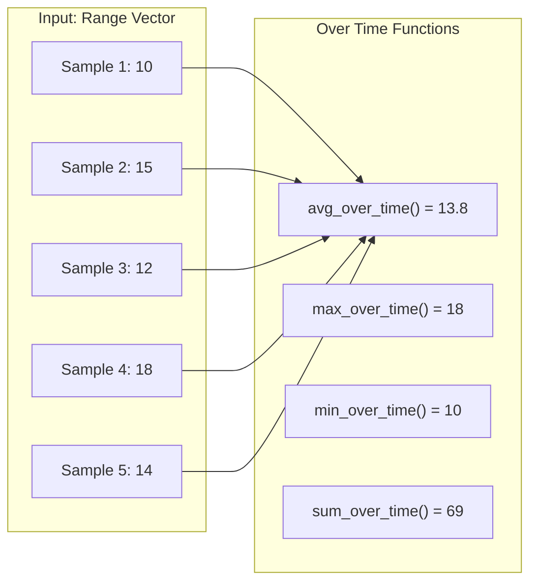

# How to Create Prometheus Metrics for Over Time Analysis

Author: [nawazdhandala](https://www.github.com/nawazdhandala)

Tags: Prometheus, PromQL, Metrics, Time Series, Analysis, avg_over_time, Recording Rules, Observability

Description: Learn how to create and analyze Prometheus metrics over time using over_time functions, subqueries, and recording rules. This guide covers aggregation patterns for historical analysis and trend detection.

---

Analyzing metrics over time windows is essential for understanding trends, detecting anomalies, and capacity planning. Prometheus provides powerful `_over_time` functions that aggregate time series data across specified periods. This guide shows you how to use them effectively.

## Understanding Over Time Functions

Prometheus offers several functions that aggregate values across a time range:

| Function | Description |
|----------|-------------|
| `avg_over_time()` | Average value over the range |
| `min_over_time()` | Minimum value over the range |
| `max_over_time()` | Maximum value over the range |
| `sum_over_time()` | Sum of all values over the range |
| `count_over_time()` | Count of samples over the range |
| `quantile_over_time()` | Quantile of values over the range |
| `stddev_over_time()` | Standard deviation over the range |
| `stdvar_over_time()` | Standard variance over the range |
| `last_over_time()` | Most recent value over the range |
| `present_over_time()` | 1 if any value exists over the range |
| `changes()` | Number of times value changed over the range |



## Basic Usage

### Average Over Time

```promql
# Average CPU usage over the last hour
avg_over_time(node_cpu_utilization[1h])

# Average response time over the last 24 hours
avg_over_time(http_request_duration_seconds[24h])

# Average per instance
avg by (instance) (avg_over_time(node_cpu_utilization[1h]))
```

### Min and Max Over Time

```promql
# Maximum memory usage in last 24 hours
max_over_time(node_memory_MemUsed_bytes[24h])

# Minimum available memory in last hour
min_over_time(node_memory_MemAvailable_bytes[1h])

# Peak request rate
max_over_time(rate(http_requests_total[5m])[24h:5m])
```

### Sum Over Time

```promql
# Total samples of a gauge over time (not common, but useful for specific cases)
sum_over_time(temperature_readings[1h])

# Use increase() for counters instead
increase(http_requests_total[1h])
```

## Using Subqueries for Complex Analyses

Subqueries let you apply over_time functions to expression results:

### Syntax

```promql
<expression>[range:resolution]
```

### Examples

```promql
# Average error rate over the last hour, sampled every minute
avg_over_time(
  (
    rate(http_errors_total[5m])
    / rate(http_requests_total[5m])
  )[1h:1m]
)

# Maximum CPU usage over 24 hours, sampled every 5 minutes
max_over_time(
  sum by (instance) (rate(node_cpu_seconds_total{mode!="idle"}[5m]))[24h:5m]
)

# Minimum response time (P95) over the last week
min_over_time(
  histogram_quantile(0.95,
    sum by (le) (rate(http_request_duration_seconds_bucket[5m]))
  )[7d:1h]
)
```

## Detecting Trends and Anomalies

### Comparing Current to Historical

```promql
# Current rate vs average over last 7 days
rate(http_requests_total[5m])
/
avg_over_time(rate(http_requests_total[5m])[7d:1h])

# Current error rate vs baseline
sum(rate(http_errors_total[5m]))
-
avg_over_time(sum(rate(http_errors_total[5m]))[7d:1h])
```

### Standard Deviation for Anomaly Detection

```promql
# How many standard deviations from mean
(
  rate(http_requests_total[5m])
  - avg_over_time(rate(http_requests_total[5m])[24h:5m])
)
/
stddev_over_time(rate(http_requests_total[5m])[24h:5m])

# Alert if more than 3 standard deviations
(
  rate(http_requests_total[5m])
  - avg_over_time(rate(http_requests_total[5m])[24h:5m])
)
/
stddev_over_time(rate(http_requests_total[5m])[24h:5m])
> 3
```

### Changes Detection

```promql
# Number of config changes in last 24 hours
changes(config_version[24h])

# Alert on frequent restarts
changes(process_start_time_seconds[1h]) > 3
```

## Time-Based Analysis Patterns

### Daily Patterns

```promql
# Average hourly traffic pattern
avg_over_time(rate(http_requests_total[5m])[1h:5m])

# Compare current hour to same hour yesterday
rate(http_requests_total[5m])
/
avg_over_time(rate(http_requests_total[5m]) offset 24h)[1h:5m]
```

### Weekly Patterns

```promql
# Average weekly pattern
avg_over_time(rate(http_requests_total[5m])[7d:1h])

# Current vs same time last week
rate(http_requests_total[5m])
/
rate(http_requests_total[5m] offset 7d)
```

### Percentile Over Time

```promql
# 95th percentile of latency over 24 hours
quantile_over_time(0.95, http_request_duration_seconds[24h])

# 99th percentile of error rate over a week
quantile_over_time(0.99,
  (
    rate(http_errors_total[5m])
    / rate(http_requests_total[5m])
  )[7d:5m]
)
```

## Recording Rules for Historical Analysis

Pre-compute metrics for faster historical queries:

```yaml
groups:
  - name: historical-analysis-rules
    interval: 5m
    rules:
      # Hourly average request rate
      - record: service:http_requests:rate5m_avg1h
        expr: |
          avg by (service) (
            avg_over_time(rate(http_requests_total[5m])[1h:5m])
          )

      # Daily max CPU
      - record: instance:cpu_utilization:max24h
        expr: |
          max by (instance) (
            max_over_time(
              sum by (instance) (rate(node_cpu_seconds_total{mode!="idle"}[5m]))[24h:5m]
            )
          )

      # Weekly average latency
      - record: service:http_latency_p95:avg7d
        expr: |
          avg by (service) (
            avg_over_time(
              histogram_quantile(0.95,
                sum by (service, le) (rate(http_request_duration_seconds_bucket[5m]))
              )[7d:1h]
            )
          )

      # Hourly error rate baseline
      - record: service:error_rate:avg24h
        expr: |
          avg by (service) (
            avg_over_time(
              (
                sum by (service) (rate(http_errors_total[5m]))
                / sum by (service) (rate(http_requests_total[5m]))
              )[24h:5m]
            )
          )

      # Standard deviation of request rate (for anomaly detection)
      - record: service:http_requests:rate5m_stddev24h
        expr: |
          stddev by (service) (
            stddev_over_time(
              sum by (service) (rate(http_requests_total[5m]))[24h:5m]
            )
          )
```

## Grafana Dashboard Examples

### Panel: Average vs Current

```promql
# Legend: Current Rate
sum(rate(http_requests_total[5m]))

# Legend: 24h Average
avg_over_time(sum(rate(http_requests_total[5m]))[24h:5m])

# Legend: 7d Average
avg_over_time(sum(rate(http_requests_total[5m]))[7d:1h])
```

### Panel: Min/Max/Avg Band

```promql
# Min (lower bound)
min_over_time(sum(rate(http_requests_total[5m]))[24h:5m])

# Max (upper bound)
max_over_time(sum(rate(http_requests_total[5m]))[24h:5m])

# Average (middle line)
avg_over_time(sum(rate(http_requests_total[5m]))[24h:5m])
```

### Panel: Anomaly Score

```promql
# Z-score: how many standard deviations from mean
(
  sum(rate(http_requests_total[5m]))
  - avg_over_time(sum(rate(http_requests_total[5m]))[24h:5m])
)
/
stddev_over_time(sum(rate(http_requests_total[5m]))[24h:5m])
```

## Alert Rules Using Over Time Analysis

```yaml
groups:
  - name: trend-alerts
    rules:
      # Traffic drop compared to baseline
      - alert: TrafficDropped
        expr: |
          sum(rate(http_requests_total[5m]))
          <
          0.5 * avg_over_time(sum(rate(http_requests_total[5m]))[24h:5m])
        for: 10m
        labels:
          severity: warning
        annotations:
          summary: "Traffic is 50% below 24h average"

      # Latency spike compared to baseline
      - alert: LatencySpike
        expr: |
          histogram_quantile(0.95,
            sum by (le) (rate(http_request_duration_seconds_bucket[5m]))
          )
          >
          2 * avg_over_time(
            histogram_quantile(0.95,
              sum by (le) (rate(http_request_duration_seconds_bucket[5m]))
            )[24h:5m]
          )
        for: 10m
        labels:
          severity: warning
        annotations:
          summary: "P95 latency is 2x the 24h average"

      # Anomaly detection using z-score
      - alert: TrafficAnomaly
        expr: |
          abs(
            sum(rate(http_requests_total[5m]))
            - avg_over_time(sum(rate(http_requests_total[5m]))[7d:1h])
          )
          /
          stddev_over_time(sum(rate(http_requests_total[5m]))[7d:1h])
          > 3
        for: 15m
        labels:
          severity: info
        annotations:
          summary: "Traffic is more than 3 standard deviations from weekly average"

      # Resource utilization trending up
      - alert: CPUTrendingUp
        expr: |
          avg_over_time(
            sum by (instance) (rate(node_cpu_seconds_total{mode!="idle"}[5m]))[1h:5m]
          )
          >
          1.5 * avg_over_time(
            sum by (instance) (rate(node_cpu_seconds_total{mode!="idle"}[5m]))[24h:5m]
          )
        for: 30m
        labels:
          severity: warning
        annotations:
          summary: "CPU usage is trending 50% above daily average on {{ $labels.instance }}"
```

## Capacity Planning Queries

### Growth Rate Analysis

```promql
# Average daily growth rate over last 30 days
(
  avg_over_time(sum(rate(http_requests_total[5m]))[1d:1h])
  -
  avg_over_time(sum(rate(http_requests_total[5m]) offset 30d)[1d:1h])
)
/ 30

# Storage growth rate
(
  max_over_time(sum(container_fs_usage_bytes)[1d:1h])
  -
  max_over_time(sum(container_fs_usage_bytes)[1d:1h] offset 30d)
)
/ 30
```

### Peak vs Average Ratio

```promql
# Peak to average ratio (helps size for peaks)
max_over_time(sum(rate(http_requests_total[5m]))[7d:5m])
/
avg_over_time(sum(rate(http_requests_total[5m]))[7d:5m])
```

## Performance Considerations

### Subquery Resolution

Choose appropriate resolution for your time range:

| Time Range | Suggested Resolution |
|------------|---------------------|
| 1 hour | 1m |
| 24 hours | 5m |
| 7 days | 15m or 1h |
| 30 days | 1h |

### Recording Rules for Heavy Queries

```yaml
# Pre-compute daily aggregations
groups:
  - name: daily-aggregations
    interval: 1h
    rules:
      - record: service:requests:daily_avg
        expr: avg_over_time(sum by (service) (rate(http_requests_total[5m]))[24h:5m])

      - record: service:requests:daily_max
        expr: max_over_time(sum by (service) (rate(http_requests_total[5m]))[24h:5m])

      - record: service:requests:daily_min
        expr: min_over_time(sum by (service) (rate(http_requests_total[5m]))[24h:5m])
```

## Summary Table

| Goal | Function | Example |
|------|----------|---------|
| Average over time | `avg_over_time()` | `avg_over_time(metric[24h])` |
| Peak value | `max_over_time()` | `max_over_time(metric[24h])` |
| Minimum value | `min_over_time()` | `min_over_time(metric[24h])` |
| Percentile | `quantile_over_time()` | `quantile_over_time(0.95, metric[24h])` |
| Variation | `stddev_over_time()` | `stddev_over_time(metric[24h])` |
| Rate analysis | Subquery | `avg_over_time(rate(counter[5m])[24h:5m])` |

---

Over time analysis in Prometheus transforms point-in-time metrics into historical trends and baselines. Use `_over_time` functions for gauge metrics and subqueries for rate-based analysis. Pre-compute common patterns with recording rules to keep dashboards responsive. Combine with standard deviation calculations for effective anomaly detection.
