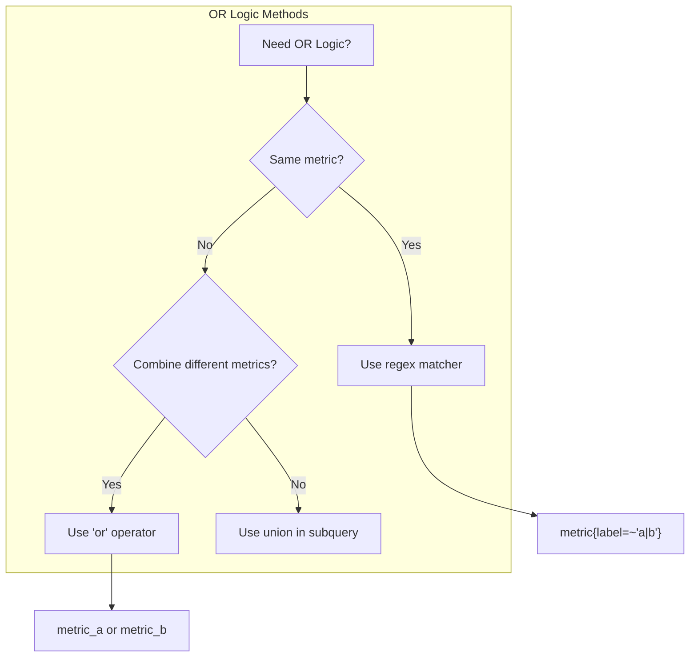

# How to Write OR Logical Operator in Prometheus Queries

Author: [nawazdhandala](https://www.github.com/nawazdhandala)

Tags: Prometheus, PromQL, Queries, Logical Operators, Monitoring, Observability, Metrics

Description: Learn how to implement OR logical operators in Prometheus queries using the or operator and regex label matchers. This guide covers practical examples for combining multiple conditions in PromQL.

---

Prometheus queries often require combining multiple conditions. Unlike SQL where you use `OR` directly, PromQL handles OR logic differently depending on your use case. This guide shows you how to write effective OR conditions in Prometheus.

## Understanding OR Logic in PromQL

PromQL provides two main ways to implement OR logic:

1. **The `or` operator** - Combines two vector expressions
2. **Regex label matchers** - Match multiple label values in a single selector

Each approach serves different purposes. Understanding when to use which is key to writing efficient queries.



## Method 1: The `or` Operator

The `or` operator performs a union of two instant vectors. It returns all samples from the left side, plus any samples from the right side that don't have matching label sets.

### Basic Syntax

```promql
<vector_expression_1> or <vector_expression_2>
```

### Example: Combining Different Metrics

Monitor either high CPU or high memory:

```promql
# Returns nodes with CPU > 80% OR memory > 90%
(node_cpu_utilization > 0.8) or (node_memory_utilization > 0.9)
```

### Example: Handling Missing Metrics

Use `or` to provide fallback values when metrics might not exist:

```promql
# Use custom metric if available, otherwise fall back to default
custom_http_requests_total or http_requests_total
```

### Example: Alert on Multiple Conditions

```yaml
# Alert rule using OR
groups:
  - name: resource-alerts
    rules:
      - alert: HighResourceUsage
        expr: |
          (
            sum by (instance) (rate(node_cpu_seconds_total{mode!="idle"}[5m])) > 0.8
          ) or (
            (node_memory_MemTotal_bytes - node_memory_MemAvailable_bytes)
            / node_memory_MemTotal_bytes > 0.9
          )
        for: 5m
        labels:
          severity: warning
        annotations:
          summary: "High resource usage on {{ $labels.instance }}"
```

## Method 2: Regex Label Matchers

When you want to select multiple values of the same label, use regex matchers with the `=~` operator.

### Basic Syntax

```promql
metric_name{label=~"value1|value2|value3"}
```

### Example: Multiple Status Codes

```promql
# Select 4xx and 5xx errors
http_requests_total{status=~"4..|5.."}

# Select specific status codes
http_requests_total{status=~"400|404|500|502|503"}

# Select all non-2xx responses
http_requests_total{status!~"2.."}
```

### Example: Multiple Services

```promql
# Monitor requests for web or api services
rate(http_requests_total{service=~"web|api"}[5m])

# Calculate error rate across multiple namespaces
sum by (namespace) (
  rate(http_requests_total{namespace=~"production|staging", status=~"5.."}[5m])
)
/
sum by (namespace) (
  rate(http_requests_total{namespace=~"production|staging"}[5m])
)
```

### Example: Multiple Instances

```promql
# Query specific instances
node_cpu_seconds_total{instance=~"node-01:9100|node-02:9100|node-03:9100"}

# Using regex patterns
node_cpu_seconds_total{instance=~"node-0[1-3]:9100"}

# Exclude specific instances
node_cpu_seconds_total{instance!~"node-test.*"}
```

## Combining Both Approaches

For complex queries, combine both methods:

```promql
# High CPU on web servers OR high memory on database servers
(
  sum by (instance) (
    rate(node_cpu_seconds_total{mode!="idle", job=~"web-.*"}[5m])
  ) > 0.8
)
or
(
  (
    node_memory_MemTotal_bytes{job=~"db-.*"}
    - node_memory_MemAvailable_bytes{job=~"db-.*"}
  ) / node_memory_MemTotal_bytes{job=~"db-.*"} > 0.9
)
```

## The `unless` Operator (NOT Logic)

While not OR, the `unless` operator is useful for exclusion:

```promql
# All instances except those with high CPU
all_instances unless high_cpu_instances

# Practical example: healthy services that aren't under maintenance
up{job="web"} == 1 unless on(instance) maintenance_mode == 1
```

## Vector Matching with OR

When using `or`, be aware of label matching:

```promql
# These have different labels, so both will appear
http_requests_total{method="GET"} or http_requests_total{method="POST"}

# This is equivalent and more efficient
http_requests_total{method=~"GET|POST"}
```

### Label Inheritance

The `or` operator preserves labels from both sides:

```promql
# Result contains labels from both metrics
metric_a{env="prod"} or metric_b{env="staging"}
# Output might include: {env="prod"} and {env="staging"}
```

## Practical Use Cases

### Use Case 1: Multi-Region Monitoring

```promql
# Total requests across US and EU regions
sum(
  rate(http_requests_total{region=~"us-.*|eu-.*"}[5m])
)

# OR using explicit operator for different metric sources
sum(rate(http_requests_us_total[5m]))
or
sum(rate(http_requests_eu_total[5m]))
```

### Use Case 2: Service Health Dashboard

```promql
# Show all unhealthy services (down or error rate > 5%)
(up{job=~"api|web|worker"} == 0)
or
(
  sum by (job) (rate(http_errors_total{job=~"api|web"}[5m]))
  /
  sum by (job) (rate(http_requests_total{job=~"api|web"}[5m]))
  > 0.05
)
```

### Use Case 3: Resource Threshold Alerts

```promql
# Alert when any critical resource exceeds threshold
(
  # Disk usage > 85%
  (node_filesystem_size_bytes - node_filesystem_avail_bytes)
  / node_filesystem_size_bytes > 0.85
)
or
(
  # Memory usage > 90%
  (node_memory_MemTotal_bytes - node_memory_MemAvailable_bytes)
  / node_memory_MemTotal_bytes > 0.90
)
or
(
  # CPU usage > 80%
  sum by (instance) (rate(node_cpu_seconds_total{mode!="idle"}[5m])) > 0.80
)
```

### Use Case 4: Fallback Metrics

```promql
# Use new metric format, fall back to legacy if not available
(
  sum by (service) (rate(http_server_requests_total[5m]))
)
or
(
  sum by (service) (rate(http_requests_total[5m]))
)
```

## Common Mistakes and Solutions

### Mistake 1: Using OR for Label Values

```promql
# Wrong - this doesn't work
http_requests_total{status="400" or status="500"}

# Correct - use regex
http_requests_total{status=~"400|500"}
```

### Mistake 2: Expecting AND Behavior

```promql
# This returns union, not intersection
metric_a or metric_b

# For intersection (AND), use 'and' operator
metric_a and metric_b
```

### Mistake 3: Forgetting Label Matching

```promql
# These might not combine as expected if labels differ
(rate(requests_total{service="a"}[5m]) > 100)
or
(rate(errors_total{app="a"}[5m]) > 10)

# Use consistent labeling or on() modifier
(rate(requests_total{service="a"}[5m]) > 100)
or on()
(rate(errors_total{app="a"}[5m]) > 10)
```

## Performance Considerations

1. **Regex complexity** - Simple alternations (`a|b|c`) are fast; complex patterns are slower
2. **Vector size** - Large OR combinations increase memory usage
3. **Recording rules** - Pre-compute complex OR conditions for dashboards

```yaml
# Recording rule for complex OR condition
groups:
  - name: precomputed
    rules:
      - record: instance:resource_pressure:bool
        expr: |
          (instance:cpu_utilization:ratio > 0.8)
          or
          (instance:memory_utilization:ratio > 0.9)
          or
          (instance:disk_utilization:ratio > 0.85)
```

## Summary

| Use Case | Method | Example |
|----------|--------|---------|
| Multiple label values | Regex `=~` | `{status=~"4..\|5.."}` |
| Different metrics | `or` operator | `metric_a or metric_b` |
| Fallback values | `or` operator | `new_metric or old_metric` |
| Complex conditions | Combine both | `(expr1) or (expr2)` |

---

OR logic in Prometheus differs from traditional SQL but offers flexibility for both simple label matching and complex metric combinations. Use regex matchers for filtering within a single metric and the `or` operator for combining different metrics or conditions. For frequently used OR expressions, create recording rules to improve query performance.
