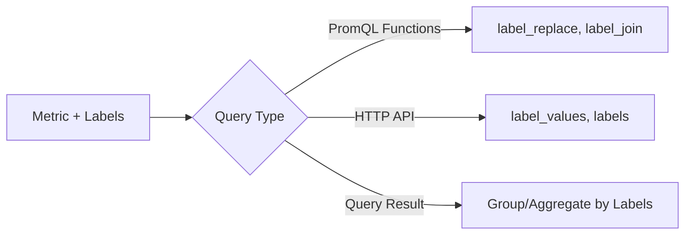

# How to Write Prometheus Queries That Return Label Values

Author: [nawazdhandala](https://www.github.com/nawazdhandala)

Tags: Prometheus, PromQL, Labels, Queries, Monitoring, Metrics

Description: Learn how to write Prometheus queries that extract and return label values. This guide covers label_values(), label_replace(), label_join(), and advanced techniques for working with labels in PromQL queries.

Prometheus labels provide dimensional metadata for metrics, and often you need to extract, transform, or query based on label values. While PromQL is designed for numeric time series, several functions and techniques allow you to work with label values directly. This guide covers all the methods for extracting and manipulating labels in Prometheus.

## Understanding Label Queries

PromQL queries return time series with numeric values. To work with label values, you use special functions or leverage Prometheus HTTP API endpoints.



## Using label_values() in Grafana

The `label_values()` function is specific to Grafana and returns unique values for a label. It is not part of PromQL but is essential for dashboard variables.

### Basic Syntax

```promql
# Get all values for a label across all metrics
label_values(label_name)

# Get label values from a specific metric
label_values(metric_name, label_name)

# Get label values with additional filters
label_values(metric_name{filter="value"}, label_name)
```

### Practical Examples

```promql
# All namespace values
label_values(kube_pod_info, namespace)

# All instance values from up metric
label_values(up, instance)

# Job values filtered by namespace
label_values(kube_pod_info{namespace="production"}, job)

# Pod names in a specific deployment
label_values(kube_pod_labels{label_app="api-server"}, pod)
```

## Prometheus HTTP API for Labels

### Get All Label Names

```bash
# List all label names in the database
curl "http://prometheus:9090/api/v1/labels"

# Response:
# {"status":"success","data":["__name__","instance","job","namespace","pod"]}
```

### Get Values for a Specific Label

```bash
# All values for the "job" label
curl "http://prometheus:9090/api/v1/label/job/values"

# Response:
# {"status":"success","data":["api-server","prometheus","node-exporter"]}

# Filter by time range
curl "http://prometheus:9090/api/v1/label/namespace/values?start=2024-01-01T00:00:00Z&end=2024-01-02T00:00:00Z"

# Filter by metric name
curl "http://prometheus:9090/api/v1/label/pod/values?match[]=kube_pod_info{namespace='production'}"
```

### Get Series Matching Labels

```bash
# Find all series with specific labels
curl -G "http://prometheus:9090/api/v1/series" \
  --data-urlencode 'match[]=http_requests_total{job="api-server"}'
```

## PromQL Functions for Label Manipulation

### label_replace()

Transform or create labels based on regex matching:

```promql
# Syntax
label_replace(vector, dst_label, replacement, src_label, regex)

# Extract pod name prefix as a new label
label_replace(
  kube_pod_info,
  "app",
  "$1",
  "pod",
  "(.+)-[a-z0-9]+-[a-z0-9]+"
)

# Create a "short_instance" label from instance
label_replace(
  up,
  "short_instance",
  "$1",
  "instance",
  "([^:]+):\\d+"
)

# Copy a label to a new name
label_replace(
  http_requests_total,
  "service",
  "$1",
  "job",
  "(.*)"
)
```

### label_join()

Concatenate multiple label values into a new label:

```promql
# Syntax
label_join(vector, dst_label, separator, src_label_1, src_label_2, ...)

# Combine namespace and pod into a single label
label_join(
  kube_pod_info,
  "namespace_pod",
  "/",
  "namespace",
  "pod"
)

# Create a full identifier
label_join(
  http_requests_total,
  "full_id",
  "-",
  "job",
  "instance",
  "method"
)
```

## Extracting Labels Through Aggregation

### Using group()

The `group()` function returns 1 for each unique label combination, effectively listing all label values:

```promql
# Get all unique namespace values (returns 1 for each)
group(kube_pod_info) by (namespace)

# Get all unique job/instance combinations
group(up) by (job, instance)

# Get all pods in a namespace
group(kube_pod_info{namespace="production"}) by (pod)
```

### Using count()

Count unique values per label:

```promql
# Count pods per namespace
count(kube_pod_info) by (namespace)

# Count instances per job
count(up) by (job)
```

## Advanced Label Queries

### Filtering Based on Label Existence

```promql
# Metrics that have a specific label
http_requests_total{namespace!=""}

# Metrics missing a label (label exists but empty)
http_requests_total{version=""}

# Combine with regex for partial matches
http_requests_total{pod=~".+-api-.+"}
```

### Dynamic Label Matching

Using recording rules to materialize label values:

```yaml
groups:
  - name: label_materialization
    rules:
      # Create a metric that exposes label as value
      - record: namespace:pod_count:total
        expr: count(kube_pod_info) by (namespace)

      # Store label mappings
      - record: info:service_version:labels
        expr: |
          max(
            label_replace(
              service_info,
              "version_major",
              "$1",
              "version",
              "(\\d+)\\..*"
            )
          ) by (service, version, version_major)
```

### Cross-Metric Label Queries

Join metrics to transfer labels:

```promql
# Get pod names with their node labels
kube_pod_info
  * on(namespace, pod) group_left(node)
  kube_pod_info

# Enrich metrics with metadata labels
http_requests_total
  * on(namespace, pod) group_left(owner_kind, owner_name)
  kube_pod_owner
```

## Grafana Variable Queries

### Basic Variables

```promql
# Namespace variable
label_values(namespace)

# Pod variable filtered by namespace
label_values(kube_pod_info{namespace="$namespace"}, pod)

# Instance variable
label_values(up{job="$job"}, instance)
```

### Query-Based Variables

Use `query_result()` for complex label extraction:

```promql
# Variable: top_pods (pods with highest CPU)
query_result(
  topk(10, sum(rate(container_cpu_usage_seconds_total[5m])) by (pod))
)
# Regex: /pod="([^"]+)"/

# Variable: active_services (services with traffic)
query_result(
  count(rate(http_requests_total[5m]) > 0) by (service)
)
# Regex: /service="([^"]+)"/
```

### Custom Label Values

Create custom options with metric-based filtering:

```promql
# Environments with running pods
label_values(kube_pod_info{phase="Running"}, label_environment)

# Regions with active traffic
label_values(
  http_requests_total{status_code!~"5.."},
  region
)
```

## Practical Use Cases

### Service Discovery via Labels

```promql
# Find all services in production
group(up{environment="production"}) by (job, instance)

# List all database instances
group(pg_up) by (instance, datname)
```

### Label-Based Routing

```promql
# Get all canary deployment pods
group(kube_pod_labels{label_track="canary"}) by (namespace, pod)

# Find blue/green deployment versions
group(kube_deployment_labels) by (deployment, label_version)
```

### Metadata Extraction

```promql
# Extract version from pod name
label_replace(
  kube_pod_info,
  "version",
  "$2",
  "pod",
  "(.+)-(v[0-9]+)-.*"
)

# Parse environment from namespace
label_replace(
  kube_namespace_labels,
  "environment",
  "$1",
  "namespace",
  "(dev|staging|prod)-.*"
)
```

## API Wrapper Script

Create a utility script for label queries:

```bash
#!/bin/bash
# get-labels.sh - Query Prometheus for label values

PROMETHEUS_URL="${PROMETHEUS_URL:-http://localhost:9090}"

get_label_values() {
  local label=$1
  local metric=$2

  if [ -z "$metric" ]; then
    curl -s "$PROMETHEUS_URL/api/v1/label/$label/values" | jq -r '.data[]'
  else
    curl -s -G "$PROMETHEUS_URL/api/v1/label/$label/values" \
      --data-urlencode "match[]=$metric" | jq -r '.data[]'
  fi
}

get_all_labels() {
  curl -s "$PROMETHEUS_URL/api/v1/labels" | jq -r '.data[]'
}

# Usage examples
case "$1" in
  "values")
    get_label_values "$2" "$3"
    ;;
  "labels")
    get_all_labels
    ;;
  *)
    echo "Usage: $0 {values <label> [metric]|labels}"
    ;;
esac
```

Usage:

```bash
# Get all label names
./get-labels.sh labels

# Get all namespace values
./get-labels.sh values namespace

# Get pod values for specific metric
./get-labels.sh values pod 'kube_pod_info{namespace="production"}'
```

## Python Client Example

```python
import requests

class PrometheusLabelClient:
    def __init__(self, url):
        self.url = url.rstrip('/')

    def get_label_names(self):
        """Get all label names."""
        response = requests.get(f"{self.url}/api/v1/labels")
        return response.json()['data']

    def get_label_values(self, label, match=None):
        """Get values for a specific label."""
        params = {}
        if match:
            params['match[]'] = match

        response = requests.get(
            f"{self.url}/api/v1/label/{label}/values",
            params=params
        )
        return response.json()['data']

    def get_series(self, match):
        """Get series matching a selector."""
        response = requests.get(
            f"{self.url}/api/v1/series",
            params={'match[]': match}
        )
        return response.json()['data']

# Usage
client = PrometheusLabelClient("http://prometheus:9090")

# Get all namespaces
namespaces = client.get_label_values("namespace")
print(f"Namespaces: {namespaces}")

# Get pods in production
pods = client.get_label_values("pod", 'kube_pod_info{namespace="production"}')
print(f"Production pods: {pods}")

# Get all labels for a metric
series = client.get_series('http_requests_total{job="api"}')
for s in series:
    print(f"Labels: {s}")
```

## Conclusion

Working with label values in Prometheus requires understanding the different approaches:

1. **Grafana's label_values()** - Best for dashboard variables
2. **Prometheus HTTP API** - Direct access to label metadata
3. **PromQL functions** - label_replace() and label_join() for transformation
4. **Aggregation functions** - group() and count() for label enumeration

Key takeaways:
- Use the HTTP API for programmatic label discovery
- Leverage label_replace() to extract substrings from labels
- Create recording rules to materialize complex label transformations
- Combine metrics with group_left() to transfer labels between series

With these techniques, you can build dynamic dashboards and automation that adapts to your changing infrastructure based on label values.
