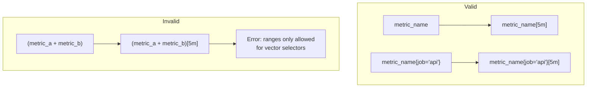
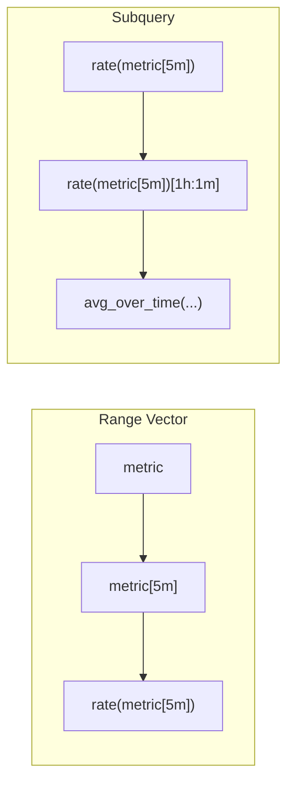

# How to Fix "ranges only allowed for vector selectors" Errors

Author: [nawazdhandala](https://www.github.com/nawazdhandala)

Tags: Prometheus, PromQL, Errors, Troubleshooting, Vector Selectors, Range Vectors, Monitoring, Observability

Description: Learn how to fix the "ranges only allowed for vector selectors" error in Prometheus. This guide explains instant vs range vectors, common causes, and practical solutions.

---

The "ranges only allowed for vector selectors" error is one of the most common PromQL mistakes. It occurs when you try to apply a time range to something that isn't a simple metric selector. This guide explains why it happens and how to fix it.

## Understanding the Error

The error appears when you write something like:

```promql
# This causes the error
(metric_a + metric_b)[5m]
```

Prometheus tells you that `[5m]` (a range) can only be applied to a simple vector selector like `metric_name{labels}`, not to an expression result.



## Instant Vectors vs Range Vectors

### Instant Vector

A single value per time series at one point in time:

```promql
# Returns current value
http_requests_total

# Returns current value with filter
http_requests_total{job="api"}
```

### Range Vector

Multiple values per time series over a time range:

```promql
# Returns values over last 5 minutes
http_requests_total[5m]

# Returns values over last 5 minutes with filter
http_requests_total{job="api"}[5m]
```

## Common Causes and Solutions

### Cause 1: Range on Expression Result

```promql
# Wrong: Range on arithmetic result
(http_requests_total / http_requests_total offset 1h)[5m]

# Fix: Apply rate() to base metrics, then divide
rate(http_requests_total[5m])
/
rate(http_requests_total[5m] offset 1h)
```

### Cause 2: Range on Aggregation

```promql
# Wrong: Range on sum()
sum(http_requests_total)[5m]

# Fix: Range inside aggregation
sum(rate(http_requests_total[5m]))
```

### Cause 3: Range on Function Result

```promql
# Wrong: Range on rate() result
rate(http_requests_total[5m])[10m]

# Fix: Use subquery syntax (requires Prometheus 2.7+)
rate(http_requests_total[5m])[10m:1m]

# Or use avg_over_time with subquery
avg_over_time(rate(http_requests_total[5m])[10m:1m])
```

### Cause 4: Range on Binary Operation

```promql
# Wrong: Range on division result
(http_errors_total / http_requests_total)[5m]

# Fix: Apply range inside the expression
rate(http_errors_total[5m]) / rate(http_requests_total[5m])
```

### Cause 5: Range After group_left/group_right

```promql
# Wrong: Range on join result
(metric_a * on(label) group_left() metric_b)[5m]

# Fix: Apply range before join
rate(metric_a[5m]) * on(label) group_left() metric_b
```

## Using Subqueries

Subqueries let you apply a time range to any expression, but with different syntax:

### Subquery Syntax

```promql
expression[range:resolution]
```

### Examples

```promql
# Average rate over the last hour, evaluated every minute
avg_over_time(rate(http_requests_total[5m])[1h:1m])

# Max CPU over last 24 hours, evaluated every 5 minutes
max_over_time(sum(rate(node_cpu_seconds_total{mode!="idle"}[5m]))[24h:5m])

# Standard deviation of request rate
stddev_over_time(rate(http_requests_total[5m])[1h:1m])
```

### Subquery vs Range Vector

| Syntax | Type | Use Case |
|--------|------|----------|
| `metric[5m]` | Range vector | Input to rate(), increase(), etc. |
| `expr[5m:1m]` | Subquery | Time window over expression result |



## Practical Examples

### Example 1: Average Error Rate Over Time

```promql
# Wrong
avg(rate(http_errors_total[5m]) / rate(http_requests_total[5m]))[1h]

# Right: Use subquery
avg_over_time(
  (
    rate(http_errors_total[5m])
    / rate(http_requests_total[5m])
  )[1h:1m]
)
```

### Example 2: Maximum CPU Spike

```promql
# Wrong
max(sum by (instance) (rate(node_cpu_seconds_total[5m])))[24h]

# Right: Use subquery
max_over_time(
  sum by (instance) (rate(node_cpu_seconds_total{mode!="idle"}[5m]))[24h:5m]
)
```

### Example 3: Percentile Over Time Window

```promql
# Wrong
quantile(0.95, http_request_duration_seconds)[1h]

# Right: For histograms, aggregate properly
histogram_quantile(0.95,
  sum by (le) (rate(http_request_duration_seconds_bucket[1h]))
)

# Or use subquery for the quantile value over time
quantile_over_time(0.95,
  histogram_quantile(0.95,
    sum by (le) (rate(http_request_duration_seconds_bucket[5m]))
  )[1h:5m]
)
```

### Example 4: Rate of Change of a Rate

```promql
# Wrong
deriv(rate(http_requests_total[5m]))[1h]

# Right: Use subquery
deriv(rate(http_requests_total[5m])[1h:1m])
```

## Functions That Require Range Vectors

These functions need a range vector as input:

| Function | Example |
|----------|---------|
| `rate()` | `rate(counter[5m])` |
| `irate()` | `irate(counter[5m])` |
| `increase()` | `increase(counter[1h])` |
| `avg_over_time()` | `avg_over_time(gauge[1h])` |
| `min_over_time()` | `min_over_time(gauge[1h])` |
| `max_over_time()` | `max_over_time(gauge[1h])` |
| `sum_over_time()` | `sum_over_time(gauge[1h])` |
| `count_over_time()` | `count_over_time(metric[1h])` |
| `quantile_over_time()` | `quantile_over_time(0.95, gauge[1h])` |
| `stddev_over_time()` | `stddev_over_time(gauge[1h])` |
| `stdvar_over_time()` | `stdvar_over_time(gauge[1h])` |
| `last_over_time()` | `last_over_time(gauge[1h])` |
| `present_over_time()` | `present_over_time(metric[1h])` |
| `deriv()` | `deriv(gauge[5m])` |
| `predict_linear()` | `predict_linear(gauge[1h], 3600)` |
| `delta()` | `delta(gauge[5m])` |
| `idelta()` | `idelta(gauge[5m])` |
| `changes()` | `changes(metric[1h])` |
| `resets()` | `resets(counter[1h])` |

## Alert Rule Examples

### Correct Alert with Rate

```yaml
groups:
  - name: example
    rules:
      # Wrong way (would cause error if you tried)
      # - alert: HighErrorRate
      #   expr: (http_errors_total / http_requests_total)[5m] > 0.05

      # Correct way
      - alert: HighErrorRate
        expr: |
          rate(http_errors_total[5m])
          / rate(http_requests_total[5m])
          > 0.05
        for: 5m
        labels:
          severity: warning
```

### Alert with Subquery

```yaml
      # Alert if average error rate over 1 hour exceeds threshold
      - alert: SustainedHighErrorRate
        expr: |
          avg_over_time(
            (
              rate(http_errors_total[5m])
              / rate(http_requests_total[5m])
            )[1h:1m]
          ) > 0.05
        for: 5m
        labels:
          severity: critical
```

## Recording Rules to Avoid the Issue

Pre-compute rates to simplify queries:

```yaml
groups:
  - name: rate-recording-rules
    rules:
      # Pre-compute error rate
      - record: job:http_error_rate:ratio5m
        expr: |
          rate(http_errors_total[5m])
          / rate(http_requests_total[5m])

      # Pre-compute CPU usage
      - record: instance:cpu_utilization:ratio5m
        expr: |
          sum by (instance) (
            rate(node_cpu_seconds_total{mode!="idle"}[5m])
          )
```

Now you can use these in subqueries:

```promql
# Average error rate over 1 hour
avg_over_time(job:http_error_rate:ratio5m[1h])

# Max CPU over 24 hours
max_over_time(instance:cpu_utilization:ratio5m[24h])
```

## Quick Reference

| Pattern | Issue | Solution |
|---------|-------|----------|
| `(a + b)[5m]` | Range on expression | Use `rate(a[5m]) + rate(b[5m])` |
| `sum(m)[5m]` | Range on aggregation | Use `sum(rate(m[5m]))` |
| `rate(m[5m])[1h]` | Range on function | Use `rate(m[5m])[1h:1m]` |
| `f(m) / g(m)[5m]` | Range on division | Use `rate(m[5m]) / rate(n[5m])` |

## Summary

The "ranges only allowed for vector selectors" error means you're trying to apply a time range `[duration]` to something other than a simple metric selector. The solutions are:

1. **Move the range inside** - Apply `[5m]` to the base metrics, not the expression result
2. **Use subqueries** - Add a resolution step: `[1h:1m]` instead of `[1h]`
3. **Use recording rules** - Pre-compute complex expressions, then apply ranges to the recorded metric

Understanding the difference between instant vectors, range vectors, and subqueries is key to writing correct PromQL queries.
