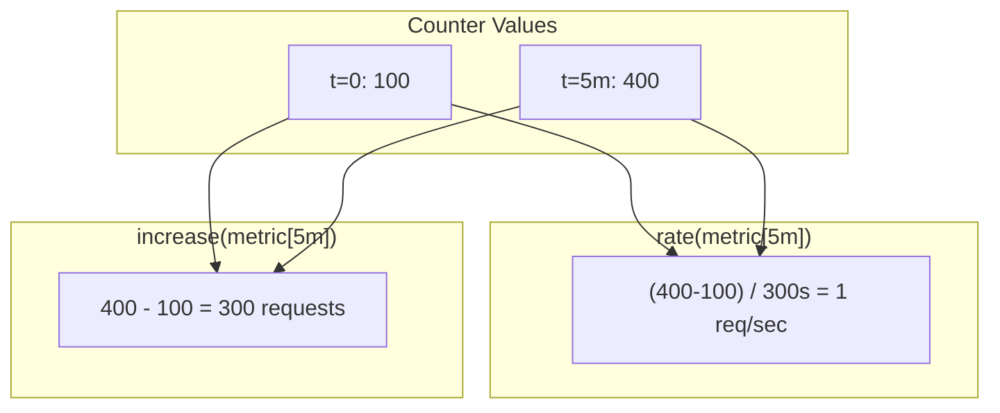
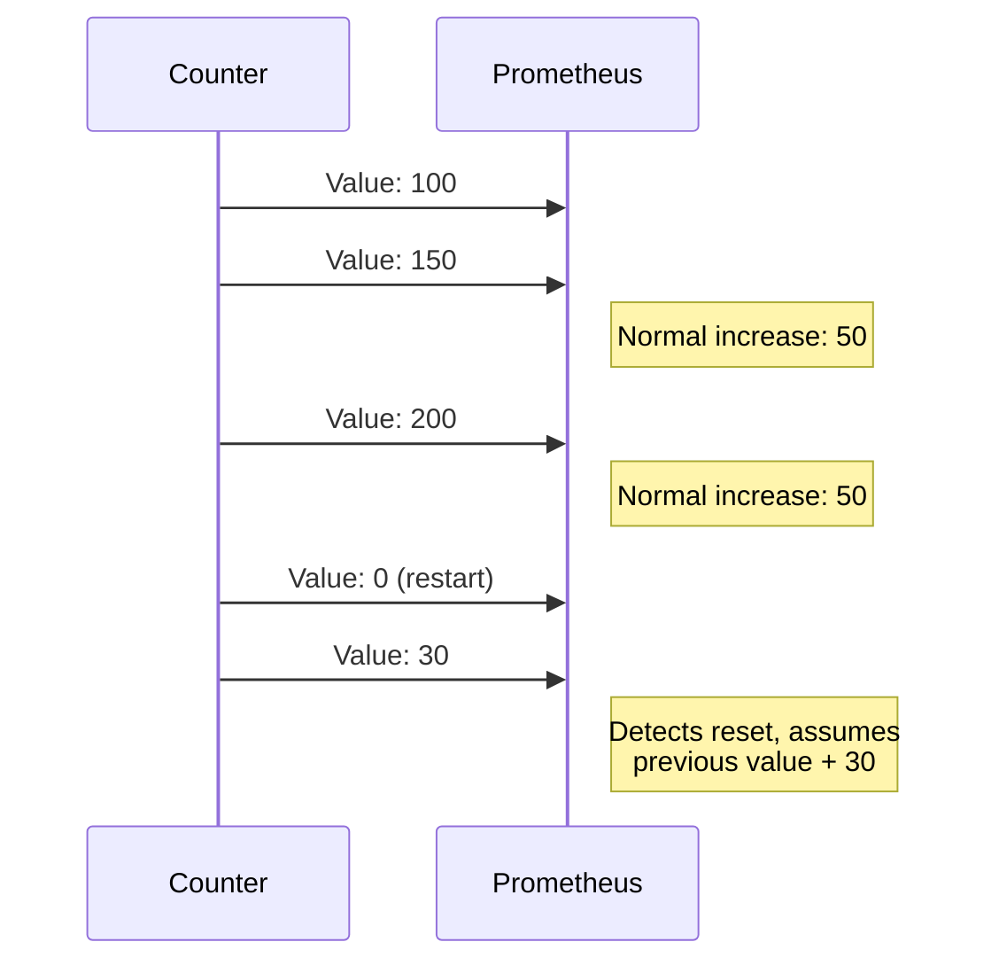

# How to Understand rate() vs increase() in Prometheus

Author: [nawazdhandala](https://www.github.com/nawazdhandala)

Tags: Prometheus, PromQL, rate(), increase(), Counters, Metrics, Monitoring, Observability

Description: Learn the difference between rate() and increase() in Prometheus. This guide explains when to use each function, how they handle counter resets, and common mistakes to avoid.

---

The `rate()` and `increase()` functions are essential for working with Prometheus counters, but they serve different purposes. Understanding when to use each helps you write more accurate queries and avoid common mistakes.

## Core Difference

| Function | Returns | Best For |
|----------|---------|----------|
| `rate()` | Per-second average | Rates, throughput, alerting |
| `increase()` | Total count | Totals, billing, absolute numbers |



## How rate() Works

`rate()` calculates the per-second average rate of increase over the time range:

```promql
rate(counter[time_range])
```

### Mathematical Definition

```
rate = (last_value - first_value) / time_range_seconds
```

### Examples

```promql
# Requests per second (averaged over 5 minutes)
rate(http_requests_total[5m])
# If counter went from 1000 to 1300 over 5 minutes:
# rate = (1300 - 1000) / 300 = 1 request/second

# Bytes per second
rate(network_bytes_total[5m])

# CPU usage (returns 0-1 representing core utilization)
rate(node_cpu_seconds_total[5m])
```

## How increase() Works

`increase()` calculates the total increase in a counter over the time range:

```promql
increase(counter[time_range])
```

### Mathematical Definition

```
increase = last_value - first_value
```

Note: `increase()` also extrapolates to cover the entire time range, which can produce fractional results.

### Examples

```promql
# Total requests in the last hour
increase(http_requests_total[1h])
# If counter went from 1000 to 4600 over 1 hour:
# increase = 3600 requests

# Total errors today
increase(http_errors_total[24h])

# Bytes transferred in last week
increase(network_bytes_total[7d])
```

## The Relationship

`rate()` and `increase()` are mathematically related:

```promql
# These are approximately equivalent
increase(metric[5m]) ~= rate(metric[5m]) * 300

# And
rate(metric[5m]) ~= increase(metric[5m]) / 300
```

### Proof by Example

```promql
# If rate(http_requests_total[5m]) = 10 (requests/second)
# Then increase(http_requests_total[5m]) ~= 10 * 300 = 3000 requests

# If increase(http_requests_total[1h]) = 36000 requests
# Then rate(http_requests_total[1h]) ~= 36000 / 3600 = 10 requests/second
```

## When to Use rate()

### Throughput Monitoring

```promql
# Requests per second
rate(http_requests_total[5m])

# Queries per second
rate(database_queries_total[5m])

# Messages per second
rate(kafka_messages_processed_total[5m])
```

### CPU and Resource Usage

```promql
# CPU utilization (0-1 scale per core)
rate(node_cpu_seconds_total[5m])

# Disk I/O per second
rate(node_disk_read_bytes_total[5m])
```

### Alerting on Rates

```promql
# Alert when request rate drops
rate(http_requests_total[5m]) < 10

# Alert on high error rate
rate(http_errors_total[5m]) / rate(http_requests_total[5m]) > 0.05
```

### Grafana Graphs

```promql
# Smooth line showing requests/second over time
rate(http_requests_total[5m])
```

## When to Use increase()

### Counting Events

```promql
# Total requests in the last hour
increase(http_requests_total[1h])

# Total errors today
increase(http_errors_total[24h])

# Total logins this week
increase(user_logins_total[7d])
```

### Billing and Quotas

```promql
# API calls for billing
sum by (customer) (increase(api_calls_total[30d]))

# Data transfer for billing
increase(network_egress_bytes_total[30d]) / 1024 / 1024 / 1024  # GB
```

### Capacity Planning

```promql
# Total requests per day for capacity estimation
sum(increase(http_requests_total[24h]))
```

### Single-Stat Panels

```promql
# Show total count in dashboard
increase(http_requests_total[1h])
```

## Counter Reset Handling

Both functions handle counter resets (when the counter goes back to zero after a restart):



### How Reset Detection Works

```promql
# Counter values: 100, 150, 200, 0 (reset), 30
# rate() and increase() detect the drop from 200 to 0
# They assume the counter would have been 200 + 30 = 230

# The resets() function shows how many resets occurred
resets(http_requests_total[1h])
```

## Common Mistakes

### Mistake 1: Using rate() for Totals

```promql
# Wrong: Shows per-second rate, not total
rate(http_requests_total[1h])

# Right: Shows total requests
increase(http_requests_total[1h])
```

### Mistake 2: Using increase() for Graphs

```promql
# Problematic: increase() in a time-series graph
# The value represents total over the window, not rate
increase(http_requests_total[5m])

# Better: rate() shows instantaneous rate
rate(http_requests_total[5m])
```

### Mistake 3: Wrong Time Range

```promql
# Too short: May miss samples, inaccurate result
rate(http_requests_total[30s])

# Better: At least 4x your scrape interval
rate(http_requests_total[2m])  # For 30s scrape interval
```

### Mistake 4: Using rate() on Gauges

```promql
# Wrong: rate() on a gauge doesn't make sense
rate(temperature_celsius[5m])

# Right: Use deriv() for gauge rate of change
deriv(temperature_celsius[5m])

# Or just use the gauge directly
temperature_celsius
```

### Mistake 5: Expecting Integers from increase()

```promql
# increase() extrapolates and may return decimals
increase(http_requests_total[5m])
# Result: 299.7 (not 300)

# If you need integers
ceil(increase(http_requests_total[5m]))
# or
floor(increase(http_requests_total[5m]))
```

## Choosing the Right Time Range

### For rate()

- Use at least 4x your scrape interval
- 5 minutes (`[5m]`) is a common choice
- Longer ranges smooth out spikes

```promql
# With 15s scrape interval, use at least 1m
rate(metric[1m])

# 5m is good for most dashboards
rate(metric[5m])

# 15m or more for smoother graphs
rate(metric[15m])
```

### For increase()

- Match your reporting period
- Common choices: 1h, 24h, 7d, 30d

```promql
# Hourly totals
increase(metric[1h])

# Daily totals
increase(metric[24h])

# Monthly totals
increase(metric[30d])
```

## irate() - Instant Rate

`irate()` calculates rate using only the last two samples:

```promql
# Very responsive to changes
irate(http_requests_total[5m])
```

### rate() vs irate()

| Function | Calculation | Use Case |
|----------|-------------|----------|
| `rate()` | Average over range | Alerting, smooth graphs |
| `irate()` | Last two points only | Volatile graphs, spikes |

```promql
# rate() smooths out the line
rate(http_requests_total[5m])

# irate() shows every spike
irate(http_requests_total[5m])
```

## Recording Rules

Pre-compute common rate/increase calculations:

```yaml
groups:
  - name: rate-rules
    interval: 15s
    rules:
      # Request rate per service
      - record: service:http_requests:rate5m
        expr: sum by (service) (rate(http_requests_total[5m]))

      # Error rate per service
      - record: service:http_errors:rate5m
        expr: sum by (service) (rate(http_errors_total[5m]))

  - name: increase-rules
    interval: 5m
    rules:
      # Hourly request count
      - record: service:http_requests:increase1h
        expr: sum by (service) (increase(http_requests_total[1h]))

      # Daily error count
      - record: service:http_errors:increase24h
        expr: sum by (service) (increase(http_errors_total[24h]))
```

## Summary Table

| Scenario | Function | Example |
|----------|----------|---------|
| Requests/second | `rate()` | `rate(http_requests_total[5m])` |
| CPU utilization | `rate()` | `rate(node_cpu_seconds_total[5m])` |
| Error rate % | `rate()` | `rate(errors[5m]) / rate(requests[5m])` |
| Alert on rate | `rate()` | `rate(errors[5m]) > 10` |
| Smooth graph | `rate()` | Dashboard time series |
| Total today | `increase()` | `increase(http_requests_total[24h])` |
| Billing count | `increase()` | `increase(api_calls_total[30d])` |
| Single stat | `increase()` | Dashboard stat panel |
| Spiky graph | `irate()` | `irate(http_requests_total[5m])` |

---

Use `rate()` when you need per-second rates for monitoring, alerting, and time-series graphs. Use `increase()` when you need absolute counts for totals, billing, and single-value displays. Both functions handle counter resets automatically, making them safe to use across service restarts. Choose your time range based on your scrape interval and the level of smoothing you want.
