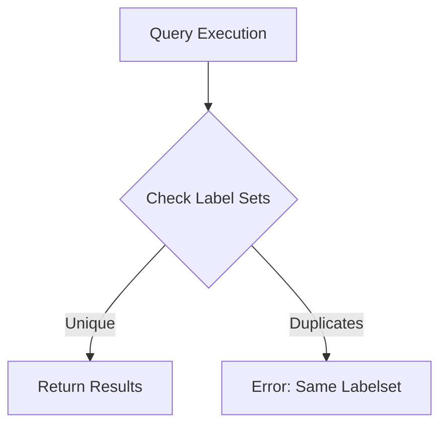

# How to Fix 'vector cannot contain metrics with same labelset' Errors

Author: [nawazdhandala](https://www.github.com/nawazdhandala)

Tags: Prometheus, PromQL, Debugging, Metrics, Monitoring, Errors

Description: Learn how to diagnose and fix the common Prometheus error 'vector cannot contain metrics with the same labelset'. This guide explains why duplicate label sets occur and provides practical solutions for recording rules, aggregations, and metric relabeling.

The error "vector cannot contain metrics with the same labelset" is one of the most common and frustrating issues when working with Prometheus. It occurs when a query or recording rule produces multiple time series with identical label combinations. This guide explains why this happens and how to fix it.

## Understanding the Error

Prometheus requires that every time series in a result vector has a unique label set. When two or more series share the exact same labels, Prometheus cannot distinguish between them and throws this error.



The error typically appears in:
- Recording rules
- Alerting rules
- Grafana panel queries
- API query responses

## Common Causes and Solutions

### Cause 1: Multiple Scrape Targets with Same Labels

When multiple Prometheus scrape jobs produce metrics with the same name and labels:

```yaml
# Problem: Two jobs scraping the same metric
scrape_configs:
  - job_name: 'app-primary'
    static_configs:
      - targets: ['app:8080']
  - job_name: 'app-secondary'
    static_configs:
      - targets: ['app:8080']
```

Both jobs scrape `http_requests_total` from the same target, creating duplicates.

**Solution**: Add distinguishing labels or consolidate jobs:

```yaml
# Option 1: Add distinguishing labels
scrape_configs:
  - job_name: 'app-primary'
    static_configs:
      - targets: ['app:8080']
        labels:
          cluster: 'primary'
  - job_name: 'app-secondary'
    static_configs:
      - targets: ['app:8080']
        labels:
          cluster: 'secondary'

# Option 2: Consolidate into one job
scrape_configs:
  - job_name: 'app'
    static_configs:
      - targets: ['app:8080']
```

### Cause 2: Aggregation Losing Distinguishing Labels

When aggregating, if you drop labels that distinguish series:

```promql
# Problem: If multiple instances exist per job
sum(http_requests_total) by (job)
```

If two instances have the same `job` label but different `instance` labels, and both have the same other labels, this works. But if they truly have identical labels after aggregation, you get duplicates.

**Solution**: Include all necessary distinguishing labels:

```promql
# Include instance to maintain uniqueness
sum(http_requests_total) by (job, instance)

# Or use without() to explicitly drop specific labels
sum(http_requests_total) without (path, status)
```

### Cause 3: Recording Rules Creating Duplicates

Recording rules that join metrics can create duplicates:

```yaml
# Problem: Join produces duplicates
groups:
  - name: example
    rules:
      - record: job:request_rate:sum
        expr: |
          sum(rate(http_requests_total[5m])) by (job)
          +
          sum(rate(http_requests_total[5m])) by (job)
```

**Solution**: Ensure unique label combinations:

```yaml
groups:
  - name: example
    rules:
      - record: job:request_rate:sum
        expr: |
          sum(rate(http_requests_total[5m])) by (job, instance)
```

### Cause 4: Federation Pulling Duplicate Metrics

When federating from multiple Prometheus servers:

```yaml
# Problem: Both servers have metrics with same labels
scrape_configs:
  - job_name: 'federation'
    honor_labels: true
    static_configs:
      - targets: ['prometheus-1:9090', 'prometheus-2:9090']
```

**Solution**: Add external labels to distinguish sources:

```yaml
# On prometheus-1
global:
  external_labels:
    prometheus: 'prometheus-1'

# On prometheus-2
global:
  external_labels:
    prometheus: 'prometheus-2'
```

Or use relabeling during federation:

```yaml
scrape_configs:
  - job_name: 'federation-1'
    static_configs:
      - targets: ['prometheus-1:9090']
    relabel_configs:
      - target_label: source_prometheus
        replacement: 'prometheus-1'
```

### Cause 5: Metric Relabeling Removing Distinguishing Labels

Aggressive relabeling can strip necessary labels:

```yaml
# Problem: Dropping labels that distinguish series
metric_relabel_configs:
  - regex: 'instance|pod|container'
    action: labeldrop
```

**Solution**: Keep at least one distinguishing label:

```yaml
metric_relabel_configs:
  - regex: 'pod|container'
    action: labeldrop
  # Keep instance to maintain uniqueness
```

## Debugging Techniques

### Find Duplicate Label Sets

Query to identify metrics with duplicate labels:

```promql
# Count series per label set - values > 1 indicate duplicates
count(http_requests_total) by (job, instance, path) > 1
```

### Check for Duplicate Targets

```promql
# Find targets being scraped multiple times
count(up) by (instance) > 1
```

### Inspect Recording Rule Output

Before creating a recording rule, test the expression:

```promql
# Run the expression manually
sum(rate(http_requests_total[5m])) by (job)

# Check for unique label combinations
count(sum(rate(http_requests_total[5m])) by (job)) by (job) > 1
```

### Use Label Inspection

```promql
# See all label combinations for a metric
group(http_requests_total) by (job, instance, path, status)
```

## Prevention Strategies

### Strategy 1: Consistent Labeling Standards

Establish labeling conventions that ensure uniqueness:

```yaml
# Always include these base labels
relabel_configs:
  - source_labels: [__address__]
    target_label: instance
  - source_labels: [__meta_kubernetes_namespace]
    target_label: namespace
  - source_labels: [__meta_kubernetes_pod_name]
    target_label: pod
```

### Strategy 2: Explicit Aggregation Labels

Always be explicit about which labels to keep:

```promql
# Bad: Implicit label selection
sum(rate(requests[5m]))

# Good: Explicit label selection
sum(rate(requests[5m])) by (service, instance, method)
```

### Strategy 3: Validation in CI/CD

Add validation to check for potential duplicates before deploying rules:

```bash
#!/bin/bash
# validate-rules.sh

# Check each recording rule for potential duplicates
for rule_file in rules/*.yaml; do
  promtool check rules "$rule_file"

  # Test expressions against a Prometheus instance
  while IFS= read -r expr; do
    result=$(curl -s "http://prometheus:9090/api/v1/query?query=$expr" | jq '.status')
    if [ "$result" != '"success"' ]; then
      echo "Rule expression failed: $expr"
      exit 1
    fi
  done < <(yq e '.groups[].rules[].expr' "$rule_file")
done
```

### Strategy 4: Recording Rule Best Practices

Follow naming conventions that prevent collisions:

```yaml
groups:
  - name: aggregated_metrics
    rules:
      # Level:metric:aggregation format
      - record: instance:http_requests:rate5m
        expr: rate(http_requests_total[5m])

      - record: job:http_requests:rate5m
        expr: sum without(instance) (instance:http_requests:rate5m)
```

## Handling Edge Cases

### Time-Based Duplicates

When metrics appear duplicated due to timing:

```promql
# Use max_over_time to handle slight timing differences
max_over_time(http_requests_total[1m])
```

### Multiple Exporters Same Data

When the same data comes from multiple exporters:

```promql
# Deduplicate by taking max
max(node_cpu_seconds_total) by (cpu, mode, instance)
```

### Duplicate Series from Restarts

Pod restarts can cause temporary duplicates:

```promql
# Use last_over_time to pick most recent
last_over_time(container_cpu_usage_seconds_total[5m])
```

## Common Scenarios and Fixes

### Kubernetes Metrics

```promql
# Problem: kube-state-metrics running as multiple replicas
sum(kube_pod_info) by (namespace, pod)

# Solution: Deduplicate first
max(kube_pod_info) by (namespace, pod, node)
```

### Application Metrics with Sidecars

```promql
# Problem: Main container and sidecar both expose metrics
sum(app_requests_total) by (pod)

# Solution: Filter to specific container
sum(app_requests_total{container="main"}) by (pod)
```

### Federated Metrics

```promql
# Problem: Same metric federated from multiple Prometheus instances
sum(federated_metric) by (job)

# Solution: Include source label in aggregation
sum(federated_metric) by (job, prometheus)
```

## Conclusion

The "vector cannot contain metrics with same labelset" error always indicates a labeling problem - either labels are too similar across different sources, or aggregations are dropping distinguishing labels. The key steps to resolve it are:

1. **Identify the duplicate** - Find which series share labels
2. **Determine the source** - Check scrape configs, federation, or aggregations
3. **Add distinguishing labels** - Either at scrape time or in queries
4. **Validate changes** - Test queries before deploying rules

By following consistent labeling practices and being explicit about aggregation labels, you can prevent most duplicate labelset issues before they occur.
