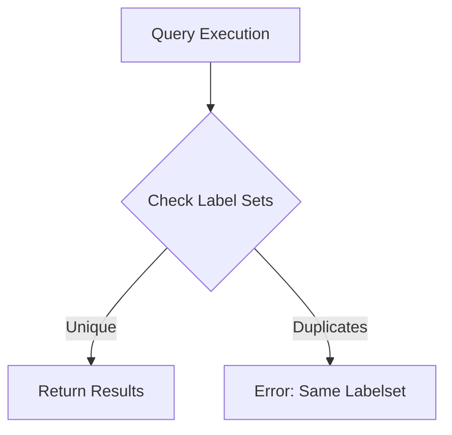

# How to Fix 'vector cannot contain metrics with same labelset' Errors

Author: [nawazdhandala](https://www.github.com/nawazdhandala)

Tags: Prometheus, PromQL, Debugging, Metric, Monitoring, Error

Description: Learn how to diagnose and fix the common Prometheus error 'vector cannot contain metrics with the same labelset'.

The error "vector cannot contain metrics with the same labelset" is one of the most common and frustrating issues when working with Prometheus. It occurs when a query, recording rule, or alerting rule produces multiple output time series with identical label combinations after PromQL has applied functions, operators, or rule labels. This guide explains why this happens and how to fix it.

## Understanding the Error

Prometheus requires that every time series in a result vector has a unique label set. When two or more series share the exact same labels, Prometheus cannot distinguish between them and throws this error.


```mermaid
graph TD
    A[Query Execution] --> B{Check Label Sets}
    B -->|Unique| C[Return Results]
    B -->|Duplicates| D[Error: Same Labelset]
```

The error typically appears in:
- Recording rules
- Alerting rules
- Grafana panel queries
- API query responses

## Common Causes and Solutions

### Cause 1: Functions Removing the Metric Name

When a function such as `rate()` is applied to multiple metric names that otherwise have the same labels, the result no longer has the original metric name to distinguish the series:

```promql
# Problem: The metric name is the only distinguishing label
rate({__name__=~"http_requests_total|http_errors_total"}[5m])
```

If `http_requests_total` and `http_errors_total` have the same labels, both results can collapse to the same label set after `rate()` removes the metric name.

**Solution**: Query each metric separately, aggregate by a distinguishing label, or copy the metric name into a regular label before applying the operation:

```promql
# Option 1: Query each metric separately
rate(http_requests_total[5m])
rate(http_errors_total[5m])

# Option 2: Preserve the original name in a regular label for instant-vector operations
label_replace(
  {__name__=~"http_requests_total|http_errors_total"},
  "metric",
  "$1",
  "__name__",
  "(.+)"
)
```

### Cause 2: Binary Operators Dropping the Metric Name

Arithmetic binary operators involving vectors drop the metric name. If the metric name was the only distinguishing label, the output can contain duplicates:

```promql
# Problem: Two metrics have the same non-name labels
{__name__=~"memory_used_bytes|memory_limit_bytes"} / 1024 / 1024
```

If `memory_used_bytes` and `memory_limit_bytes` differ only by metric name, division by a scalar drops that name and leaves duplicate label sets.

**Solution**: Preserve a distinguishing label or query one metric at a time:

```promql
# Copy the metric name into a regular label before the operation
label_replace(
  {__name__=~"memory_used_bytes|memory_limit_bytes"},
  "metric",
  "$1",
  "__name__",
  "(.+)"
) / 1024 / 1024

# Or select one metric at a time
memory_used_bytes / 1024 / 1024
```

### Cause 3: Recording Rule Labels Creating Duplicates

Recording rule labels overwrite labels on every series produced by the expression. If the overwritten labels were distinguishing the output, the rule can create duplicates:

```yaml
# Problem: The rule label overwrites the service label
groups:
  - name: example
    rules:
      - record: job:request_rate:sum
        labels:
          service: api
        expr: |
          sum(rate(http_requests_total[5m])) by (job, service)
```

If the expression returns both `service="frontend"` and `service="backend"` for the same `job`, the rule overwrites both to `service="api"`.

**Solution**: Do not overwrite distinguishing labels, or keep another label that remains unique:

```yaml
groups:
  - name: example
    rules:
      - record: job:request_rate:sum
        expr: |
          sum(rate(http_requests_total[5m])) by (job, service)
```

### Cause 4: Federation Pulling Duplicate Metrics

When federating from multiple Prometheus servers, the destination Prometheus scrapes the `/federate` endpoint and normally uses `honor_labels: true` so source labels are preserved:

```yaml
# Problem: Both servers have metrics with same labels
scrape_configs:
  - job_name: 'federation'
    honor_labels: true
    metrics_path: '/federate'
    params:
      'match[]':
        - '{job="api"}'
    static_configs:
      - targets: ['prometheus-1:9090', 'prometheus-2:9090']
```

**Solution**: Add external labels to distinguish sources:

```yaml
# On prometheus-1
global:
  external_labels:
    prometheus: 'prometheus-1'

# On prometheus-2
global:
  external_labels:
    prometheus: 'prometheus-2'
```

Or use relabeling during federation:

```yaml
scrape_configs:
  - job_name: 'federation-1'
    honor_labels: true
    metrics_path: '/federate'
    params:
      'match[]':
        - '{job="api"}'
    static_configs:
      - targets: ['prometheus-1:9090']
    relabel_configs:
      - target_label: source_prometheus
        replacement: 'prometheus-1'
```

### Cause 5: Metric Relabeling Removing Distinguishing Labels

Aggressive relabeling can strip necessary labels:

```yaml
# Problem: Dropping labels that distinguish series
metric_relabel_configs:
  - regex: 'instance|pod|container'
    action: labeldrop
```

**Solution**: Keep at least one distinguishing label:

```yaml
metric_relabel_configs:
  - regex: 'pod|container'
    action: labeldrop
  # Keep instance to maintain uniqueness
```

## Debugging Techniques

### Find Duplicate Label Sets

Query to identify metrics with duplicate labels:

```promql
# Count series that would collide if the metric name were removed
count by (job, instance, path, status) ({__name__=~"http_requests_total|http_errors_total"}) > 1
```

### Check for Duplicate Targets

```promql
# Find targets being scraped multiple times
count(up) by (instance) > 1
```

### Inspect Recording Rule Output

Before creating a recording rule, test the expression:

```promql
# Run the expression manually
sum(rate(http_requests_total[5m])) by (job)

# Check whether rule labels would collapse existing labels
count by (job) (sum(rate(http_requests_total[5m])) by (job, service)) > 1
```

### Use Label Inspection

```promql
# See all label combinations for a metric
group(http_requests_total) by (job, instance, path, status)
```

## Prevention Strategies

### Strategy 1: Consistent Labeling Standards

Establish labeling conventions that ensure uniqueness:

```yaml
# Always include these base labels
relabel_configs:
  - source_labels: [__address__]
    target_label: instance
  - source_labels: [__meta_kubernetes_namespace]
    target_label: namespace
  - source_labels: [__meta_kubernetes_pod_name]
    target_label: pod
```

### Strategy 2: Explicit Aggregation Labels

Always be explicit about which labels to keep:

```promql
# Bad: Implicit label selection
sum(rate(requests[5m]))

# Good: Explicit label selection
sum(rate(requests[5m])) by (service, instance, method)
```

### Strategy 3: Validation in CI/CD

Add validation to check for potential duplicates before deploying rules:

```bash
#!/bin/bash
# validate-rules.sh

# Check each recording rule for potential duplicates
for rule_file in rules/*.yaml; do
  promtool check rules "$rule_file"

  # Test expressions against a Prometheus instance
  while IFS= read -r expr; do
    result=$(curl -G -s "http://prometheus:9090/api/v1/query" --data-urlencode "query=$expr" | jq -r '.status')
    if [ "$result" != "success" ]; then
      echo "Rule expression failed: $expr"
      exit 1
    fi
  done < <(yq e '.groups[].rules[].expr' "$rule_file")
done
```

### Strategy 4: Recording Rule Best Practices

Follow naming conventions that prevent collisions:

```yaml
groups:
  - name: aggregated_metrics
    rules:
      # Level:metric:aggregation format
      - record: instance:http_requests:rate5m
        expr: rate(http_requests_total[5m])

      - record: job:http_requests:rate5m
        expr: sum without(instance) (instance:http_requests:rate5m)
```

## Handling Edge Cases

### Range Functions Removing the Metric Name

Range functions can also remove the metric name, so applying them to multiple metric names with identical non-name labels can produce duplicate outputs:

```promql
# Query each metric separately, or preserve the metric name in a regular label first
max_over_time(http_requests_total[1m])
```

### Multiple Exporters Same Data

When the same data comes from multiple exporters:

```promql
# Deduplicate by taking max
max(node_cpu_seconds_total) by (cpu, mode, instance)
```

### Duplicate Series from Restarts or Replica Changes

Pod restarts or replica changes usually create different `pod`, `container`, or `instance` labels rather than identical Prometheus series. Aggregate or filter on the labels that describe the data you want:

```promql
# Aggregate across changing pod names only when that matches your intent
sum without (pod) (rate(container_cpu_usage_seconds_total[5m]))
```

## Common Scenarios and Fixes

### Kubernetes Metrics

```promql
# Problem: kube-state-metrics running as multiple replicas
sum(kube_pod_info) by (namespace, pod)

# Solution: Deduplicate first
max(kube_pod_info) by (namespace, pod, node)
```

### Application Metrics with Sidecars

```promql
# Problem: Main container and sidecar both expose metrics
sum(app_requests_total) by (pod)

# Solution: Filter to specific container
sum(app_requests_total{container="main"}) by (pod)
```

### Federated Metrics

```promql
# Problem: Same metric federated from multiple Prometheus instances
sum(federated_metric) by (job)

# Solution: Include source label in aggregation
sum(federated_metric) by (job, prometheus)
```

## Conclusion

The "vector cannot contain metrics with same labelset" error always indicates a labeling problem - either labels are too similar across different sources, or PromQL operations or rule labels are removing distinguishing labels. The key steps to resolve it are:

1. **Identify the duplicate** - Find which series share labels
2. **Determine the source** - Check functions, binary operators, rule labels, scrape configs, federation, or aggregations
3. **Add distinguishing labels** - Either at scrape time or in queries
4. **Validate changes** - Test queries before deploying rules

By following consistent labeling practices and being explicit about aggregation labels, you can prevent most duplicate labelset issues before they occur.
