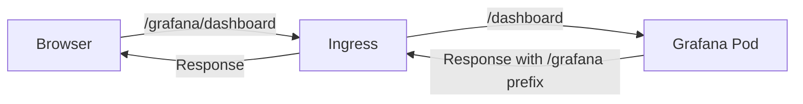

# How to Rewrite URLs for Grafana with Ingress

Author: [nawazdhandala](https://www.github.com/nawazdhandala)

Tags: Grafana, Kubernetes, Ingress, Nginx, URL Rewrite

Description: Learn how to configure Kubernetes Ingress URL rewrites for Grafana when serving from a subpath, including Nginx Ingress annotations and Grafana root_url configuration.

---

Running Grafana behind an Ingress controller at a subpath like `/grafana` requires URL rewriting. Without proper configuration, assets fail to load and redirects break. This guide covers the complete setup for Nginx Ingress and other controllers.

## Understanding the URL Rewrite Problem

When Grafana runs at a subpath, two issues arise: the Ingress must strip the prefix before forwarding, and Grafana must know its public URL for generating correct links.



## 1. Basic Nginx Ingress with Rewrite

Configure the Ingress to strip the `/grafana` prefix.

`grafana-ingress.yaml`

```yaml
apiVersion: networking.k8s.io/v1
kind: Ingress
metadata:
  name: grafana
  namespace: monitoring
  annotations:
    kubernetes.io/ingress.class: nginx
    nginx.ingress.kubernetes.io/rewrite-target: /$2
    nginx.ingress.kubernetes.io/use-regex: "true"
spec:
  rules:
    - host: monitoring.example.com
      http:
        paths:
          - path: /grafana(/|$)(.*)
            pathType: ImplementationSpecific
            backend:
              service:
                name: grafana
                port:
                  number: 80
```

The regex pattern `/grafana(/|$)(.*)` captures everything after `/grafana`, and `rewrite-target: /$2` forwards only that captured portion.

## 2. Configure Grafana root_url

Grafana must know its public URL to generate correct links for assets, redirects, and OAuth callbacks.

`grafana.ini`

```ini
[server]
# The full public URL including subpath
root_url = https://monitoring.example.com/grafana/

# Serve from subpath
serve_from_sub_path = true

# Optional: enforce HTTPS redirect
enforce_domain = false
```

For Kubernetes ConfigMap:

```yaml
apiVersion: v1
kind: ConfigMap
metadata:
  name: grafana-config
  namespace: monitoring
data:
  grafana.ini: |
    [server]
    root_url = https://monitoring.example.com/grafana/
    serve_from_sub_path = true
```

## 3. Helm Values Configuration

When deploying Grafana via Helm, set the root URL in values.

`values.yaml`

```yaml
grafana.ini:
  server:
    root_url: "https://monitoring.example.com/grafana/"
    serve_from_sub_path: true

ingress:
  enabled: true
  annotations:
    kubernetes.io/ingress.class: nginx
    nginx.ingress.kubernetes.io/rewrite-target: /$2
    nginx.ingress.kubernetes.io/use-regex: "true"
  hosts:
    - monitoring.example.com
  path: /grafana(/|$)(.*)
  pathType: ImplementationSpecific
```

## 4. Handle WebSocket Connections

Grafana Live uses WebSockets for real-time updates. Configure Ingress to support WebSocket upgrades.

```yaml
apiVersion: networking.k8s.io/v1
kind: Ingress
metadata:
  name: grafana
  namespace: monitoring
  annotations:
    kubernetes.io/ingress.class: nginx
    nginx.ingress.kubernetes.io/rewrite-target: /$2
    nginx.ingress.kubernetes.io/use-regex: "true"
    # WebSocket support
    nginx.ingress.kubernetes.io/proxy-read-timeout: "3600"
    nginx.ingress.kubernetes.io/proxy-send-timeout: "3600"
    nginx.ingress.kubernetes.io/connection-proxy-header: "keep-alive"
    nginx.ingress.kubernetes.io/upstream-hash-by: "$remote_addr"
spec:
  rules:
    - host: monitoring.example.com
      http:
        paths:
          - path: /grafana(/|$)(.*)
            pathType: ImplementationSpecific
            backend:
              service:
                name: grafana
                port:
                  number: 80
```

## 5. Separate Path for API Endpoints

For complex setups, create separate Ingress rules for API and UI paths.

```yaml
apiVersion: networking.k8s.io/v1
kind: Ingress
metadata:
  name: grafana-ui
  namespace: monitoring
  annotations:
    nginx.ingress.kubernetes.io/rewrite-target: /$2
    nginx.ingress.kubernetes.io/use-regex: "true"
spec:
  rules:
    - host: monitoring.example.com
      http:
        paths:
          - path: /grafana(/|$)(.*)
            pathType: ImplementationSpecific
            backend:
              service:
                name: grafana
                port:
                  number: 80
---
apiVersion: networking.k8s.io/v1
kind: Ingress
metadata:
  name: grafana-api
  namespace: monitoring
  annotations:
    nginx.ingress.kubernetes.io/rewrite-target: /api/$2
    nginx.ingress.kubernetes.io/use-regex: "true"
    # Higher timeout for datasource queries
    nginx.ingress.kubernetes.io/proxy-read-timeout: "300"
spec:
  rules:
    - host: monitoring.example.com
      http:
        paths:
          - path: /grafana/api(/|$)(.*)
            pathType: ImplementationSpecific
            backend:
              service:
                name: grafana
                port:
                  number: 80
```

## 6. TLS Configuration

Add TLS termination at the Ingress level.

```yaml
apiVersion: networking.k8s.io/v1
kind: Ingress
metadata:
  name: grafana
  namespace: monitoring
  annotations:
    kubernetes.io/ingress.class: nginx
    nginx.ingress.kubernetes.io/rewrite-target: /$2
    nginx.ingress.kubernetes.io/use-regex: "true"
    nginx.ingress.kubernetes.io/ssl-redirect: "true"
    cert-manager.io/cluster-issuer: letsencrypt-prod
spec:
  tls:
    - hosts:
        - monitoring.example.com
      secretName: grafana-tls
  rules:
    - host: monitoring.example.com
      http:
        paths:
          - path: /grafana(/|$)(.*)
            pathType: ImplementationSpecific
            backend:
              service:
                name: grafana
                port:
                  number: 80
```

## 7. Traefik Ingress Configuration

For Traefik Ingress controller, use middleware for path stripping.

`grafana-ingressroute.yaml`

```yaml
apiVersion: traefik.io/v1alpha1
kind: Middleware
metadata:
  name: strip-grafana-prefix
  namespace: monitoring
spec:
  stripPrefix:
    prefixes:
      - /grafana
---
apiVersion: traefik.io/v1alpha1
kind: IngressRoute
metadata:
  name: grafana
  namespace: monitoring
spec:
  entryPoints:
    - websecure
  routes:
    - match: Host(`monitoring.example.com`) && PathPrefix(`/grafana`)
      kind: Rule
      middlewares:
        - name: strip-grafana-prefix
      services:
        - name: grafana
          port: 80
  tls:
    secretName: grafana-tls
```

## 8. AWS ALB Ingress Configuration

For AWS Application Load Balancer Ingress controller.

```yaml
apiVersion: networking.k8s.io/v1
kind: Ingress
metadata:
  name: grafana
  namespace: monitoring
  annotations:
    kubernetes.io/ingress.class: alb
    alb.ingress.kubernetes.io/scheme: internet-facing
    alb.ingress.kubernetes.io/target-type: ip
    alb.ingress.kubernetes.io/listen-ports: '[{"HTTPS":443}]'
    alb.ingress.kubernetes.io/actions.grafana-redirect: |
      {
        "Type": "forward",
        "ForwardConfig": {
          "TargetGroups": [{
            "ServiceName": "grafana",
            "ServicePort": "80"
          }]
        }
      }
spec:
  rules:
    - host: monitoring.example.com
      http:
        paths:
          - path: /grafana
            pathType: Prefix
            backend:
              service:
                name: grafana-redirect
                port:
                  name: use-annotation
```

Note: AWS ALB does not support path rewriting natively. Either serve Grafana at root or use `serve_from_sub_path = true` without stripping the prefix.

## 9. Debug URL Rewrite Issues

Test the rewrite configuration step by step.

```bash
# Test Ingress directly
curl -v https://monitoring.example.com/grafana/api/health

# Check what Grafana receives
kubectl logs deployment/grafana -n monitoring | grep "Request"

# Verify root_url is set correctly
kubectl exec deployment/grafana -n monitoring -- cat /etc/grafana/grafana.ini | grep root_url

# Test asset loading
curl -I https://monitoring.example.com/grafana/public/build/grafana.dark.css
```

## 10. Fix Common Issues

### Assets Return 404

Ensure `serve_from_sub_path = true` is set and root_url ends with `/grafana/`.

```bash
# Verify the root_url setting
kubectl exec deployment/grafana -n monitoring -- \
  grafana-cli admin settings | grep root_url
```

### Login Redirects to Wrong URL

Check OAuth callback URL matches root_url.

```ini
[auth.generic_oauth]
auth_url = https://auth.example.com/oauth/authorize
token_url = https://auth.example.com/oauth/token
# Must match the Ingress path
redirect_uri = https://monitoring.example.com/grafana/login/generic_oauth
```

### WebSocket Connection Fails

Verify Ingress allows connection upgrades.

```yaml
annotations:
  nginx.ingress.kubernetes.io/proxy-http-version: "1.1"
  nginx.ingress.kubernetes.io/configuration-snippet: |
    proxy_set_header Upgrade $http_upgrade;
    proxy_set_header Connection "upgrade";
```

### Mixed Content Errors

Ensure Grafana knows it is behind HTTPS.

```ini
[server]
protocol = http
root_url = https://monitoring.example.com/grafana/
```

## 11. Multiple Grafana Instances

Route to different Grafana instances based on path.

```yaml
apiVersion: networking.k8s.io/v1
kind: Ingress
metadata:
  name: grafana-multi
  namespace: monitoring
  annotations:
    nginx.ingress.kubernetes.io/use-regex: "true"
spec:
  rules:
    - host: monitoring.example.com
      http:
        paths:
          - path: /grafana-prod(/|$)(.*)
            pathType: ImplementationSpecific
            backend:
              service:
                name: grafana-prod
                port:
                  number: 80
          - path: /grafana-dev(/|$)(.*)
            pathType: ImplementationSpecific
            backend:
              service:
                name: grafana-dev
                port:
                  number: 80
```

## 12. Complete Working Example

Full deployment with all components configured.

```yaml
---
apiVersion: v1
kind: ConfigMap
metadata:
  name: grafana-config
  namespace: monitoring
data:
  grafana.ini: |
    [server]
    root_url = https://monitoring.example.com/grafana/
    serve_from_sub_path = true
    [security]
    admin_user = admin
---
apiVersion: apps/v1
kind: Deployment
metadata:
  name: grafana
  namespace: monitoring
spec:
  replicas: 1
  selector:
    matchLabels:
      app: grafana
  template:
    metadata:
      labels:
        app: grafana
    spec:
      containers:
        - name: grafana
          image: grafana/grafana:latest
          ports:
            - containerPort: 3000
          volumeMounts:
            - name: config
              mountPath: /etc/grafana/grafana.ini
              subPath: grafana.ini
      volumes:
        - name: config
          configMap:
            name: grafana-config
---
apiVersion: v1
kind: Service
metadata:
  name: grafana
  namespace: monitoring
spec:
  selector:
    app: grafana
  ports:
    - port: 80
      targetPort: 3000
---
apiVersion: networking.k8s.io/v1
kind: Ingress
metadata:
  name: grafana
  namespace: monitoring
  annotations:
    nginx.ingress.kubernetes.io/rewrite-target: /$2
    nginx.ingress.kubernetes.io/use-regex: "true"
    nginx.ingress.kubernetes.io/proxy-read-timeout: "3600"
spec:
  tls:
    - hosts:
        - monitoring.example.com
      secretName: grafana-tls
  rules:
    - host: monitoring.example.com
      http:
        paths:
          - path: /grafana(/|$)(.*)
            pathType: ImplementationSpecific
            backend:
              service:
                name: grafana
                port:
                  number: 80
```

---

URL rewriting for Grafana requires coordination between Ingress annotations and Grafana configuration. The key is ensuring the Ingress strips the prefix correctly while Grafana generates URLs with the prefix included. With both sides aligned, Grafana works seamlessly at any subpath.
