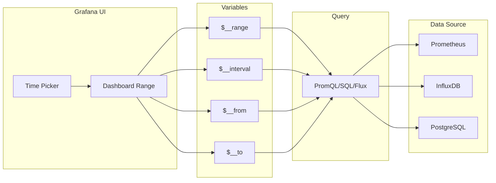
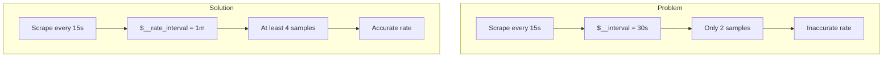

# How to Use Selected Time Period in Grafana Queries

Author: [nawazdhandala](https://www.github.com/nawazdhandala)

Tags: Grafana, PromQL, Queries, Time Range, Variables, Dashboard, Monitoring, Visualization

Description: Learn how to use Grafana's selected time period in your queries with $__range, $__interval, and other built-in variables. This guide covers dynamic time ranges for PromQL, InfluxDB, and other data sources.

---

Grafana dashboards let users select custom time ranges using the time picker. But how do you make your queries respect this selection dynamically? This guide explains Grafana's built-in time variables and how to use them effectively across different data sources.

---

## TL;DR

- Use `$__range` for the total selected time period duration
- Use `$__interval` for automatic resolution-based intervals
- Use `$__from` and `$__to` for absolute timestamps
- These variables work across PromQL, InfluxDB, SQL, and more
- Combine with `$__rate_interval` for accurate rate calculations

---

## Understanding Grafana Time Variables

Grafana provides several built-in variables that adapt to the user's time selection:

| Variable | Description | Example Value |
|----------|-------------|---------------|
| `$__range` | Duration of selected time range | `1h`, `24h`, `7d` |
| `$__range_s` | Range in seconds | `3600`, `86400` |
| `$__range_ms` | Range in milliseconds | `3600000` |
| `$__interval` | Suggested interval for aggregation | `1m`, `5m` |
| `$__interval_ms` | Interval in milliseconds | `60000` |
| `$__from` | Start timestamp (Unix ms) | `1640000000000` |
| `$__to` | End timestamp (Unix ms) | `1640086400000` |
| `$__rate_interval` | Safe interval for rate calculations | `1m` |

---

## Using $__range in PromQL

The `$__range` variable represents the entire selected time period:

```promql
# Calculate total requests over the selected time range
increase(http_requests_total[$__range])

# Average rate over the entire selected period
rate(http_requests_total[$__range])

# Sum of all errors in the selected window
sum(increase(http_errors_total[$__range]))
```

### Practical Example: Total vs Rate

```promql
# Total events in selected period
sum(increase(events_total[$__range]))

# Events per second averaged over selected period
sum(rate(events_total[$__range]))

# Events per minute
sum(rate(events_total[$__range])) * 60
```

---

## How Time Variables Flow Through Queries



---

## Using $__interval for Resolution

The `$__interval` variable automatically adjusts based on:

- The selected time range
- The panel width in pixels
- The data source's minimum interval setting

```promql
# Rate with automatic resolution
rate(http_requests_total[$__interval])

# Aggregated over automatic intervals
avg_over_time(cpu_usage[$__interval])

# Sum rate with proper grouping
sum(rate(http_requests_total[$__interval])) by (service)
```

### When to Use $__interval vs $__range

| Use Case | Variable | Example |
|----------|----------|---------|
| Time series graphs | `$__interval` | `rate(metric[$__interval])` |
| Single stat totals | `$__range` | `increase(metric[$__range])` |
| Summary calculations | `$__range` | `avg_over_time(metric[$__range])` |
| Alerting evaluations | Specific value | `rate(metric[5m])` |

---

## The $__rate_interval Variable

For rate calculations, `$__rate_interval` ensures accuracy by being at least 4x the scrape interval:

```promql
# Recommended for rate calculations
rate(http_requests_total[$__rate_interval])

# NOT recommended - may miss scrapes
rate(http_requests_total[$__interval])
```

### Why $__rate_interval Matters



Configure the minimum rate interval in your data source settings:

1. Go to Configuration > Data Sources
2. Select your Prometheus data source
3. Set "Scrape interval" to match your Prometheus config
4. Grafana calculates `$__rate_interval` as 4x this value

---

## Using Time Variables in Different Data Sources

### InfluxDB (Flux)

```flux
from(bucket: "metrics")
  |> range(start: v.timeRangeStart, stop: v.timeRangeStop)
  |> filter(fn: (r) => r._measurement == "cpu")
  |> aggregateWindow(every: v.windowPeriod, fn: mean)
```

### InfluxDB (InfluxQL)

```sql
SELECT mean("usage_idle")
FROM "cpu"
WHERE $timeFilter
GROUP BY time($__interval) fill(null)
```

### PostgreSQL/MySQL

```sql
SELECT
  $__timeGroup(time_column, $__interval) as time,
  avg(value) as value
FROM metrics
WHERE $__timeFilter(time_column)
GROUP BY 1
ORDER BY 1
```

### Elasticsearch

```json
{
  "query": {
    "range": {
      "@timestamp": {
        "gte": "$__from",
        "lte": "$__to"
      }
    }
  }
}
```

---

## Advanced Patterns

### Compare Current to Previous Period

```promql
# Current period requests
sum(increase(http_requests_total[$__range]))

# Previous period (use offset)
sum(increase(http_requests_total[$__range] offset $__range))
```

### Percentage Change Over Time

```promql
# Calculate percentage change from period start to end
(
  sum(rate(http_requests_total[$__interval]))
  -
  sum(rate(http_requests_total[$__interval] offset $__range))
)
/
sum(rate(http_requests_total[$__interval] offset $__range))
* 100
```

### Dynamic Lookback Windows

```promql
# Error rate over selected period
sum(rate(http_errors_total[$__range]))
/
sum(rate(http_requests_total[$__range]))

# Compare to baseline (3x the selected range)
# Note: This requires query manipulation in Grafana
```

---

## Panel Configuration Tips

### Stat Panel with Total

For showing totals in stat panels:

```promql
sum(increase(http_requests_total[$__range]))
```

Set the panel options:
- Calculation: Last (not average)
- Unit: Short or specific unit
- Decimals: As needed

### Time Series with Proper Resolution

```promql
sum(rate(http_requests_total[$__rate_interval])) by (service)
```

Panel settings:
- Connect null values: Always
- Line interpolation: Smooth or Linear

### Table with Time Buckets

```promql
sum(increase(http_requests_total[$__interval])) by (service, status)
```

Transform options:
- Add "Series to rows" transform
- Format time column appropriately

---

## Troubleshooting Common Issues

### Issue: Empty Data at Range Edges

When using `$__range`, data might appear missing:

```promql
# Problem: Last point might be partial
increase(metric[$__range])

# Solution: Use slightly larger range
increase(metric[$__range] @ end())
```

### Issue: Inconsistent Resolution

```promql
# Problem: Resolution changes with zoom
rate(metric[$__interval])

# Solution: Set minimum interval in panel settings
# Edit Panel > Query > Min interval: 1m
```

### Issue: Rate Spikes at Range Start

```promql
# Problem: First data point shows spike
rate(metric[5m])

# Solution: Use irate for instant rate or increase for totals
irate(metric[5m])
# or
increase(metric[$__range])
```

---

## Best Practices

1. **Use $__rate_interval for rates**: Prevents inaccurate calculations
2. **Use $__range for totals**: Shows cumulative values over selection
3. **Set appropriate min intervals**: Prevents too many data points
4. **Test with different ranges**: Verify queries work at 5m, 1h, 24h, 7d
5. **Document variable usage**: Help team members understand queries

---

## Conclusion

Grafana's time variables make dashboards dynamic and responsive to user selections:

- `$__range`: Use for totals and summaries over the full period
- `$__interval`: Use for time series with automatic resolution
- `$__rate_interval`: Use for accurate rate calculations
- `$__from` / `$__to`: Use when you need absolute timestamps

Master these variables to create dashboards that work seamlessly across any time range, from real-time monitoring to historical analysis.

---

*For more Grafana techniques, see our guides on histogram visualization and legend sorting.*
