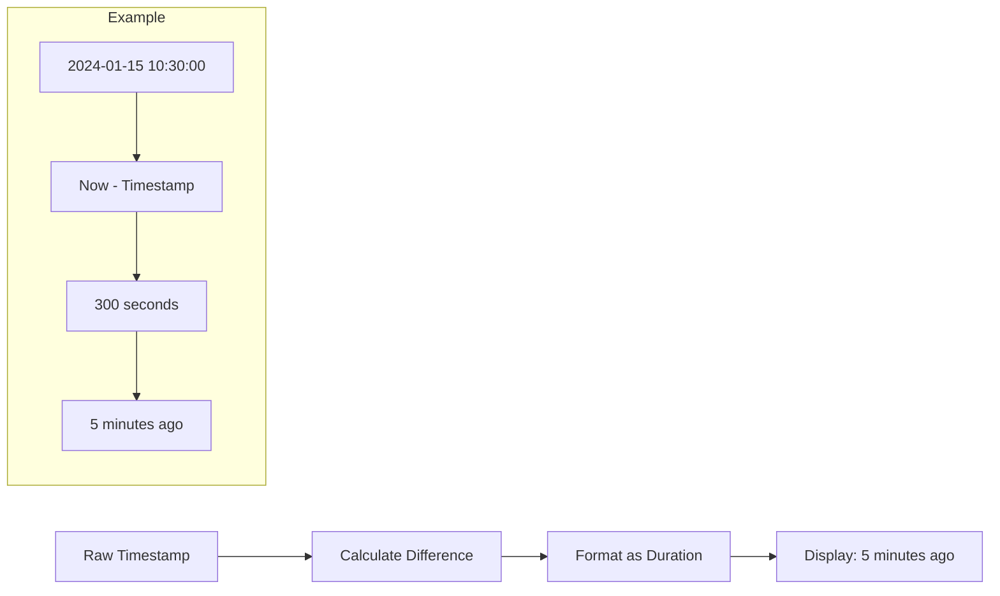

# How to Show "X Time Ago" in Grafana with InfluxDB

Author: [nawazdhandala](https://www.github.com/nawazdhandala)

Tags: Grafana, InfluxDB, Time, Dashboard, Visualization, Stat Panel, Value Mapping, Monitoring

Description: Learn how to display relative time like "5 minutes ago" or "2 hours ago" in Grafana panels with InfluxDB. This guide covers time calculations, value transformations, and formatting for human-readable timestamps.

---

Showing when something last happened - "5 minutes ago" rather than a raw timestamp - makes dashboards more intuitive. This guide shows you how to display relative time ("X time ago") in Grafana using InfluxDB data sources.

---

## TL;DR

- Calculate time difference between now and your timestamp
- Use Grafana's unit formatting with "From Now" option
- Apply value mappings for custom text
- Works with Stat, Table, and other panel types
- Use transforms for complex time calculations

---

## The Use Case

Common scenarios for "time ago" displays:

- Last successful backup
- Last deployment timestamp
- Last heartbeat from a service
- Last data sync
- Time since last error/incident



---

## Method 1: Using InfluxDB Time Calculations

### Flux Query (InfluxDB 2.x)

```flux
import "date"

// Get the last recorded timestamp
lastEvent = from(bucket: "mydata")
  |> range(start: -30d)
  |> filter(fn: (r) => r._measurement == "deployments")
  |> filter(fn: (r) => r._field == "timestamp")
  |> last()
  |> findRecord(fn: (key) => true, idx: 0)

// Calculate seconds since last event
from(bucket: "mydata")
  |> range(start: -1m)
  |> filter(fn: (r) => r._measurement == "deployments")
  |> last()
  |> map(fn: (r) => ({
      r with
      _value: float(v: uint(v: now()) - uint(v: r._time)) / 1000000000.0
  }))
```

### InfluxQL Query (InfluxDB 1.x)

```sql
-- Get the most recent timestamp
SELECT last("value") as "last_value", time as "last_time"
FROM "service_heartbeat"
WHERE time > now() - 7d
GROUP BY "service"
```

Then calculate the difference in Grafana.

---

## Method 2: Grafana Transformations

When your query returns a timestamp, use transforms to calculate the difference.

### Step 1: Query Returns Timestamp

```flux
from(bucket: "monitoring")
  |> range(start: -7d)
  |> filter(fn: (r) => r._measurement == "backup_status")
  |> filter(fn: (r) => r._field == "last_successful")
  |> last()
```

### Step 2: Add "Add field from calculation" Transform

1. Edit panel
2. Go to Transform tab
3. Add "Add field from calculation"
4. Mode: Binary operation
5. Operation: Subtract
6. Field A: Your timestamp field
7. Field B: Use "now()" or current time

### Step 3: Configure the Calculation

```json
{
  "transformations": [
    {
      "id": "calculateField",
      "options": {
        "mode": "binary",
        "reduce": {
          "reducer": "lastNotNull"
        },
        "binary": {
          "left": "_time",
          "operator": "-",
          "right": "$__now"
        },
        "alias": "time_ago"
      }
    }
  ]
}
```

---

## Method 3: Stat Panel with Duration Unit

The simplest approach for displaying "time ago":

### Query Setup

Return the difference in seconds:

```flux
import "date"

// Calculate seconds since last backup
lastBackup = from(bucket: "monitoring")
  |> range(start: -30d)
  |> filter(fn: (r) => r._measurement == "backup_jobs")
  |> filter(fn: (r) => r._field == "completed_at")
  |> last()

// Return seconds difference
lastBackup
  |> map(fn: (r) => ({
      _time: r._time,
      _value: float(v: int(v: now()) - int(v: r._time)) / 1000000000.0
  }))
```

### Panel Configuration

```json
{
  "type": "stat",
  "title": "Last Backup",
  "fieldConfig": {
    "defaults": {
      "unit": "dtdurations",
      "mappings": [],
      "thresholds": {
        "mode": "absolute",
        "steps": [
          { "value": null, "color": "green" },
          { "value": 3600, "color": "yellow" },
          { "value": 86400, "color": "red" }
        ]
      }
    }
  },
  "options": {
    "textMode": "value",
    "colorMode": "value",
    "graphMode": "none"
  }
}
```

---

## Unit Options for Time Display

Grafana provides several duration units:

| Unit | Code | Example Output |
|------|------|----------------|
| Duration (ms) | `dtdurationms` | `5m 30s` |
| Duration (s) | `dtdurations` | `5m 30s` |
| From Now | `dateTimeFromNow` | `5 minutes ago` |
| Time (ISO) | `dateTimeAsIso` | `2024-01-15 10:30:00` |

### Using "From Now" Format

For true "X time ago" display:

```json
{
  "fieldConfig": {
    "defaults": {
      "unit": "dateTimeFromNow"
    }
  }
}
```

This expects a Unix timestamp (milliseconds) and displays relative time.

---

## Complete Example: Last Deployment Time

### Flux Query

```flux
// Query last deployment timestamp
from(bucket: "cicd")
  |> range(start: -30d)
  |> filter(fn: (r) => r._measurement == "deployments")
  |> filter(fn: (r) => r._field == "timestamp")
  |> filter(fn: (r) => r.environment == "production")
  |> last()
  |> map(fn: (r) => ({
      _time: r._time,
      _field: "last_deploy",
      _value: int(v: r._time) / 1000000  // Convert to milliseconds
  }))
```

### Panel JSON

```json
{
  "type": "stat",
  "title": "Last Production Deployment",
  "targets": [
    {
      "query": "/* flux query above */"
    }
  ],
  "fieldConfig": {
    "defaults": {
      "unit": "dateTimeFromNow",
      "color": {
        "mode": "thresholds"
      },
      "thresholds": {
        "mode": "absolute",
        "steps": [
          { "value": null, "color": "green" }
        ]
      }
    }
  },
  "options": {
    "reduceOptions": {
      "values": false,
      "calcs": ["lastNotNull"],
      "fields": ""
    },
    "orientation": "horizontal",
    "textMode": "auto",
    "colorMode": "value",
    "graphMode": "none"
  }
}
```

---

## Value Mappings for Custom Text

Add descriptive text with value mappings:

```json
{
  "fieldConfig": {
    "defaults": {
      "unit": "dtdurations",
      "mappings": [
        {
          "type": "range",
          "options": {
            "from": 0,
            "to": 60,
            "result": {
              "text": "Just now",
              "color": "green"
            }
          }
        },
        {
          "type": "range",
          "options": {
            "from": 60,
            "to": 300,
            "result": {
              "text": "A few minutes ago",
              "color": "green"
            }
          }
        },
        {
          "type": "range",
          "options": {
            "from": 300,
            "to": 3600,
            "result": {
              "text": "${__value.text}",
              "color": "yellow"
            }
          }
        },
        {
          "type": "range",
          "options": {
            "from": 86400,
            "to": null,
            "result": {
              "text": "Over a day ago - CHECK!",
              "color": "red"
            }
          }
        }
      ]
    }
  }
}
```

---

## Table Panel with Multiple "Time Ago" Values

Display multiple services with their last seen times:

### Query

```flux
from(bucket: "monitoring")
  |> range(start: -7d)
  |> filter(fn: (r) => r._measurement == "heartbeat")
  |> filter(fn: (r) => r._field == "timestamp")
  |> group(columns: ["service"])
  |> last()
  |> map(fn: (r) => ({
      service: r.service,
      last_seen_ms: int(v: r._time) / 1000000
  }))
```

### Table Configuration

```json
{
  "type": "table",
  "title": "Service Health",
  "fieldConfig": {
    "overrides": [
      {
        "matcher": {
          "id": "byName",
          "options": "last_seen_ms"
        },
        "properties": [
          {
            "id": "unit",
            "value": "dateTimeFromNow"
          },
          {
            "id": "displayName",
            "value": "Last Seen"
          }
        ]
      }
    ]
  }
}
```

---

## Handling Missing Data

When no data exists in the time range:

### Add Default Value

```flux
import "array"

data = from(bucket: "monitoring")
  |> range(start: -30d)
  |> filter(fn: (r) => r._measurement == "backup")
  |> last()

// Return "Never" if no data
if exists data._value then
  data
else
  array.from(rows: [{_value: -1, _time: time(v: 0)}])
```

### Value Mapping for "Never"

```json
{
  "mappings": [
    {
      "type": "value",
      "options": {
        "-1": {
          "text": "Never",
          "color": "red"
        }
      }
    }
  ]
}
```

---

## Alert on Stale Data

Create alerts when "time ago" exceeds threshold:

### Grafana Alert Rule

```yaml
# Alert when backup is more than 24 hours old
groups:
  - name: backup_alerts
    rules:
      - alert: StaleBackup
        expr: |
          (time() * 1000) - last_backup_timestamp_ms > 86400000
        for: 5m
        labels:
          severity: warning
        annotations:
          summary: "Backup is stale"
          description: "Last backup was more than 24 hours ago"
```

---

## Tips for Different Time Scales

### For Short Durations (seconds to minutes)

```json
{
  "unit": "dtdurations",
  "decimals": 0
}
```

### For Medium Durations (minutes to hours)

```json
{
  "unit": "dateTimeFromNow"
}
```

### For Long Durations (days to weeks)

```json
{
  "unit": "dtdurations",
  "mappings": [
    {
      "type": "range",
      "options": {
        "from": 604800,
        "to": null,
        "result": {
          "text": "Over a week ago"
        }
      }
    }
  ]
}
```

---

## Conclusion

Displaying "X time ago" in Grafana with InfluxDB involves:

- **Query-level calculations**: Compute time difference in Flux or InfluxQL
- **Grafana transformations**: Calculate differences from timestamps
- **Unit formatting**: Use `dateTimeFromNow` for relative time display
- **Value mappings**: Add custom text for specific ranges

This pattern makes dashboards more intuitive by showing relative times instead of raw timestamps - helping users quickly understand how recent or stale data is.

---

*For more Grafana visualization techniques, see our guides on histogram visualization and legend sorting.*
