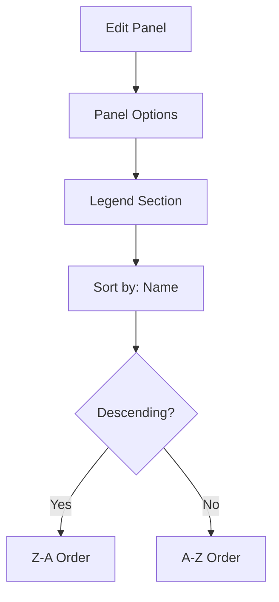

# How to Sort Legends by Series Name in Grafana

Author: [nawazdhandala](https://www.github.com/nawazdhandala)

Tags: Grafana, Dashboard, Visualization, Legend, Sorting, UI, Monitoring, Time Series

Description: Learn how to sort legends alphabetically by series name in Grafana panels. This guide covers legend configuration options, sorting by different criteria, and customizing legend display for better dashboard usability.

---

Grafana legends help identify what each line or bar represents in your visualizations. By default, legends may appear in the order data is returned, which can be confusing. This guide shows you how to sort legends by series name and other useful criteria.

---

## TL;DR

- Use "Sort by: Name" in legend options for alphabetical sorting
- Enable "Sort descending" to reverse the order
- Use transforms for complex sorting requirements
- Configure via panel options or override settings
- Legend placement affects readability on different screen sizes

---

## Legend Configuration Basics

Access legend settings through:

1. Edit panel
2. Go to the right sidebar
3. Find "Legend" section under panel options

### Basic Legend Options

| Option | Description |
|--------|-------------|
| Visibility | Show or hide the legend |
| Mode | List, Table, or Hidden |
| Placement | Bottom or Right |
| Width | Fixed width for right placement |
| Values | Show min, max, mean, total, etc. |

---

## Sorting by Series Name

### Method 1: Panel Legend Options

For time series panels:

1. Edit your panel
2. Open Panel options - Legend
3. Find "Sort by" dropdown
4. Select "Name"
5. Toggle "Sort descending" if needed



### Method 2: Via JSON Model

Edit the panel JSON directly:

```json
{
  "options": {
    "legend": {
      "displayMode": "list",
      "placement": "bottom",
      "showLegend": true,
      "sortBy": "Name",
      "sortDesc": false
    }
  }
}
```

---

## Sorting Options Explained

### Sort by Name

Alphabetically sorts legend entries:

```
Before sorting:
- web-server-3
- api-gateway
- web-server-1
- database

After sorting (ascending):
- api-gateway
- database
- web-server-1
- web-server-3
```

### Sort by Value

Sorts by the currently displayed value (if values are shown):

```json
{
  "legend": {
    "sortBy": "Last",
    "sortDesc": true
  }
}
```

Available value sorts:
- Last: Most recent value
- Min: Minimum value
- Max: Maximum value
- Mean: Average value
- Total: Sum of all values

### Sort by Custom Field

With table legend mode, sort by any displayed field:

```json
{
  "legend": {
    "displayMode": "table",
    "sortBy": "Max",
    "sortDesc": true,
    "calcs": ["last", "min", "max", "mean"]
  }
}
```

---

## Table Legend Mode for Rich Sorting

Table mode provides more sorting flexibility:

### Configuration

```json
{
  "options": {
    "legend": {
      "displayMode": "table",
      "placement": "right",
      "showLegend": true,
      "sortBy": "Name",
      "sortDesc": false,
      "calcs": [
        "lastNotNull",
        "min",
        "max",
        "mean"
      ]
    }
  }
}
```

### Resulting Table Legend

```
| Series        | Last  | Min   | Max   | Mean  |
|---------------|-------|-------|-------|-------|
| api-gateway   | 45ms  | 12ms  | 120ms | 38ms  |
| database      | 23ms  | 8ms   | 89ms  | 31ms  |
| web-server-1  | 67ms  | 15ms  | 234ms | 52ms  |
| web-server-3  | 89ms  | 22ms  | 301ms | 78ms  |
```

Click column headers to sort by that column interactively.

---

## Using Transforms for Advanced Sorting

When panel options are insufficient, use transforms:

### Sort Transform

1. Edit panel
2. Go to Transform tab
3. Add "Sort by" transform
4. Configure field and order

```json
{
  "transformations": [
    {
      "id": "sortBy",
      "options": {
        "fields": {},
        "sort": [
          {
            "field": "Time",
            "desc": false
          }
        ]
      }
    }
  ]
}
```

### Organize Fields Transform

Reorder series manually:

```json
{
  "transformations": [
    {
      "id": "organize",
      "options": {
        "indexByName": {
          "api-gateway": 0,
          "database": 1,
          "web-server-1": 2,
          "web-server-3": 3
        }
      }
    }
  ]
}
```

---

## Query-Level Sorting

Control sort order in your query:

### PromQL with sort

```promql
# Sort results ascending by value
sort(sum(rate(http_requests_total[5m])) by (service))

# Sort results descending by value
sort_desc(sum(rate(http_requests_total[5m])) by (service))
```

### PromQL with topk/bottomk

```promql
# Top 10 services by request rate
topk(10, sum(rate(http_requests_total[5m])) by (service))

# Bottom 10 services
bottomk(10, sum(rate(http_requests_total[5m])) by (service))
```

---

## Legend Naming with Series Override

Customize how series names appear in legends:

### Using Legend Format

In your query:

```promql
# Query
sum(rate(http_requests_total[5m])) by (service, environment)

# Legend format
{{service}} - {{environment}}
```

### Using Field Override

1. Go to Overrides tab
2. Add field override
3. Select "Fields with name matching regex"
4. Set display name

```json
{
  "overrides": [
    {
      "matcher": {
        "id": "byRegexp",
        "options": "/.*service=\"([^\"]+)\".*/"
      },
      "properties": [
        {
          "id": "displayName",
          "value": "$1"
        }
      ]
    }
  ]
}
```

---

## Complete Panel Configuration Example

Here is a complete time series panel with sorted legends:

```json
{
  "type": "timeseries",
  "title": "Service Request Latency",
  "targets": [
    {
      "expr": "histogram_quantile(0.95, sum(rate(http_request_duration_seconds_bucket[$__rate_interval])) by (le, service))",
      "legendFormat": "{{service}}"
    }
  ],
  "options": {
    "legend": {
      "displayMode": "table",
      "placement": "right",
      "showLegend": true,
      "sortBy": "Name",
      "sortDesc": false,
      "calcs": [
        "lastNotNull",
        "mean",
        "max"
      ],
      "width": 300
    },
    "tooltip": {
      "mode": "multi",
      "sort": "desc"
    }
  },
  "fieldConfig": {
    "defaults": {
      "unit": "s"
    }
  }
}
```

---

## Tooltip Sorting

Tooltips can also be sorted when hovering:

```json
{
  "options": {
    "tooltip": {
      "mode": "multi",
      "sort": "desc"
    }
  }
}
```

Tooltip sort options:
- `none`: Order from query
- `asc`: Ascending by value
- `desc`: Descending by value

---

## Best Practices

### 1. Match Sorting to Use Case

| Use Case | Recommended Sort |
|----------|-----------------|
| Comparing named services | Sort by Name |
| Finding top contributors | Sort by Max (desc) |
| Identifying problems | Sort by Last (desc) |
| Capacity planning | Sort by Mean (desc) |

### 2. Use Consistent Naming

Name your series consistently for predictable sorting:

```promql
# Good: Consistent prefix
legendFormat: "svc-{{service}}"
# Results: svc-api, svc-auth, svc-web

# Avoid: Inconsistent naming
legendFormat: "{{service}}"
# Results: API Gateway, auth-service, Web
```

### 3. Consider Legend Placement

```json
{
  "legend": {
    // For many series, use right placement
    "placement": "right",
    "width": 250,

    // For few series, bottom works well
    "placement": "bottom"
  }
}
```

### 4. Limit Series Count

Too many legend entries become unreadable:

```promql
# Limit to top 10 services
topk(10, sum(rate(http_requests_total[5m])) by (service))
```

---

## Troubleshooting

### Legend Not Sorting

Check these settings:

1. Ensure "Show legend" is enabled
2. Verify sort field exists
3. Check for transform conflicts

### Inconsistent Sort Order

Causes:
- Data returning in different order
- Cache issues
- Time range affecting visible series

Solutions:
- Add explicit sort in query
- Use transforms
- Set consistent legend format

### Performance with Many Series

For panels with 50+ series:
- Use table mode for better performance
- Consider aggregating data
- Implement series filtering

---

## Conclusion

Sorted legends dramatically improve dashboard usability:

- **Alphabetical sorting** helps locate specific services quickly
- **Value-based sorting** highlights top contributors or problems
- **Table mode** provides interactive sorting options
- **Transforms** handle complex sorting requirements

Configure legend sorting as part of your dashboard design to make information easier to find and compare.

---

*For more Grafana customization, see our guides on histogram visualization and panel visibility with template variables.*
