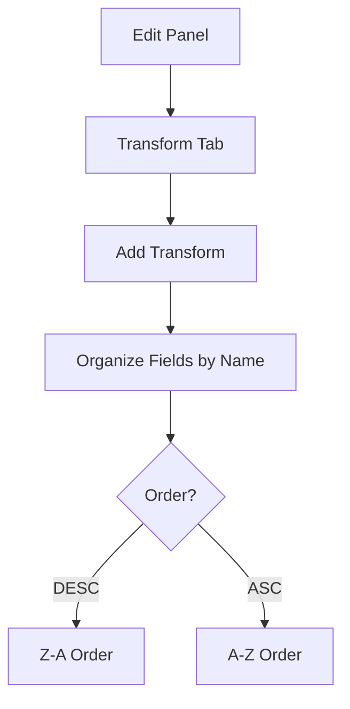

# How to Sort Legends by Series Name in Grafana

Author: [nawazdhandala](https://www.github.com/nawazdhandala)

Tags: Grafana, Dashboard, Visualization, Legend, Sorting, UI, Monitoring, Time Series

Description: Learn how to sort legends alphabetically by series name in Grafana panels.

---

Grafana legends help identify what each line or bar represents in your visualizations. By default, legends may appear in the order data is returned, which can be confusing. This guide shows you how to sort legends by series name and other useful criteria.

---

## TL;DR

- Grafana's time series legend options do not provide a persistent "Sort by: Name" setting
- Use table legend mode to sort interactively by displayed calculation values
- Use the Organize fields transform for name-based field ordering
- Configure display names with legend format or field overrides
- Legend placement affects readability on different screen sizes

---

## Legend Configuration Basics

Access legend settings through:

1. Edit panel
2. Go to the right sidebar
3. Find "Legend" section under panel options

### Basic Legend Options

| Option | Description |
|--------|-------------|
| Visibility | Show or hide the legend |
| Mode | List or Table |
| Placement | Bottom or Right |
| Width | Fixed width for right placement |
| Values | Show min, max, mean, total, etc. |

---

## Sorting by Series Name

### Method 1: Organize Fields Transform

For time series panels:

1. Edit your panel
2. Go to the Transform tab
3. Add the "Organize fields by name" transform
4. Set field order mode to Auto
5. Choose ASC to sort names A-Z or DESC to sort names Z-A


```mermaid
flowchart TD
    A[Edit Panel] --> B[Transform Tab]
    B --> C[Add Transform]
    C --> D[Organize Fields by Name]
    D --> E{Order?}
    E -->|DESC| F[Z-A Order]
    E -->|ASC| G[A-Z Order]
```

### Method 2: Via JSON Model

Edit the panel JSON directly to add an organize transform:

```json
{
  "transformations": [
    {
      "id": "organize",
      "options": {
        "indexByName": {
          "api-gateway": 0,
          "database": 1,
          "web-server-1": 2,
          "web-server-3": 3
        }
      }
    }
  ]
}
```

---

## Sorting Options Explained

### Sort by Name

Alphabetically sorts legend entries:

```text
Before sorting:
- web-server-3
- api-gateway
- web-server-1
- database

After sorting (ascending):
- api-gateway
- database
- web-server-1
- web-server-3
```

### Sort by Value

Grafana can sort legend table rows by displayed calculation values:

```json
{
  "legend": {
    "displayMode": "table",
    "calcs": ["lastNotNull"]
  }
}
```

Available calculation values include:
- Last: Most recent value
- Min: Minimum value
- Max: Maximum value
- Mean: Average value
- Total: Sum of all values

### Sort by Custom Field

With table legend mode, add the calculation you want to sort by:

```json
{
  "legend": {
    "displayMode": "table",
    "calcs": ["lastNotNull", "min", "max", "mean"]
  }
}
```

---

## Table Legend Mode for Rich Sorting

Table mode provides more sorting flexibility:

### Configuration

```json
{
  "options": {
    "legend": {
      "displayMode": "table",
      "placement": "right",
      "showLegend": true,
      "calcs": [
        "lastNotNull",
        "min",
        "max",
        "mean"
      ]
    }
  }
}
```

### Resulting Table Legend

```text
| Series        | Last  | Min   | Max   | Mean  |
|---------------|-------|-------|-------|-------|
| api-gateway   | 45ms  | 12ms  | 120ms | 38ms  |
| database      | 23ms  | 8ms   | 89ms  | 31ms  |
| web-server-1  | 67ms  | 15ms  | 234ms | 52ms  |
| web-server-3  | 89ms  | 22ms  | 301ms | 78ms  |
```

Click calculation column headers to sort by that column interactively.

---

## Using Transforms for Advanced Sorting

When panel options are insufficient, use transforms. The Sort by transform sorts rows within each data frame; the Organize fields by name transform reorders fields, which is what affects series order in a time series legend.

### Sort Transform

1. Edit panel
2. Go to Transform tab
3. Add "Sort by" transform
4. Configure the row field and order

```json
{
  "transformations": [
    {
      "id": "sortBy",
      "options": {
        "fields": {},
        "sort": [
          {
            "field": "Time",
            "desc": false
          }
        ]
      }
    }
  ]
}
```

### Organize Fields by Name Transform

Reorder series manually:

```json
{
  "transformations": [
    {
      "id": "organize",
      "options": {
        "indexByName": {
          "api-gateway": 0,
          "database": 1,
          "web-server-1": 2,
          "web-server-3": 3
        }
      }
    }
  ]
}
```

---

## Query-Level Sorting

Control sort order in your query:

### PromQL with sort

```promql
sort(sum(rate(http_requests_total[5m])) by (service))

sort_desc(sum(rate(http_requests_total[5m])) by (service))
```

Prometheus `sort()` and `sort_desc()` sort instant-vector results by sample value. They do not sort by label name, and Prometheus range query results have a fixed output ordering.

### PromQL with sort_by_label

If your Prometheus server enables experimental PromQL functions, you can sort instant-vector results by a label:

```promql
sort_by_label(sum(rate(http_requests_total[5m])) by (service), "service")

sort_by_label_desc(sum(rate(http_requests_total[5m])) by (service), "service")
```

### PromQL with topk/bottomk

```promql
# Top 10 services by request rate
topk(10, sum(rate(http_requests_total[5m])) by (service))

# Bottom 10 services
bottomk(10, sum(rate(http_requests_total[5m])) by (service))
```

---

## Legend Naming with Series Override

Customize how series names appear in legends:

### Using Legend Format

In your query:

```text
# Query
sum(rate(http_requests_total[5m])) by (service, environment)

# Legend format
{{service}} - {{environment}}
```

### Using Field Override

1. Go to Overrides tab
2. Add field override
3. Select "Fields with name matching regex"
4. Set display name

```json
{
  "fieldConfig": {
    "overrides": [
      {
        "matcher": {
          "id": "byRegexp",
          "options": ".*"
        },
        "properties": [
          {
            "id": "displayName",
            "value": "${__field.labels.service}"
          }
        ]
      }
    ]
  }
}
```

---

## Complete Panel Configuration Example

Here is a complete time series panel with sorted legends:

```json
{
  "type": "timeseries",
  "title": "Service Request Latency",
  "targets": [
    {
      "expr": "histogram_quantile(0.95, sum(rate(http_request_duration_seconds_bucket[$__rate_interval])) by (le, service))",
      "legendFormat": "{{service}}"
    }
  ],
  "options": {
    "legend": {
      "displayMode": "table",
      "placement": "right",
      "showLegend": true,
      "calcs": [
        "lastNotNull",
        "mean",
        "max"
      ],
      "width": 300
    },
    "tooltip": {
      "mode": "multi",
      "sort": "desc"
    }
  },
  "transformations": [
    {
      "id": "organize",
      "options": {
        "indexByName": {
          "api-gateway": 0,
          "database": 1,
          "web-server-1": 2,
          "web-server-3": 3
        }
      }
    }
  ],
  "fieldConfig": {
    "defaults": {
      "unit": "s"
    }
  }
}
```

---

## Tooltip Sorting

Tooltips can also be sorted when hovering:

```json
{
  "options": {
    "tooltip": {
      "mode": "multi",
      "sort": "desc"
    }
  }
}
```

Tooltip sort options:
- `none`: Order from query
- `asc`: Ascending by value
- `desc`: Descending by value

---

## Best Practices

### 1. Match Sorting to Use Case

| Use Case | Recommended Sort |
|----------|-----------------|
| Comparing named services | Organize fields by name |
| Finding top contributors | Sort legend table by Max |
| Identifying problems | Sort legend table by Last |
| Capacity planning | Sort legend table by Mean |

### 2. Use Consistent Naming

Name your series consistently for predictable sorting:

```text
# Good: Consistent prefix
legendFormat: "svc-{{service}}"
# Results: svc-api, svc-auth, svc-web

# Avoid: Inconsistent naming
legendFormat: "{{service}}"
# Results: API Gateway, auth-service, Web
```

### 3. Consider Legend Placement

```json
{
  "legend": {
    "placement": "right",
    "width": 250
  }
}
```

For few series, bottom placement also works well:

```json
{
  "legend": {
    "placement": "bottom"
  }
}
```

### 4. Limit Series Count

Too many legend entries become unreadable:

```promql
# Limit to top 10 services
topk(10, sum(rate(http_requests_total[5m])) by (service))
```

---

## Troubleshooting

### Legend Not Sorting

Check these settings:

1. Ensure "Show legend" is enabled
2. Verify sort field exists
3. Check for transform conflicts
4. Use table mode and displayed calculations for interactive value sorting

### Inconsistent Sort Order

Causes:
- Data returning in different order
- Cache issues
- Time range affecting visible series

Solutions:
- Add explicit sort in query where the data source supports it
- Use transforms
- Set consistent legend format

### Performance with Many Series

For panels with 50+ series:
- Use table mode for better performance
- Consider aggregating data
- Implement series filtering

---

## Conclusion

Sorted legends dramatically improve dashboard usability:

- **Alphabetical sorting** helps locate specific services quickly
- **Value-based sorting** highlights top contributors or problems
- **Table mode** provides interactive sorting options
- **Transforms** handle complex sorting requirements

Configure legend sorting as part of your dashboard design to make information easier to find and compare.

---

*For more Grafana customization, see our guides on histogram visualization and panel visibility with template variables.*
