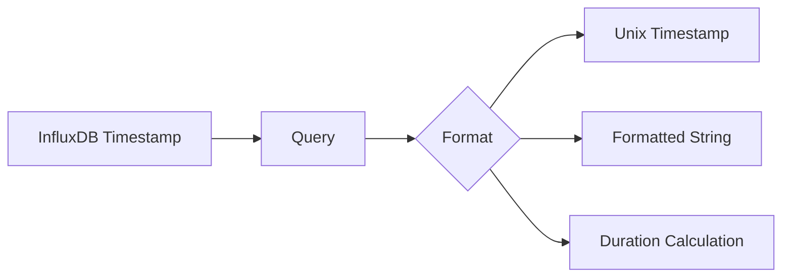

# How to Use Time Field from InfluxDB in Grafana Single Stat

Author: [nawazdhandala](https://www.github.com/nawazdhandala)

Tags: Grafana, InfluxDB, Single Stat, Data Visualization, Time Series

Description: Learn how to display time-based values from InfluxDB in Grafana Single Stat and Stat panels. This guide covers formatting timestamps, calculating durations, and displaying last-seen times.

---

Displaying time-based information in Grafana stat panels is useful for showing last event times, durations since events, or countdown timers. When working with InfluxDB, extracting and formatting time fields requires specific techniques. This guide shows you how to effectively use time data in single stat visualizations.

## Common Use Cases

- **Last seen time** - When was the last successful backup?
- **Time since event** - How long since the last deployment?
- **Event timestamps** - When did the last alert fire?
- **Countdown timers** - Time until maintenance window
- **Duration displays** - How long did the last job take?

## Understanding InfluxDB Time Data

InfluxDB stores timestamps in nanosecond precision. When querying for display in Grafana:



## Method 1: Display Last Event Time

### InfluxDB Query (InfluxQL)

```sql
SELECT last("value") AS "value", time
FROM "events"
WHERE $timeFilter
GROUP BY time($__interval) fill(none)
ORDER BY time DESC
LIMIT 1
```

### InfluxDB Query (Flux)

```flux
from(bucket: "mydb")
  |> range(start: v.timeRangeStart, stop: v.timeRangeStop)
  |> filter(fn: (r) => r._measurement == "events")
  |> last()
  |> keep(columns: ["_time", "_value"])
```

### Stat Panel Configuration

1. Select **Stat** visualization
2. Set **Value options** > **Fields** to `Time`
3. Configure **Standard options**:
   - Unit: `dateTimeAsLocal` or `dateTimeFromNow`

```json
{
  "type": "stat",
  "options": {
    "reduceOptions": {
      "calcs": ["lastNotNull"],
      "fields": "/^_time$/"
    },
    "textMode": "value"
  },
  "fieldConfig": {
    "defaults": {
      "unit": "dateTimeAsLocal"
    }
  }
}
```

## Method 2: Time Since Last Event

Show how long ago something happened:

### InfluxQL Query

```sql
SELECT last("value") AS "value"
FROM "deployments"
WHERE $timeFilter
```

### Grafana Transformation Approach

1. Query returns the timestamp of last event
2. Add **Add field from calculation** transformation
3. Mode: **Binary operation**
4. Operation: Current time minus event time

### Alternative: Flux Calculation

```flux
import "date"

lastEvent = from(bucket: "mydb")
  |> range(start: -30d)
  |> filter(fn: (r) => r._measurement == "deployments")
  |> last()
  |> findRecord(fn: (key) => true, idx: 0)

from(bucket: "mydb")
  |> range(start: -1m)
  |> filter(fn: (r) => r._measurement == "deployments")
  |> map(fn: (r) => ({
      _time: r._time,
      _value: float(v: uint(v: now()) - uint(v: lastEvent._time)) / 1000000000.0
  }))
  |> last()
```

### Panel Configuration for Duration

```json
{
  "fieldConfig": {
    "defaults": {
      "unit": "dtdurations",
      "decimals": 0
    }
  }
}
```

## Method 3: Using Grafana's Built-in Time Units

Grafana provides several time-related units:

| Unit | Description | Example Output |
|------|-------------|----------------|
| `dateTimeAsLocal` | Local time format | `2024-01-15 10:30:45` |
| `dateTimeAsUS` | US format | `01/15/2024 10:30:45 AM` |
| `dateTimeAsISO` | ISO format | `2024-01-15T10:30:45Z` |
| `dateTimeFromNow` | Relative time | `5 minutes ago` |
| `dtdurations` | Duration | `2h 30m 15s` |
| `s` | Seconds | `3600` |

### Configuration Example

```json
{
  "fieldConfig": {
    "defaults": {
      "unit": "dateTimeFromNow",
      "color": {
        "mode": "thresholds"
      },
      "thresholds": {
        "steps": [
          {"color": "green", "value": null},
          {"color": "yellow", "value": 3600},
          {"color": "red", "value": 86400}
        ]
      }
    }
  }
}
```

## Method 4: Duration Between Two Events

Calculate and display duration between start and end times:

### Flux Query

```flux
from(bucket: "mydb")
  |> range(start: v.timeRangeStart, stop: v.timeRangeStop)
  |> filter(fn: (r) => r._measurement == "jobs")
  |> filter(fn: (r) => r._field == "duration_seconds")
  |> last()
```

### InfluxQL with Math

```sql
SELECT last("end_time") - last("start_time") AS "duration"
FROM "jobs"
WHERE $timeFilter
```

### Panel for Duration Display

```json
{
  "type": "stat",
  "title": "Last Job Duration",
  "fieldConfig": {
    "defaults": {
      "unit": "s",
      "decimals": 0,
      "mappings": [],
      "thresholds": {
        "steps": [
          {"color": "green", "value": null},
          {"color": "yellow", "value": 300},
          {"color": "red", "value": 600}
        ]
      }
    }
  },
  "options": {
    "reduceOptions": {
      "calcs": ["lastNotNull"]
    },
    "colorMode": "background",
    "graphMode": "none"
  }
}
```

## Method 5: Countdown Timer

Show time until a future event:

### Flux Query for Scheduled Event

```flux
import "date"

scheduledTime = 2024-01-20T00:00:00Z

from(bucket: "mydb")
  |> range(start: -1m)
  |> limit(n: 1)
  |> map(fn: (r) => ({
      _time: r._time,
      _value: float(v: uint(v: scheduledTime) - uint(v: now())) / 1000000000.0
  }))
```

### Panel Configuration

```json
{
  "fieldConfig": {
    "defaults": {
      "unit": "dtdurations",
      "thresholds": {
        "steps": [
          {"color": "red", "value": null},
          {"color": "yellow", "value": 3600},
          {"color": "green", "value": 86400}
        ]
      }
    }
  }
}
```

## Working with Unix Timestamps

### InfluxQL: Convert to Unix

```sql
SELECT last("timestamp") * 1
FROM "events"
WHERE $timeFilter
```

### Flux: Unix Timestamp

```flux
from(bucket: "mydb")
  |> range(start: v.timeRangeStart, stop: v.timeRangeStop)
  |> filter(fn: (r) => r._measurement == "events")
  |> last()
  |> map(fn: (r) => ({
      _time: r._time,
      _value: uint(v: r._time) / uint(v: 1000000000)
  }))
```

### Display Unix Timestamp as Date

Set unit to `dateTimeAsLocal`:

```json
{
  "fieldConfig": {
    "defaults": {
      "unit": "dateTimeAsLocal",
      "decimals": 0
    }
  }
}
```

## Complete Dashboard Example

### Last Backup Status Dashboard

```json
{
  "panels": [
    {
      "title": "Last Successful Backup",
      "type": "stat",
      "targets": [
        {
          "query": "from(bucket: \"backups\") |> range(start: -7d) |> filter(fn: (r) => r._measurement == \"backup_status\" and r.status == \"success\") |> last() |> keep(columns: [\"_time\"])",
          "datasource": "InfluxDB"
        }
      ],
      "fieldConfig": {
        "defaults": {
          "unit": "dateTimeFromNow",
          "thresholds": {
            "steps": [
              {"color": "green", "value": null},
              {"color": "yellow", "value": 86400000},
              {"color": "red", "value": 172800000}
            ]
          }
        }
      },
      "options": {
        "reduceOptions": {
          "calcs": ["lastNotNull"],
          "fields": "/_time/"
        },
        "colorMode": "background"
      }
    },
    {
      "title": "Backup Duration",
      "type": "stat",
      "targets": [
        {
          "query": "from(bucket: \"backups\") |> range(start: -7d) |> filter(fn: (r) => r._measurement == \"backup_status\" and r._field == \"duration_seconds\") |> last()",
          "datasource": "InfluxDB"
        }
      ],
      "fieldConfig": {
        "defaults": {
          "unit": "dtdurations"
        }
      }
    },
    {
      "title": "Next Scheduled Backup",
      "type": "stat",
      "targets": [
        {
          "query": "from(bucket: \"backups\") |> range(start: -1d) |> filter(fn: (r) => r._measurement == \"backup_schedule\" and r._field == \"next_run\") |> last()",
          "datasource": "InfluxDB"
        }
      ],
      "fieldConfig": {
        "defaults": {
          "unit": "dateTimeAsLocal"
        }
      }
    }
  ]
}
```

## Troubleshooting

### Time Shows as Large Number

The value is in nanoseconds or milliseconds. Apply appropriate unit:

```json
{
  "fieldConfig": {
    "defaults": {
      "unit": "dateTimeAsLocal"
    }
  }
}
```

### "No Data" for Time Field

1. Check query returns the `_time` field
2. Verify field selection in panel matches
3. Use `keep(columns: ["_time"])` in Flux

### Wrong Timezone

Configure dashboard timezone:
1. Dashboard Settings > Time Options
2. Set Timezone to desired value

### Duration Shows Negative

Ensure time calculation order is correct (later time minus earlier time).

## Value Mappings for Time States

Add contextual text based on time values:

```json
{
  "fieldConfig": {
    "defaults": {
      "mappings": [
        {
          "type": "range",
          "options": {
            "from": 0,
            "to": 3600,
            "result": {
              "text": "Recent",
              "color": "green"
            }
          }
        },
        {
          "type": "range",
          "options": {
            "from": 3601,
            "to": 86400,
            "result": {
              "text": "Today",
              "color": "yellow"
            }
          }
        },
        {
          "type": "range",
          "options": {
            "from": 86401,
            "to": null,
            "result": {
              "text": "Stale",
              "color": "red"
            }
          }
        }
      ]
    }
  }
}
```

## Summary

Using time fields from InfluxDB in Grafana stat panels requires:

1. **Proper query format** - Return time as a field or calculate duration
2. **Correct unit selection** - Use `dateTimeFromNow`, `dateTimeAsLocal`, or `dtdurations`
3. **Field selection** - Target the `_time` field or calculated duration
4. **Thresholds** - Set meaningful thresholds based on time values (in milliseconds)

With these techniques, you can create informative stat panels showing last event times, time since events, durations, and countdown timers - essential components of operational dashboards.
