# How to Time Shift Single Query Backwards in Grafana

Author: [nawazdhandala](https://www.github.com/nawazdhandala)

Tags: Grafana, Prometheus, PromQL, Time Shift, Offset, Queries, Dashboard, Comparison, Monitoring

Description: Learn how to time shift individual queries in Grafana to compare current metrics with historical data. This guide covers the offset modifier, relative time overrides, and building comparison dashboards.

---

Comparing current metrics with historical data helps identify trends, detect anomalies, and validate changes. Grafana allows you to time shift individual queries to overlay "now" with "yesterday" or "last week" on the same panel. This guide shows you how.

---

## TL;DR

- Use `offset` modifier in PromQL to shift queries backwards
- Set "Relative time" in query options for non-PromQL sources
- Combine current and offset queries in the same panel
- Use transforms for comparing different time periods
- Create dedicated comparison dashboards for common patterns

---

## The PromQL Offset Modifier

PromQL's `offset` modifier shifts a query's time range backwards:

```promql
# Current request rate
sum(rate(http_requests_total[5m]))

# Request rate 1 hour ago
sum(rate(http_requests_total[5m] offset 1h))

# Request rate 1 day ago
sum(rate(http_requests_total[5m] offset 1d))

# Request rate 1 week ago
sum(rate(http_requests_total[5m] offset 1w))
```

### Supported Time Units

| Unit | Meaning | Example |
|------|---------|---------|
| `s` | Seconds | `offset 30s` |
| `m` | Minutes | `offset 15m` |
| `h` | Hours | `offset 1h` |
| `d` | Days | `offset 1d` |
| `w` | Weeks | `offset 1w` |
| `y` | Years | `offset 1y` |

---

## How Offset Works

```mermaid
flowchart LR
    subgraph Dashboard Time Range
        TR[Selected: Last 6 hours]
    end

    subgraph Query A: Current
        QA[rate&#40metric&#91;5m&#93;&#41]
        TA[Time: Now-6h to Now]
    end

    subgraph Query B: Offset 1d
        QB[rate&#40metric&#91;5m&#93; offset 1d&#41]
        TB[Time: Now-30h to Now-24h]
    end

    TR --> QA
    TR --> QB
    QA --> TA
    QB --> TB

    TA --> PA[Current Line]
    TB --> PB[Yesterday Line]
```



The offset shifts the entire query window backwards by the specified duration.

---

## Comparing Current vs Historical Data

### Side-by-Side in Same Panel

Create two queries in one panel:

**Query A - Current:**
```promql
sum(rate(http_requests_total[5m]))
```
Legend: `Current`

**Query B - Yesterday:**
```promql
sum(rate(http_requests_total[5m] offset 1d))
```
Legend: `Yesterday`

**Query C - Last Week:**
```promql
sum(rate(http_requests_total[5m] offset 1w))
```
Legend: `Last Week`

### Panel Configuration

```json
{
  "targets": [
    {
      "expr": "sum(rate(http_requests_total[5m]))",
      "legendFormat": "Current"
    },
    {
      "expr": "sum(rate(http_requests_total[5m] offset 1d))",
      "legendFormat": "Yesterday"
    },
    {
      "expr": "sum(rate(http_requests_total[5m] offset 1w))",
      "legendFormat": "Last Week"
    }
  ],
  "fieldConfig": {
    "defaults": {
      "custom": {
        "lineWidth": 2
      }
    },
    "overrides": [
      {
        "matcher": { "id": "byName", "options": "Yesterday" },
        "properties": [
          { "id": "custom.lineStyle", "value": { "dash": [10, 10] } }
        ]
      },
      {
        "matcher": { "id": "byName", "options": "Last Week" },
        "properties": [
          { "id": "custom.lineStyle", "value": { "dash": [5, 5] } }
        ]
      }
    ]
  }
}
```

---

## Calculating Percentage Change

Compare current values to historical:

### Week-over-Week Change

```promql
# Percentage change from last week
(
  sum(rate(http_requests_total[5m]))
  -
  sum(rate(http_requests_total[5m] offset 1w))
)
/
sum(rate(http_requests_total[5m] offset 1w))
* 100
```

### Day-over-Day Change

```promql
# Percentage change from yesterday
(
  sum(rate(http_requests_total[5m]))
  -
  sum(rate(http_requests_total[5m] offset 1d))
)
/
sum(rate(http_requests_total[5m] offset 1d))
* 100
```

### Stat Panel for Change

```json
{
  "type": "stat",
  "title": "Traffic vs Yesterday",
  "targets": [
    {
      "expr": "(sum(rate(http_requests_total[5m])) - sum(rate(http_requests_total[5m] offset 1d))) / sum(rate(http_requests_total[5m] offset 1d)) * 100"
    }
  ],
  "fieldConfig": {
    "defaults": {
      "unit": "percent",
      "thresholds": {
        "steps": [
          { "value": -20, "color": "red" },
          { "value": -5, "color": "yellow" },
          { "value": 5, "color": "green" },
          { "value": 20, "color": "blue" }
        ]
      }
    }
  }
}
```

---

## Dynamic Offset with Variables

Create a template variable for flexible time shifting:

### Variable Configuration

```yaml
Name: offset_period
Type: Custom
Values: 1h, 6h, 1d, 7d, 30d
Label: Compare To
```

### Query Using Variable

```promql
# Current
sum(rate(http_requests_total[5m]))

# Historical (using variable)
sum(rate(http_requests_total[5m] offset $offset_period))
```

### Variable for Business Hours

```yaml
Name: compare_period
Type: Custom
Values:
  "Same time yesterday": "1d"
  "Same time last week": "7d"
  "Same time last month": "30d"
```

---

## Relative Time Override (Non-PromQL)

For data sources without offset support, use Grafana's relative time override:

### Query Options

1. Edit panel
2. Expand query options
3. Set "Relative time" field

```
Query A: (no relative time - uses dashboard range)
Query B: Relative time: now-1d/d  (yesterday)
Query C: Relative time: now-7d/d  (last week)
```

### Time Range Syntax

| Syntax | Meaning |
|--------|---------|
| `now-1d` | 1 day ago from now |
| `now-1d/d` | Start of yesterday |
| `now-7d/d` | Start of day, 7 days ago |
| `now-1w/w` | Start of last week |
| `now-1M/M` | Start of last month |

---

## Handling Offset Edge Cases

### Missing Historical Data

When offset period has no data:

```promql
# Use or operator for fallback
sum(rate(http_requests_total[5m] offset 1w))
or
vector(0)
```

### Aligning to Business Days

Skip weekends when comparing:

```promql
# If today is Monday, compare to last Monday (7d)
# If today is Tuesday, compare to last Tuesday (7d)
# This requires consistent 7-day offset
sum(rate(http_requests_total[5m] offset 7d))
```

### Handling DST Changes

Daylight saving time can cause 23 or 25 hour days:

```promql
# Use day-aligned offset for consistency
sum(rate(http_requests_total[5m] offset 24h))  # Exactly 24 hours
sum(rate(http_requests_total[5m] offset 1d))   # Calendar day
```

---

## Complete Comparison Dashboard

### Row 1: Current vs Historical

```json
{
  "panels": [
    {
      "title": "Request Rate Comparison",
      "type": "timeseries",
      "gridPos": { "h": 8, "w": 16, "x": 0, "y": 0 },
      "targets": [
        {
          "expr": "sum(rate(http_requests_total[5m]))",
          "legendFormat": "Now"
        },
        {
          "expr": "sum(rate(http_requests_total[5m] offset $offset))",
          "legendFormat": "{{offset}} ago"
        }
      ]
    },
    {
      "title": "Change %",
      "type": "stat",
      "gridPos": { "h": 8, "w": 8, "x": 16, "y": 0 },
      "targets": [
        {
          "expr": "(sum(rate(http_requests_total[5m])) - sum(rate(http_requests_total[5m] offset $offset))) / sum(rate(http_requests_total[5m] offset $offset)) * 100"
        }
      ],
      "fieldConfig": {
        "defaults": {
          "unit": "percent",
          "decimals": 1
        }
      }
    }
  ]
}
```

### Row 2: Error Rate Comparison

```json
{
  "panels": [
    {
      "title": "Error Rate Comparison",
      "targets": [
        {
          "expr": "sum(rate(http_requests_total{status=~'5..'}[5m])) / sum(rate(http_requests_total[5m]))",
          "legendFormat": "Current Error Rate"
        },
        {
          "expr": "sum(rate(http_requests_total{status=~'5..'}[5m] offset $offset)) / sum(rate(http_requests_total[5m] offset $offset))",
          "legendFormat": "Historical Error Rate"
        }
      ]
    }
  ]
}
```

---

## Using Transforms for Time Comparison

### Join by Time Transform

When queries return different timestamps:

1. Add both queries to panel
2. Add "Join by field" transform
3. Join on: Time field
4. Mode: Outer join

### Calculate Difference Transform

```json
{
  "transformations": [
    {
      "id": "calculateField",
      "options": {
        "mode": "binary",
        "binary": {
          "left": "Current",
          "operator": "-",
          "right": "Historical"
        },
        "alias": "Difference"
      }
    }
  ]
}
```

---

## Best Practices

### 1. Use Consistent Colors

```json
{
  "overrides": [
    {
      "matcher": { "id": "byRegexp", "options": "/Current|Now/" },
      "properties": [{ "id": "color", "value": { "fixedColor": "blue" } }]
    },
    {
      "matcher": { "id": "byRegexp", "options": "/Yesterday|Historical/" },
      "properties": [{ "id": "color", "value": { "fixedColor": "gray" } }]
    }
  ]
}
```

### 2. Add Visual Distinction

Use dashed lines for historical data:

```json
{
  "custom": {
    "lineStyle": { "dash": [10, 10] }
  }
}
```

### 3. Document the Comparison

Add annotation explaining what's being compared:

```json
{
  "description": "Compares current metrics to the same time period $offset ago. Use the dropdown to change comparison period."
}
```

### 4. Consider Timezone Impact

Ensure comparisons make business sense:
- Compare business hours to business hours
- Account for holidays and special events
- Use week-over-week for consistent day patterns

---

## Conclusion

Time shifting queries in Grafana enables powerful comparison analysis:

- **Use offset modifier** in PromQL for precise time shifting
- **Relative time overrides** work for non-PromQL data sources
- **Combine queries** in single panels for visual comparison
- **Calculate differences** to show percentage changes
- **Use variables** for flexible comparison periods

This technique helps you understand trends, validate deployments, and identify anomalies by comparing current behavior to historical baselines.

---

*For more Grafana query techniques, see our guides on using time period variables and histogram visualization.*
