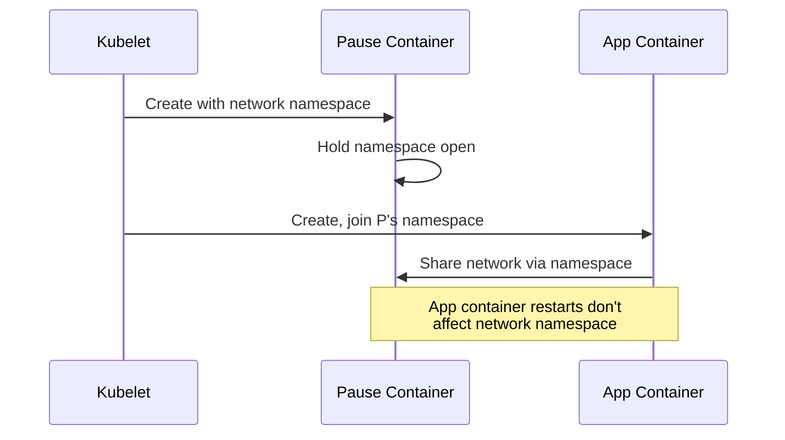

# How to Understand container='POD' Label in Prometheus

Author: [nawazdhandala](https://www.github.com/nawazdhandala)

Tags: Prometheus, Kubernetes, cAdvisor, Containers, Metrics, Monitoring, POD, Labels, Observability

Description: Learn what the container='POD' label means in Prometheus metrics from Kubernetes. This guide explains the pause container concept, how to filter metrics correctly, and best practices for container-level monitoring.

---

When querying Kubernetes container metrics in Prometheus, you will encounter the mysterious `container="POD"` label. This isn't a bug - it represents a fundamental Kubernetes concept. Understanding it is essential for accurate container monitoring.

---

## TL;DR

- `container="POD"` represents the pause container (infrastructure container)
- Every Kubernetes pod has a pause container that holds network namespace
- Filter it out with `container!="POD"` for application metrics
- Include it when measuring total pod resource usage
- cAdvisor reports metrics for both application and pause containers

---

## What Is the Pause Container?

Every Kubernetes pod runs a hidden "pause" container that:

1. **Holds the network namespace** - Other containers share its network
2. **Serves as PID 1** - Reaps zombie processes
3. **Keeps the pod alive** - If app containers crash, pod still exists
4. **Uses minimal resources** - Typically ~1MB memory

```mermaid
flowchart TD
    subgraph Pod
        PC[Pause Container<br/>container="POD"]
        AC1[App Container 1<br/>container="nginx"]
        AC2[App Container 2<br/>container="sidecar"]

        PC --> NS[Network Namespace]
        AC1 --> NS
        AC2 --> NS
    end

    subgraph Prometheus Metrics
        M1["container_memory_usage{container='POD'}"]
        M2["container_memory_usage{container='nginx'}"]
        M3["container_memory_usage{container='sidecar'}"]
    end

    PC --> M1
    AC1 --> M2
    AC2 --> M3
```

---

## Why You See container="POD"

cAdvisor (Container Advisor), which provides container metrics to Prometheus, reports metrics for ALL containers - including the pause container.

### Example Metric Output

```promql
# Raw container metrics for a pod
container_memory_usage_bytes{
  pod="my-app-7b5f9c6d4f-abc12",
  container="POD",
  namespace="production"
} 262144

container_memory_usage_bytes{
  pod="my-app-7b5f9c6d4f-abc12",
  container="my-app",
  namespace="production"
} 134217728

container_memory_usage_bytes{
  pod="my-app-7b5f9c6d4f-abc12",
  container="istio-proxy",
  namespace="production"
} 52428800
```

---

## When to Filter Out container="POD"

### Application Monitoring

For monitoring your actual application containers:

```promql
# Memory usage - excluding pause container
container_memory_usage_bytes{
  namespace="production",
  container!="POD",
  container!=""
}

# CPU usage for application containers
sum(rate(container_cpu_usage_seconds_total{
  namespace="production",
  container!="POD",
  container!=""
}[5m])) by (pod, container)
```

### Per-Container Resource Analysis

```promql
# Top memory consumers (excluding POD containers)
topk(10,
  sum(container_memory_usage_bytes{container!="POD", container!=""})
  by (namespace, pod, container)
)

# CPU by container name
sum(rate(container_cpu_usage_seconds_total{
  container!="POD",
  container!=""
}[5m])) by (container)
```

---

## When to Include container="POD"

### Total Pod Resource Usage

When you need the complete resource picture:

```promql
# Total memory per pod (including all containers)
sum(container_memory_usage_bytes{container!=""}) by (namespace, pod)

# Total CPU per pod
sum(rate(container_cpu_usage_seconds_total{container!=""}[5m])) by (namespace, pod)
```

### Network Metrics

Network metrics are typically only reported for the POD container:

```promql
# Network receive bytes (POD container holds network namespace)
sum(rate(container_network_receive_bytes_total[5m])) by (namespace, pod)

# This metric doesn't have container label filtering issues
# because network is shared at pod level
```

### Debugging Pod Infrastructure Issues

Sometimes the pause container itself has problems:

```promql
# Pause container memory (should be minimal)
container_memory_usage_bytes{container="POD"}

# Alert if pause container uses unexpected memory
container_memory_usage_bytes{container="POD"} > 10485760  # 10MB
```

---

## Common Filtering Patterns

### Filter 1: Application Containers Only

```promql
{container!="POD", container!=""}
```

This excludes:
- Pause containers (`container="POD"`)
- Pod-level aggregates (`container=""`)

### Filter 2: Named Containers

```promql
{container=~".+", container!="POD"}
```

Matches any non-empty container name except POD.

### Filter 3: Specific Container Types

```promql
# Only your main application containers (not sidecars)
{container!="POD", container!~"istio.*|envoy.*|linkerd.*"}
```

### Filter 4: Everything in Pod

```promql
# All containers including infrastructure
{pod="my-app-xyz", container!=""}
```

---

## Understanding the Empty Container Label

You'll also see `container=""` in some metrics:

```promql
container_memory_usage_bytes{container=""}     # Pod-level aggregate
container_memory_usage_bytes{container="POD"}  # Pause container
container_memory_usage_bytes{container="app"}  # App container
```

- `container=""` - Often a pod-level or system aggregate
- `container="POD"` - The pause/infrastructure container
- `container="app"` - Your actual application container

---

## Practical Dashboard Queries

### Memory Dashboard

```promql
# Total memory by namespace (excluding noise)
sum(container_memory_usage_bytes{
  container!="POD",
  container!=""
}) by (namespace)

# Memory by pod with container breakdown
sum(container_memory_usage_bytes{
  namespace="$namespace",
  container!="POD",
  container!=""
}) by (pod, container)

# Memory vs limits
sum(container_memory_usage_bytes{container!="POD", container!=""}) by (pod)
/
sum(kube_pod_container_resource_limits{resource="memory"}) by (pod)
```

### CPU Dashboard

```promql
# CPU usage rate by pod
sum(rate(container_cpu_usage_seconds_total{
  container!="POD",
  container!=""
}[5m])) by (namespace, pod)

# CPU throttling (only affects app containers)
sum(rate(container_cpu_cfs_throttled_seconds_total{
  container!="POD"
}[5m])) by (namespace, pod, container)
```

### Resource Requests vs Usage

```promql
# Memory usage vs requests
sum(container_memory_usage_bytes{container!="POD", container!=""}) by (namespace, pod)
/
sum(kube_pod_container_resource_requests{resource="memory", container!=""}) by (namespace, pod)
```

---

## Recording Rules for Clean Metrics

Create recording rules that pre-filter:

```yaml
groups:
  - name: container_metrics
    interval: 30s
    rules:
      # Memory usage excluding infrastructure containers
      - record: namespace_pod_container:memory_usage:bytes
        expr: |
          sum(container_memory_usage_bytes{
            container!="POD",
            container!=""
          }) by (namespace, pod, container)

      # CPU usage excluding infrastructure
      - record: namespace_pod_container:cpu_usage:rate5m
        expr: |
          sum(rate(container_cpu_usage_seconds_total{
            container!="POD",
            container!=""
          }[5m])) by (namespace, pod, container)

      # Total pod memory (including all containers)
      - record: namespace_pod:memory_usage:bytes
        expr: |
          sum(container_memory_usage_bytes{container!=""})
          by (namespace, pod)
```

---

## Alerting Considerations

### Alert on Application Containers

```yaml
groups:
  - name: container_alerts
    rules:
      # OOMKill risk (app containers only)
      - alert: ContainerMemoryHigh
        expr: |
          (
            sum(container_memory_usage_bytes{container!="POD", container!=""}) by (namespace, pod, container)
            /
            sum(kube_pod_container_resource_limits{resource="memory"}) by (namespace, pod, container)
          ) > 0.9
        for: 5m
        labels:
          severity: warning
        annotations:
          summary: "Container {{ $labels.container }} memory above 90%"

      # CPU throttling
      - alert: ContainerCPUThrottling
        expr: |
          sum(rate(container_cpu_cfs_throttled_seconds_total{container!="POD"}[5m]))
          by (namespace, pod, container) > 0.1
        for: 10m
        labels:
          severity: warning
```

### Don't Alert on Pause Containers

```yaml
      # WRONG - would alert on pause containers too
      - alert: BadExample
        expr: container_memory_usage_bytes > 100000000

      # RIGHT - filtered appropriately
      - alert: GoodExample
        expr: |
          container_memory_usage_bytes{
            container!="POD",
            container!=""
          } > 100000000
```

---

## Deep Dive: What the Pause Container Does

### Network Namespace Holder



### Process Reaping

The pause container runs as PID 1 in the pod's PID namespace:

```bash
# Inside a pod
$ ps aux
PID   USER     COMMAND
1     root     /pause
7     app      /usr/bin/myapp
15    app      /usr/bin/myapp worker
```

If child processes become orphaned, the pause container reaps them.

---

## Conclusion

The `container="POD"` label in Prometheus represents Kubernetes' pause container:

- **Filter it out** (`container!="POD"`) for application-level monitoring
- **Include it** when measuring total pod resources
- **Understand it** represents infrastructure, not your code
- **Use recording rules** to pre-filter for cleaner dashboards

This knowledge helps you write accurate queries and avoid confusion when monitoring Kubernetes workloads with Prometheus.

---

*For more Kubernetes monitoring patterns, see our guides on service latency measurement and persistent Grafana dashboards.*
