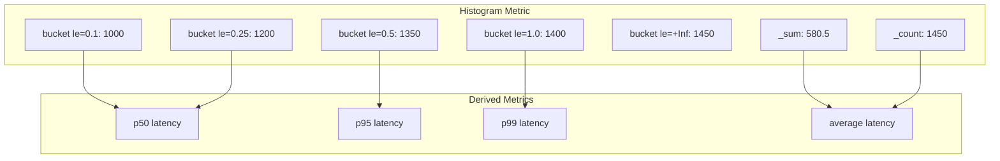

# How to Visualize Histograms in Grafana with Prometheus

Author: [nawazdhandala](https://www.github.com/nawazdhandala)

Tags: Grafana, Prometheus, Histograms, PromQL, Visualization, Latency, Metrics, Monitoring, Percentiles

Description: Learn how to visualize Prometheus histograms in Grafana using heatmaps, percentile calculations, and distribution analysis. This guide covers histogram_quantile, bucket visualization, and best practices for latency monitoring.

---

Prometheus histograms are powerful for tracking distributions - response times, request sizes, queue depths. But visualizing them effectively in Grafana requires understanding how histogram buckets work and which visualization options to use. This guide shows you how to turn histogram data into actionable insights.

---

## TL;DR

- Use `histogram_quantile()` for percentile calculations (p50, p95, p99)
- Heatmaps show distribution changes over time
- Rate the histogram before calculating quantiles
- Use native histogram format if on Prometheus 2.40+
- Always include the `le` label in aggregations

---

## Understanding Prometheus Histograms

Prometheus histograms store data in cumulative buckets:

```promql
# Example histogram metric
http_request_duration_seconds_bucket{le="0.1"}   1000  # <= 100ms
http_request_duration_seconds_bucket{le="0.25"}  1200  # <= 250ms
http_request_duration_seconds_bucket{le="0.5"}   1350  # <= 500ms
http_request_duration_seconds_bucket{le="1.0"}   1400  # <= 1s
http_request_duration_seconds_bucket{le="+Inf"}  1450  # all requests

# Also includes sum and count
http_request_duration_seconds_sum    580.5   # total duration
http_request_duration_seconds_count  1450    # total requests
```

The `le` (less than or equal) label defines bucket boundaries.

---

## Histogram Data Structure



---

## Calculating Percentiles with histogram_quantile

The `histogram_quantile()` function calculates percentiles from bucket data:

```promql
# 50th percentile (median)
histogram_quantile(0.5, rate(http_request_duration_seconds_bucket[5m]))

# 95th percentile
histogram_quantile(0.95, rate(http_request_duration_seconds_bucket[5m]))

# 99th percentile
histogram_quantile(0.99, rate(http_request_duration_seconds_bucket[5m]))
```

### Important: Always Rate Before Quantile

```promql
# CORRECT: Rate the buckets first
histogram_quantile(0.95, rate(http_request_duration_seconds_bucket[5m]))

# INCORRECT: Will give wrong results
histogram_quantile(0.95, http_request_duration_seconds_bucket)
```

### Grouping Percentiles by Label

```promql
# P95 per service
histogram_quantile(0.95,
  sum(rate(http_request_duration_seconds_bucket[5m])) by (le, service)
)

# P99 per endpoint
histogram_quantile(0.99,
  sum(rate(http_request_duration_seconds_bucket[5m])) by (le, endpoint)
)
```

---

## Visualization Option 1: Time Series Percentile Lines

The most common visualization shows percentile trends over time:

### Query Setup

Create multiple queries in a single panel:

**Query A - P50:**
```promql
histogram_quantile(0.5, sum(rate(http_request_duration_seconds_bucket[$__rate_interval])) by (le))
```

**Query B - P95:**
```promql
histogram_quantile(0.95, sum(rate(http_request_duration_seconds_bucket[$__rate_interval])) by (le))
```

**Query C - P99:**
```promql
histogram_quantile(0.99, sum(rate(http_request_duration_seconds_bucket[$__rate_interval])) by (le))
```

### Panel Configuration

1. Visualization: Time series
2. Legend: Set custom names (p50, p95, p99)
3. Unit: Seconds (s) or milliseconds (ms)
4. Thresholds: Add warning/critical lines

---

## Visualization Option 2: Heatmaps

Heatmaps show distribution density over time:

### Query for Heatmap

```promql
# Calculate bucket rates
sum(rate(http_request_duration_seconds_bucket[$__rate_interval])) by (le)
```

### Panel Configuration

1. Visualization: Heatmap
2. Data format: Time series buckets
3. Y-Axis: Buckets
4. Color scheme: Spectral or similar
5. Options > Calculate from data: On

### Advanced Heatmap Query

For smoother visualization:

```promql
# Non-cumulative bucket counts (difference between buckets)
sum(rate(http_request_duration_seconds_bucket[$__rate_interval])) by (le)
- ignoring(le) group_left
sum(rate(http_request_duration_seconds_bucket[$__rate_interval] offset 0s)) by (le)
```

---

## Visualization Option 3: Bar Gauge Distribution

Show current distribution as a bar chart:

### Query

```promql
# Current bucket distribution
sum(increase(http_request_duration_seconds_bucket[5m])) by (le)
```

### Panel Configuration

1. Visualization: Bar gauge
2. Orientation: Horizontal
3. Display mode: Basic
4. Value: Last
5. Unit: Short or requests

---

## Complete Dashboard Panel Examples

### Panel 1: Latency Percentiles Over Time

```promql
# Create a multi-line graph with p50, p90, p95, p99
# Each as a separate query in the same panel

# Query A: p50
histogram_quantile(0.50, sum(rate(http_request_duration_seconds_bucket[$__rate_interval])) by (le))

# Query B: p90
histogram_quantile(0.90, sum(rate(http_request_duration_seconds_bucket[$__rate_interval])) by (le))

# Query C: p95
histogram_quantile(0.95, sum(rate(http_request_duration_seconds_bucket[$__rate_interval])) by (le))

# Query D: p99
histogram_quantile(0.99, sum(rate(http_request_duration_seconds_bucket[$__rate_interval])) by (le))
```

### Panel 2: Latency by Service Comparison

```promql
# P95 latency per service
histogram_quantile(0.95,
  sum(rate(http_request_duration_seconds_bucket[$__rate_interval])) by (le, service)
)
```

### Panel 3: Average Latency (from histogram)

```promql
# Calculate average from sum and count
sum(rate(http_request_duration_seconds_sum[$__rate_interval]))
/
sum(rate(http_request_duration_seconds_count[$__rate_interval]))
```

### Panel 4: Request Rate (from histogram)

```promql
# Total requests per second
sum(rate(http_request_duration_seconds_count[$__rate_interval]))
```

---

## SLO Monitoring with Histograms

Track what percentage of requests meet latency SLOs:

### Percentage Under SLO Threshold

```promql
# What percentage of requests are under 500ms?
sum(rate(http_request_duration_seconds_bucket{le="0.5"}[5m]))
/
sum(rate(http_request_duration_seconds_count[5m]))
* 100
```

### Apdex Score Calculation

```promql
# Apdex with satisfied=0.5s, tolerating=2s
(
  sum(rate(http_request_duration_seconds_bucket{le="0.5"}[5m]))
  +
  sum(rate(http_request_duration_seconds_bucket{le="2.0"}[5m]))
  -
  sum(rate(http_request_duration_seconds_bucket{le="0.5"}[5m]))
) / 2
/
sum(rate(http_request_duration_seconds_count[5m]))
```

---

## Common Issues and Solutions

### Issue: NaN Values in Percentiles

```promql
# Problem: No data in time range
histogram_quantile(0.99, rate(metric_bucket[5m]))
# Returns NaN

# Solution: Use longer range or check if data exists
histogram_quantile(0.99, rate(metric_bucket[15m]))
```

### Issue: Inaccurate Percentiles

Bucket boundaries affect accuracy:

```promql
# Coarse buckets (less accurate)
buckets = [0.1, 1.0, 10.0]  # Only 3 buckets

# Fine buckets (more accurate but higher cardinality)
buckets = [0.01, 0.025, 0.05, 0.1, 0.25, 0.5, 1.0, 2.5, 5.0, 10.0]
```

### Issue: Missing le Label in Aggregation

```promql
# WRONG: Missing le label
histogram_quantile(0.95, sum(rate(metric_bucket[5m])) by (service))

# CORRECT: Include le label
histogram_quantile(0.95, sum(rate(metric_bucket[5m])) by (le, service))
```

---

## Native Histograms (Prometheus 2.40+)

Prometheus 2.40 introduced native histograms with automatic bucketing:

```promql
# Native histogram quantile (simpler syntax)
histogram_quantile(0.95, sum(rate(http_request_duration_seconds[5m])))

# No need to specify _bucket suffix
# Buckets are determined automatically
```

### Benefits of Native Histograms

- Lower cardinality (fewer time series)
- More accurate percentiles
- Automatic bucket boundary selection
- Better memory efficiency

---

## Dashboard JSON Example

Here is a complete panel configuration:

```json
{
  "title": "Request Latency Percentiles",
  "type": "timeseries",
  "targets": [
    {
      "expr": "histogram_quantile(0.50, sum(rate(http_request_duration_seconds_bucket[$__rate_interval])) by (le))",
      "legendFormat": "p50"
    },
    {
      "expr": "histogram_quantile(0.95, sum(rate(http_request_duration_seconds_bucket[$__rate_interval])) by (le))",
      "legendFormat": "p95"
    },
    {
      "expr": "histogram_quantile(0.99, sum(rate(http_request_duration_seconds_bucket[$__rate_interval])) by (le))",
      "legendFormat": "p99"
    }
  ],
  "fieldConfig": {
    "defaults": {
      "unit": "s",
      "custom": {
        "lineWidth": 2,
        "fillOpacity": 10
      }
    }
  }
}
```

---

## Conclusion

Prometheus histograms provide rich distribution data when visualized correctly:

- **Use `histogram_quantile()`** for percentile calculations
- **Always rate before quantile** to get accurate results
- **Include the `le` label** in aggregations
- **Choose visualization type** based on your analysis needs
- **Consider native histograms** for newer Prometheus versions

Effective histogram visualization helps you understand not just averages, but the full distribution of your metrics - essential for SLO tracking and user experience monitoring.

---

*For more visualization techniques, explore our guides on Grafana legend sorting and time shifting queries.*
