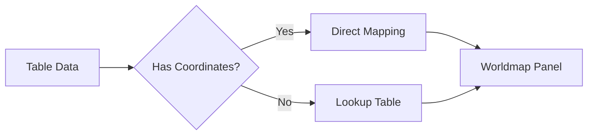
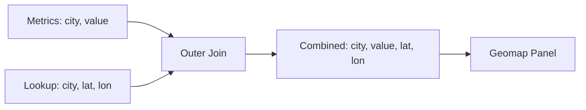

# How to Use Worldmap Plugin with Table Data in Grafana

Author: [nawazdhandala](https://www.github.com/nawazdhandala)

Tags: Grafana, Worldmap, Data Visualization, Geolocation, Dashboards

Description: Learn how to configure the Grafana Worldmap plugin with table data to visualize geographic metrics. This guide covers data formatting, coordinate mapping, and creating interactive geo-visualizations.

---

The Grafana Worldmap plugin (and its successor, the Geomap panel) allows you to visualize metrics geographically. When your data comes in table format with location information, proper configuration is required to map values to coordinates. This guide shows you how to set up geographic visualizations with table data.

## Understanding Worldmap Data Requirements

The Worldmap panel needs three things:

1. **Latitude** - Geographic latitude coordinate
2. **Longitude** - Geographic longitude coordinate
3. **Value** - The metric value to display



## Method 1: Table Data with Coordinates

When your data includes latitude and longitude columns:

### Sample Data Format

```
| location    | latitude | longitude | value |
|-------------|----------|-----------|-------|
| New York    | 40.7128  | -74.0060  | 1500  |
| London      | 51.5074  | -0.1278   | 1200  |
| Tokyo       | 35.6762  | 139.6503  | 2100  |
| Sydney      | -33.8688 | 151.2093  | 800   |
```

### Prometheus Query Returning Table Data

```promql
# Query returning location metrics with coordinates
sum by (location, latitude, longitude) (
  http_requests_total{job="api-gateway"}
)
```

### Panel Configuration

1. Select **Geomap** panel (or legacy Worldmap)
2. Set **Data format** to **Table**
3. Configure **Location** settings:
   - Mode: **Coordinates**
   - Latitude field: `latitude`
   - Longitude field: `longitude`

```json
{
  "type": "geomap",
  "options": {
    "view": {
      "id": "coords",
      "lat": 30,
      "lon": 0,
      "zoom": 2
    },
    "basemap": {
      "type": "default",
      "name": "Basemap"
    },
    "layers": [
      {
        "type": "markers",
        "config": {
          "showLegend": true,
          "style": {
            "size": {
              "field": "value",
              "min": 5,
              "max": 30
            },
            "color": {
              "field": "value"
            }
          }
        }
      }
    ]
  }
}
```

## Method 2: Using Location Lookup

When your data only has location names (countries, cities, regions):

### Sample Data Format

```
| country | requests |
|---------|----------|
| US      | 5000     |
| GB      | 3000     |
| JP      | 4500     |
| AU      | 1200     |
```

### Configure Location Lookup

1. Set **Location** mode to **Lookup**
2. Select **Lookup field**: `country`
3. Choose **Gazetteer**: `Countries` (built-in)

```json
{
  "options": {
    "layers": [
      {
        "type": "markers",
        "location": {
          "mode": "lookup",
          "lookup": "country",
          "gazetteer": "public/gazetteer/countries.json"
        }
      }
    ]
  }
}
```

## Method 3: Transformations for Table Data

Use Grafana transformations to prepare data for the Worldmap:

### Step 1: Base Query

```promql
# Returns time series data
sum by (region) (rate(http_requests_total[5m]))
```

### Step 2: Add Transformations

1. **Series to rows** - Convert time series to table format
2. **Add field from calculation** - Add coordinate columns
3. **Organize fields** - Rename and reorder

### Transformation Configuration

```json
{
  "transformations": [
    {
      "id": "seriesToRows",
      "options": {}
    },
    {
      "id": "organize",
      "options": {
        "renameByName": {
          "Metric": "region",
          "Value": "requests"
        }
      }
    }
  ]
}
```

## Practical Example: Server Locations Dashboard

### Data Source Query

Create a Prometheus query that returns server metrics with location labels:

```promql
# Server metrics with location labels
sum by (datacenter, lat, lon) (
  up{job="node-exporter"}
)
```

Where your targets are configured with location labels:

```yaml
# prometheus.yml
scrape_configs:
  - job_name: 'node-exporter'
    static_configs:
      - targets: ['server1:9100']
        labels:
          datacenter: 'us-east'
          lat: '39.0438'
          lon: '-77.4874'
      - targets: ['server2:9100']
        labels:
          datacenter: 'eu-west'
          lat: '53.3498'
          lon: '-6.2603'
```

### Panel Setup

```json
{
  "type": "geomap",
  "title": "Server Locations",
  "targets": [
    {
      "expr": "sum by (datacenter, lat, lon) (up{job=\"node-exporter\"})",
      "format": "table",
      "instant": true
    }
  ],
  "options": {
    "view": {
      "zoom": 2,
      "lat": 40,
      "lon": -20
    },
    "layers": [
      {
        "type": "markers",
        "config": {
          "style": {
            "size": {
              "fixed": 10
            },
            "color": {
              "field": "Value",
              "fixed": "green"
            },
            "symbol": {
              "fixed": "circle"
            }
          }
        },
        "location": {
          "mode": "coords",
          "latitude": "lat",
          "longitude": "lon"
        }
      }
    ]
  }
}
```

## Using InfluxDB Table Data

### InfluxDB Query

```sql
SELECT mean("value") AS "value", "latitude", "longitude", "location"
FROM "requests"
WHERE $timeFilter
GROUP BY "location", "latitude", "longitude"
```

### Format as Table

Set the query format to **Table** in the query editor.

## Custom Coordinate Mapping with Join

When coordinates are in a separate data source:

### Main Query (Prometheus)

```promql
# Query A: Metrics without coordinates
sum by (city) (http_requests_total)
```

### Lookup Query (CSV or Static Data)

```
# Query B: City coordinates
# Format: Table
city,latitude,longitude
New York,40.7128,-74.0060
London,51.5074,-0.1278
Tokyo,35.6762,139.6503
```

### Join Transformation

1. Add **Outer join** transformation
2. Join on: `city`
3. Result includes metrics with coordinates



## Heatmap Layer Configuration

For density visualization:

```json
{
  "layers": [
    {
      "type": "heatmap",
      "config": {
        "weight": {
          "field": "value"
        },
        "radius": 30,
        "blur": 15
      },
      "location": {
        "mode": "coords",
        "latitude": "lat",
        "longitude": "lon"
      }
    }
  ]
}
```

## Complete Dashboard Example

```json
{
  "dashboard": {
    "title": "Geographic Traffic Analysis",
    "panels": [
      {
        "id": 1,
        "type": "geomap",
        "title": "Request Volume by Location",
        "gridPos": {"h": 15, "w": 24, "x": 0, "y": 0},
        "targets": [
          {
            "expr": "sum by (country, lat, lon) (increase(http_requests_total[24h]))",
            "format": "table",
            "instant": true
          }
        ],
        "options": {
          "view": {
            "id": "fit",
            "zoom": 2
          },
          "basemap": {
            "type": "default"
          },
          "layers": [
            {
              "type": "markers",
              "name": "Requests",
              "config": {
                "showLegend": true,
                "style": {
                  "size": {
                    "field": "Value",
                    "min": 5,
                    "max": 50
                  },
                  "color": {
                    "field": "Value"
                  },
                  "opacity": 0.8
                }
              },
              "location": {
                "mode": "coords",
                "latitude": "lat",
                "longitude": "lon"
              }
            }
          ],
          "tooltip": {
            "mode": "details"
          }
        },
        "fieldConfig": {
          "defaults": {
            "thresholds": {
              "steps": [
                {"color": "green", "value": null},
                {"color": "yellow", "value": 1000},
                {"color": "red", "value": 5000}
              ]
            }
          }
        }
      }
    ]
  }
}
```

## Troubleshooting Common Issues

### No Points Displayed

1. Verify data format is set to **Table**
2. Check coordinate field names match exactly
3. Ensure coordinates are numeric (not strings)

```promql
# Debug: Check if coordinates are present
sum by (location, lat, lon) (up) > 0
```

### Points in Wrong Locations

1. Verify latitude/longitude are not swapped
2. Check for negative values (West longitude, South latitude)
3. Ensure coordinates are in decimal degrees

### Missing Lookup Matches

1. Check country/region codes match gazetteer format
2. Use ISO codes (US, GB, JP) not full names
3. Verify case sensitivity

## Data Format Reference

| Source | Format | Example |
|--------|--------|---------|
| Prometheus | Labels | `{lat="40.7", lon="-74.0"}` |
| InfluxDB | Tags/Fields | `latitude=40.7, longitude=-74.0` |
| MySQL | Columns | `SELECT lat, lon FROM locations` |
| CSV | Columns | `lat,lon,value` |

## Summary

Using the Worldmap/Geomap plugin with table data requires:

1. **Proper data format** - Table format with latitude, longitude, and value columns
2. **Location configuration** - Set mode to "coords" and map field names
3. **Coordinate accuracy** - Use decimal degrees with correct signs
4. **Transformations** - Join or convert data as needed

With these configurations, you can create powerful geographic visualizations showing traffic patterns, server locations, regional performance, and more.
