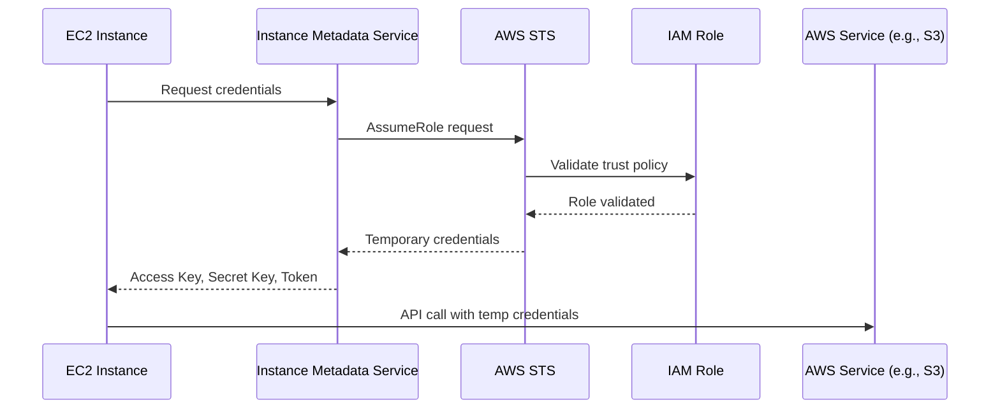

# How to Understand AssumeRole with EC2 Service

Author: [nawazdhandala](https://www.github.com/nawazdhandala)

Tags: AWS, IAM, Terraform, EC2, Security

Description: Learn how AWS AssumeRole works with EC2 instances, how to configure IAM instance profiles in Terraform, and best practices for secure cross-account access.

---

Understanding how EC2 instances assume IAM roles is fundamental to AWS security. This guide explains the AssumeRole mechanism, how EC2 gets temporary credentials, and how to configure it properly in Terraform.

## How EC2 AssumeRole Works

When an EC2 instance needs AWS credentials, it does not store static access keys. Instead, it assumes an IAM role through the instance metadata service. This process involves several AWS components working together.



## The Components Involved

### 1. IAM Role

The role defines what permissions the EC2 instance will have:

```hcl
resource "aws_iam_role" "ec2_role" {
  name = "ec2-application-role"

  # Trust policy - who can assume this role
  assume_role_policy = jsonencode({
    Version = "2012-10-17"
    Statement = [
      {
        Action = "sts:AssumeRole"
        Effect = "Allow"
        Principal = {
          Service = "ec2.amazonaws.com"  # EC2 service can assume this role
        }
      }
    ]
  })
}
```

### 2. IAM Policy

The policy defines what actions the role can perform:

```hcl
resource "aws_iam_role_policy" "ec2_policy" {
  name = "ec2-application-policy"
  role = aws_iam_role.ec2_role.id

  policy = jsonencode({
    Version = "2012-10-17"
    Statement = [
      {
        Effect = "Allow"
        Action = [
          "s3:GetObject",
          "s3:PutObject"
        ]
        Resource = "arn:aws:s3:::my-bucket/*"
      },
      {
        Effect = "Allow"
        Action = [
          "secretsmanager:GetSecretValue"
        ]
        Resource = "arn:aws:secretsmanager:us-east-1:123456789012:secret:app/*"
      }
    ]
  })
}
```

### 3. Instance Profile

The instance profile is the container that passes the role to EC2:

```hcl
resource "aws_iam_instance_profile" "ec2_profile" {
  name = "ec2-application-profile"
  role = aws_iam_role.ec2_role.name
}
```

### 4. EC2 Instance

The instance references the instance profile:

```hcl
resource "aws_instance" "app_server" {
  ami           = "ami-0c55b159cbfafe1f0"
  instance_type = "t3.micro"

  # Attach the instance profile
  iam_instance_profile = aws_iam_instance_profile.ec2_profile.name

  tags = {
    Name = "application-server"
  }
}
```

## Complete Terraform Configuration

Here is a complete working example:

```hcl
# IAM Role with trust policy for EC2
resource "aws_iam_role" "app_role" {
  name = "application-ec2-role"

  assume_role_policy = jsonencode({
    Version = "2012-10-17"
    Statement = [
      {
        Action = "sts:AssumeRole"
        Effect = "Allow"
        Principal = {
          Service = "ec2.amazonaws.com"
        }
      }
    ]
  })

  tags = {
    Environment = "production"
  }
}

# Attach AWS managed policy for SSM access
resource "aws_iam_role_policy_attachment" "ssm_policy" {
  role       = aws_iam_role.app_role.name
  policy_arn = "arn:aws:iam::aws:policy/AmazonSSMManagedInstanceCore"
}

# Custom policy for application needs
resource "aws_iam_role_policy" "app_policy" {
  name = "application-permissions"
  role = aws_iam_role.app_role.id

  policy = jsonencode({
    Version = "2012-10-17"
    Statement = [
      {
        Sid    = "S3Access"
        Effect = "Allow"
        Action = [
          "s3:GetObject",
          "s3:PutObject",
          "s3:ListBucket"
        ]
        Resource = [
          aws_s3_bucket.app_bucket.arn,
          "${aws_s3_bucket.app_bucket.arn}/*"
        ]
      },
      {
        Sid    = "DynamoDBAccess"
        Effect = "Allow"
        Action = [
          "dynamodb:GetItem",
          "dynamodb:PutItem",
          "dynamodb:Query"
        ]
        Resource = aws_dynamodb_table.app_table.arn
      }
    ]
  })
}

# Instance Profile
resource "aws_iam_instance_profile" "app_profile" {
  name = "application-instance-profile"
  role = aws_iam_role.app_role.name
}

# EC2 Instance
resource "aws_instance" "app" {
  ami                  = data.aws_ami.amazon_linux.id
  instance_type        = "t3.micro"
  iam_instance_profile = aws_iam_instance_profile.app_profile.name
  subnet_id            = aws_subnet.private.id

  tags = {
    Name = "application-server"
  }
}

# Data source for latest Amazon Linux AMI
data "aws_ami" "amazon_linux" {
  most_recent = true
  owners      = ["amazon"]

  filter {
    name   = "name"
    values = ["amzn2-ami-hvm-*-x86_64-gp2"]
  }
}
```

## How Credentials Are Retrieved

Inside the EC2 instance, credentials are fetched from the Instance Metadata Service (IMDS):

```bash
# Query IMDS v2 for credentials (recommended)
TOKEN=$(curl -X PUT "http://169.254.169.254/latest/api/token" \
  -H "X-aws-ec2-metadata-token-ttl-seconds: 21600")

ROLE_NAME=$(curl -H "X-aws-ec2-metadata-token: $TOKEN" \
  http://169.254.169.254/latest/meta-data/iam/security-credentials/)

CREDENTIALS=$(curl -H "X-aws-ec2-metadata-token: $TOKEN" \
  http://169.254.169.254/latest/meta-data/iam/security-credentials/$ROLE_NAME)

echo $CREDENTIALS
# Returns JSON with AccessKeyId, SecretAccessKey, Token, Expiration
```

AWS SDKs handle this automatically. You do not need to manually fetch credentials in application code.

## Cross-Account AssumeRole

EC2 instances can assume roles in other AWS accounts:

```hcl
# In Account B (target account) - the role to be assumed
resource "aws_iam_role" "cross_account_role" {
  name = "cross-account-access-role"

  assume_role_policy = jsonencode({
    Version = "2012-10-17"
    Statement = [
      {
        Action = "sts:AssumeRole"
        Effect = "Allow"
        Principal = {
          AWS = "arn:aws:iam::111111111111:role/application-ec2-role"
        }
        Condition = {
          StringEquals = {
            "sts:ExternalId" = "unique-external-id-12345"
          }
        }
      }
    ]
  })
}

# In Account A (source account) - allow EC2 role to assume cross-account role
resource "aws_iam_role_policy" "assume_cross_account" {
  name = "assume-cross-account-role"
  role = aws_iam_role.app_role.id

  policy = jsonencode({
    Version = "2012-10-17"
    Statement = [
      {
        Effect = "Allow"
        Action = "sts:AssumeRole"
        Resource = "arn:aws:iam::222222222222:role/cross-account-access-role"
      }
    ]
  })
}
```

Application code to assume the cross-account role:

```python
import boto3

# Create STS client using instance profile credentials
sts_client = boto3.client('sts')

# Assume the cross-account role
response = sts_client.assume_role(
    RoleArn='arn:aws:iam::222222222222:role/cross-account-access-role',
    RoleSessionName='cross-account-session',
    ExternalId='unique-external-id-12345',
    DurationSeconds=3600
)

# Use the temporary credentials
credentials = response['Credentials']
s3_client = boto3.client(
    's3',
    aws_access_key_id=credentials['AccessKeyId'],
    aws_secret_access_key=credentials['SecretAccessKey'],
    aws_session_token=credentials['SessionToken']
)

# Now you can access resources in Account B
buckets = s3_client.list_buckets()
```

## Enforcing IMDSv2

For security, require IMDSv2 (token-based) instead of IMDSv1:

```hcl
resource "aws_instance" "secure_app" {
  ami                  = data.aws_ami.amazon_linux.id
  instance_type        = "t3.micro"
  iam_instance_profile = aws_iam_instance_profile.app_profile.name

  metadata_options {
    http_endpoint               = "enabled"
    http_tokens                 = "required"  # Enforce IMDSv2
    http_put_response_hop_limit = 1
    instance_metadata_tags      = "enabled"
  }

  tags = {
    Name = "secure-application-server"
  }
}
```

## Troubleshooting AssumeRole Issues

### Check if Role is Attached

```bash
# On the EC2 instance
curl -H "X-aws-ec2-metadata-token: $TOKEN" \
  http://169.254.169.254/latest/meta-data/iam/info
```

### Verify Trust Policy

Ensure the trust policy allows `ec2.amazonaws.com`:

```bash
aws iam get-role --role-name application-ec2-role \
  --query 'Role.AssumeRolePolicyDocument'
```

### Check CloudTrail for Errors

Look for `AssumeRole` events in CloudTrail to diagnose failures.

## Best Practices

1. **Use least privilege** - Grant only necessary permissions
2. **Enforce IMDSv2** - Prevent SSRF attacks
3. **Use external IDs** - For cross-account roles to prevent confused deputy
4. **Enable CloudTrail** - Audit all AssumeRole calls
5. **Rotate credentials** - Temporary credentials expire automatically
6. **Tag resources** - Track which roles are used where

---

Understanding the AssumeRole mechanism helps you build secure AWS architectures. EC2 instance profiles provide automatic credential rotation without storing secrets, making them the preferred authentication method for applications running on EC2.
