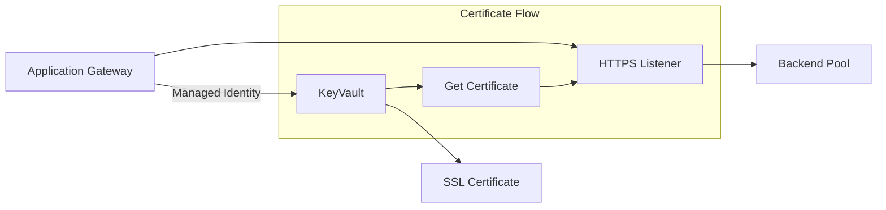

# How to Attach Azure KeyVault SSL Certificate to Application Gateway

Author: [nawazdhandala](https://www.github.com/nawazdhandala)

Tags: Terraform, Azure, KeyVault, SSL, Application Gateway

Description: Learn how to configure Azure Application Gateway to use SSL certificates stored in Azure KeyVault with Terraform, including managed identities and access policies.

---

Azure Application Gateway can retrieve SSL certificates directly from Azure KeyVault, enabling centralized certificate management and automatic renewal. This guide shows you how to configure this integration with Terraform.

## Architecture Overview



## Prerequisites

Before starting, you need:
- An SSL certificate (PFX format) or a KeyVault-generated certificate
- Azure subscription with permissions to create resources
- Terraform 1.0+

## Complete Terraform Configuration

### Step 1: Create Resource Group and Network

```hcl
terraform {
  required_providers {
    azurerm = {
      source  = "hashicorp/azurerm"
      version = "~> 3.0"
    }
  }
}

provider "azurerm" {
  features {}
}

# Get current Azure client configuration
data "azurerm_client_config" "current" {}

# Resource Group
resource "azurerm_resource_group" "main" {
  name     = "appgw-keyvault-rg"
  location = "East US"
}

# Virtual Network
resource "azurerm_virtual_network" "main" {
  name                = "appgw-vnet"
  resource_group_name = azurerm_resource_group.main.name
  location            = azurerm_resource_group.main.location
  address_space       = ["10.0.0.0/16"]
}

# Subnet for Application Gateway
resource "azurerm_subnet" "appgw" {
  name                 = "appgw-subnet"
  resource_group_name  = azurerm_resource_group.main.name
  virtual_network_name = azurerm_virtual_network.main.name
  address_prefixes     = ["10.0.1.0/24"]
}

# Public IP for Application Gateway
resource "azurerm_public_ip" "appgw" {
  name                = "appgw-pip"
  resource_group_name = azurerm_resource_group.main.name
  location            = azurerm_resource_group.main.location
  allocation_method   = "Static"
  sku                 = "Standard"
}
```

### Step 2: Create User-Assigned Managed Identity

```hcl
# User-Assigned Managed Identity for Application Gateway
resource "azurerm_user_assigned_identity" "appgw" {
  name                = "appgw-identity"
  resource_group_name = azurerm_resource_group.main.name
  location            = azurerm_resource_group.main.location
}
```

### Step 3: Create KeyVault with Access Policies

```hcl
# KeyVault for storing SSL certificates
resource "azurerm_key_vault" "main" {
  name                        = "appgw-kv-${random_string.suffix.result}"
  location                    = azurerm_resource_group.main.location
  resource_group_name         = azurerm_resource_group.main.name
  tenant_id                   = data.azurerm_client_config.current.tenant_id
  sku_name                    = "standard"
  soft_delete_retention_days  = 7
  purge_protection_enabled    = false

  # Enable Azure services to access the vault
  enabled_for_deployment          = true
  enabled_for_disk_encryption     = false
  enabled_for_template_deployment = true
}

# Random suffix for globally unique KeyVault name
resource "random_string" "suffix" {
  length  = 8
  special = false
  upper   = false
}

# Access policy for Terraform (to upload certificates)
resource "azurerm_key_vault_access_policy" "terraform" {
  key_vault_id = azurerm_key_vault.main.id
  tenant_id    = data.azurerm_client_config.current.tenant_id
  object_id    = data.azurerm_client_config.current.object_id

  certificate_permissions = [
    "Create",
    "Delete",
    "Get",
    "Import",
    "List",
    "Update",
    "Purge"
  ]

  secret_permissions = [
    "Get",
    "List",
    "Set",
    "Delete",
    "Purge"
  ]
}

# Access policy for Application Gateway Managed Identity
resource "azurerm_key_vault_access_policy" "appgw" {
  key_vault_id = azurerm_key_vault.main.id
  tenant_id    = data.azurerm_client_config.current.tenant_id
  object_id    = azurerm_user_assigned_identity.appgw.principal_id

  certificate_permissions = [
    "Get",
    "List"
  ]

  secret_permissions = [
    "Get",
    "List"
  ]
}
```

### Step 4: Upload or Generate SSL Certificate

**Option A: Import existing PFX certificate**

```hcl
resource "azurerm_key_vault_certificate" "ssl" {
  name         = "appgw-ssl-cert"
  key_vault_id = azurerm_key_vault.main.id

  depends_on = [azurerm_key_vault_access_policy.terraform]

  certificate {
    contents = filebase64("./certificates/ssl-certificate.pfx")
    password = var.certificate_password
  }

  certificate_policy {
    issuer_parameters {
      name = "Self"
    }

    key_properties {
      exportable = true
      key_size   = 2048
      key_type   = "RSA"
      reuse_key  = false
    }

    secret_properties {
      content_type = "application/x-pkcs12"
    }
  }
}

variable "certificate_password" {
  type        = string
  sensitive   = true
  description = "Password for the PFX certificate"
}
```

**Option B: Generate self-signed certificate in KeyVault**

```hcl
resource "azurerm_key_vault_certificate" "ssl" {
  name         = "appgw-ssl-cert"
  key_vault_id = azurerm_key_vault.main.id

  depends_on = [azurerm_key_vault_access_policy.terraform]

  certificate_policy {
    issuer_parameters {
      name = "Self"
    }

    key_properties {
      exportable = true
      key_size   = 2048
      key_type   = "RSA"
      reuse_key  = true
    }

    lifetime_action {
      action {
        action_type = "AutoRenew"
      }

      trigger {
        days_before_expiry = 30
      }
    }

    secret_properties {
      content_type = "application/x-pkcs12"
    }

    x509_certificate_properties {
      extended_key_usage = ["1.3.6.1.5.5.7.3.1"]  # Server Authentication

      key_usage = [
        "cRLSign",
        "dataEncipherment",
        "digitalSignature",
        "keyAgreement",
        "keyCertSign",
        "keyEncipherment",
      ]

      subject            = "CN=example.com"
      validity_in_months = 12

      subject_alternative_names {
        dns_names = ["example.com", "www.example.com"]
      }
    }
  }
}
```

### Step 5: Create Application Gateway with KeyVault Certificate

```hcl
resource "azurerm_application_gateway" "main" {
  name                = "appgw"
  resource_group_name = azurerm_resource_group.main.name
  location            = azurerm_resource_group.main.location

  sku {
    name     = "Standard_v2"
    tier     = "Standard_v2"
    capacity = 2
  }

  # Associate managed identity
  identity {
    type         = "UserAssigned"
    identity_ids = [azurerm_user_assigned_identity.appgw.id]
  }

  gateway_ip_configuration {
    name      = "appgw-ip-config"
    subnet_id = azurerm_subnet.appgw.id
  }

  frontend_port {
    name = "https-port"
    port = 443
  }

  frontend_port {
    name = "http-port"
    port = 80
  }

  frontend_ip_configuration {
    name                 = "frontend-ip"
    public_ip_address_id = azurerm_public_ip.appgw.id
  }

  # SSL Certificate from KeyVault
  ssl_certificate {
    name                = "ssl-cert"
    key_vault_secret_id = azurerm_key_vault_certificate.ssl.secret_id
  }

  # HTTPS Listener
  http_listener {
    name                           = "https-listener"
    frontend_ip_configuration_name = "frontend-ip"
    frontend_port_name             = "https-port"
    protocol                       = "Https"
    ssl_certificate_name           = "ssl-cert"
  }

  # HTTP Listener (for redirect)
  http_listener {
    name                           = "http-listener"
    frontend_ip_configuration_name = "frontend-ip"
    frontend_port_name             = "http-port"
    protocol                       = "Http"
  }

  # Backend Address Pool
  backend_address_pool {
    name = "backend-pool"
  }

  # Backend HTTP Settings
  backend_http_settings {
    name                  = "backend-http-settings"
    cookie_based_affinity = "Disabled"
    port                  = 80
    protocol              = "Http"
    request_timeout       = 60
  }

  # Routing Rule for HTTPS
  request_routing_rule {
    name                       = "https-rule"
    priority                   = 100
    rule_type                  = "Basic"
    http_listener_name         = "https-listener"
    backend_address_pool_name  = "backend-pool"
    backend_http_settings_name = "backend-http-settings"
  }

  # Redirect HTTP to HTTPS
  redirect_configuration {
    name                 = "http-to-https"
    redirect_type        = "Permanent"
    target_listener_name = "https-listener"
    include_path         = true
    include_query_string = true
  }

  request_routing_rule {
    name                        = "http-redirect-rule"
    priority                    = 200
    rule_type                   = "Basic"
    http_listener_name          = "http-listener"
    redirect_configuration_name = "http-to-https"
  }

  depends_on = [
    azurerm_key_vault_access_policy.appgw
  ]
}
```

### Step 6: Add Backend Targets

```hcl
# Example: Add VM Scale Set as backend
resource "azurerm_network_interface_application_gateway_backend_address_pool_association" "example" {
  count                   = var.add_backend_vms ? 1 : 0
  network_interface_id    = azurerm_network_interface.backend[0].id
  ip_configuration_name   = "internal"
  backend_address_pool_id = tolist(azurerm_application_gateway.main.backend_address_pool)[0].id
}

# Or add FQDN backend
resource "azurerm_application_gateway" "main" {
  # ... other configuration ...

  backend_address_pool {
    name  = "backend-pool"
    fqdns = ["backend.example.com"]
  }
}
```

## Using RBAC Instead of Access Policies

For newer deployments, you can use Azure RBAC:

```hcl
resource "azurerm_key_vault" "main" {
  name                       = "appgw-kv-${random_string.suffix.result}"
  location                   = azurerm_resource_group.main.location
  resource_group_name        = azurerm_resource_group.main.name
  tenant_id                  = data.azurerm_client_config.current.tenant_id
  sku_name                   = "standard"
  enable_rbac_authorization  = true  # Use RBAC instead of access policies
}

# Assign Key Vault Secrets User role to Application Gateway identity
resource "azurerm_role_assignment" "appgw_keyvault" {
  scope                = azurerm_key_vault.main.id
  role_definition_name = "Key Vault Secrets User"
  principal_id         = azurerm_user_assigned_identity.appgw.principal_id
}

# Assign Key Vault Certificates Officer role to Terraform
resource "azurerm_role_assignment" "terraform_keyvault" {
  scope                = azurerm_key_vault.main.id
  role_definition_name = "Key Vault Certificates Officer"
  principal_id         = data.azurerm_client_config.current.object_id
}
```

## Troubleshooting Common Issues

### Issue 1: Access Denied to KeyVault

```bash
# Check managed identity has correct permissions
az keyvault show --name your-keyvault-name --query "properties.accessPolicies"

# Or for RBAC
az role assignment list --scope /subscriptions/.../resourceGroups/.../providers/Microsoft.KeyVault/vaults/your-vault
```

### Issue 2: Certificate Not Found

Ensure the certificate is in the correct format:

```bash
# Verify certificate in KeyVault
az keyvault certificate show --vault-name your-vault --name your-cert

# Check if secret exists (certificates are stored as secrets too)
az keyvault secret show --vault-name your-vault --name your-cert
```

### Issue 3: Application Gateway Provisioning Fails

```hcl
# Add explicit dependencies
resource "azurerm_application_gateway" "main" {
  # ... configuration ...

  depends_on = [
    azurerm_key_vault_access_policy.appgw,
    azurerm_key_vault_certificate.ssl
  ]
}
```

### Issue 4: Certificate Renewal

KeyVault handles renewal for generated certificates. For imported certificates:

```hcl
# Use a null_resource to detect certificate changes
resource "null_resource" "certificate_update" {
  triggers = {
    cert_thumbprint = azurerm_key_vault_certificate.ssl.thumbprint
  }
}
```

## Outputs

```hcl
output "application_gateway_ip" {
  value = azurerm_public_ip.appgw.ip_address
}

output "key_vault_uri" {
  value = azurerm_key_vault.main.vault_uri
}

output "certificate_thumbprint" {
  value = azurerm_key_vault_certificate.ssl.thumbprint
}

output "certificate_expiry" {
  value = azurerm_key_vault_certificate.ssl.certificate_attribute[0].expires
}
```

---

Integrating Azure Application Gateway with KeyVault SSL certificates provides centralized certificate management and enables automatic renewal. The key requirements are: a user-assigned managed identity for the Application Gateway, proper KeyVault access policies or RBAC assignments, and correct certificate format. This setup eliminates manual certificate updates and reduces the risk of expired certificates causing outages.
