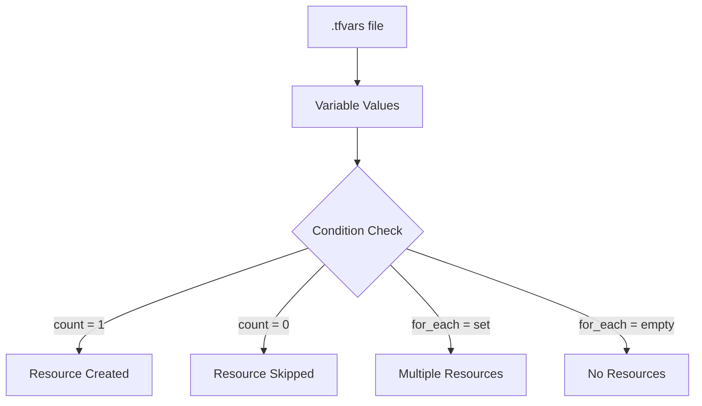

# How to Conditionally Create Resources Based on .tfvars

Author: [nawazdhandala](https://www.github.com/nawazdhandala)

Tags: Terraform, Infrastructure as Code, DevOps, Conditional Resources, Configuration Management

Description: Learn how to conditionally create Terraform resources based on values in .tfvars files. This guide covers count-based conditionals, for_each patterns, and dynamic blocks for flexible infrastructure deployment.

Terraform's power lies in its ability to adapt infrastructure based on configuration. By using variables defined in .tfvars files, you can control which resources get created, making your infrastructure code flexible across different environments, use cases, and deployment scenarios.

## Understanding Conditional Resource Creation

Terraform doesn't have explicit if/else statements for resources. Instead, we use `count` and `for_each` meta-arguments to conditionally create resources.



## Basic Conditional with count

The simplest pattern uses a boolean variable with count.

```hcl
# variables.tf
variable "enable_monitoring" {
  type        = bool
  default     = false
  description = "Enable CloudWatch monitoring resources"
}

variable "create_database" {
  type        = bool
  default     = true
  description = "Create RDS database instance"
}

# main.tf
resource "aws_cloudwatch_metric_alarm" "cpu_alarm" {
  count = var.enable_monitoring ? 1 : 0

  alarm_name          = "high-cpu-utilization"
  comparison_operator = "GreaterThanThreshold"
  evaluation_periods  = 2
  metric_name         = "CPUUtilization"
  namespace           = "AWS/EC2"
  period              = 300
  statistic           = "Average"
  threshold           = 80
  alarm_description   = "This metric monitors EC2 CPU utilization"

  dimensions = {
    InstanceId = aws_instance.main.id
  }
}

resource "aws_db_instance" "main" {
  count = var.create_database ? 1 : 0

  identifier        = "main-database"
  engine            = "postgres"
  engine_version    = "14"
  instance_class    = "db.t3.micro"
  allocated_storage = 20
  db_name           = "myapp"
  username          = "admin"
  password          = var.db_password

  skip_final_snapshot = true
}
```

### Environment-Specific .tfvars

```hcl
# environments/dev.tfvars
enable_monitoring = false
create_database   = true

# environments/staging.tfvars
enable_monitoring = true
create_database   = true

# environments/prod.tfvars
enable_monitoring = true
create_database   = true
```

```bash
# Apply with specific environment
terraform apply -var-file="environments/dev.tfvars"
terraform apply -var-file="environments/prod.tfvars"
```

## Conditional Resources with for_each

Use `for_each` when you need conditional resources with stable identifiers.

```hcl
# variables.tf
variable "additional_security_groups" {
  type = map(object({
    description = string
    ingress_rules = list(object({
      from_port   = number
      to_port     = number
      protocol    = string
      cidr_blocks = list(string)
    }))
  }))
  default = {}
  description = "Additional security groups to create"
}

# main.tf
resource "aws_security_group" "additional" {
  for_each = var.additional_security_groups

  name        = each.key
  description = each.value.description
  vpc_id      = aws_vpc.main.id

  dynamic "ingress" {
    for_each = each.value.ingress_rules
    content {
      from_port   = ingress.value.from_port
      to_port     = ingress.value.to_port
      protocol    = ingress.value.protocol
      cidr_blocks = ingress.value.cidr_blocks
    }
  }

  egress {
    from_port   = 0
    to_port     = 0
    protocol    = "-1"
    cidr_blocks = ["0.0.0.0/0"]
  }

  tags = {
    Name = each.key
  }
}
```

### Environment-Specific Security Groups

```hcl
# environments/dev.tfvars
additional_security_groups = {}  # No additional security groups in dev

# environments/prod.tfvars
additional_security_groups = {
  "bastion-sg" = {
    description = "Bastion host security group"
    ingress_rules = [
      {
        from_port   = 22
        to_port     = 22
        protocol    = "tcp"
        cidr_blocks = ["10.0.0.0/8"]
      }
    ]
  }
  "monitoring-sg" = {
    description = "Monitoring agents security group"
    ingress_rules = [
      {
        from_port   = 9090
        to_port     = 9090
        protocol    = "tcp"
        cidr_blocks = ["10.0.0.0/8"]
      },
      {
        from_port   = 3000
        to_port     = 3000
        protocol    = "tcp"
        cidr_blocks = ["10.0.0.0/8"]
      }
    ]
  }
}
```

## Feature Flags Pattern

Create a comprehensive feature flags system for complex deployments.

```hcl
# variables.tf
variable "features" {
  type = object({
    enable_vpc_flow_logs    = bool
    enable_cloudtrail       = bool
    enable_guardduty        = bool
    enable_config           = bool
    enable_backup           = bool
    enable_waf              = bool
    enable_elasticache      = bool
    enable_elasticsearch    = bool
  })
  description = "Feature flags for optional resources"

  default = {
    enable_vpc_flow_logs  = false
    enable_cloudtrail     = false
    enable_guardduty      = false
    enable_config         = false
    enable_backup         = false
    enable_waf            = false
    enable_elasticache    = false
    enable_elasticsearch  = false
  }
}

# vpc_flow_logs.tf
resource "aws_flow_log" "main" {
  count = var.features.enable_vpc_flow_logs ? 1 : 0

  vpc_id                   = aws_vpc.main.id
  traffic_type             = "ALL"
  log_destination_type     = "cloud-watch-logs"
  log_destination          = aws_cloudwatch_log_group.flow_logs[0].arn
  iam_role_arn             = aws_iam_role.flow_logs[0].arn
}

resource "aws_cloudwatch_log_group" "flow_logs" {
  count = var.features.enable_vpc_flow_logs ? 1 : 0

  name              = "/aws/vpc/flow-logs"
  retention_in_days = 30
}

resource "aws_iam_role" "flow_logs" {
  count = var.features.enable_vpc_flow_logs ? 1 : 0

  name = "vpc-flow-logs-role"

  assume_role_policy = jsonencode({
    Version = "2012-10-17"
    Statement = [
      {
        Action = "sts:AssumeRole"
        Effect = "Allow"
        Principal = {
          Service = "vpc-flow-logs.amazonaws.com"
        }
      }
    ]
  })
}

# guardduty.tf
resource "aws_guardduty_detector" "main" {
  count = var.features.enable_guardduty ? 1 : 0

  enable = true

  datasources {
    s3_logs {
      enable = true
    }
    kubernetes {
      audit_logs {
        enable = true
      }
    }
  }
}

# elasticache.tf
resource "aws_elasticache_cluster" "main" {
  count = var.features.enable_elasticache ? 1 : 0

  cluster_id           = "main-cache"
  engine               = "redis"
  node_type            = "cache.t3.micro"
  num_cache_nodes      = 1
  parameter_group_name = "default.redis7"
  port                 = 6379
  security_group_ids   = [aws_security_group.elasticache[0].id]
  subnet_group_name    = aws_elasticache_subnet_group.main[0].name
}

resource "aws_elasticache_subnet_group" "main" {
  count = var.features.enable_elasticache ? 1 : 0

  name       = "main-cache-subnet"
  subnet_ids = aws_subnet.private[*].id
}

resource "aws_security_group" "elasticache" {
  count = var.features.enable_elasticache ? 1 : 0

  name        = "elasticache-sg"
  description = "Security group for ElastiCache"
  vpc_id      = aws_vpc.main.id

  ingress {
    from_port       = 6379
    to_port         = 6379
    protocol        = "tcp"
    security_groups = [aws_security_group.app.id]
  }
}
```

### Feature Flags by Environment

```hcl
# environments/dev.tfvars
features = {
  enable_vpc_flow_logs  = false
  enable_cloudtrail     = false
  enable_guardduty      = false
  enable_config         = false
  enable_backup         = false
  enable_waf            = false
  enable_elasticache    = false
  enable_elasticsearch  = false
}

# environments/staging.tfvars
features = {
  enable_vpc_flow_logs  = true
  enable_cloudtrail     = false
  enable_guardduty      = false
  enable_config         = false
  enable_backup         = true
  enable_waf            = false
  enable_elasticache    = true
  enable_elasticsearch  = false
}

# environments/prod.tfvars
features = {
  enable_vpc_flow_logs  = true
  enable_cloudtrail     = true
  enable_guardduty      = true
  enable_config         = true
  enable_backup         = true
  enable_waf            = true
  enable_elasticache    = true
  enable_elasticsearch  = true
}
```

## Environment Type Pattern

Use an environment type variable to control multiple resources.

```hcl
# variables.tf
variable "environment_type" {
  type        = string
  description = "Type of environment: minimal, standard, or full"

  validation {
    condition     = contains(["minimal", "standard", "full"], var.environment_type)
    error_message = "environment_type must be minimal, standard, or full"
  }
}

locals {
  # Define what each environment type includes
  env_config = {
    minimal = {
      instance_count    = 1
      instance_type     = "t3.micro"
      enable_monitoring = false
      enable_backup     = false
      enable_ha         = false
      rds_multi_az      = false
    }
    standard = {
      instance_count    = 2
      instance_type     = "t3.small"
      enable_monitoring = true
      enable_backup     = true
      enable_ha         = false
      rds_multi_az      = false
    }
    full = {
      instance_count    = 3
      instance_type     = "t3.medium"
      enable_monitoring = true
      enable_backup     = true
      enable_ha         = true
      rds_multi_az      = true
    }
  }

  config = local.env_config[var.environment_type]
}

# main.tf
resource "aws_instance" "app" {
  count = local.config.instance_count

  ami           = data.aws_ami.amazon_linux.id
  instance_type = local.config.instance_type

  tags = {
    Name = "app-server-${count.index + 1}"
  }
}

resource "aws_db_instance" "main" {
  identifier        = "main-db"
  engine            = "postgres"
  instance_class    = "db.t3.micro"
  allocated_storage = 20

  multi_az = local.config.rds_multi_az

  skip_final_snapshot = true
}

resource "aws_backup_plan" "main" {
  count = local.config.enable_backup ? 1 : 0

  name = "main-backup-plan"

  rule {
    rule_name         = "daily-backup"
    target_vault_name = aws_backup_vault.main[0].name
    schedule          = "cron(0 5 ? * * *)"

    lifecycle {
      delete_after = 30
    }
  }
}

resource "aws_backup_vault" "main" {
  count = local.config.enable_backup ? 1 : 0

  name = "main-backup-vault"
}
```

## Conditional Module Usage

Apply conditionals at the module level.

```hcl
# variables.tf
variable "deploy_monitoring_stack" {
  type        = bool
  default     = false
  description = "Deploy the monitoring stack module"
}

variable "monitoring_config" {
  type = object({
    retention_days = number
    alert_email    = string
  })
  default = null
  description = "Monitoring stack configuration"
}

# main.tf
module "monitoring" {
  count  = var.deploy_monitoring_stack ? 1 : 0
  source = "./modules/monitoring"

  retention_days = var.monitoring_config.retention_days
  alert_email    = var.monitoring_config.alert_email
  vpc_id         = aws_vpc.main.id
}

# outputs.tf
output "monitoring_dashboard_url" {
  value       = var.deploy_monitoring_stack ? module.monitoring[0].dashboard_url : null
  description = "URL of the monitoring dashboard"
}
```

```hcl
# environments/dev.tfvars
deploy_monitoring_stack = false
monitoring_config       = null

# environments/prod.tfvars
deploy_monitoring_stack = true
monitoring_config = {
  retention_days = 90
  alert_email    = "ops@example.com"
}
```

## Referencing Conditional Resources

When resources might not exist, handle references carefully.

```hcl
# Safe reference patterns
locals {
  db_endpoint = var.create_database ? aws_db_instance.main[0].endpoint : null
  cache_endpoint = var.features.enable_elasticache ? aws_elasticache_cluster.main[0].cache_nodes[0].address : null
}

output "database_endpoint" {
  value       = local.db_endpoint
  description = "Database endpoint if created"
}

# In application config
resource "aws_ssm_parameter" "db_endpoint" {
  count = var.create_database ? 1 : 0

  name  = "/app/database/endpoint"
  type  = "String"
  value = aws_db_instance.main[0].endpoint
}
```

## Best Practices

1. **Use meaningful variable names** - `enable_X` or `create_X` clearly indicate purpose
2. **Provide sensible defaults** - Default to safe, minimal configurations
3. **Document dependencies** - Note when one feature depends on another
4. **Validate inputs** - Use validation blocks to catch invalid combinations
5. **Group related features** - Use objects to group related feature flags
6. **Test all combinations** - Verify terraform plan works with all tfvars variants

By leveraging these conditional patterns with .tfvars files, you can create flexible, reusable Terraform configurations that adapt to different environments and requirements.
