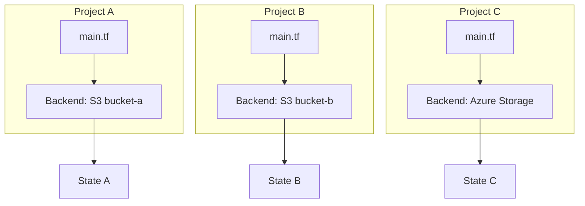

# How to Use Different Terraform Backends for Each Project

Author: [nawazdhandala](https://www.github.com/nawazdhandala)

Tags: Terraform, Infrastructure as Code, DevOps, Backend Configuration, State Management

Description: Learn how to configure different Terraform backends for each project to manage state files separately. This guide covers backend configuration strategies, partial configuration, and workspace patterns for multi-project environments.

Managing Terraform state across multiple projects requires careful planning. Each project may need its own backend configuration for isolation, security, or organizational requirements. This guide shows you how to configure different backends for each project while maintaining a clean, maintainable infrastructure codebase.

## Why Use Different Backends?

Different projects often have different requirements for state storage:

- **Environment isolation** - Production and development need separate state files
- **Team boundaries** - Different teams manage different infrastructure
- **Compliance requirements** - Some projects require specific storage locations
- **Account separation** - Multi-account AWS setups need account-specific backends



## Method 1: Partial Backend Configuration

Partial configuration lets you define the backend type in code while specifying details at runtime. This is the most flexible approach.

### Backend Configuration File

```hcl
# backend.tf
terraform {
  backend "s3" {
    # These values will be provided at init time
  }
}
```

### Project-Specific Backend Configs

Create separate backend configuration files for each project:

```hcl
# backends/project-a.hcl
bucket         = "terraform-state-project-a"
key            = "infrastructure/terraform.tfstate"
region         = "us-east-1"
dynamodb_table = "terraform-locks-project-a"
encrypt        = true
```

```hcl
# backends/project-b.hcl
bucket         = "terraform-state-project-b"
key            = "infrastructure/terraform.tfstate"
region         = "us-west-2"
dynamodb_table = "terraform-locks-project-b"
encrypt        = true
```

```hcl
# backends/project-c-azure.hcl
resource_group_name  = "terraform-state-rg"
storage_account_name = "tfstateprojectc"
container_name       = "tfstate"
key                  = "terraform.tfstate"
```

### Initialize with Backend Config

```bash
# Initialize Project A
cd project-a
terraform init -backend-config=../backends/project-a.hcl

# Initialize Project B
cd ../project-b
terraform init -backend-config=../backends/project-b.hcl

# Initialize Project C (Azure)
cd ../project-c
terraform init -backend-config=../backends/project-c-azure.hcl
```

## Method 2: Environment Variables

Use environment variables to configure backends dynamically.

```hcl
# backend.tf
terraform {
  backend "s3" {
    bucket         = ""  # Set via TF_BACKEND_BUCKET
    key            = ""  # Set via TF_BACKEND_KEY
    region         = ""  # Set via TF_BACKEND_REGION
    dynamodb_table = ""  # Set via TF_BACKEND_DYNAMODB_TABLE
    encrypt        = true
  }
}
```

### Wrapper Script

```bash
#!/bin/bash
# scripts/init-project.sh

set -e

PROJECT_NAME=$1

if [ -z "$PROJECT_NAME" ]; then
    echo "Usage: $0 <project-name>"
    exit 1
fi

# Load project-specific configuration
source "configs/${PROJECT_NAME}.env"

# Initialize Terraform with backend configuration
terraform init \
    -backend-config="bucket=${TF_BACKEND_BUCKET}" \
    -backend-config="key=${TF_BACKEND_KEY}" \
    -backend-config="region=${TF_BACKEND_REGION}" \
    -backend-config="dynamodb_table=${TF_BACKEND_DYNAMODB_TABLE}"

echo "Initialized Terraform for project: ${PROJECT_NAME}"
```

### Project Configuration Files

```bash
# configs/project-a.env
export TF_BACKEND_BUCKET="terraform-state-project-a"
export TF_BACKEND_KEY="infrastructure/terraform.tfstate"
export TF_BACKEND_REGION="us-east-1"
export TF_BACKEND_DYNAMODB_TABLE="terraform-locks-project-a"
```

```bash
# configs/project-b.env
export TF_BACKEND_BUCKET="terraform-state-project-b"
export TF_BACKEND_KEY="infrastructure/terraform.tfstate"
export TF_BACKEND_REGION="us-west-2"
export TF_BACKEND_DYNAMODB_TABLE="terraform-locks-project-b"
```

## Method 3: Directory-Based Projects

Organize projects into separate directories, each with its own complete backend configuration.

```
infrastructure/
├── project-a/
│   ├── backend.tf
│   ├── main.tf
│   ├── variables.tf
│   └── outputs.tf
├── project-b/
│   ├── backend.tf
│   ├── main.tf
│   ├── variables.tf
│   └── outputs.tf
└── shared-modules/
    └── vpc/
        ├── main.tf
        └── variables.tf
```

### Project A Backend

```hcl
# project-a/backend.tf
terraform {
  backend "s3" {
    bucket         = "terraform-state-project-a"
    key            = "infrastructure/terraform.tfstate"
    region         = "us-east-1"
    dynamodb_table = "terraform-locks-project-a"
    encrypt        = true
  }
}

# project-a/main.tf
module "vpc" {
  source = "../shared-modules/vpc"

  cidr_block = "10.0.0.0/16"
  project    = "project-a"
}
```

### Project B Backend

```hcl
# project-b/backend.tf
terraform {
  backend "s3" {
    bucket         = "terraform-state-project-b"
    key            = "infrastructure/terraform.tfstate"
    region         = "us-west-2"
    dynamodb_table = "terraform-locks-project-b"
    encrypt        = true
  }
}

# project-b/main.tf
module "vpc" {
  source = "../shared-modules/vpc"

  cidr_block = "10.1.0.0/16"
  project    = "project-b"
}
```

## Method 4: Workspaces with Shared Backend

For projects that share infrastructure patterns but need separate state, use workspaces.

```hcl
# backend.tf
terraform {
  backend "s3" {
    bucket         = "terraform-state-shared"
    key            = "projects/terraform.tfstate"
    region         = "us-east-1"
    dynamodb_table = "terraform-locks"
    encrypt        = true

    # State path includes workspace name
    workspace_key_prefix = "workspaces"
  }
}
```

```hcl
# main.tf
locals {
  # Configuration varies by workspace
  workspace_config = {
    project-a = {
      region     = "us-east-1"
      cidr_block = "10.0.0.0/16"
      env        = "production"
    }
    project-b = {
      region     = "us-west-2"
      cidr_block = "10.1.0.0/16"
      env        = "staging"
    }
    project-c = {
      region     = "eu-west-1"
      cidr_block = "10.2.0.0/16"
      env        = "development"
    }
  }

  config = local.workspace_config[terraform.workspace]
}

provider "aws" {
  region = local.config.region
}

resource "aws_vpc" "main" {
  cidr_block = local.config.cidr_block

  tags = {
    Name        = "${terraform.workspace}-vpc"
    Environment = local.config.env
    Project     = terraform.workspace
  }
}
```

### Working with Workspaces

```bash
# Create and switch to project workspaces
terraform workspace new project-a
terraform workspace new project-b
terraform workspace new project-c

# Switch between projects
terraform workspace select project-a
terraform plan
terraform apply

terraform workspace select project-b
terraform plan
terraform apply

# List all workspaces
terraform workspace list
```

## Creating Backend Infrastructure

Before using backends, you need to create the backend infrastructure itself. Here's a bootstrap module:

```hcl
# bootstrap/main.tf
variable "projects" {
  type = list(string)
  default = ["project-a", "project-b", "project-c"]
}

resource "aws_s3_bucket" "terraform_state" {
  for_each = toset(var.projects)

  bucket = "terraform-state-${each.key}"

  tags = {
    Name    = "Terraform State - ${each.key}"
    Project = each.key
  }
}

resource "aws_s3_bucket_versioning" "terraform_state" {
  for_each = aws_s3_bucket.terraform_state

  bucket = each.value.id

  versioning_configuration {
    status = "Enabled"
  }
}

resource "aws_s3_bucket_server_side_encryption_configuration" "terraform_state" {
  for_each = aws_s3_bucket.terraform_state

  bucket = each.value.id

  rule {
    apply_server_side_encryption_by_default {
      sse_algorithm = "aws:kms"
    }
  }
}

resource "aws_s3_bucket_public_access_block" "terraform_state" {
  for_each = aws_s3_bucket.terraform_state

  bucket = each.value.id

  block_public_acls       = true
  block_public_policy     = true
  ignore_public_acls      = true
  restrict_public_buckets = true
}

resource "aws_dynamodb_table" "terraform_locks" {
  for_each = toset(var.projects)

  name         = "terraform-locks-${each.key}"
  billing_mode = "PAY_PER_REQUEST"
  hash_key     = "LockID"

  attribute {
    name = "LockID"
    type = "S"
  }

  tags = {
    Name    = "Terraform Locks - ${each.key}"
    Project = each.key
  }
}

output "backend_configs" {
  value = {
    for project in var.projects : project => {
      bucket         = aws_s3_bucket.terraform_state[project].id
      dynamodb_table = aws_dynamodb_table.terraform_locks[project].name
      region         = data.aws_region.current.name
    }
  }
}

data "aws_region" "current" {}
```

## CI/CD Integration

Here's how to use different backends in a CI/CD pipeline:

```yaml
# .github/workflows/terraform.yml
name: Terraform

on:
  push:
    branches: [main]
  pull_request:
    branches: [main]

jobs:
  terraform:
    runs-on: ubuntu-latest
    strategy:
      matrix:
        project: [project-a, project-b, project-c]

    steps:
      - uses: actions/checkout@v4

      - name: Setup Terraform
        uses: hashicorp/setup-terraform@v3
        with:
          terraform_version: 1.6.0

      - name: Configure AWS Credentials
        uses: aws-actions/configure-aws-credentials@v4
        with:
          aws-access-key-id: ${{ secrets.AWS_ACCESS_KEY_ID }}
          aws-secret-access-key: ${{ secrets.AWS_SECRET_ACCESS_KEY }}
          aws-region: us-east-1

      - name: Terraform Init
        working-directory: projects/${{ matrix.project }}
        run: |
          terraform init \
            -backend-config=../../backends/${{ matrix.project }}.hcl

      - name: Terraform Plan
        working-directory: projects/${{ matrix.project }}
        run: terraform plan -out=tfplan

      - name: Terraform Apply
        if: github.ref == 'refs/heads/main'
        working-directory: projects/${{ matrix.project }}
        run: terraform apply -auto-approve tfplan
```

## Best Practices

1. **Use state locking** - Always configure DynamoDB or equivalent for state locking
2. **Enable encryption** - Encrypt state files at rest
3. **Version state buckets** - Enable versioning to recover from corruption
4. **Restrict access** - Use IAM policies to limit who can access state
5. **Document backend configurations** - Keep backend configs in version control
6. **Use consistent naming** - Follow naming conventions across projects

By implementing separate backends for each project, you gain better isolation, security, and manageability of your Terraform infrastructure across your organization.
