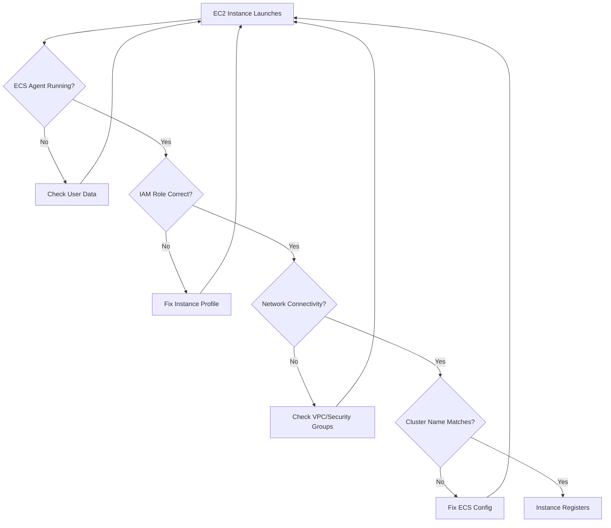

# How to Fix 'Registered Container Instance is Showing 0' in ECS

Author: [nawazdhandala](https://www.github.com/nawazdhandala)

Tags: AWS, ECS, Terraform, Infrastructure as Code, Containers, Troubleshooting

Description: Learn how to diagnose and fix the common ECS issue where registered container instances show as 0. This guide covers IAM roles, ECS agent configuration, networking, and Terraform configurations for reliable ECS clusters.

One of the most frustrating issues when setting up Amazon ECS is seeing your cluster with "0 Registered Container Instances" even after launching EC2 instances. This typically indicates that your instances aren't properly registering with the ECS cluster. Let's walk through the common causes and their Terraform-based solutions.

## Understanding the Problem

When an EC2 instance fails to register with ECS, the cluster shows zero instances, and no tasks can be scheduled.



## Cause 1: Missing or Incorrect IAM Role

The most common cause is a missing or incorrectly configured IAM instance profile. The ECS agent needs specific permissions to communicate with the ECS service.

```hcl
# Correct IAM configuration for ECS instances
resource "aws_iam_role" "ecs_instance_role" {
  name = "ecsInstanceRole"

  assume_role_policy = jsonencode({
    Version = "2012-10-17"
    Statement = [
      {
        Action = "sts:AssumeRole"
        Effect = "Allow"
        Principal = {
          Service = "ec2.amazonaws.com"
        }
      }
    ]
  })
}

# Attach the AWS managed ECS policy
resource "aws_iam_role_policy_attachment" "ecs_instance_policy" {
  role       = aws_iam_role.ecs_instance_role.name
  policy_arn = "arn:aws:iam::aws:policy/service-role/AmazonEC2ContainerServiceforEC2Role"
}

# Add SSM for debugging (optional but recommended)
resource "aws_iam_role_policy_attachment" "ssm_policy" {
  role       = aws_iam_role.ecs_instance_role.name
  policy_arn = "arn:aws:iam::aws:policy/AmazonSSMManagedInstanceCore"
}

# Create instance profile - THIS IS OFTEN FORGOTTEN
resource "aws_iam_instance_profile" "ecs_instance_profile" {
  name = "ecsInstanceProfile"
  role = aws_iam_role.ecs_instance_role.name
}
```

## Cause 2: ECS Agent Not Configured Correctly

The ECS agent needs to know which cluster to join. This is configured via the ECS_CLUSTER environment variable.

```hcl
resource "aws_ecs_cluster" "main" {
  name = "my-ecs-cluster"

  setting {
    name  = "containerInsights"
    value = "enabled"
  }
}

resource "aws_launch_template" "ecs_instances" {
  name_prefix   = "ecs-instance-"
  image_id      = data.aws_ami.ecs_optimized.id
  instance_type = "t3.medium"

  iam_instance_profile {
    arn = aws_iam_instance_profile.ecs_instance_profile.arn
  }

  # Critical: Configure ECS agent with cluster name
  user_data = base64encode(<<-EOF
    #!/bin/bash
    echo "ECS_CLUSTER=${aws_ecs_cluster.main.name}" >> /etc/ecs/ecs.config
    echo "ECS_ENABLE_CONTAINER_METADATA=true" >> /etc/ecs/ecs.config
    echo "ECS_ENABLE_TASK_IAM_ROLE=true" >> /etc/ecs/ecs.config

    # Ensure ECS agent starts
    systemctl enable ecs
    systemctl start ecs
  EOF
  )

  vpc_security_group_ids = [aws_security_group.ecs_instances.id]

  tag_specifications {
    resource_type = "instance"
    tags = {
      Name = "ecs-instance"
    }
  }
}

# Get the latest ECS-optimized AMI
data "aws_ami" "ecs_optimized" {
  most_recent = true
  owners      = ["amazon"]

  filter {
    name   = "name"
    values = ["amzn2-ami-ecs-hvm-*-x86_64-ebs"]
  }
}
```

## Cause 3: Network Connectivity Issues

ECS instances need to reach ECS service endpoints. In private subnets, this requires NAT Gateway or VPC endpoints.

```hcl
# VPC Configuration with proper networking
resource "aws_vpc" "main" {
  cidr_block           = "10.0.0.0/16"
  enable_dns_hostnames = true
  enable_dns_support   = true

  tags = {
    Name = "ecs-vpc"
  }
}

# Public subnets for NAT Gateway
resource "aws_subnet" "public" {
  count             = 2
  vpc_id            = aws_vpc.main.id
  cidr_block        = "10.0.${count.index}.0/24"
  availability_zone = data.aws_availability_zones.available.names[count.index]

  map_public_ip_on_launch = true

  tags = {
    Name = "public-${count.index}"
  }
}

# Private subnets for ECS instances
resource "aws_subnet" "private" {
  count             = 2
  vpc_id            = aws_vpc.main.id
  cidr_block        = "10.0.${count.index + 10}.0/24"
  availability_zone = data.aws_availability_zones.available.names[count.index]

  tags = {
    Name = "private-${count.index}"
  }
}

# Internet Gateway
resource "aws_internet_gateway" "main" {
  vpc_id = aws_vpc.main.id
}

# NAT Gateway for private subnet internet access
resource "aws_eip" "nat" {
  domain = "vpc"
}

resource "aws_nat_gateway" "main" {
  allocation_id = aws_eip.nat.id
  subnet_id     = aws_subnet.public[0].id

  depends_on = [aws_internet_gateway.main]
}

# Route table for private subnets
resource "aws_route_table" "private" {
  vpc_id = aws_vpc.main.id

  route {
    cidr_block     = "0.0.0.0/0"
    nat_gateway_id = aws_nat_gateway.main.id
  }
}

resource "aws_route_table_association" "private" {
  count          = 2
  subnet_id      = aws_subnet.private[count.index].id
  route_table_id = aws_route_table.private.id
}

data "aws_availability_zones" "available" {
  state = "available"
}
```

## Cause 4: Security Group Blocking Outbound Traffic

ECS instances need outbound internet access to reach ECS APIs.

```hcl
resource "aws_security_group" "ecs_instances" {
  name        = "ecs-instances-sg"
  description = "Security group for ECS instances"
  vpc_id      = aws_vpc.main.id

  # Allow all outbound traffic - required for ECS agent
  egress {
    from_port   = 0
    to_port     = 0
    protocol    = "-1"
    cidr_blocks = ["0.0.0.0/0"]
    description = "Allow all outbound traffic"
  }

  # Inbound rules for your services
  ingress {
    from_port       = 0
    to_port         = 65535
    protocol        = "tcp"
    security_groups = [aws_security_group.alb.id]
    description     = "Allow traffic from ALB"
  }

  tags = {
    Name = "ecs-instances-sg"
  }
}
```

## Using VPC Endpoints Instead of NAT

For better security and lower cost, use VPC endpoints.

```hcl
# ECS endpoint
resource "aws_vpc_endpoint" "ecs" {
  vpc_id              = aws_vpc.main.id
  service_name        = "com.amazonaws.${data.aws_region.current.name}.ecs"
  vpc_endpoint_type   = "Interface"
  subnet_ids          = aws_subnet.private[*].id
  security_group_ids  = [aws_security_group.vpc_endpoints.id]
  private_dns_enabled = true
}

# ECS Agent endpoint
resource "aws_vpc_endpoint" "ecs_agent" {
  vpc_id              = aws_vpc.main.id
  service_name        = "com.amazonaws.${data.aws_region.current.name}.ecs-agent"
  vpc_endpoint_type   = "Interface"
  subnet_ids          = aws_subnet.private[*].id
  security_group_ids  = [aws_security_group.vpc_endpoints.id]
  private_dns_enabled = true
}

# ECS Telemetry endpoint
resource "aws_vpc_endpoint" "ecs_telemetry" {
  vpc_id              = aws_vpc.main.id
  service_name        = "com.amazonaws.${data.aws_region.current.name}.ecs-telemetry"
  vpc_endpoint_type   = "Interface"
  subnet_ids          = aws_subnet.private[*].id
  security_group_ids  = [aws_security_group.vpc_endpoints.id]
  private_dns_enabled = true
}

# ECR endpoints for pulling images
resource "aws_vpc_endpoint" "ecr_api" {
  vpc_id              = aws_vpc.main.id
  service_name        = "com.amazonaws.${data.aws_region.current.name}.ecr.api"
  vpc_endpoint_type   = "Interface"
  subnet_ids          = aws_subnet.private[*].id
  security_group_ids  = [aws_security_group.vpc_endpoints.id]
  private_dns_enabled = true
}

resource "aws_vpc_endpoint" "ecr_dkr" {
  vpc_id              = aws_vpc.main.id
  service_name        = "com.amazonaws.${data.aws_region.current.name}.ecr.dkr"
  vpc_endpoint_type   = "Interface"
  subnet_ids          = aws_subnet.private[*].id
  security_group_ids  = [aws_security_group.vpc_endpoints.id]
  private_dns_enabled = true
}

# S3 endpoint (Gateway type, required for ECR)
resource "aws_vpc_endpoint" "s3" {
  vpc_id            = aws_vpc.main.id
  service_name      = "com.amazonaws.${data.aws_region.current.name}.s3"
  vpc_endpoint_type = "Gateway"
  route_table_ids   = [aws_route_table.private.id]
}

# Security group for VPC endpoints
resource "aws_security_group" "vpc_endpoints" {
  name        = "vpc-endpoints-sg"
  description = "Security group for VPC endpoints"
  vpc_id      = aws_vpc.main.id

  ingress {
    from_port   = 443
    to_port     = 443
    protocol    = "tcp"
    cidr_blocks = [aws_vpc.main.cidr_block]
    description = "Allow HTTPS from VPC"
  }

  egress {
    from_port   = 0
    to_port     = 0
    protocol    = "-1"
    cidr_blocks = ["0.0.0.0/0"]
  }
}

data "aws_region" "current" {}
```

## Complete Working Configuration

Here's a complete, working ECS cluster configuration:

```hcl
# Auto Scaling Group for ECS instances
resource "aws_autoscaling_group" "ecs" {
  name                = "ecs-asg"
  min_size            = 1
  max_size            = 3
  desired_capacity    = 2
  vpc_zone_identifier = aws_subnet.private[*].id

  launch_template {
    id      = aws_launch_template.ecs_instances.id
    version = "$Latest"
  }

  tag {
    key                 = "AmazonECSManaged"
    value               = true
    propagate_at_launch = true
  }

  tag {
    key                 = "Name"
    value               = "ecs-instance"
    propagate_at_launch = true
  }

  lifecycle {
    create_before_destroy = true
  }
}

# ECS Capacity Provider
resource "aws_ecs_capacity_provider" "main" {
  name = "ec2-capacity-provider"

  auto_scaling_group_provider {
    auto_scaling_group_arn         = aws_autoscaling_group.ecs.arn
    managed_termination_protection = "DISABLED"

    managed_scaling {
      maximum_scaling_step_size = 2
      minimum_scaling_step_size = 1
      status                    = "ENABLED"
      target_capacity           = 80
    }
  }
}

resource "aws_ecs_cluster_capacity_providers" "main" {
  cluster_name       = aws_ecs_cluster.main.name
  capacity_providers = [aws_ecs_capacity_provider.main.name]

  default_capacity_provider_strategy {
    capacity_provider = aws_ecs_capacity_provider.main.name
    weight            = 1
    base              = 1
  }
}
```

## Debugging Commands

If instances still aren't registering, SSH into an instance and run:

```bash
# Check ECS agent status
sudo systemctl status ecs

# View ECS agent logs
sudo cat /var/log/ecs/ecs-agent.log

# Check ECS configuration
cat /etc/ecs/ecs.config

# Verify instance can reach ECS endpoint
curl -s https://ecs.us-east-1.amazonaws.com

# Check instance metadata for IAM role
curl -s http://169.254.169.254/latest/meta-data/iam/security-credentials/

# Manually restart ECS agent
sudo systemctl restart ecs
```

## Best Practices

1. **Use ECS-optimized AMI** - It includes the ECS agent pre-installed
2. **Verify IAM instance profile** - The role must be attached via instance profile
3. **Test network connectivity** - Ensure instances can reach ECS endpoints
4. **Use capacity providers** - Better scaling and management
5. **Enable Container Insights** - For debugging and monitoring
6. **Use SSM** - Allows debugging without SSH access

By following this guide and ensuring all components are properly configured, your ECS instances will successfully register with your cluster.
