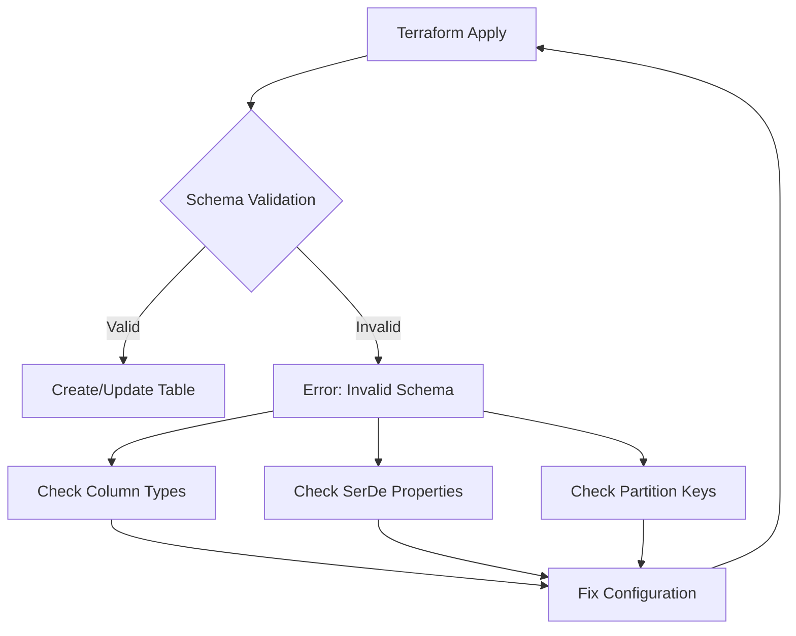

# How to Fix Invalid Schema Errors in AWS Glue

Author: [nawazdhandala](https://www.github.com/nawazdhandala)

Tags: AWS, Glue, Terraform, Infrastructure as Code, Data Engineering

Description: Learn how to diagnose and fix invalid schema errors in AWS Glue when managing your data catalog with Terraform. This guide covers common causes, debugging strategies, and Terraform configurations for reliable Glue deployments.

AWS Glue is a powerful serverless data integration service, but invalid schema errors can be frustrating when deploying through Terraform. These errors typically occur when the schema definition in your Terraform configuration doesn't match what Glue expects, or when there's a mismatch between your actual data and the defined schema. Let's explore common causes and their solutions.

## Understanding Glue Schema Validation

AWS Glue uses schemas to define the structure of your data in the Data Catalog. When Terraform applies a Glue table or crawler configuration, Glue validates the schema against its internal rules. Invalid schemas can block deployments and cause crawlers to fail.



## Common Causes of Invalid Schema Errors

### 1. Unsupported Data Types

Glue supports specific data types. Using unsupported types will cause schema validation failures.

```hcl
# Incorrect - using unsupported type
resource "aws_glue_catalog_table" "example_bad" {
  name          = "example_table"
  database_name = aws_glue_catalog_database.example.name

  storage_descriptor {
    columns {
      name = "id"
      type = "integer"  # Wrong! Use 'int' instead
    }
    columns {
      name = "timestamp"
      type = "datetime"  # Wrong! Use 'timestamp' instead
    }
  }
}

# Correct - using supported Glue types
resource "aws_glue_catalog_table" "example_good" {
  name          = "example_table"
  database_name = aws_glue_catalog_database.example.name

  storage_descriptor {
    columns {
      name = "id"
      type = "int"
    }
    columns {
      name = "event_time"
      type = "timestamp"
    }
    columns {
      name = "amount"
      type = "decimal(10,2)"
    }
    columns {
      name = "metadata"
      type = "struct<key:string,value:string>"
    }
  }
}
```

### 2. Invalid Complex Type Syntax

Complex types like arrays, maps, and structs have specific syntax requirements.

```hcl
resource "aws_glue_catalog_table" "complex_types" {
  name          = "orders"
  database_name = aws_glue_catalog_database.example.name

  storage_descriptor {
    columns {
      name = "order_id"
      type = "string"
    }
    # Array type
    columns {
      name = "items"
      type = "array<struct<product_id:string,quantity:int,price:decimal(10,2)>>"
    }
    # Map type
    columns {
      name = "attributes"
      type = "map<string,string>"
    }
    # Nested struct
    columns {
      name = "shipping_address"
      type = "struct<street:string,city:string,state:string,zip:string,country:string>"
    }

    location      = "s3://my-bucket/orders/"
    input_format  = "org.apache.hadoop.mapred.TextInputFormat"
    output_format = "org.apache.hadoop.hive.ql.io.HiveIgnoreKeyTextOutputFormat"

    ser_de_info {
      serialization_library = "org.openx.data.jsonserde.JsonSerDe"
    }
  }
}
```

### 3. Partition Key Conflicts

Partition keys must not duplicate column names and must be defined correctly.

```hcl
resource "aws_glue_catalog_table" "partitioned_table" {
  name          = "events"
  database_name = aws_glue_catalog_database.example.name

  storage_descriptor {
    # Regular columns - do NOT include partition columns here
    columns {
      name = "event_id"
      type = "string"
    }
    columns {
      name = "event_type"
      type = "string"
    }
    columns {
      name = "payload"
      type = "string"
    }

    location      = "s3://my-bucket/events/"
    input_format  = "org.apache.hadoop.mapred.TextInputFormat"
    output_format = "org.apache.hadoop.hive.ql.io.HiveIgnoreKeyTextOutputFormat"

    ser_de_info {
      serialization_library = "org.openx.data.jsonserde.JsonSerDe"
    }
  }

  # Partition keys defined separately
  partition_keys {
    name = "year"
    type = "string"
  }
  partition_keys {
    name = "month"
    type = "string"
  }
  partition_keys {
    name = "day"
    type = "string"
  }
}
```

## SerDe Configuration Issues

Mismatched SerDe configurations are a common source of schema errors, especially when dealing with JSON or Parquet data.

```hcl
# JSON SerDe configuration
resource "aws_glue_catalog_table" "json_table" {
  name          = "json_events"
  database_name = aws_glue_catalog_database.example.name

  storage_descriptor {
    columns {
      name = "id"
      type = "string"
    }
    columns {
      name = "data"
      type = "struct<field1:string,field2:int>"
    }

    location      = "s3://my-bucket/json-events/"
    input_format  = "org.apache.hadoop.mapred.TextInputFormat"
    output_format = "org.apache.hadoop.hive.ql.io.HiveIgnoreKeyTextOutputFormat"

    ser_de_info {
      serialization_library = "org.openx.data.jsonserde.JsonSerDe"
      parameters = {
        "serialization.format" = "1"
        "ignore.malformed.json" = "true"
        "case.insensitive"      = "true"
      }
    }
  }

  table_type = "EXTERNAL_TABLE"

  parameters = {
    "classification" = "json"
  }
}

# Parquet SerDe configuration
resource "aws_glue_catalog_table" "parquet_table" {
  name          = "parquet_events"
  database_name = aws_glue_catalog_database.example.name

  storage_descriptor {
    columns {
      name = "id"
      type = "string"
    }
    columns {
      name = "timestamp"
      type = "timestamp"
    }

    location      = "s3://my-bucket/parquet-events/"
    input_format  = "org.apache.hadoop.hive.ql.io.parquet.MapredParquetInputFormat"
    output_format = "org.apache.hadoop.hive.ql.io.parquet.MapredParquetOutputFormat"

    ser_de_info {
      serialization_library = "org.apache.hadoop.hive.ql.io.parquet.serde.ParquetHiveSerDe"
      parameters = {
        "serialization.format" = "1"
      }
    }
  }

  table_type = "EXTERNAL_TABLE"

  parameters = {
    "classification" = "parquet"
  }
}
```

## Debugging Schema Errors

### Using Terraform Plan Output

Always run `terraform plan` first to catch schema issues before they reach AWS.

```bash
# Run plan with detailed output
terraform plan -out=tfplan 2>&1 | tee plan_output.txt

# Look for schema-related errors
grep -i "schema\|invalid\|type" plan_output.txt
```

### Validating with AWS CLI

You can validate your schema against Glue before applying with Terraform.

```bash
# Get existing table schema for comparison
aws glue get-table \
  --database-name my_database \
  --name my_table \
  --query 'Table.StorageDescriptor.Columns' \
  --output json

# Test crawler schema detection
aws glue start-crawler --name my-test-crawler
aws glue get-crawler --name my-test-crawler --query 'Crawler.State'
```

## Creating a Reusable Module

Here's a Terraform module that handles schema validation patterns.

```hcl
# modules/glue-table/variables.tf
variable "database_name" {
  type        = string
  description = "Name of the Glue database"
}

variable "table_name" {
  type        = string
  description = "Name of the Glue table"
}

variable "s3_location" {
  type        = string
  description = "S3 location for table data"
}

variable "columns" {
  type = list(object({
    name    = string
    type    = string
    comment = optional(string, "")
  }))
  description = "List of column definitions"
}

variable "partition_keys" {
  type = list(object({
    name = string
    type = string
  }))
  default     = []
  description = "List of partition key definitions"
}

variable "data_format" {
  type        = string
  default     = "json"
  description = "Data format: json, parquet, csv, or orc"

  validation {
    condition     = contains(["json", "parquet", "csv", "orc"], var.data_format)
    error_message = "data_format must be one of: json, parquet, csv, orc"
  }
}

# modules/glue-table/main.tf
locals {
  format_config = {
    json = {
      input_format  = "org.apache.hadoop.mapred.TextInputFormat"
      output_format = "org.apache.hadoop.hive.ql.io.HiveIgnoreKeyTextOutputFormat"
      serde_library = "org.openx.data.jsonserde.JsonSerDe"
    }
    parquet = {
      input_format  = "org.apache.hadoop.hive.ql.io.parquet.MapredParquetInputFormat"
      output_format = "org.apache.hadoop.hive.ql.io.parquet.MapredParquetOutputFormat"
      serde_library = "org.apache.hadoop.hive.ql.io.parquet.serde.ParquetHiveSerDe"
    }
    csv = {
      input_format  = "org.apache.hadoop.mapred.TextInputFormat"
      output_format = "org.apache.hadoop.hive.ql.io.HiveIgnoreKeyTextOutputFormat"
      serde_library = "org.apache.hadoop.hive.serde2.lazy.LazySimpleSerDe"
    }
    orc = {
      input_format  = "org.apache.hadoop.hive.ql.io.orc.OrcInputFormat"
      output_format = "org.apache.hadoop.hive.ql.io.orc.OrcOutputFormat"
      serde_library = "org.apache.hadoop.hive.ql.io.orc.OrcSerde"
    }
  }
}

resource "aws_glue_catalog_table" "this" {
  name          = var.table_name
  database_name = var.database_name

  storage_descriptor {
    dynamic "columns" {
      for_each = var.columns
      content {
        name    = columns.value.name
        type    = columns.value.type
        comment = columns.value.comment
      }
    }

    location      = var.s3_location
    input_format  = local.format_config[var.data_format].input_format
    output_format = local.format_config[var.data_format].output_format

    ser_de_info {
      serialization_library = local.format_config[var.data_format].serde_library
      parameters = {
        "serialization.format" = "1"
      }
    }
  }

  dynamic "partition_keys" {
    for_each = var.partition_keys
    content {
      name = partition_keys.value.name
      type = partition_keys.value.type
    }
  }

  table_type = "EXTERNAL_TABLE"

  parameters = {
    "classification" = var.data_format
  }
}
```

## Using the Module

```hcl
module "events_table" {
  source = "./modules/glue-table"

  database_name = aws_glue_catalog_database.analytics.name
  table_name    = "user_events"
  s3_location   = "s3://my-data-lake/events/"
  data_format   = "parquet"

  columns = [
    { name = "event_id", type = "string" },
    { name = "user_id", type = "string" },
    { name = "event_type", type = "string" },
    { name = "event_data", type = "struct<action:string,value:double>" },
    { name = "created_at", type = "timestamp" }
  ]

  partition_keys = [
    { name = "year", type = "string" },
    { name = "month", type = "string" }
  ]
}
```

## Best Practices

1. **Use consistent data types** - Stick to Glue-supported types: string, int, bigint, double, decimal, timestamp, date, boolean, binary, array, map, struct
2. **Validate schemas locally** - Use `terraform validate` and `terraform plan` before applying
3. **Document complex types** - Add comments explaining nested structures
4. **Test with sample data** - Ensure your schema matches your actual data format
5. **Use modules** - Encapsulate schema patterns in reusable modules

By following these patterns and understanding the common causes of schema errors, you can create reliable Glue table definitions in Terraform that deploy consistently across environments.
