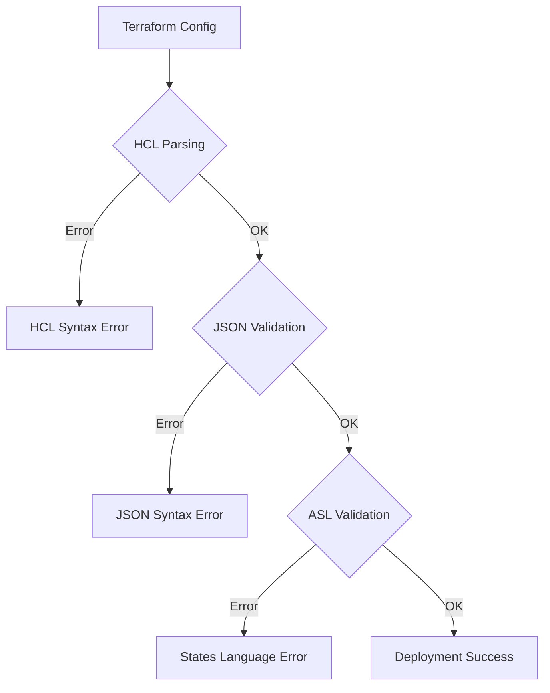

# How to Fix JSON Parsing Errors in AWS Step Functions

Author: [nawazdhandala](https://www.github.com/nawazdhandala)

Tags: AWS, Step Functions, Terraform, Infrastructure as Code, Serverless, JSON

Description: Learn how to diagnose and fix JSON parsing errors in AWS Step Functions when deploying with Terraform. This guide covers common syntax issues, proper escaping, using jsonencode, and best practices for state machine definitions.

AWS Step Functions use Amazon States Language (ASL), which is JSON-based. When defining Step Functions in Terraform, JSON parsing errors are common due to escaping issues, syntax problems, or type mismatches. Let's explore how to identify and fix these errors effectively.

## Understanding the Problem

Step Functions definitions are JSON documents embedded in Terraform. Errors occur at multiple levels:



## Common Error: Unescaped Quotes

The most frequent issue is improper quote escaping when using heredoc syntax.

```hcl
# WRONG - unescaped quotes cause parsing errors
resource "aws_sfn_state_machine" "bad_example" {
  name     = "bad-state-machine"
  role_arn = aws_iam_role.step_functions.arn

  definition = <<EOF
{
  "Comment": "This will fail because of "nested quotes"",
  "StartAt": "FirstState",
  "States": {
    "FirstState": {
      "Type": "Pass",
      "End": true
    }
  }
}
EOF
}

# CORRECT - use jsonencode() function
resource "aws_sfn_state_machine" "good_example" {
  name     = "good-state-machine"
  role_arn = aws_iam_role.step_functions.arn

  definition = jsonencode({
    Comment = "This works because jsonencode handles escaping"
    StartAt = "FirstState"
    States = {
      FirstState = {
        Type = "Pass"
        End  = true
      }
    }
  })
}
```

## Using jsonencode() - The Recommended Approach

The `jsonencode()` function handles all escaping automatically and provides HCL syntax validation.

```hcl
resource "aws_sfn_state_machine" "order_processing" {
  name     = "order-processing"
  role_arn = aws_iam_role.step_functions.arn

  definition = jsonencode({
    Comment = "Order processing workflow"
    StartAt = "ValidateOrder"

    States = {
      ValidateOrder = {
        Type     = "Task"
        Resource = aws_lambda_function.validate_order.arn
        Next     = "CheckInventory"
        Catch = [{
          ErrorEquals = ["ValidationError"]
          Next        = "OrderFailed"
        }]
      }

      CheckInventory = {
        Type     = "Task"
        Resource = aws_lambda_function.check_inventory.arn
        Next     = "ProcessPayment"
        Retry = [{
          ErrorEquals     = ["States.TaskFailed"]
          IntervalSeconds = 3
          MaxAttempts     = 2
          BackoffRate     = 1.5
        }]
      }

      ProcessPayment = {
        Type     = "Task"
        Resource = aws_lambda_function.process_payment.arn
        Next     = "ShipOrder"
      }

      ShipOrder = {
        Type     = "Task"
        Resource = aws_lambda_function.ship_order.arn
        End      = true
      }

      OrderFailed = {
        Type  = "Fail"
        Error = "OrderProcessingFailed"
        Cause = "Order validation or processing failed"
      }
    }
  })
}
```

## Fixing JSONPath Expression Errors

JSONPath expressions in Step Functions use special characters that need careful handling.

```hcl
resource "aws_sfn_state_machine" "with_jsonpath" {
  name     = "jsonpath-example"
  role_arn = aws_iam_role.step_functions.arn

  definition = jsonencode({
    StartAt = "ProcessData"

    States = {
      ProcessData = {
        Type = "Pass"
        Parameters = {
          # Use $$ for literal $ in JSONPath
          "orderId.$"    = "$.order.id"
          "customerId.$" = "$.customer.id"
          "items.$"      = "$.order.items[*]"

          # Static values don't use .$
          "processedAt" = timestamp()
          "version"     = "1.0"
        }
        ResultPath = "$.processedData"
        Next       = "TransformOutput"
      }

      TransformOutput = {
        Type = "Pass"
        InputPath  = "$.processedData"
        OutputPath = "$"
        End = true
      }
    }
  })
}
```

## Choice State with Conditions

Choice states require specific comparison operators that often cause parsing issues.

```hcl
resource "aws_sfn_state_machine" "with_choice" {
  name     = "choice-example"
  role_arn = aws_iam_role.step_functions.arn

  definition = jsonencode({
    StartAt = "CheckOrderType"

    States = {
      CheckOrderType = {
        Type = "Choice"
        Choices = [
          {
            Variable      = "$.orderType"
            StringEquals  = "express"
            Next          = "ExpressProcessing"
          },
          {
            Variable       = "$.orderTotal"
            NumericGreaterThan = 1000
            Next           = "HighValueProcessing"
          },
          {
            # Compound condition using And
            And = [
              {
                Variable     = "$.isPrime"
                BooleanEquals = true
              },
              {
                Variable      = "$.orderType"
                StringEquals  = "standard"
              }
            ]
            Next = "PrimeProcessing"
          }
        ]
        Default = "StandardProcessing"
      }

      ExpressProcessing = {
        Type = "Pass"
        Result = { "processingType" = "express" }
        End = true
      }

      HighValueProcessing = {
        Type = "Pass"
        Result = { "processingType" = "high-value" }
        End = true
      }

      PrimeProcessing = {
        Type = "Pass"
        Result = { "processingType" = "prime" }
        End = true
      }

      StandardProcessing = {
        Type = "Pass"
        Result = { "processingType" = "standard" }
        End = true
      }
    }
  })
}
```

## Map State with Iteration

Map states iterate over arrays, requiring proper configuration to avoid errors.

```hcl
resource "aws_sfn_state_machine" "with_map" {
  name     = "map-example"
  role_arn = aws_iam_role.step_functions.arn

  definition = jsonencode({
    StartAt = "ProcessItems"

    States = {
      ProcessItems = {
        Type = "Map"
        ItemsPath = "$.items"
        MaxConcurrency = 10

        ItemSelector = {
          "itemId.$"   = "$$.Map.Item.Value.id"
          "index.$"    = "$$.Map.Item.Index"
          "context.$"  = "$.context"
        }

        Iterator = {
          StartAt = "ProcessSingleItem"
          States = {
            ProcessSingleItem = {
              Type     = "Task"
              Resource = aws_lambda_function.process_item.arn
              End      = true
            }
          }
        }

        ResultPath = "$.processedItems"
        Next = "AggregateResults"
      }

      AggregateResults = {
        Type     = "Task"
        Resource = aws_lambda_function.aggregate.arn
        End      = true
      }
    }
  })
}
```

## Parallel State Configuration

Parallel states run branches concurrently and need proper structure.

```hcl
resource "aws_sfn_state_machine" "with_parallel" {
  name     = "parallel-example"
  role_arn = aws_iam_role.step_functions.arn

  definition = jsonencode({
    StartAt = "ParallelProcessing"

    States = {
      ParallelProcessing = {
        Type = "Parallel"

        Branches = [
          {
            StartAt = "SendEmail"
            States = {
              SendEmail = {
                Type     = "Task"
                Resource = aws_lambda_function.send_email.arn
                End      = true
              }
            }
          },
          {
            StartAt = "SendSMS"
            States = {
              SendSMS = {
                Type     = "Task"
                Resource = aws_lambda_function.send_sms.arn
                End      = true
              }
            }
          },
          {
            StartAt = "UpdateDatabase"
            States = {
              UpdateDatabase = {
                Type     = "Task"
                Resource = aws_lambda_function.update_db.arn
                End      = true
              }
            }
          }
        ]

        ResultPath = "$.notificationResults"
        Next = "Complete"
      }

      Complete = {
        Type = "Succeed"
      }
    }
  })
}
```

## Wait State with Dynamic Timestamps

Wait states can cause parsing errors with timestamp formats.

```hcl
resource "aws_sfn_state_machine" "with_wait" {
  name     = "wait-example"
  role_arn = aws_iam_role.step_functions.arn

  definition = jsonencode({
    StartAt = "StartProcessing"

    States = {
      StartProcessing = {
        Type = "Pass"
        Next = "WaitForScheduledTime"
      }

      WaitForScheduledTime = {
        Type = "Wait"
        # Wait until timestamp from input
        TimestampPath = "$.scheduledTime"
        Next = "ExecuteTask"
      }

      # Alternative: fixed duration wait
      WaitFixedDuration = {
        Type = "Wait"
        Seconds = 300
        Next = "ExecuteTask"
      }

      # Alternative: dynamic seconds from input
      WaitDynamicDuration = {
        Type = "Wait"
        SecondsPath = "$.waitSeconds"
        Next = "ExecuteTask"
      }

      ExecuteTask = {
        Type     = "Task"
        Resource = aws_lambda_function.execute.arn
        End      = true
      }
    }
  })
}
```

## Using Local Variables for Complex Definitions

For complex state machines, use locals to build the definition.

```hcl
locals {
  common_retry_config = [
    {
      ErrorEquals     = ["Lambda.ServiceException", "Lambda.TooManyRequestsException"]
      IntervalSeconds = 2
      MaxAttempts     = 6
      BackoffRate     = 2
    }
  ]

  common_catch_config = [
    {
      ErrorEquals = ["States.ALL"]
      ResultPath  = "$.error"
      Next        = "HandleError"
    }
  ]

  state_machine_definition = {
    Comment = "Complex workflow with shared configurations"
    StartAt = "Step1"

    States = {
      Step1 = {
        Type     = "Task"
        Resource = aws_lambda_function.step1.arn
        Retry    = local.common_retry_config
        Catch    = local.common_catch_config
        Next     = "Step2"
      }

      Step2 = {
        Type     = "Task"
        Resource = aws_lambda_function.step2.arn
        Retry    = local.common_retry_config
        Catch    = local.common_catch_config
        End      = true
      }

      HandleError = {
        Type     = "Task"
        Resource = aws_lambda_function.error_handler.arn
        End      = true
      }
    }
  }
}

resource "aws_sfn_state_machine" "complex" {
  name       = "complex-workflow"
  role_arn   = aws_iam_role.step_functions.arn
  definition = jsonencode(local.state_machine_definition)
}
```

## Debugging Tips

### Validate JSON Locally

```bash
# Extract and validate JSON from Terraform
terraform console <<< 'jsonencode(local.state_machine_definition)' | jq .

# Use AWS CLI to validate
aws stepfunctions create-state-machine \
  --name "test-validation" \
  --role-arn "arn:aws:iam::123456789:role/test" \
  --definition file://definition.json \
  --dry-run
```

### Common Validation Errors

```hcl
# Error: Missing "End" or "Next"
# Every state must have either End=true or Next="StateName"

# Error: Invalid state name
# State names cannot contain special characters

# Error: Invalid JSONPath
# Ensure paths start with $ and use proper syntax
```

## Best Practices

1. **Always use jsonencode()** - It handles escaping automatically
2. **Use locals for complex definitions** - Improves readability
3. **Validate before apply** - Use terraform plan to catch errors early
4. **Test with small inputs** - Verify JSONPath expressions work
5. **Use AWS Toolkit** - IDE extensions provide ASL validation
6. **Version your definitions** - Track changes in version control

By following these patterns and using `jsonencode()`, you can avoid most JSON parsing errors in Step Functions and create reliable serverless workflows with Terraform.
