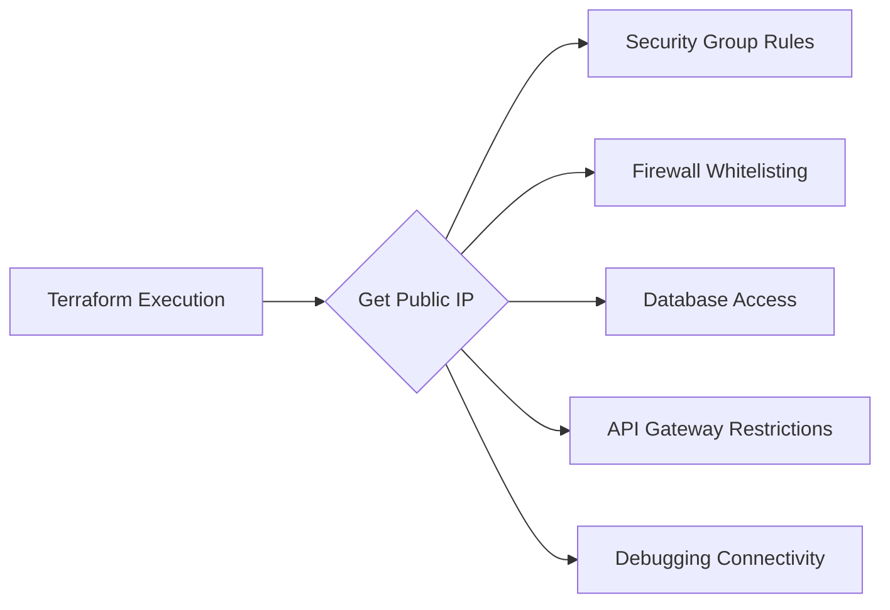

# How to Identify Public IP of Terraform Execution Environment

Author: [nawazdhandala](https://www.github.com/nawazdhandala)

Tags: Terraform, Infrastructure as Code, DevOps, Networking, Security

Description: Learn how to identify the public IP address of your Terraform execution environment. This guide covers using external data sources, HTTP providers, and practical use cases like dynamic security group rules.

When running Terraform, you often need to know the public IP address of the machine executing the commands. This is useful for creating security group rules that allow access from your CI/CD system, whitelisting IPs for database access, or debugging network connectivity issues.

## Why You Need This

Common scenarios where knowing Terraform's execution IP is valuable:



## Method 1: HTTP Data Source

The most reliable method uses the `http` data source to query an IP lookup service.

```hcl
# Get public IP using icanhazip.com
data "http" "my_public_ip" {
  url = "https://icanhazip.com"
}

locals {
  my_public_ip = chomp(data.http.my_public_ip.response_body)
}

output "terraform_execution_ip" {
  value       = local.my_public_ip
  description = "Public IP of Terraform execution environment"
}

# Use in security group
resource "aws_security_group_rule" "allow_terraform" {
  type              = "ingress"
  from_port         = 22
  to_port           = 22
  protocol          = "tcp"
  cidr_blocks       = ["${local.my_public_ip}/32"]
  security_group_id = aws_security_group.main.id
  description       = "SSH from Terraform execution environment"
}
```

## Method 2: Multiple IP Services for Reliability

For production use, query multiple services and handle failures.

```hcl
# Primary IP service
data "http" "ip_icanhazip" {
  url = "https://icanhazip.com"

  request_headers = {
    Accept = "text/plain"
  }

  lifecycle {
    postcondition {
      condition     = self.status_code == 200
      error_message = "Failed to get IP from icanhazip.com"
    }
  }
}

# Backup IP service
data "http" "ip_ipify" {
  url = "https://api.ipify.org"

  lifecycle {
    postcondition {
      condition     = self.status_code == 200
      error_message = "Failed to get IP from ipify.org"
    }
  }
}

# Alternative using ipinfo.io (returns JSON)
data "http" "ip_ipinfo" {
  url = "https://ipinfo.io/json"

  request_headers = {
    Accept = "application/json"
  }
}

locals {
  # Use primary, fallback to backup
  my_ip_primary = chomp(data.http.ip_icanhazip.response_body)
  my_ip_backup  = chomp(data.http.ip_ipify.response_body)

  # Parse JSON response for additional info
  ip_info = jsondecode(data.http.ip_ipinfo.response_body)

  # Verify both services return same IP
  ips_match = local.my_ip_primary == local.my_ip_backup

  # Use the validated IP
  my_public_ip = local.my_ip_primary
}

output "execution_ip" {
  value = local.my_public_ip
}

output "execution_ip_info" {
  value = {
    ip       = local.ip_info.ip
    city     = local.ip_info.city
    region   = local.ip_info.region
    country  = local.ip_info.country
    org      = local.ip_info.org
  }
}

output "ip_verification" {
  value = local.ips_match ? "IPs match" : "WARNING: IPs differ between services"
}
```

## Method 3: External Data Source

Use an external script for more control.

```hcl
# external_ip.tf
data "external" "my_ip" {
  program = ["bash", "${path.module}/scripts/get-ip.sh"]
}

locals {
  my_ip = data.external.my_ip.result.ip
}

output "execution_ip" {
  value = local.my_ip
}
```

```bash
#!/bin/bash
# scripts/get-ip.sh

# Try multiple services
IP=""

# Try icanhazip
IP=$(curl -s --max-time 5 https://icanhazip.com 2>/dev/null | tr -d '[:space:]')

# Fallback to ipify
if [ -z "$IP" ]; then
    IP=$(curl -s --max-time 5 https://api.ipify.org 2>/dev/null | tr -d '[:space:]')
fi

# Fallback to ifconfig.me
if [ -z "$IP" ]; then
    IP=$(curl -s --max-time 5 https://ifconfig.me 2>/dev/null | tr -d '[:space:]')
fi

# Validate IP format
if [[ ! $IP =~ ^[0-9]+\.[0-9]+\.[0-9]+\.[0-9]+$ ]]; then
    echo '{"error": "Could not determine public IP"}' >&2
    exit 1
fi

# Output as JSON (required for external data source)
echo "{\"ip\": \"$IP\"}"
```

## Practical Use Cases

### Dynamic Security Group Rules

```hcl
data "http" "my_public_ip" {
  url = "https://icanhazip.com"
}

locals {
  my_public_ip = chomp(data.http.my_public_ip.response_body)
}

resource "aws_security_group" "database" {
  name        = "database-sg"
  description = "Database security group"
  vpc_id      = aws_vpc.main.id

  # Allow access from Terraform execution environment
  ingress {
    from_port   = 5432
    to_port     = 5432
    protocol    = "tcp"
    cidr_blocks = ["${local.my_public_ip}/32"]
    description = "PostgreSQL from Terraform/CI"
  }

  # Allow access from application servers
  ingress {
    from_port       = 5432
    to_port         = 5432
    protocol        = "tcp"
    security_groups = [aws_security_group.application.id]
    description     = "PostgreSQL from application"
  }

  egress {
    from_port   = 0
    to_port     = 0
    protocol    = "-1"
    cidr_blocks = ["0.0.0.0/0"]
  }
}
```

### RDS with Dynamic IP Whitelisting

```hcl
data "http" "my_public_ip" {
  url = "https://icanhazip.com"
}

locals {
  my_public_ip = chomp(data.http.my_public_ip.response_body)

  # Combine static and dynamic IPs
  allowed_ips = concat(
    var.static_allowed_ips,
    ["${local.my_public_ip}/32"]
  )
}

resource "aws_security_group" "rds" {
  name        = "rds-sg"
  description = "RDS security group"
  vpc_id      = aws_vpc.main.id

  dynamic "ingress" {
    for_each = local.allowed_ips
    content {
      from_port   = 3306
      to_port     = 3306
      protocol    = "tcp"
      cidr_blocks = [ingress.value]
      description = "MySQL access"
    }
  }
}

resource "aws_db_instance" "main" {
  identifier             = "main-database"
  engine                 = "mysql"
  engine_version         = "8.0"
  instance_class         = "db.t3.micro"
  allocated_storage      = 20
  db_name                = "myapp"
  username               = "admin"
  password               = var.db_password
  vpc_security_group_ids = [aws_security_group.rds.id]
  db_subnet_group_name   = aws_db_subnet_group.main.name
  publicly_accessible    = true  # Required for external access
  skip_final_snapshot    = true
}
```

### Kubernetes API Access

```hcl
data "http" "my_public_ip" {
  url = "https://icanhazip.com"
}

locals {
  my_public_ip = chomp(data.http.my_public_ip.response_body)
}

resource "aws_eks_cluster" "main" {
  name     = "main-cluster"
  role_arn = aws_iam_role.eks_cluster.arn

  vpc_config {
    subnet_ids              = aws_subnet.private[*].id
    endpoint_private_access = true
    endpoint_public_access  = true

    # Restrict public access to specific IPs
    public_access_cidrs = [
      "${local.my_public_ip}/32",  # Terraform execution
      "10.0.0.0/8",                 # Internal networks
    ]
  }
}
```

### Debugging Network Connectivity

```hcl
data "http" "my_public_ip" {
  url = "https://icanhazip.com"
}

data "http" "ip_details" {
  url = "https://ipinfo.io/json"
}

locals {
  my_ip   = chomp(data.http.my_public_ip.response_body)
  ip_info = jsondecode(data.http.ip_details.response_body)
}

output "network_debug_info" {
  value = {
    public_ip      = local.my_ip
    city           = local.ip_info.city
    region         = local.ip_info.region
    country        = local.ip_info.country
    isp            = local.ip_info.org
    timezone       = local.ip_info.timezone
    terraform_host = "Run 'hostname' to get local hostname"
  }
  description = "Network debugging information for Terraform execution"
}
```

## CI/CD Considerations

### GitHub Actions

```yaml
# GitHub Actions runners have dynamic IPs
# Consider using GitHub's IP ranges or self-hosted runners

jobs:
  deploy:
    runs-on: ubuntu-latest
    steps:
      - uses: actions/checkout@v4

      - name: Get Runner IP
        run: |
          IP=$(curl -s https://icanhazip.com)
          echo "Runner IP: $IP"
          echo "RUNNER_IP=$IP" >> $GITHUB_ENV

      - name: Terraform Apply
        run: terraform apply -auto-approve
        env:
          TF_VAR_ci_runner_ip: ${{ env.RUNNER_IP }}
```

### GitLab CI

```yaml
deploy:
  script:
    - export RUNNER_IP=$(curl -s https://icanhazip.com)
    - echo "Runner IP is $RUNNER_IP"
    - terraform apply -auto-approve -var="ci_runner_ip=$RUNNER_IP"
```

## Handling IP Changes

```hcl
# Use lifecycle to prevent issues with changing IPs
resource "aws_security_group_rule" "terraform_access" {
  type              = "ingress"
  from_port         = 22
  to_port           = 22
  protocol          = "tcp"
  cidr_blocks       = ["${local.my_public_ip}/32"]
  security_group_id = aws_security_group.main.id

  lifecycle {
    # Create new rule before destroying old one
    create_before_destroy = true
  }
}

# Or use a variable to control this behavior
variable "update_ip_rules" {
  type        = bool
  default     = true
  description = "Update IP-based security rules"
}

resource "aws_security_group_rule" "dynamic_access" {
  count = var.update_ip_rules ? 1 : 0

  type              = "ingress"
  from_port         = 22
  to_port           = 22
  protocol          = "tcp"
  cidr_blocks       = ["${local.my_public_ip}/32"]
  security_group_id = aws_security_group.main.id
}
```

## Best Practices

1. **Use multiple IP services** - Provides redundancy if one service is down
2. **Validate IP format** - Ensure you get a valid IP address
3. **Handle timeouts** - Set appropriate timeouts for HTTP requests
4. **Document IP-based rules** - Add descriptions explaining why IPs are whitelisted
5. **Consider static IPs** - For production, use NAT Gateway or static IP for CI/CD
6. **Clean up dynamic rules** - Remove temporary IP rules after use
7. **Use lifecycle rules** - Prevent access issues during IP changes

By implementing these patterns, you can dynamically identify and use the public IP of your Terraform execution environment for secure, flexible infrastructure configurations.
