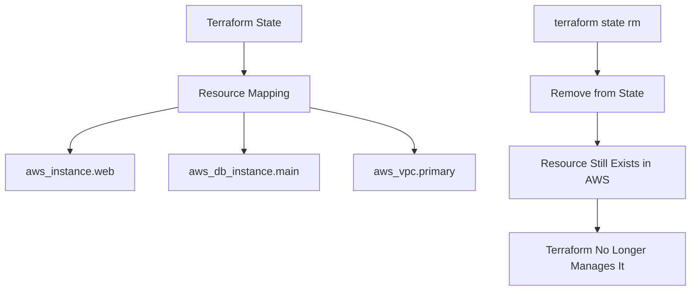

# How to Remove Resources from Terraform State

Author: [nawazdhandala](https://www.github.com/nawazdhandala)

Tags: Terraform, Infrastructure as Code, DevOps, State Management, Operations

Description: Learn how to safely remove resources from Terraform state without destroying them. This guide covers terraform state rm, moved blocks, import workflows, and best practices for state manipulation.

Sometimes you need to remove a resource from Terraform state without actually destroying the resource in your cloud provider. This is useful when migrating resources between Terraform configurations, removing resources from management, or fixing state inconsistencies. Let's explore the different methods and when to use each.

## Understanding Terraform State

Terraform state tracks the mapping between your configuration and real infrastructure. Removing a resource from state tells Terraform to "forget" about it - the actual resource remains untouched.



## Method 1: terraform state rm

The `terraform state rm` command removes resources from state.

### Basic Usage

```bash
# Remove a single resource
terraform state rm aws_instance.web

# Remove a resource with count index
terraform state rm 'aws_instance.web[0]'
terraform state rm 'aws_instance.web[1]'

# Remove a resource with for_each key
terraform state rm 'aws_instance.web["production"]'
terraform state rm 'aws_security_group.main["web-sg"]'

# Remove an entire module
terraform state rm module.vpc
terraform state rm 'module.vpc.aws_vpc.main'

# Remove nested module resources
terraform state rm 'module.network.module.vpc.aws_vpc.main'
```

### Dry Run First

Always preview what will be removed:

```bash
# List all resources in state
terraform state list

# Show specific resource details before removing
terraform state show aws_instance.web

# Backup state before making changes
terraform state pull > terraform.tfstate.backup
```

### Removing Multiple Resources

```bash
# Remove all instances of a resource type
terraform state list | grep 'aws_instance.web' | xargs -I {} terraform state rm '{}'

# Remove all resources in a module
terraform state list | grep '^module.vpc' | xargs -I {} terraform state rm '{}'

# Remove resources matching a pattern
for resource in $(terraform state list | grep 'aws_security_group'); do
  terraform state rm "$resource"
done
```

## Method 2: removed Block (Terraform 1.7+)

Starting with Terraform 1.7, you can use the `removed` block for declarative state removal.

```hcl
# When you want to stop managing a resource but keep it in the cloud
removed {
  from = aws_instance.legacy_server

  lifecycle {
    destroy = false
  }
}

# Remove a resource from a module
removed {
  from = module.old_vpc.aws_vpc.main

  lifecycle {
    destroy = false
  }
}

# Remove resources created with count
removed {
  from = aws_instance.web[0]

  lifecycle {
    destroy = false
  }
}

# Remove resources created with for_each
removed {
  from = aws_security_group.dynamic["deprecated-sg"]

  lifecycle {
    destroy = false
  }
}
```

### Using removed with Refactoring

```hcl
# Original configuration (before)
resource "aws_instance" "old_name" {
  ami           = "ami-0c55b159cbfafe1f0"
  instance_type = "t3.micro"
}

# New configuration with removed block
# This tells Terraform to forget about old_name without destroying it
removed {
  from = aws_instance.old_name

  lifecycle {
    destroy = false
  }
}

# The resource now exists outside Terraform management
# If you want to import it with a new name later:
# terraform import aws_instance.new_name i-1234567890abcdef0
```

## Method 3: moved Block for Refactoring

When renaming or reorganizing resources, use `moved` blocks to transfer state.

```hcl
# Rename a resource
moved {
  from = aws_instance.web_server
  to   = aws_instance.application_server
}

# Move resource into a module
moved {
  from = aws_vpc.main
  to   = module.networking.aws_vpc.main
}

# Move resource out of a module
moved {
  from = module.old_network.aws_vpc.main
  to   = aws_vpc.primary
}

# Rename a module
moved {
  from = module.old_vpc
  to   = module.networking
}

# Move between module instances (for_each)
moved {
  from = module.services["api"]
  to   = module.services["api-gateway"]
}

# Move from count to for_each
moved {
  from = aws_instance.web[0]
  to   = aws_instance.web["primary"]
}
```

### Complete Refactoring Example

```hcl
# Before: flat structure
# resource "aws_vpc" "main" { ... }
# resource "aws_subnet" "public" { ... }
# resource "aws_subnet" "private" { ... }

# After: modular structure
module "networking" {
  source = "./modules/networking"

  vpc_cidr = "10.0.0.0/16"
}

# moved blocks to preserve state
moved {
  from = aws_vpc.main
  to   = module.networking.aws_vpc.main
}

moved {
  from = aws_subnet.public
  to   = module.networking.aws_subnet.public
}

moved {
  from = aws_subnet.private
  to   = module.networking.aws_subnet.private
}
```

## Safe State Removal Workflow

Follow this workflow for safe state manipulation:

```bash
#!/bin/bash
# scripts/safe-state-remove.sh

set -e

RESOURCE=$1
BACKUP_DIR="state-backups"

if [ -z "$RESOURCE" ]; then
    echo "Usage: $0 <resource_address>"
    exit 1
fi

# Create backup directory
mkdir -p "$BACKUP_DIR"

# Create timestamped backup
TIMESTAMP=$(date +%Y%m%d_%H%M%S)
BACKUP_FILE="$BACKUP_DIR/terraform_${TIMESTAMP}.tfstate"

echo "Creating state backup..."
terraform state pull > "$BACKUP_FILE"
echo "Backup saved to: $BACKUP_FILE"

# Show resource details
echo "Resource details:"
terraform state show "$RESOURCE"

# Confirm removal
read -p "Remove $RESOURCE from state? (yes/no): " CONFIRM
if [ "$CONFIRM" != "yes" ]; then
    echo "Aborted"
    exit 0
fi

# Remove from state
echo "Removing $RESOURCE from state..."
terraform state rm "$RESOURCE"

# Verify removal
echo "Verifying removal..."
if terraform state list | grep -q "^${RESOURCE}$"; then
    echo "ERROR: Resource still in state!"
    exit 1
else
    echo "Resource successfully removed from state"
fi

# Run plan to verify
echo "Running terraform plan..."
terraform plan
```

## Handling Complex Scenarios

### Removing Resources with Dependencies

```bash
# Check for dependencies first
terraform state list | while read resource; do
  terraform state show "$resource" 2>/dev/null | grep -q "aws_instance.web" && echo "Depends on web: $resource"
done

# Remove in dependency order (dependents first)
terraform state rm aws_security_group_rule.web_ingress
terraform state rm aws_instance.web
```

### Bulk State Operations

```hcl
# Using Terraform to generate removal commands
output "removal_commands" {
  value = [
    for instance in aws_instance.legacy :
    "terraform state rm 'aws_instance.legacy[\"${instance.tags.Name}\"]'"
  ]
}
```

```bash
# Execute removal commands
terraform output -json removal_commands | jq -r '.[]' | bash
```

### Moving State Between Backends

```bash
# Pull from old backend
cd old-config
terraform state pull > ../migrated.tfstate

# Push to new backend
cd ../new-config
terraform state push ../migrated.tfstate

# Selectively remove from old
cd ../old-config
terraform state rm aws_vpc.main
```

## Recovering from Mistakes

If you accidentally remove a resource from state:

```bash
# Restore from backup
terraform state push terraform.tfstate.backup

# Or re-import the resource
terraform import aws_instance.web i-1234567890abcdef0

# For modules
terraform import 'module.vpc.aws_vpc.main' vpc-12345678
```

### Import After Removal

```hcl
# After removing from state, you can import into a different configuration

# New configuration
resource "aws_instance" "migrated_server" {
  ami           = "ami-0c55b159cbfafe1f0"
  instance_type = "t3.micro"

  # Match existing resource configuration
  tags = {
    Name = "legacy-server"
  }

  lifecycle {
    # Prevent changes during import
    ignore_changes = all
  }
}
```

```bash
# Import the resource
terraform import aws_instance.migrated_server i-1234567890abcdef0

# Remove lifecycle ignore_changes after successful import
```

## State Manipulation in CI/CD

```yaml
# .github/workflows/state-cleanup.yml
name: State Cleanup

on:
  workflow_dispatch:
    inputs:
      resource:
        description: 'Resource address to remove'
        required: true
      environment:
        description: 'Environment'
        required: true
        type: choice
        options:
          - dev
          - staging
          - prod

jobs:
  remove-resource:
    runs-on: ubuntu-latest
    environment: ${{ github.event.inputs.environment }}

    steps:
      - uses: actions/checkout@v4

      - uses: hashicorp/setup-terraform@v3

      - name: Configure AWS Credentials
        uses: aws-actions/configure-aws-credentials@v4
        with:
          aws-access-key-id: ${{ secrets.AWS_ACCESS_KEY_ID }}
          aws-secret-access-key: ${{ secrets.AWS_SECRET_ACCESS_KEY }}
          aws-region: us-east-1

      - name: Terraform Init
        run: terraform init

      - name: Backup State
        run: |
          terraform state pull > state-backup.tfstate
          aws s3 cp state-backup.tfstate s3://terraform-backups/${{ github.event.inputs.environment }}/$(date +%Y%m%d_%H%M%S).tfstate

      - name: Show Resource
        run: terraform state show '${{ github.event.inputs.resource }}'

      - name: Remove Resource
        run: terraform state rm '${{ github.event.inputs.resource }}'

      - name: Verify Plan
        run: terraform plan
```

## Best Practices

1. **Always backup state first** - Use `terraform state pull` before any manipulation
2. **Use removed/moved blocks** - Prefer declarative approaches over CLI commands
3. **Test in non-production** - Practice state operations in development environments
4. **Document removals** - Keep records of what was removed and why
5. **Review plan after removal** - Ensure no unexpected changes
6. **Consider dependencies** - Remove dependent resources in the correct order
7. **Use version control** - Commit removed/moved blocks to track changes

By understanding these state manipulation techniques, you can safely manage Terraform resources, perform migrations, and handle complex refactoring scenarios without disrupting your infrastructure.
