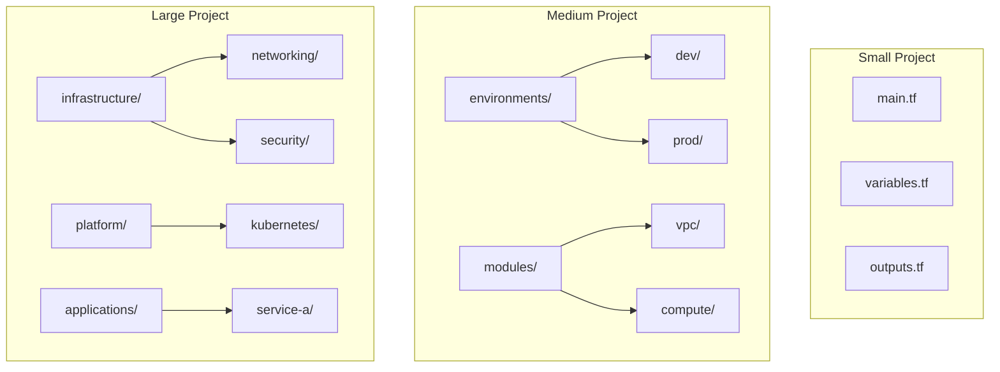

# How to Structure Terraform Folders Properly

Author: [nawazdhandala](https://www.github.com/nawazdhandala)

Tags: Terraform, Infrastructure as Code, DevOps, Best Practices, Project Structure

Description: Learn how to structure Terraform folders for scalable, maintainable infrastructure projects. This guide covers flat structures for small projects, module-based architectures for large deployments, and environment separation strategies.

A well-organized Terraform folder structure is crucial for maintaining infrastructure code as your project grows. Poor organization leads to duplicated code, difficult updates, and team confusion. Let's explore different folder structures suited for various project sizes and requirements.

## Structure Principles

Good Terraform organization follows these principles:

- **DRY (Don't Repeat Yourself)** - Use modules to avoid duplication
- **Separation of Concerns** - Split by environment, component, or team
- **Clear Dependencies** - Make resource relationships obvious
- **Easy Navigation** - Anyone should find resources quickly



## Small Project Structure

For projects with a single environment and few resources, a flat structure works well.

```
terraform/
├── main.tf           # Resource definitions
├── variables.tf      # Variable declarations
├── outputs.tf        # Output values
├── providers.tf      # Provider configuration
├── backend.tf        # Backend configuration
├── terraform.tfvars  # Variable values
└── versions.tf       # Version constraints
```

```hcl
# versions.tf
terraform {
  required_version = ">= 1.0"

  required_providers {
    aws = {
      source  = "hashicorp/aws"
      version = "~> 5.0"
    }
  }
}

# providers.tf
provider "aws" {
  region = var.aws_region
}

# variables.tf
variable "aws_region" {
  type        = string
  default     = "us-east-1"
  description = "AWS region for resources"
}

variable "environment" {
  type        = string
  description = "Environment name"
}

# main.tf
resource "aws_vpc" "main" {
  cidr_block = "10.0.0.0/16"

  tags = {
    Name        = "${var.environment}-vpc"
    Environment = var.environment
  }
}
```

## Medium Project Structure

As projects grow, separate environments and introduce modules.

```
terraform/
├── environments/
│   ├── dev/
│   │   ├── main.tf
│   │   ├── variables.tf
│   │   ├── outputs.tf
│   │   ├── backend.tf
│   │   └── terraform.tfvars
│   ├── staging/
│   │   ├── main.tf
│   │   ├── variables.tf
│   │   ├── outputs.tf
│   │   ├── backend.tf
│   │   └── terraform.tfvars
│   └── prod/
│       ├── main.tf
│       ├── variables.tf
│       ├── outputs.tf
│       ├── backend.tf
│       └── terraform.tfvars
├── modules/
│   ├── vpc/
│   │   ├── main.tf
│   │   ├── variables.tf
│   │   └── outputs.tf
│   ├── compute/
│   │   ├── main.tf
│   │   ├── variables.tf
│   │   └── outputs.tf
│   └── database/
│       ├── main.tf
│       ├── variables.tf
│       └── outputs.tf
└── shared/
    └── providers.tf
```

### Environment Configuration

```hcl
# environments/dev/main.tf
terraform {
  required_version = ">= 1.0"

  backend "s3" {
    bucket = "terraform-state-dev"
    key    = "infrastructure/terraform.tfstate"
    region = "us-east-1"
  }
}

provider "aws" {
  region = var.aws_region
}

module "vpc" {
  source = "../../modules/vpc"

  environment    = "dev"
  vpc_cidr       = "10.0.0.0/16"
  azs            = ["us-east-1a", "us-east-1b"]
  public_subnets = ["10.0.1.0/24", "10.0.2.0/24"]
}

module "compute" {
  source = "../../modules/compute"

  environment   = "dev"
  vpc_id        = module.vpc.vpc_id
  subnet_ids    = module.vpc.public_subnet_ids
  instance_type = "t3.small"
  instance_count = 1
}

# environments/dev/terraform.tfvars
aws_region = "us-east-1"
```

```hcl
# environments/prod/main.tf
terraform {
  required_version = ">= 1.0"

  backend "s3" {
    bucket = "terraform-state-prod"
    key    = "infrastructure/terraform.tfstate"
    region = "us-east-1"
  }
}

provider "aws" {
  region = var.aws_region
}

module "vpc" {
  source = "../../modules/vpc"

  environment    = "prod"
  vpc_cidr       = "10.1.0.0/16"
  azs            = ["us-east-1a", "us-east-1b", "us-east-1c"]
  public_subnets = ["10.1.1.0/24", "10.1.2.0/24", "10.1.3.0/24"]
}

module "compute" {
  source = "../../modules/compute"

  environment    = "prod"
  vpc_id         = module.vpc.vpc_id
  subnet_ids     = module.vpc.public_subnet_ids
  instance_type  = "t3.large"
  instance_count = 3
}
```

### Module Structure

```hcl
# modules/vpc/main.tf
resource "aws_vpc" "main" {
  cidr_block           = var.vpc_cidr
  enable_dns_hostnames = true
  enable_dns_support   = true

  tags = {
    Name        = "${var.environment}-vpc"
    Environment = var.environment
  }
}

resource "aws_subnet" "public" {
  count             = length(var.public_subnets)
  vpc_id            = aws_vpc.main.id
  cidr_block        = var.public_subnets[count.index]
  availability_zone = var.azs[count.index]

  map_public_ip_on_launch = true

  tags = {
    Name        = "${var.environment}-public-${count.index + 1}"
    Environment = var.environment
  }
}

# modules/vpc/variables.tf
variable "environment" {
  type        = string
  description = "Environment name"
}

variable "vpc_cidr" {
  type        = string
  description = "CIDR block for VPC"
}

variable "azs" {
  type        = list(string)
  description = "Availability zones"
}

variable "public_subnets" {
  type        = list(string)
  description = "Public subnet CIDR blocks"
}

# modules/vpc/outputs.tf
output "vpc_id" {
  value       = aws_vpc.main.id
  description = "VPC ID"
}

output "public_subnet_ids" {
  value       = aws_subnet.public[*].id
  description = "Public subnet IDs"
}
```

## Large Project Structure

For large organizations with multiple teams and complex infrastructure.

```
terraform/
├── infrastructure/           # Core infrastructure
│   ├── networking/
│   │   ├── vpc/
│   │   ├── transit-gateway/
│   │   └── dns/
│   ├── security/
│   │   ├── iam/
│   │   ├── kms/
│   │   └── security-groups/
│   └── storage/
│       ├── s3/
│       └── efs/
├── platform/                 # Platform services
│   ├── kubernetes/
│   │   ├── cluster/
│   │   └── addons/
│   ├── databases/
│   │   ├── rds/
│   │   └── elasticache/
│   └── messaging/
│       └── sqs/
├── applications/             # Application-specific
│   ├── service-a/
│   ├── service-b/
│   └── service-c/
├── modules/                  # Shared modules
│   ├── vpc/
│   ├── eks/
│   ├── rds/
│   └── lambda/
├── environments/             # Environment configs
│   ├── dev.tfvars
│   ├── staging.tfvars
│   └── prod.tfvars
└── scripts/                  # Helper scripts
    ├── init.sh
    └── deploy.sh
```

### Layer-Based Approach

```hcl
# infrastructure/networking/vpc/main.tf
terraform {
  backend "s3" {
    bucket = "terraform-state"
    key    = "infrastructure/networking/vpc/terraform.tfstate"
    region = "us-east-1"
  }
}

module "vpc" {
  source = "../../../modules/vpc"

  environment = var.environment
  vpc_cidr    = var.vpc_cidr
  # ... other variables
}

output "vpc_id" {
  value = module.vpc.vpc_id
}

output "private_subnet_ids" {
  value = module.vpc.private_subnet_ids
}
```

```hcl
# platform/kubernetes/cluster/main.tf
terraform {
  backend "s3" {
    bucket = "terraform-state"
    key    = "platform/kubernetes/cluster/terraform.tfstate"
    region = "us-east-1"
  }
}

# Read VPC state from networking layer
data "terraform_remote_state" "vpc" {
  backend = "s3"

  config = {
    bucket = "terraform-state"
    key    = "infrastructure/networking/vpc/terraform.tfstate"
    region = "us-east-1"
  }
}

module "eks" {
  source = "../../../modules/eks"

  environment = var.environment
  vpc_id      = data.terraform_remote_state.vpc.outputs.vpc_id
  subnet_ids  = data.terraform_remote_state.vpc.outputs.private_subnet_ids
  # ... other variables
}
```

## Terragrunt for DRY Configuration

For very large projects, Terragrunt reduces duplication.

```
terragrunt/
├── terragrunt.hcl            # Root config
├── environments/
│   ├── dev/
│   │   ├── env.hcl
│   │   ├── vpc/
│   │   │   └── terragrunt.hcl
│   │   └── eks/
│   │       └── terragrunt.hcl
│   └── prod/
│       ├── env.hcl
│       ├── vpc/
│       │   └── terragrunt.hcl
│       └── eks/
│           └── terragrunt.hcl
└── modules/
    ├── vpc/
    └── eks/
```

```hcl
# terragrunt.hcl (root)
remote_state {
  backend = "s3"
  generate = {
    path      = "backend.tf"
    if_exists = "overwrite_terragrunt"
  }
  config = {
    bucket         = "terraform-state-${get_env("AWS_ACCOUNT_ID")}"
    key            = "${path_relative_to_include()}/terraform.tfstate"
    region         = "us-east-1"
    encrypt        = true
    dynamodb_table = "terraform-locks"
  }
}

generate "provider" {
  path      = "provider.tf"
  if_exists = "overwrite_terragrunt"
  contents  = <<EOF
provider "aws" {
  region = "${local.aws_region}"
}
EOF
}

locals {
  aws_region = "us-east-1"
}
```

```hcl
# environments/dev/env.hcl
locals {
  environment = "dev"
  aws_region  = "us-east-1"
}
```

```hcl
# environments/dev/vpc/terragrunt.hcl
include "root" {
  path = find_in_parent_folders()
}

include "env" {
  path = "../env.hcl"
}

terraform {
  source = "../../../modules/vpc"
}

inputs = {
  environment = local.environment
  vpc_cidr    = "10.0.0.0/16"
}
```

## Naming Conventions

Consistent naming makes navigation easier:

```
# Files
main.tf          # Primary resource definitions
variables.tf     # Input variable declarations
outputs.tf       # Output value definitions
providers.tf     # Provider configurations
backend.tf       # Backend configuration
versions.tf      # Version constraints
locals.tf        # Local value definitions
data.tf          # Data source definitions

# Directories
modules/         # Reusable modules
environments/    # Environment configurations
scripts/         # Helper scripts
tests/           # Test configurations
docs/            # Documentation
```

## CI/CD Integration

Structure supports automated deployments:

```yaml
# .github/workflows/terraform.yml
name: Terraform

on:
  push:
    branches: [main]
    paths:
      - 'terraform/**'

jobs:
  detect-changes:
    runs-on: ubuntu-latest
    outputs:
      matrix: ${{ steps.set-matrix.outputs.matrix }}
    steps:
      - uses: actions/checkout@v4
      - id: set-matrix
        run: |
          CHANGES=$(git diff --name-only HEAD~1 | grep '^terraform/environments' | cut -d'/' -f3 | sort -u)
          echo "matrix=$(echo $CHANGES | jq -R -s -c 'split(" ")')" >> $GITHUB_OUTPUT

  deploy:
    needs: detect-changes
    strategy:
      matrix:
        environment: ${{ fromJson(needs.detect-changes.outputs.matrix) }}
    runs-on: ubuntu-latest
    steps:
      - uses: actions/checkout@v4
      - uses: hashicorp/setup-terraform@v3
      - run: |
          cd terraform/environments/${{ matrix.environment }}
          terraform init
          terraform plan
```

## Best Practices Summary

1. **Start simple** - Begin with flat structure, add complexity as needed
2. **Use modules early** - Even small projects benefit from modules
3. **Separate environments** - Never mix production and development state
4. **Version modules** - Use semantic versioning for shared modules
5. **Document structure** - Include README files explaining organization
6. **Consistent naming** - Follow conventions across all projects
7. **Automate testing** - Add terraform validate and plan to CI/CD

By following these patterns, your Terraform codebase will remain maintainable as it grows, enabling teams to collaborate effectively and deploy infrastructure reliably.
