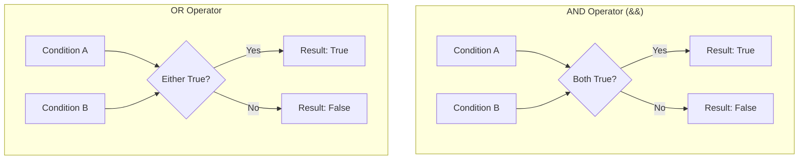

# How to Use AND/OR Conditional Operators in Terraform

Author: [nawazdhandala](https://www.github.com/nawazdhandala)

Tags: Terraform, Conditional Logic, Operators, HCL, Best Practices

Description: Learn how to implement AND and OR conditional logic in Terraform using boolean operators, ternary expressions, and conditional resource creation for flexible infrastructure configurations.

Terraform's HashiCorp Configuration Language (HCL) supports boolean logic through operators like `&&` (AND) and `||` (OR). This guide covers how to effectively use these operators for conditional infrastructure configurations.

## Basic Boolean Operators



Terraform supports:
- `&&` - AND operator (both conditions must be true)
- `||` - OR operator (at least one condition must be true)
- `!` - NOT operator (negates a boolean)

## AND Operator Examples

### Basic AND Usage

```hcl
variable "environment" {
  type    = string
  default = "production"
}

variable "enable_feature" {
  type    = bool
  default = true
}

locals {
  # Both conditions must be true
  enable_enhanced_monitoring = var.environment == "production" && var.enable_feature

  # Multiple AND conditions
  is_production_ready = (
    var.environment == "production" &&
    var.enable_feature &&
    var.min_instances >= 2 &&
    var.enable_backups
  )
}

resource "aws_db_instance" "main" {
  identifier     = "mydb-${var.environment}"
  engine         = "postgres"
  instance_class = "db.t3.medium"

  # Enable enhanced monitoring only in production with feature flag
  performance_insights_enabled = local.enable_enhanced_monitoring

  # Multi-AZ only when production ready
  multi_az = local.is_production_ready
}
```

### AND with Ternary Expressions

```hcl
variable "environment" {
  type = string
}

variable "high_availability" {
  type    = bool
  default = false
}

resource "aws_autoscaling_group" "main" {
  name = "app-${var.environment}"

  # Production AND high availability requested = 4 instances
  # Otherwise = 2 instances
  min_size = var.environment == "production" && var.high_availability ? 4 : 2

  # Production AND high availability = 20 max
  # Production only = 10 max
  # Other = 4 max
  max_size = (
    var.environment == "production" && var.high_availability ? 20 :
    var.environment == "production" ? 10 :
    4
  )

  launch_template {
    id      = aws_launch_template.main.id
    version = "$Latest"
  }
}
```

### AND for Resource Creation

```hcl
variable "create_vpc" {
  type    = bool
  default = true
}

variable "create_nat_gateway" {
  type    = bool
  default = true
}

# Create NAT gateway only if both VPC and NAT gateway are requested
resource "aws_nat_gateway" "main" {
  count = var.create_vpc && var.create_nat_gateway ? 1 : 0

  allocation_id = aws_eip.nat[0].id
  subnet_id     = aws_subnet.public[0].id
}

# EIP also needs both conditions
resource "aws_eip" "nat" {
  count  = var.create_vpc && var.create_nat_gateway ? 1 : 0
  domain = "vpc"
}
```

## OR Operator Examples

### Basic OR Usage

```hcl
variable "environment" {
  type = string
}

variable "force_deletion_protection" {
  type    = bool
  default = false
}

locals {
  # Enable deletion protection in production OR staging OR when forced
  enable_deletion_protection = (
    var.environment == "production" ||
    var.environment == "staging" ||
    var.force_deletion_protection
  )

  # Allow public access only in dev OR test environments
  allow_public_access = var.environment == "development" || var.environment == "test"
}

resource "aws_db_instance" "main" {
  identifier          = "mydb-${var.environment}"
  engine              = "postgres"
  instance_class      = "db.t3.medium"
  deletion_protection = local.enable_deletion_protection
  publicly_accessible = local.allow_public_access
}
```

### OR with Multiple Options

```hcl
variable "instance_size" {
  type    = string
  default = "medium"
}

locals {
  # Large instances need more resources
  is_large_instance = (
    var.instance_size == "large" ||
    var.instance_size == "xlarge" ||
    var.instance_size == "2xlarge"
  )

  # Small instances have limited features
  is_small_instance = (
    var.instance_size == "micro" ||
    var.instance_size == "small"
  )
}

resource "aws_instance" "app" {
  ami           = var.ami_id
  instance_type = var.instance_type

  # Enable detailed monitoring for large instances
  monitoring = local.is_large_instance

  # EBS optimization not available on small instances
  ebs_optimized = !local.is_small_instance
}
```

### OR for Conditional Resource Creation

```hcl
variable "environment" {
  type = string
}

variable "enable_monitoring" {
  type    = bool
  default = false
}

# Create CloudWatch alarms in production/staging OR when explicitly enabled
resource "aws_cloudwatch_metric_alarm" "cpu" {
  count = (
    var.environment == "production" ||
    var.environment == "staging" ||
    var.enable_monitoring
  ) ? 1 : 0

  alarm_name          = "high-cpu-${var.environment}"
  comparison_operator = "GreaterThanThreshold"
  evaluation_periods  = 2
  metric_name         = "CPUUtilization"
  namespace           = "AWS/EC2"
  period              = 300
  statistic           = "Average"
  threshold           = 80
}
```

## Combining AND and OR

### Complex Conditions

```hcl
variable "environment" {
  type = string
}

variable "team" {
  type = string
}

variable "override_permissions" {
  type    = bool
  default = false
}

locals {
  # Production AND platform team, OR has override
  can_modify_infrastructure = (
    (var.environment == "production" && var.team == "platform") ||
    var.override_permissions
  )

  # (Production OR staging) AND (has approval OR is automated)
  can_deploy = (
    (var.environment == "production" || var.environment == "staging") &&
    (var.has_approval || var.is_automated_deployment)
  )
}

# IAM policy based on complex conditions
resource "aws_iam_policy" "deployment" {
  count = local.can_modify_infrastructure ? 1 : 0

  name = "deployment-policy-${var.environment}"

  policy = jsonencode({
    Version = "2012-10-17"
    Statement = [
      {
        Effect = "Allow"
        Action = local.can_deploy ? [
          "ecs:UpdateService",
          "ecs:RegisterTaskDefinition"
        ] : ["ecs:Describe*"]
        Resource = "*"
      }
    ]
  })
}
```

### Using Parentheses for Clarity

```hcl
locals {
  # Without parentheses - can be confusing
  # AND has higher precedence than OR
  confusing = var.a || var.b && var.c  # Evaluates as: a || (b && c)

  # With parentheses - clear intent
  clear_or_first = (var.a || var.b) && var.c  # OR evaluated first
  clear_and_first = var.a || (var.b && var.c)  # AND evaluated first (same as default)
}
```

## NOT Operator

### Negating Conditions

```hcl
variable "environment" {
  type = string
}

variable "maintenance_mode" {
  type    = bool
  default = false
}

locals {
  # NOT production
  is_non_production = var.environment != "production"

  # NOT in maintenance mode
  is_operational = !var.maintenance_mode

  # NOT production AND NOT staging
  is_development = var.environment != "production" && var.environment != "staging"

  # Alternative using NOT with OR
  is_development_alt = !(var.environment == "production" || var.environment == "staging")
}

resource "aws_instance" "app" {
  ami           = var.ami_id
  instance_type = var.instance_type

  # Allow termination in non-production
  disable_api_termination = !local.is_non_production

  # Apply updates only when operational and non-production
  user_data = local.is_operational && local.is_non_production ? file("update-script.sh") : null
}
```

## Practical Use Cases

### Feature Flags

```hcl
variable "features" {
  type = object({
    enable_cache      = bool
    enable_cdn        = bool
    enable_waf        = bool
    enable_monitoring = bool
  })
  default = {
    enable_cache      = false
    enable_cdn        = false
    enable_waf        = false
    enable_monitoring = false
  }
}

# Create cache only if cache OR CDN is enabled
resource "aws_elasticache_cluster" "main" {
  count = var.features.enable_cache || var.features.enable_cdn ? 1 : 0

  cluster_id           = "app-cache"
  engine               = "redis"
  node_type            = "cache.t3.micro"
  num_cache_nodes      = 1
  parameter_group_name = "default.redis7"
}

# WAF requires CDN to be enabled
resource "aws_wafv2_web_acl" "main" {
  count = var.features.enable_waf && var.features.enable_cdn ? 1 : 0

  name  = "app-waf"
  scope = "CLOUDFRONT"

  default_action {
    allow {}
  }

  visibility_config {
    cloudwatch_metrics_enabled = var.features.enable_monitoring
    metric_name                = "app-waf"
    sampled_requests_enabled   = true
  }
}
```

### Environment-Based Configuration

```hcl
variable "environment" {
  type = string
}

variable "cost_optimization" {
  type    = bool
  default = false
}

locals {
  # Use spot instances in dev/test OR when cost optimization is enabled
  use_spot_instances = (
    var.environment == "development" ||
    var.environment == "test" ||
    var.cost_optimization
  )

  # Reserved instances in production AND NOT cost optimizing
  use_reserved_instances = (
    var.environment == "production" &&
    !var.cost_optimization
  )

  # Determine instance purchasing option
  purchasing_option = (
    local.use_spot_instances ? "spot" :
    local.use_reserved_instances ? "reserved" :
    "on-demand"
  )
}

resource "aws_launch_template" "main" {
  name_prefix   = "app-"
  image_id      = var.ami_id
  instance_type = var.instance_type

  dynamic "instance_market_options" {
    for_each = local.use_spot_instances ? [1] : []
    content {
      market_type = "spot"
      spot_options {
        max_price = var.spot_max_price
      }
    }
  }
}
```

### Validation with Conditions

```hcl
variable "instance_count" {
  type = number

  validation {
    # Must be between 1 and 10, OR exactly 0 (disabled)
    condition     = (var.instance_count >= 1 && var.instance_count <= 10) || var.instance_count == 0
    error_message = "Instance count must be between 1-10, or 0 to disable."
  }
}

variable "environment" {
  type = string

  validation {
    condition     = var.environment == "development" || var.environment == "staging" || var.environment == "production"
    error_message = "Environment must be development, staging, or production."
  }
}

variable "backup_config" {
  type = object({
    enabled   = bool
    frequency = string
  })

  validation {
    # If enabled, frequency must be valid
    condition = (
      !var.backup_config.enabled ||
      (var.backup_config.frequency == "daily" || var.backup_config.frequency == "weekly")
    )
    error_message = "When backups are enabled, frequency must be 'daily' or 'weekly'."
  }
}
```

## Best Practices

### 1. Use Locals for Complex Conditions

```hcl
# Good: Named conditions in locals
locals {
  is_production          = var.environment == "production"
  requires_high_availability = local.is_production && var.critical_service
  needs_backup           = local.is_production || var.data_retention_required
}

resource "aws_rds_cluster" "main" {
  cluster_identifier = "app-db"
  engine             = "aurora-postgresql"

  backup_retention_period = local.needs_backup ? 30 : 1
  deletion_protection     = local.requires_high_availability
}
```

### 2. Document Complex Logic

```hcl
locals {
  # Enable enhanced security when:
  # - Running in production environment, OR
  # - Processing sensitive data (PII, financial), OR
  # - Required by compliance (SOC2, HIPAA)
  enable_enhanced_security = (
    var.environment == "production" ||
    var.data_classification == "sensitive" ||
    var.compliance_required
  )
}
```

### 3. Avoid Deep Nesting

```hcl
# Avoid: Deeply nested conditions
bad_example = var.a ? (var.b ? (var.c ? "x" : "y") : "z") : "w"

# Better: Use locals to break down logic
locals {
  step1 = var.c ? "x" : "y"
  step2 = var.b ? local.step1 : "z"
  result = var.a ? local.step2 : "w"
}
```

## Conclusion

Terraform's AND (`&&`) and OR (`||`) operators enable flexible, condition-based infrastructure configurations. Use them with ternary expressions for property values, with `count` or `for_each` for conditional resource creation, and in variable validation rules. Always use parentheses to clarify operator precedence, extract complex conditions into locals with meaningful names, and document the business logic behind your conditional configurations.
