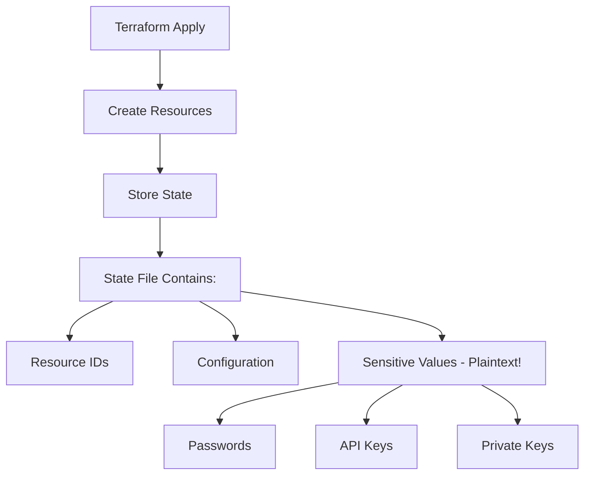
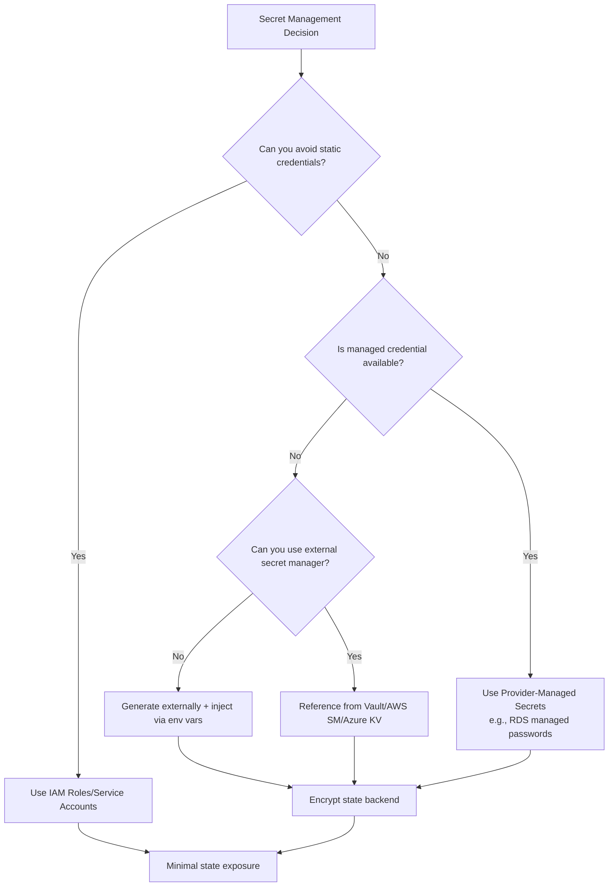

# How to Avoid Writing Secrets in Terraform State

Author: [nawazdhandala](https://www.github.com/nawazdhandala)

Tags: Terraform, Security, Secrets Management, Infrastructure as Code, DevOps

Description: Learn strategies to keep sensitive data out of Terraform state files. This guide covers secret management solutions, dynamic credentials, and architectural patterns for secure infrastructure.

Terraform state files contain a complete snapshot of your infrastructure, including sensitive values like database passwords, API keys, and certificates. Since state is stored in plaintext JSON, this presents significant security risks. This guide explores strategies to minimize or eliminate secrets in your Terraform state.

## Understanding the Problem

When you create resources with sensitive attributes, those values are stored in state:

```hcl
# This password will be stored in plaintext in terraform.tfstate
resource "aws_db_instance" "main" {
  identifier     = "production-db"
  engine         = "postgres"
  instance_class = "db.t3.medium"
  username       = "admin"
  password       = var.db_password  # Stored in state!
}
```



## Strategy 1: Use External Secret Managers

Instead of storing secrets in Terraform, reference them from dedicated secret managers:

### AWS Secrets Manager

```hcl
# Create a secret placeholder (not the actual value)
resource "aws_secretsmanager_secret" "db_password" {
  name = "production/db/password"
}

# Secret value is managed outside Terraform
# Or use a rotation lambda

# Reference the secret in your database
data "aws_secretsmanager_secret_version" "db_password" {
  secret_id = aws_secretsmanager_secret.db_password.id
}

resource "aws_db_instance" "main" {
  identifier     = "production-db"
  engine         = "postgres"
  instance_class = "db.t3.medium"
  username       = "admin"

  # Password is fetched at apply time, but still ends up in state
  password = data.aws_secretsmanager_secret_version.db_password.secret_string

  # Better: Use IAM authentication instead
  iam_database_authentication_enabled = true
}
```

### HashiCorp Vault

```hcl
# Configure Vault provider
provider "vault" {
  address = "https://vault.example.com:8200"
}

# Read secrets from Vault
data "vault_generic_secret" "database" {
  path = "secret/data/production/database"
}

# Use in resources
resource "aws_db_instance" "main" {
  identifier     = "production-db"
  engine         = "postgres"
  instance_class = "db.t3.medium"
  username       = data.vault_generic_secret.database.data["username"]
  password       = data.vault_generic_secret.database.data["password"]
}
```

### Azure Key Vault

```hcl
data "azurerm_key_vault" "main" {
  name                = "production-keyvault"
  resource_group_name = "security-rg"
}

data "azurerm_key_vault_secret" "db_password" {
  name         = "database-admin-password"
  key_vault_id = data.azurerm_key_vault.main.id
}

resource "azurerm_mssql_server" "main" {
  name                         = "production-sql"
  resource_group_name          = azurerm_resource_group.main.name
  location                     = azurerm_resource_group.main.location
  version                      = "12.0"
  administrator_login          = "sqladmin"
  administrator_login_password = data.azurerm_key_vault_secret.db_password.value
}
```

## Strategy 2: Generate Secrets Outside Terraform

Generate secrets before Terraform runs and inject them via environment variables:

```hcl
# Variable marked as sensitive
variable "database_password" {
  type        = string
  sensitive   = true
  description = "Database password - provide via TF_VAR_database_password env var"
}

resource "aws_db_instance" "main" {
  identifier     = "production-db"
  engine         = "postgres"
  instance_class = "db.t3.medium"
  username       = "admin"
  password       = var.database_password
}
```

In CI/CD pipeline:

```yaml
# GitLab CI example
deploy:
  script:
    - export TF_VAR_database_password=$(vault kv get -field=password secret/prod/database)
    - terraform apply -auto-approve
```

## Strategy 3: Use managed_password with RDS

AWS RDS supports managed passwords in Secrets Manager:

```hcl
resource "aws_db_instance" "main" {
  identifier     = "production-db"
  engine         = "postgres"
  instance_class = "db.t3.medium"
  username       = "admin"

  # Let AWS manage the password
  manage_master_user_password   = true
  master_user_secret_kms_key_id = aws_kms_key.rds.arn
}

resource "aws_kms_key" "rds" {
  description = "KMS key for RDS master password"
}

# Output the secret ARN (not the password itself)
output "master_password_secret_arn" {
  value = aws_db_instance.main.master_user_secret[0].secret_arn
}
```

## Strategy 4: Ephemeral Resources and Credentials

Use ephemeral credentials that don't need to be stored:

```hcl
# Use IAM roles instead of access keys
resource "aws_iam_role" "app" {
  name = "application-role"

  assume_role_policy = jsonencode({
    Version = "2012-10-17"
    Statement = [{
      Action = "sts:AssumeRole"
      Effect = "Allow"
      Principal = {
        Service = "ec2.amazonaws.com"
      }
    }]
  })
}

# Instance profile - no static credentials needed
resource "aws_iam_instance_profile" "app" {
  name = "application-profile"
  role = aws_iam_role.app.name
}

resource "aws_instance" "app" {
  ami                  = data.aws_ami.ubuntu.id
  instance_type        = "t3.medium"
  iam_instance_profile = aws_iam_instance_profile.app.name

  # No AWS credentials in user_data!
}
```

## Strategy 5: random_password with lifecycle Ignore

Generate passwords that persist without being tracked in state after initial creation:

```hcl
resource "random_password" "db" {
  length           = 32
  special          = true
  override_special = "!#$%&*()-_=+[]{}<>:?"
}

resource "aws_db_instance" "main" {
  identifier     = "production-db"
  engine         = "postgres"
  instance_class = "db.t3.medium"
  username       = "admin"
  password       = random_password.db.result

  lifecycle {
    ignore_changes = [password]
  }
}

# Store the password in a secret manager immediately
resource "aws_secretsmanager_secret" "db_password" {
  name = "production/db/password"
}

resource "aws_secretsmanager_secret_version" "db_password" {
  secret_id     = aws_secretsmanager_secret.db_password.id
  secret_string = random_password.db.result
}
```

## Strategy 6: Encrypt State Backend

If secrets must be in state, ensure the backend is encrypted:

### S3 Backend with Encryption

```hcl
terraform {
  backend "s3" {
    bucket         = "terraform-state-prod"
    key            = "infrastructure/terraform.tfstate"
    region         = "us-east-1"
    encrypt        = true
    kms_key_id     = "alias/terraform-state-key"
    dynamodb_table = "terraform-locks"
  }
}
```

### Azure Backend with Encryption

```hcl
terraform {
  backend "azurerm" {
    resource_group_name  = "terraform-state-rg"
    storage_account_name = "tfstateprod"
    container_name       = "tfstate"
    key                  = "infrastructure.tfstate"

    # Storage account should have:
    # - Infrastructure encryption enabled
    # - Customer-managed keys
    # - Private endpoint access only
  }
}
```

## Strategy 7: Post-Apply Secret Rotation

Rotate secrets immediately after Terraform creates resources:

```hcl
resource "aws_db_instance" "main" {
  identifier     = "production-db"
  engine         = "postgres"
  instance_class = "db.t3.medium"
  username       = "admin"
  password       = random_password.initial.result
}

# Trigger password rotation after creation
resource "null_resource" "rotate_password" {
  depends_on = [aws_db_instance.main]

  provisioner "local-exec" {
    command = <<-EOT
      # Generate new password
      NEW_PASSWORD=$(openssl rand -base64 32)

      # Update in RDS
      aws rds modify-db-instance \
        --db-instance-identifier ${aws_db_instance.main.identifier} \
        --master-user-password "$NEW_PASSWORD" \
        --apply-immediately

      # Store in Secrets Manager
      aws secretsmanager put-secret-value \
        --secret-id production/db/password \
        --secret-string "$NEW_PASSWORD"
    EOT
  }

  triggers = {
    instance_id = aws_db_instance.main.id
  }
}
```

## Strategy 8: Use SOPS for Variable Files

Encrypt sensitive variable files:

```bash
# Create encrypted variables file
sops --encrypt --kms arn:aws:kms:us-east-1:ACCOUNT:key/KEY_ID secrets.tfvars > secrets.tfvars.enc
```

```hcl
# Decrypt at runtime using external data source
data "external" "secrets" {
  program = ["sops", "-d", "--output-type", "json", "${path.module}/secrets.tfvars.enc"]
}

resource "aws_db_instance" "main" {
  # ...
  password = data.external.secrets.result["database_password"]
}
```

## Best Practices Summary



### Key Recommendations

1. **Prefer managed identities**: Use IAM roles, service accounts, and managed identities instead of static credentials
2. **Use secret managers**: Store secrets in Vault, AWS Secrets Manager, or Azure Key Vault
3. **Encrypt state**: Always enable encryption on state backends
4. **Rotate after creation**: Change auto-generated passwords immediately after resource creation
5. **Mark variables sensitive**: Use `sensitive = true` to prevent accidental logging
6. **Restrict state access**: Limit who can read state files
7. **Use remote state**: Never store state locally in production

## Conclusion

While Terraform's state model makes it challenging to completely avoid storing secrets, these strategies significantly reduce exposure. The best approach combines multiple techniques: using managed identities where possible, leveraging external secret managers, encrypting state backends, and implementing post-creation rotation. Choose the strategy that fits your security requirements and infrastructure complexity.
