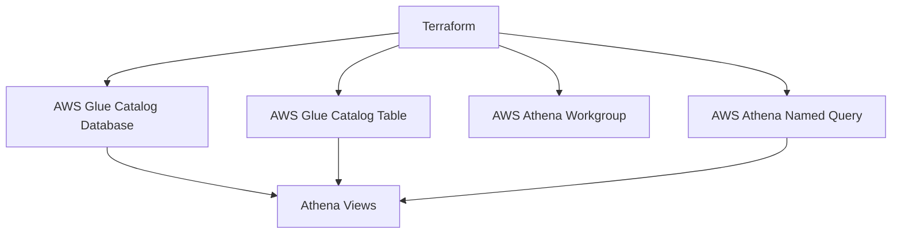

# How to Create AWS Athena Views Programmatically with Terraform

Author: [nawazdhandala](https://www.github.com/nawazdhandala)

Tags: Terraform, AWS, Athena, Infrastructure as Code, Data Engineering

Description: Learn how to create and manage AWS Athena views programmatically using Terraform. This guide covers named queries, workgroups, and best practices for maintaining data lake views as code.

AWS Athena is a powerful serverless query service that lets you analyze data in Amazon S3 using standard SQL. When building data lakes, you often need to create views that abstract complex joins or transformations. Managing these views as code with Terraform ensures reproducibility, version control, and consistent deployments across environments.

## Understanding Athena Views in Terraform

Athena views are essentially saved SQL queries that act as virtual tables. Unlike traditional databases, Athena stores view definitions as metadata in the AWS Glue Data Catalog. Terraform provides several resources to manage Athena infrastructure:



## Setting Up the Foundation

Before creating views, you need a Glue database and an Athena workgroup. Here's the complete setup:

```hcl
# Provider configuration
provider "aws" {
  region = "us-east-1"
}

# S3 bucket for Athena query results
resource "aws_s3_bucket" "athena_results" {
  bucket = "my-athena-query-results-${data.aws_caller_identity.current.account_id}"
}

resource "aws_s3_bucket_lifecycle_configuration" "athena_results" {
  bucket = aws_s3_bucket.athena_results.id

  rule {
    id     = "expire_old_results"
    status = "Enabled"

    expiration {
      days = 7
    }
  }
}

# Glue database for our data lake
resource "aws_glue_catalog_database" "analytics" {
  name        = "analytics_db"
  description = "Analytics database for data lake views"
}

# Athena workgroup with encryption
resource "aws_athena_workgroup" "analytics" {
  name = "analytics_workgroup"

  configuration {
    enforce_workgroup_configuration    = true
    publish_cloudwatch_metrics_enabled = true

    result_configuration {
      output_location = "s3://${aws_s3_bucket.athena_results.bucket}/query-results/"

      encryption_configuration {
        encryption_option = "SSE_S3"
      }
    }
  }
}

data "aws_caller_identity" "current" {}
```

## Creating Views Using Glue Catalog Tables

The most reliable way to create Athena views is through `aws_glue_catalog_table` with the correct table type and view definition:

```hcl
# Base table pointing to raw data
resource "aws_glue_catalog_table" "orders_raw" {
  name          = "orders_raw"
  database_name = aws_glue_catalog_database.analytics.name

  table_type = "EXTERNAL_TABLE"

  parameters = {
    "classification" = "parquet"
    "EXTERNAL"       = "TRUE"
  }

  storage_descriptor {
    location      = "s3://my-data-lake/orders/"
    input_format  = "org.apache.hadoop.hive.ql.io.parquet.MapredParquetInputFormat"
    output_format = "org.apache.hadoop.hive.ql.io.parquet.MapredParquetOutputFormat"

    ser_de_info {
      serialization_library = "org.apache.hadoop.hive.ql.io.parquet.serde.ParquetHiveSerDe"
    }

    columns {
      name = "order_id"
      type = "string"
    }
    columns {
      name = "customer_id"
      type = "string"
    }
    columns {
      name = "order_date"
      type = "timestamp"
    }
    columns {
      name = "total_amount"
      type = "decimal(10,2)"
    }
    columns {
      name = "status"
      type = "string"
    }
  }
}

# Create a view using Glue Catalog Table
resource "aws_glue_catalog_table" "orders_summary_view" {
  name          = "orders_summary"
  database_name = aws_glue_catalog_database.analytics.name

  table_type = "VIRTUAL_VIEW"

  parameters = {
    "presto_view" = "true"
    "comment"     = "Summary view of orders aggregated by customer"
  }

  view_original_text = "/* Presto View: ${base64encode(local.orders_summary_view_definition)} */"
  view_expanded_text = "/* Presto View */"

  storage_descriptor {
    columns {
      name = "customer_id"
      type = "string"
    }
    columns {
      name = "total_orders"
      type = "bigint"
    }
    columns {
      name = "total_revenue"
      type = "decimal(10,2)"
    }
    columns {
      name = "last_order_date"
      type = "timestamp"
    }

    ser_de_info {
      name = "ParquetHiveSerDe"
    }
  }
}

locals {
  orders_summary_view_definition = jsonencode({
    originalSql = "SELECT customer_id, COUNT(*) as total_orders, SUM(total_amount) as total_revenue, MAX(order_date) as last_order_date FROM analytics_db.orders_raw GROUP BY customer_id"
    catalog     = "awsdatacatalog"
    schema      = "analytics_db"
    columns = [
      { name = "customer_id", type = "varchar" },
      { name = "total_orders", type = "bigint" },
      { name = "total_revenue", type = "decimal(10,2)" },
      { name = "last_order_date", type = "timestamp" }
    ]
  })
}
```

## Using Named Queries for View Creation

An alternative approach uses Athena named queries with a null resource to execute them:

```hcl
# Named query to create a view
resource "aws_athena_named_query" "create_monthly_stats_view" {
  name        = "create_monthly_stats_view"
  workgroup   = aws_athena_workgroup.analytics.name
  database    = aws_glue_catalog_database.analytics.name
  description = "Creates the monthly statistics view"

  query = <<-SQL
    CREATE OR REPLACE VIEW monthly_order_stats AS
    SELECT
      date_trunc('month', order_date) as month,
      COUNT(DISTINCT customer_id) as unique_customers,
      COUNT(*) as total_orders,
      SUM(total_amount) as revenue,
      AVG(total_amount) as avg_order_value
    FROM orders_raw
    WHERE status = 'completed'
    GROUP BY date_trunc('month', order_date)
  SQL
}

# Execute the named query using local-exec provisioner
resource "null_resource" "execute_view_creation" {
  depends_on = [aws_athena_named_query.create_monthly_stats_view]

  triggers = {
    query_hash = sha256(aws_athena_named_query.create_monthly_stats_view.query)
  }

  provisioner "local-exec" {
    command = <<-EOT
      aws athena start-query-execution \
        --query-string "${replace(aws_athena_named_query.create_monthly_stats_view.query, "\"", "\\\"")}" \
        --work-group ${aws_athena_workgroup.analytics.name} \
        --query-execution-context Database=${aws_glue_catalog_database.analytics.name} \
        --result-configuration OutputLocation=s3://${aws_s3_bucket.athena_results.bucket}/view-creation/
    EOT
  }
}
```

## Managing Complex Views with Modules

For larger data lakes, organize views into reusable modules:

```hcl
# modules/athena-view/main.tf
variable "database_name" {
  type        = string
  description = "Name of the Glue database"
}

variable "view_name" {
  type        = string
  description = "Name of the view to create"
}

variable "view_query" {
  type        = string
  description = "SQL query for the view"
}

variable "columns" {
  type = list(object({
    name = string
    type = string
  }))
  description = "Column definitions for the view"
}

locals {
  presto_view_definition = jsonencode({
    originalSql = var.view_query
    catalog     = "awsdatacatalog"
    schema      = var.database_name
    columns = [
      for col in var.columns : {
        name = col.name
        type = col.type
      }
    ]
  })
}

resource "aws_glue_catalog_table" "view" {
  name          = var.view_name
  database_name = var.database_name
  table_type    = "VIRTUAL_VIEW"

  parameters = {
    "presto_view" = "true"
  }

  view_original_text = "/* Presto View: ${base64encode(local.presto_view_definition)} */"
  view_expanded_text = "/* Presto View */"

  storage_descriptor {
    dynamic "columns" {
      for_each = var.columns
      content {
        name = columns.value.name
        type = columns.value.type
      }
    }

    ser_de_info {
      name = "ParquetHiveSerDe"
    }
  }
}

output "view_name" {
  value = aws_glue_catalog_table.view.name
}
```

Using the module:

```hcl
module "customer_lifetime_value_view" {
  source = "./modules/athena-view"

  database_name = aws_glue_catalog_database.analytics.name
  view_name     = "customer_lifetime_value"

  view_query = <<-SQL
    SELECT
      customer_id,
      MIN(order_date) as first_order,
      MAX(order_date) as last_order,
      COUNT(*) as total_orders,
      SUM(total_amount) as lifetime_value
    FROM orders_raw
    GROUP BY customer_id
  SQL

  columns = [
    { name = "customer_id", type = "varchar" },
    { name = "first_order", type = "timestamp" },
    { name = "last_order", type = "timestamp" },
    { name = "total_orders", type = "bigint" },
    { name = "lifetime_value", type = "decimal(10,2)" }
  ]
}
```

## Best Practices for Athena Views in Terraform

### 1. Version Control Your View Definitions

Keep SQL queries in separate files for better maintainability:

```hcl
# views/monthly_stats.sql
locals {
  monthly_stats_query = file("${path.module}/views/monthly_stats.sql")
}
```

### 2. Use Workgroup Separation

Create separate workgroups for different environments:

```hcl
resource "aws_athena_workgroup" "environment" {
  for_each = toset(["dev", "staging", "prod"])

  name = "analytics_${each.key}"

  configuration {
    result_configuration {
      output_location = "s3://${aws_s3_bucket.athena_results.bucket}/${each.key}/"
    }
  }
}
```

### 3. Implement Proper Dependencies

Ensure views are created after their dependent tables:

```hcl
resource "aws_glue_catalog_table" "aggregated_view" {
  depends_on = [
    aws_glue_catalog_table.orders_raw,
    aws_glue_catalog_table.customers_raw
  ]
  # ... view definition
}
```

### 4. Handle State Drift

Use lifecycle rules to handle external changes:

```hcl
resource "aws_glue_catalog_table" "view" {
  # ... configuration

  lifecycle {
    create_before_destroy = true
    ignore_changes = [
      parameters["transient_lastDdlTime"]
    ]
  }
}
```

## Troubleshooting Common Issues

**Issue: View shows different schema than expected**

Ensure the columns in `storage_descriptor` match the query output exactly. Athena is strict about type mappings between Presto types and Hive types.

**Issue: "HIVE_METASTORE_ERROR" when querying the view**

This usually indicates a malformed `view_original_text`. Verify the base64 encoding and JSON structure of the Presto view definition.

**Issue: Views not updating after query changes**

Add a trigger based on query hash to force recreation:

```hcl
resource "aws_glue_catalog_table" "view" {
  # ...

  lifecycle {
    replace_triggered_by = [
      null_resource.view_query_hash
    ]
  }
}

resource "null_resource" "view_query_hash" {
  triggers = {
    query_hash = sha256(local.view_query)
  }
}
```

## Conclusion

Managing Athena views with Terraform brings consistency and reproducibility to your data lake infrastructure. By using Glue Catalog tables with proper Presto view definitions, you can version control your data transformations alongside your infrastructure code. This approach enables teams to review changes, roll back when needed, and maintain identical analytics views across all environments.
