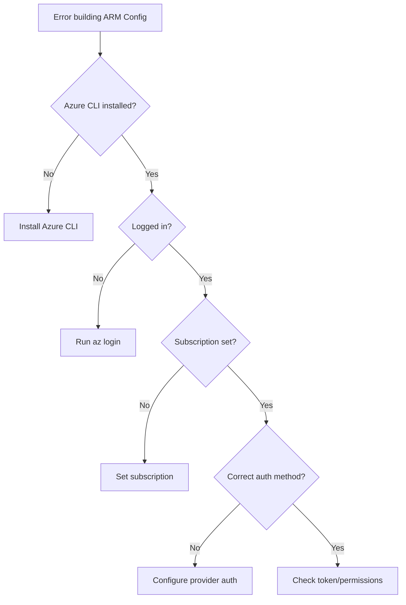

# How to Fix "Error building ARM Config" Azure CLI Issues

Author: [nawazdhandala](https://www.github.com/nawazdhandala)

Tags: Terraform, Azure, ARM, Azure CLI, DevOps

Description: Troubleshoot and fix the "Error building ARM Config" in Terraform when working with Azure, including authentication issues, subscription problems, and CLI configuration.

---

The "Error building ARM Config" message in Terraform indicates a problem with Azure authentication or configuration. This guide covers all common causes and their solutions.

## Understanding the Error

The full error typically appears as:

```
Error: Error building ARM Config: obtain subscription() from Azure CLI:
Error parsing json result from the Azure CLI: Error waiting for the Azure CLI: exit status 1

Error: Error building ARM Config: Error creating Azure client:
Authenticating using the Azure CLI is only supported as a User (not a Service Principal).
```

## Diagnostic Flowchart



## Fix 1: Install Azure CLI

First, ensure Azure CLI is installed:

```bash
# Check if Azure CLI is installed
az version

# Install on macOS
brew install azure-cli

# Install on Ubuntu/Debian
curl -sL https://aka.ms/InstallAzureCLIDeb | sudo bash

# Install on Windows (PowerShell)
winget install Microsoft.AzureCLI
```

## Fix 2: Log In to Azure CLI

The most common cause is not being logged in:

```bash
# Interactive login (opens browser)
az login

# Login with device code (for headless environments)
az login --use-device-code

# Login as service principal
az login --service-principal \
  --username $ARM_CLIENT_ID \
  --password $ARM_CLIENT_SECRET \
  --tenant $ARM_TENANT_ID

# Check current login status
az account show
```

## Fix 3: Set the Correct Subscription

Terraform needs to know which subscription to use:

```bash
# List available subscriptions
az account list --output table

# Set the active subscription
az account set --subscription "Your-Subscription-Name"

# Or use subscription ID
az account set --subscription "xxxxxxxx-xxxx-xxxx-xxxx-xxxxxxxxxxxx"

# Verify the change
az account show --output table
```

Configure in Terraform:

```hcl
provider "azurerm" {
  features {}

  subscription_id = var.subscription_id
  # Optional: Specify tenant
  tenant_id       = var.tenant_id
}
```

## Fix 4: Use Service Principal Authentication

For CI/CD pipelines, use service principal instead of CLI:

```hcl
provider "azurerm" {
  features {}

  client_id       = var.client_id
  client_secret   = var.client_secret
  tenant_id       = var.tenant_id
  subscription_id = var.subscription_id
}
```

Or use environment variables:

```bash
export ARM_CLIENT_ID="your-client-id"
export ARM_CLIENT_SECRET="your-client-secret"
export ARM_TENANT_ID="your-tenant-id"
export ARM_SUBSCRIPTION_ID="your-subscription-id"

# Then run Terraform
terraform init
terraform plan
```

## Fix 5: Create Service Principal

If you do not have a service principal:

```bash
# Create service principal with Contributor role
az ad sp create-for-rbac \
  --name "terraform-sp" \
  --role Contributor \
  --scopes /subscriptions/YOUR-SUBSCRIPTION-ID

# Output:
# {
#   "appId": "xxxxxxxx-xxxx-xxxx-xxxx-xxxxxxxxxxxx",      <- ARM_CLIENT_ID
#   "displayName": "terraform-sp",
#   "password": "xxxxxxxx-xxxx-xxxx-xxxx-xxxxxxxxxxxx",   <- ARM_CLIENT_SECRET
#   "tenant": "xxxxxxxx-xxxx-xxxx-xxxx-xxxxxxxxxxxx"      <- ARM_TENANT_ID
# }
```

## Fix 6: Fix Token Expiration

Azure CLI tokens expire. Refresh them:

```bash
# Check token validity
az account get-access-token

# If expired, login again
az login

# For service principals, tokens are generated per request
# but you might need to re-authenticate if credentials changed
```

## Fix 7: Clear Azure CLI Cache

Corrupted cache can cause issues:

```bash
# Clear Azure CLI cache
az account clear

# Remove cached credentials
rm -rf ~/.azure/accessTokens.json
rm -rf ~/.azure/azureProfile.json

# Login again
az login
az account set --subscription "Your-Subscription"
```

## Fix 8: Fix Multiple Subscriptions Issue

When you have access to multiple subscriptions:

```bash
# List all subscriptions and their states
az account list --query "[].{Name:name, ID:id, Default:isDefault}" --output table

# Explicitly set subscription in Terraform
```

```hcl
terraform {
  required_providers {
    azurerm = {
      source  = "hashicorp/azurerm"
      version = "~> 3.0"
    }
  }
}

provider "azurerm" {
  features {}

  # Explicitly specify subscription to avoid ambiguity
  subscription_id = "xxxxxxxx-xxxx-xxxx-xxxx-xxxxxxxxxxxx"
}
```

## Fix 9: Handle Managed Identity

For Azure VMs or App Services using Managed Identity:

```hcl
provider "azurerm" {
  features {}

  # Use system-assigned managed identity
  use_msi = true

  # Or use user-assigned managed identity
  # use_msi   = true
  # client_id = "managed-identity-client-id"

  subscription_id = var.subscription_id
  tenant_id       = var.tenant_id
}
```

## Fix 10: Configure for Azure DevOps Pipelines

In Azure DevOps, use the service connection:

```yaml
# azure-pipelines.yml
trigger:
  - main

pool:
  vmImage: 'ubuntu-latest'

steps:
  - task: AzureCLI@2
    displayName: 'Terraform Init and Plan'
    inputs:
      azureSubscription: 'Your-Service-Connection-Name'
      scriptType: 'bash'
      scriptLocation: 'inlineScript'
      inlineScript: |
        # Azure CLI is already authenticated via service connection

        # Export credentials for Terraform
        export ARM_CLIENT_ID=$servicePrincipalId
        export ARM_CLIENT_SECRET=$servicePrincipalKey
        export ARM_TENANT_ID=$tenantId
        export ARM_SUBSCRIPTION_ID=$(az account show --query id -o tsv)

        terraform init
        terraform plan
      addSpnToEnvironment: true
```

## Fix 11: Configure for GitHub Actions

```yaml
# .github/workflows/terraform.yml
name: Terraform

on:
  push:
    branches: [main]

jobs:
  terraform:
    runs-on: ubuntu-latest

    env:
      ARM_CLIENT_ID: ${{ secrets.AZURE_CLIENT_ID }}
      ARM_CLIENT_SECRET: ${{ secrets.AZURE_CLIENT_SECRET }}
      ARM_TENANT_ID: ${{ secrets.AZURE_TENANT_ID }}
      ARM_SUBSCRIPTION_ID: ${{ secrets.AZURE_SUBSCRIPTION_ID }}

    steps:
      - uses: actions/checkout@v4

      - name: Setup Terraform
        uses: hashicorp/setup-terraform@v3

      - name: Terraform Init
        run: terraform init

      - name: Terraform Plan
        run: terraform plan
```

## Fix 12: Debug Authentication Issues

Enable debug logging to understand the issue:

```bash
# Enable Terraform debug logging
export TF_LOG=DEBUG
terraform plan 2>&1 | tee terraform-debug.log

# Enable Azure CLI debug
az login --debug

# Test Azure CLI connectivity
az group list --output table
```

## Fix 13: Handle Proxy Issues

If behind a corporate proxy:

```bash
# Set proxy environment variables
export HTTP_PROXY="http://proxy.example.com:8080"
export HTTPS_PROXY="http://proxy.example.com:8080"
export NO_PROXY="localhost,127.0.0.1,169.254.169.254"

# For Azure CLI specifically
az config set core.use_command_extensions=true
```

## Complete Working Configuration

Here is a complete, working Terraform configuration for Azure:

```hcl
terraform {
  required_version = ">= 1.0"

  required_providers {
    azurerm = {
      source  = "hashicorp/azurerm"
      version = "~> 3.0"
    }
  }

  backend "azurerm" {
    resource_group_name  = "terraform-state-rg"
    storage_account_name = "tfstate12345"
    container_name       = "tfstate"
    key                  = "prod.terraform.tfstate"
  }
}

provider "azurerm" {
  features {
    resource_group {
      prevent_deletion_if_contains_resources = false
    }

    key_vault {
      purge_soft_delete_on_destroy = true
    }
  }

  # Explicit subscription (recommended)
  subscription_id = var.subscription_id

  # For service principal auth (optional - uses env vars if not specified)
  # client_id       = var.client_id
  # client_secret   = var.client_secret
  # tenant_id       = var.tenant_id
}

variable "subscription_id" {
  description = "Azure subscription ID"
  type        = string
}

# Test resource
resource "azurerm_resource_group" "example" {
  name     = "example-resources"
  location = "East US"
}
```

## Troubleshooting Commands Reference

```bash
# Check Azure CLI version
az version

# Check current account
az account show

# List subscriptions
az account list --output table

# Test API connectivity
az group list --output table

# Check service principal
az ad sp show --id $ARM_CLIENT_ID

# Verify permissions
az role assignment list --assignee $ARM_CLIENT_ID --output table

# Refresh credentials
az account clear && az login
```

---

The "Error building ARM Config" usually comes down to authentication - either missing credentials, expired tokens, or incorrect subscription configuration. Start by verifying `az login` works, then ensure the correct subscription is set. For CI/CD, always use service principal authentication with explicit environment variables or provider configuration.
