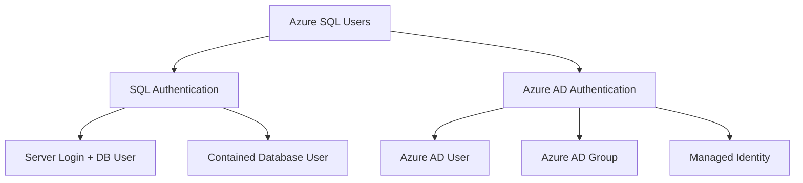

# How to Add Azure SQL Users with Terraform

Author: [nawazdhandala](https://www.github.com/nawazdhandala)

Tags: Terraform, Azure, SQL Server, Database, Security

Description: Learn how to create and manage Azure SQL database users with Terraform, including contained users, Azure AD authentication, and proper permission management.

---

Managing Azure SQL users with Terraform requires understanding the difference between server-level and database-level users, authentication methods, and the right providers. This guide covers all common scenarios.

## Understanding Azure SQL User Types



## Prerequisites

You need the AzureAD and AzureRM providers, plus the MSSQL provider for database-level operations:

```hcl
terraform {
  required_providers {
    azurerm = {
      source  = "hashicorp/azurerm"
      version = "~> 3.0"
    }
    azuread = {
      source  = "hashicorp/azuread"
      version = "~> 2.0"
    }
    mssql = {
      source  = "betr-io/mssql"
      version = "~> 0.3"
    }
  }
}

provider "azurerm" {
  features {}
}

provider "azuread" {}
```

## Method 1: SQL Authentication Users

### Create Server and Database

```hcl
# Random password for SQL admin
resource "random_password" "sql_admin" {
  length           = 32
  special          = true
  override_special = "!#$%&*()-_=+[]{}<>:?"
}

# Azure SQL Server
resource "azurerm_mssql_server" "main" {
  name                         = "sql-server-${var.environment}"
  resource_group_name          = azurerm_resource_group.main.name
  location                     = azurerm_resource_group.main.location
  version                      = "12.0"
  administrator_login          = "sqladmin"
  administrator_login_password = random_password.sql_admin.result

  azuread_administrator {
    login_username = "AzureAD Admin"
    object_id      = data.azuread_user.admin.object_id
  }
}

# Database
resource "azurerm_mssql_database" "app" {
  name         = "appdb"
  server_id    = azurerm_mssql_server.main.id
  collation    = "SQL_Latin1_General_CP1_CI_AS"
  license_type = "LicenseIncluded"
  max_size_gb  = 50
  sku_name     = "S1"
}

# Firewall rule to allow Azure services
resource "azurerm_mssql_firewall_rule" "azure_services" {
  name             = "AllowAzureServices"
  server_id        = azurerm_mssql_server.main.id
  start_ip_address = "0.0.0.0"
  end_ip_address   = "0.0.0.0"
}
```

### Create SQL Login and User with MSSQL Provider

```hcl
provider "mssql" {
  hostname = azurerm_mssql_server.main.fully_qualified_domain_name
  port     = 1433

  sql_auth {
    username = azurerm_mssql_server.main.administrator_login
    password = random_password.sql_admin.result
  }
}

# Generate password for app user
resource "random_password" "app_user" {
  length           = 24
  special          = true
  override_special = "!#$%&*()-_=+[]{}<>:?"
}

# Create SQL login (server-level)
resource "mssql_login" "app" {
  server {
    host = azurerm_mssql_server.main.fully_qualified_domain_name
    login {
      username = azurerm_mssql_server.main.administrator_login
      password = random_password.sql_admin.result
    }
  }

  login_name = "app_login"
  password   = random_password.app_user.result
}

# Create database user
resource "mssql_user" "app" {
  server {
    host = azurerm_mssql_server.main.fully_qualified_domain_name
    login {
      username = azurerm_mssql_server.main.administrator_login
      password = random_password.sql_admin.result
    }
  }

  database   = azurerm_mssql_database.app.name
  username   = "app_user"
  login_name = mssql_login.app.login_name
  roles      = ["db_datareader", "db_datawriter"]
}
```

## Method 2: Contained Database Users

Contained users do not require server-level logins:

```hcl
# Enable contained database authentication on server
resource "azurerm_mssql_server" "main" {
  name                         = "sql-server-${var.environment}"
  resource_group_name          = azurerm_resource_group.main.name
  location                     = azurerm_resource_group.main.location
  version                      = "12.0"
  administrator_login          = "sqladmin"
  administrator_login_password = random_password.sql_admin.result
}

# Create contained user using null_resource and sqlcmd
resource "null_resource" "contained_user" {
  depends_on = [azurerm_mssql_database.app]

  triggers = {
    username = var.app_username
  }

  provisioner "local-exec" {
    command = <<-EOT
      sqlcmd -S ${azurerm_mssql_server.main.fully_qualified_domain_name} \
        -d ${azurerm_mssql_database.app.name} \
        -U ${azurerm_mssql_server.main.administrator_login} \
        -P '${random_password.sql_admin.result}' \
        -Q "
          IF NOT EXISTS (SELECT * FROM sys.database_principals WHERE name = '${var.app_username}')
          BEGIN
            CREATE USER [${var.app_username}] WITH PASSWORD = '${random_password.app_user.result}';
            ALTER ROLE db_datareader ADD MEMBER [${var.app_username}];
            ALTER ROLE db_datawriter ADD MEMBER [${var.app_username}];
          END
        "
    EOT

    interpreter = ["bash", "-c"]
  }
}
```

## Method 3: Azure AD Users

### Add Azure AD User

```hcl
# Get Azure AD user
data "azuread_user" "app_developer" {
  user_principal_name = "developer@contoso.com"
}

# Configure Azure AD admin on SQL Server
resource "azurerm_mssql_server" "main" {
  name                         = "sql-server-${var.environment}"
  resource_group_name          = azurerm_resource_group.main.name
  location                     = azurerm_resource_group.main.location
  version                      = "12.0"
  administrator_login          = "sqladmin"
  administrator_login_password = random_password.sql_admin.result

  azuread_administrator {
    login_username              = "AzureADAdmin"
    object_id                   = data.azuread_user.admin.object_id
    azuread_authentication_only = false
  }
}

# Create Azure AD user in database
resource "null_resource" "aad_user" {
  depends_on = [azurerm_mssql_database.app]

  triggers = {
    user_id = data.azuread_user.app_developer.object_id
  }

  provisioner "local-exec" {
    command = <<-EOT
      # Login with Azure AD
      az login --service-principal \
        -u $ARM_CLIENT_ID \
        -p $ARM_CLIENT_SECRET \
        --tenant $ARM_TENANT_ID

      # Get access token for SQL
      TOKEN=$(az account get-access-token \
        --resource https://database.windows.net/ \
        --query accessToken -o tsv)

      # Create user using sqlcmd with AAD token
      sqlcmd -S ${azurerm_mssql_server.main.fully_qualified_domain_name} \
        -d ${azurerm_mssql_database.app.name} \
        -G -P "$TOKEN" \
        -Q "
          IF NOT EXISTS (SELECT * FROM sys.database_principals WHERE name = '${data.azuread_user.app_developer.display_name}')
          BEGIN
            CREATE USER [${data.azuread_user.app_developer.user_principal_name}] FROM EXTERNAL PROVIDER;
            ALTER ROLE db_datareader ADD MEMBER [${data.azuread_user.app_developer.user_principal_name}];
          END
        "
    EOT

    interpreter = ["bash", "-c"]
  }
}
```

### Add Azure AD Group

```hcl
# Create Azure AD group for database access
resource "azuread_group" "sql_readers" {
  display_name     = "SQL Database Readers"
  security_enabled = true
}

# Add members to the group
resource "azuread_group_member" "developer" {
  group_object_id  = azuread_group.sql_readers.id
  member_object_id = data.azuread_user.app_developer.object_id
}

# Create database user for the group
resource "null_resource" "aad_group_user" {
  depends_on = [azurerm_mssql_database.app, azuread_group.sql_readers]

  triggers = {
    group_id = azuread_group.sql_readers.id
  }

  provisioner "local-exec" {
    command = <<-EOT
      sqlcmd -S ${azurerm_mssql_server.main.fully_qualified_domain_name} \
        -d ${azurerm_mssql_database.app.name} \
        -U ${azurerm_mssql_server.main.administrator_login} \
        -P '${random_password.sql_admin.result}' \
        -Q "
          IF NOT EXISTS (SELECT * FROM sys.database_principals WHERE name = '${azuread_group.sql_readers.display_name}')
          BEGIN
            CREATE USER [${azuread_group.sql_readers.display_name}] FROM EXTERNAL PROVIDER;
            ALTER ROLE db_datareader ADD MEMBER [${azuread_group.sql_readers.display_name}];
          END
        "
    EOT
  }
}
```

## Method 4: Managed Identity Access

```hcl
# Create managed identity for application
resource "azurerm_user_assigned_identity" "app" {
  name                = "app-identity"
  location            = azurerm_resource_group.main.location
  resource_group_name = azurerm_resource_group.main.name
}

# Grant SQL access to managed identity
resource "null_resource" "managed_identity_user" {
  depends_on = [azurerm_mssql_database.app, azurerm_user_assigned_identity.app]

  triggers = {
    identity_id = azurerm_user_assigned_identity.app.principal_id
  }

  provisioner "local-exec" {
    command = <<-EOT
      sqlcmd -S ${azurerm_mssql_server.main.fully_qualified_domain_name} \
        -d ${azurerm_mssql_database.app.name} \
        -U ${azurerm_mssql_server.main.administrator_login} \
        -P '${random_password.sql_admin.result}' \
        -Q "
          IF NOT EXISTS (SELECT * FROM sys.database_principals WHERE name = '${azurerm_user_assigned_identity.app.name}')
          BEGIN
            CREATE USER [${azurerm_user_assigned_identity.app.name}] FROM EXTERNAL PROVIDER;
            ALTER ROLE db_datareader ADD MEMBER [${azurerm_user_assigned_identity.app.name}];
            ALTER ROLE db_datawriter ADD MEMBER [${azurerm_user_assigned_identity.app.name}];
          END
        "
    EOT
  }
}

# App Service using managed identity
resource "azurerm_linux_web_app" "app" {
  name                = "app-${var.environment}"
  location            = azurerm_resource_group.main.location
  resource_group_name = azurerm_resource_group.main.name
  service_plan_id     = azurerm_service_plan.main.id

  identity {
    type         = "UserAssigned"
    identity_ids = [azurerm_user_assigned_identity.app.id]
  }

  site_config {
    always_on = true
  }

  connection_string {
    name  = "Database"
    type  = "SQLAzure"
    # Connection string for managed identity auth
    value = "Server=${azurerm_mssql_server.main.fully_qualified_domain_name};Database=${azurerm_mssql_database.app.name};Authentication=Active Directory Managed Identity;User Id=${azurerm_user_assigned_identity.app.client_id};"
  }
}
```

## Complete Module Example

```hcl
# modules/sql-user/main.tf

variable "server_fqdn" {
  type = string
}

variable "database_name" {
  type = string
}

variable "admin_username" {
  type = string
}

variable "admin_password" {
  type      = string
  sensitive = true
}

variable "username" {
  type = string
}

variable "password" {
  type      = string
  sensitive = true
}

variable "roles" {
  type    = list(string)
  default = ["db_datareader"]
}

locals {
  role_assignments = join("\n", [
    for role in var.roles : "ALTER ROLE ${role} ADD MEMBER [${var.username}];"
  ])
}

resource "null_resource" "sql_user" {
  triggers = {
    username = var.username
    roles    = join(",", var.roles)
  }

  provisioner "local-exec" {
    command = <<-EOT
      sqlcmd -S ${var.server_fqdn} \
        -d ${var.database_name} \
        -U ${var.admin_username} \
        -P '${var.admin_password}' \
        -Q "
          IF NOT EXISTS (SELECT * FROM sys.database_principals WHERE name = '${var.username}')
          BEGIN
            CREATE USER [${var.username}] WITH PASSWORD = '${var.password}';
          END
          ${local.role_assignments}
        "
    EOT
  }

  provisioner "local-exec" {
    when    = destroy
    command = <<-EOT
      sqlcmd -S ${self.triggers.server_fqdn} \
        -d ${self.triggers.database_name} \
        -U ${self.triggers.admin_username} \
        -P '${self.triggers.admin_password}' \
        -Q "DROP USER IF EXISTS [${self.triggers.username}];"
    EOT
  }
}

output "username" {
  value = var.username
}
```

### Using the Module

```hcl
module "app_user" {
  source = "./modules/sql-user"

  server_fqdn    = azurerm_mssql_server.main.fully_qualified_domain_name
  database_name  = azurerm_mssql_database.app.name
  admin_username = azurerm_mssql_server.main.administrator_login
  admin_password = random_password.sql_admin.result
  username       = "app_service"
  password       = random_password.app_user.result
  roles          = ["db_datareader", "db_datawriter"]
}
```

## Storing Credentials Securely

```hcl
# Store credentials in Key Vault
resource "azurerm_key_vault_secret" "sql_connection" {
  name         = "sql-connection-string"
  value        = "Server=${azurerm_mssql_server.main.fully_qualified_domain_name};Database=${azurerm_mssql_database.app.name};User Id=${module.app_user.username};Password=${random_password.app_user.result};"
  key_vault_id = azurerm_key_vault.main.id
}

resource "azurerm_key_vault_secret" "sql_password" {
  name         = "sql-app-password"
  value        = random_password.app_user.result
  key_vault_id = azurerm_key_vault.main.id
}
```

## Outputs

```hcl
output "connection_string" {
  value     = "Server=${azurerm_mssql_server.main.fully_qualified_domain_name};Database=${azurerm_mssql_database.app.name};User Id=${module.app_user.username};Password=${random_password.app_user.result};"
  sensitive = true
}

output "server_fqdn" {
  value = azurerm_mssql_server.main.fully_qualified_domain_name
}

output "database_name" {
  value = azurerm_mssql_database.app.name
}
```

---

Managing Azure SQL users with Terraform requires using either the MSSQL provider for native support or null_resource with sqlcmd for more complex scenarios. For production environments, prefer Azure AD authentication with managed identities, which eliminates password management. Always store sensitive credentials in Azure Key Vault and use appropriate database roles following the principle of least privilege.
