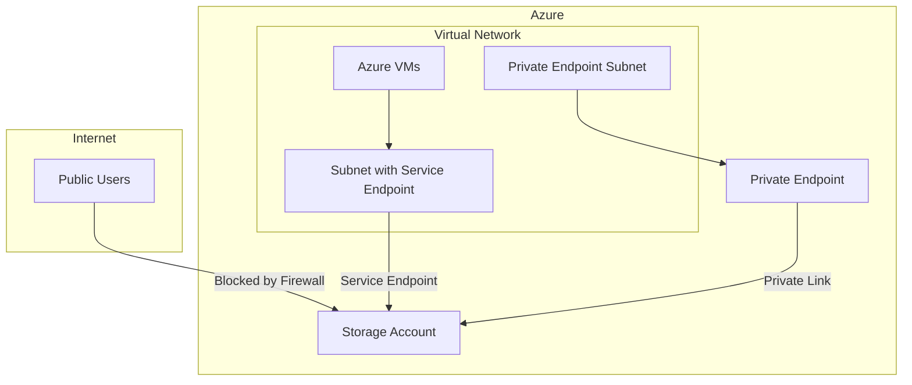

# How to Create Azure Storage Containers with Network Rules in Terraform

Author: [nawazdhandala](https://www.github.com/nawazdhandala)

Tags: Terraform, Azure, Storage, Network Rules, Security, Firewall

Description: Learn how to create Azure Storage accounts and containers with comprehensive network rules using Terraform, including private endpoints, service endpoints, IP restrictions, and virtual network integration.

Azure Storage accounts often contain sensitive data and require strict network access controls. This guide demonstrates how to create storage containers with comprehensive network rules using Terraform, ensuring your data is protected while remaining accessible to authorized services.

## Understanding Azure Storage Network Security



Azure Storage supports multiple network security layers:
- **Firewall rules**: IP-based access control
- **Virtual network rules**: Service endpoint access
- **Private endpoints**: Private Link access
- **Trusted Azure services**: Allow specific Azure services

## Basic Storage Account with Network Rules

```hcl
# providers.tf
terraform {
  required_providers {
    azurerm = {
      source  = "hashicorp/azurerm"
      version = "~> 3.85"
    }
  }
}

provider "azurerm" {
  features {}
}

# variables.tf
variable "resource_group_name" {
  type    = string
  default = "storage-network-rules-rg"
}

variable "location" {
  type    = string
  default = "eastus"
}

variable "allowed_ips" {
  type        = list(string)
  description = "List of allowed IP addresses or CIDR ranges"
  default     = []
}

# main.tf
resource "azurerm_resource_group" "main" {
  name     = var.resource_group_name
  location = var.location
}

resource "azurerm_storage_account" "main" {
  name                     = "storageacct${random_string.suffix.result}"
  resource_group_name      = azurerm_resource_group.main.name
  location                 = azurerm_resource_group.main.location
  account_tier             = "Standard"
  account_replication_type = "LRS"
  min_tls_version          = "TLS1_2"

  # Enable hierarchical namespace for Data Lake features (optional)
  is_hns_enabled = false

  # Disable public blob access
  allow_nested_items_to_be_public = false

  # Disable shared key access (use Azure AD only)
  shared_access_key_enabled = true

  # Network rules - deny all by default
  network_rules {
    default_action             = "Deny"
    ip_rules                   = var.allowed_ips
    virtual_network_subnet_ids = []
    bypass                     = ["AzureServices", "Logging", "Metrics"]
  }

  tags = {
    Environment = "Production"
    ManagedBy   = "Terraform"
  }
}

resource "random_string" "suffix" {
  length  = 8
  special = false
  upper   = false
}

# Create container
resource "azurerm_storage_container" "data" {
  name                  = "data"
  storage_account_name  = azurerm_storage_account.main.name
  container_access_type = "private"
}
```

## Adding Virtual Network Rules

Service endpoints allow VNet resources to access storage without going through the public internet:

```hcl
# Virtual network with service endpoint
resource "azurerm_virtual_network" "main" {
  name                = "storage-vnet"
  address_space       = ["10.0.0.0/16"]
  location            = azurerm_resource_group.main.location
  resource_group_name = azurerm_resource_group.main.name
}

resource "azurerm_subnet" "app" {
  name                 = "app-subnet"
  resource_group_name  = azurerm_resource_group.main.name
  virtual_network_name = azurerm_virtual_network.main.name
  address_prefixes     = ["10.0.1.0/24"]

  # Enable service endpoint for storage
  service_endpoints = ["Microsoft.Storage"]
}

resource "azurerm_subnet" "data" {
  name                 = "data-subnet"
  resource_group_name  = azurerm_resource_group.main.name
  virtual_network_name = azurerm_virtual_network.main.name
  address_prefixes     = ["10.0.2.0/24"]

  service_endpoints = ["Microsoft.Storage"]
}

# Storage account with VNet rules
resource "azurerm_storage_account" "with_vnet" {
  name                     = "storagevnet${random_string.suffix.result}"
  resource_group_name      = azurerm_resource_group.main.name
  location                 = azurerm_resource_group.main.location
  account_tier             = "Standard"
  account_replication_type = "LRS"
  min_tls_version          = "TLS1_2"

  network_rules {
    default_action = "Deny"

    # Allow specific IPs (e.g., office IP, CI/CD runners)
    ip_rules = [
      "203.0.113.50",      # Office IP
      "198.51.100.0/24"    # CI/CD range
    ]

    # Allow specific subnets
    virtual_network_subnet_ids = [
      azurerm_subnet.app.id,
      azurerm_subnet.data.id
    ]

    # Allow trusted Azure services
    bypass = ["AzureServices", "Logging", "Metrics"]
  }

  tags = {
    Environment = "Production"
  }
}
```

## Private Endpoint Configuration

Private endpoints provide the most secure access by assigning a private IP from your VNet:

```hcl
# Subnet for private endpoints
resource "azurerm_subnet" "private_endpoints" {
  name                 = "private-endpoints"
  resource_group_name  = azurerm_resource_group.main.name
  virtual_network_name = azurerm_virtual_network.main.name
  address_prefixes     = ["10.0.3.0/24"]

  # Disable network policies for private endpoints
  private_endpoint_network_policies_enabled = false
}

# Storage account for private endpoint
resource "azurerm_storage_account" "private" {
  name                     = "storagepvt${random_string.suffix.result}"
  resource_group_name      = azurerm_resource_group.main.name
  location                 = azurerm_resource_group.main.location
  account_tier             = "Standard"
  account_replication_type = "LRS"
  min_tls_version          = "TLS1_2"

  # Deny all public access
  public_network_access_enabled = false

  network_rules {
    default_action = "Deny"
    bypass         = ["AzureServices"]
  }

  tags = {
    Environment = "Production"
  }
}

# Private endpoint for blob storage
resource "azurerm_private_endpoint" "blob" {
  name                = "storage-blob-pe"
  location            = azurerm_resource_group.main.location
  resource_group_name = azurerm_resource_group.main.name
  subnet_id           = azurerm_subnet.private_endpoints.id

  private_service_connection {
    name                           = "storage-blob-connection"
    private_connection_resource_id = azurerm_storage_account.private.id
    subresource_names              = ["blob"]
    is_manual_connection           = false
  }

  tags = {
    Environment = "Production"
  }
}

# Private DNS zone for blob storage
resource "azurerm_private_dns_zone" "blob" {
  name                = "privatelink.blob.core.windows.net"
  resource_group_name = azurerm_resource_group.main.name
}

# Link DNS zone to VNet
resource "azurerm_private_dns_zone_virtual_network_link" "blob" {
  name                  = "blob-dns-link"
  resource_group_name   = azurerm_resource_group.main.name
  private_dns_zone_name = azurerm_private_dns_zone.blob.name
  virtual_network_id    = azurerm_virtual_network.main.id
  registration_enabled  = false
}

# DNS record for private endpoint
resource "azurerm_private_dns_a_record" "blob" {
  name                = azurerm_storage_account.private.name
  zone_name           = azurerm_private_dns_zone.blob.name
  resource_group_name = azurerm_resource_group.main.name
  ttl                 = 300
  records             = [azurerm_private_endpoint.blob.private_service_connection[0].private_ip_address]
}
```

## Complete Multi-Container Setup with Network Rules

```hcl
# variables.tf
variable "containers" {
  type = map(object({
    access_type = string
    metadata    = map(string)
  }))
  default = {
    "raw-data" = {
      access_type = "private"
      metadata = {
        purpose = "raw data ingestion"
      }
    }
    "processed-data" = {
      access_type = "private"
      metadata = {
        purpose = "processed analytics data"
      }
    }
    "backups" = {
      access_type = "private"
      metadata = {
        purpose = "backup storage"
      }
    }
  }
}

# main.tf
resource "azurerm_storage_account" "data_lake" {
  name                     = "datalake${random_string.suffix.result}"
  resource_group_name      = azurerm_resource_group.main.name
  location                 = azurerm_resource_group.main.location
  account_tier             = "Standard"
  account_replication_type = "GRS"
  account_kind             = "StorageV2"
  min_tls_version          = "TLS1_2"
  is_hns_enabled           = true  # Enable for Data Lake Gen2

  allow_nested_items_to_be_public = false

  blob_properties {
    versioning_enabled = true

    delete_retention_policy {
      days = 30
    }

    container_delete_retention_policy {
      days = 30
    }
  }

  network_rules {
    default_action = "Deny"

    ip_rules = var.allowed_ips

    virtual_network_subnet_ids = [
      azurerm_subnet.app.id,
      azurerm_subnet.data.id
    ]

    bypass = ["AzureServices", "Logging", "Metrics"]

    # Allow specific resource instances
    private_link_access {
      endpoint_resource_id = "/subscriptions/${data.azurerm_subscription.current.subscription_id}/providers/Microsoft.DataFactory/factories/*"
      endpoint_tenant_id   = data.azurerm_subscription.current.tenant_id
    }
  }

  identity {
    type = "SystemAssigned"
  }

  tags = {
    Environment = "Production"
    DataClass   = "Confidential"
  }
}

data "azurerm_subscription" "current" {}

# Create multiple containers
resource "azurerm_storage_container" "containers" {
  for_each = var.containers

  name                  = each.key
  storage_account_name  = azurerm_storage_account.data_lake.name
  container_access_type = each.value.access_type
  metadata              = each.value.metadata
}
```

## Lifecycle Management with Network Rules

Add lifecycle policies to manage blob retention:

```hcl
resource "azurerm_storage_management_policy" "lifecycle" {
  storage_account_id = azurerm_storage_account.data_lake.id

  rule {
    name    = "archive-old-data"
    enabled = true

    filters {
      prefix_match = ["raw-data/"]
      blob_types   = ["blockBlob"]
    }

    actions {
      base_blob {
        tier_to_cool_after_days_since_modification_greater_than    = 30
        tier_to_archive_after_days_since_modification_greater_than = 90
        delete_after_days_since_modification_greater_than          = 365
      }
      snapshot {
        delete_after_days_since_creation_greater_than = 30
      }
    }
  }

  rule {
    name    = "delete-old-backups"
    enabled = true

    filters {
      prefix_match = ["backups/"]
      blob_types   = ["blockBlob"]
    }

    actions {
      base_blob {
        delete_after_days_since_modification_greater_than = 90
      }
    }
  }
}
```

## Dynamic Network Rules Module

Create a reusable module for storage with network rules:

```hcl
# modules/secure-storage/variables.tf
variable "name" {
  type = string
}

variable "resource_group_name" {
  type = string
}

variable "location" {
  type = string
}

variable "allowed_subnet_ids" {
  type    = list(string)
  default = []
}

variable "allowed_ips" {
  type    = list(string)
  default = []
}

variable "enable_private_endpoint" {
  type    = bool
  default = false
}

variable "private_endpoint_subnet_id" {
  type    = string
  default = ""
}

variable "containers" {
  type    = list(string)
  default = []
}

# modules/secure-storage/main.tf
resource "azurerm_storage_account" "this" {
  name                     = var.name
  resource_group_name      = var.resource_group_name
  location                 = var.location
  account_tier             = "Standard"
  account_replication_type = "LRS"
  min_tls_version          = "TLS1_2"

  allow_nested_items_to_be_public = false
  public_network_access_enabled   = !var.enable_private_endpoint

  network_rules {
    default_action             = "Deny"
    ip_rules                   = var.allowed_ips
    virtual_network_subnet_ids = var.allowed_subnet_ids
    bypass                     = ["AzureServices"]
  }
}

resource "azurerm_storage_container" "this" {
  for_each = toset(var.containers)

  name                  = each.value
  storage_account_name  = azurerm_storage_account.this.name
  container_access_type = "private"
}

resource "azurerm_private_endpoint" "this" {
  count = var.enable_private_endpoint ? 1 : 0

  name                = "${var.name}-pe"
  location            = var.location
  resource_group_name = var.resource_group_name
  subnet_id           = var.private_endpoint_subnet_id

  private_service_connection {
    name                           = "${var.name}-connection"
    private_connection_resource_id = azurerm_storage_account.this.id
    subresource_names              = ["blob"]
    is_manual_connection           = false
  }
}

# modules/secure-storage/outputs.tf
output "storage_account_id" {
  value = azurerm_storage_account.this.id
}

output "storage_account_name" {
  value = azurerm_storage_account.this.name
}

output "primary_blob_endpoint" {
  value = azurerm_storage_account.this.primary_blob_endpoint
}

output "private_endpoint_ip" {
  value = var.enable_private_endpoint ? azurerm_private_endpoint.this[0].private_service_connection[0].private_ip_address : null
}
```

## Troubleshooting Network Rules

### Testing Connectivity

```bash
# Test from allowed IP
az storage blob list \
  --account-name storagename \
  --container-name data \
  --auth-mode login

# Check effective network rules
az storage account show \
  --name storagename \
  --query networkRuleSet
```

### Common Issues

1. **Terraform apply fails with network error**: Ensure your Terraform runner's IP is in `ip_rules`
2. **Service endpoint not working**: Verify the subnet has the service endpoint enabled
3. **Private endpoint DNS not resolving**: Check DNS zone is linked to VNet

## Conclusion

Securing Azure Storage with network rules is essential for protecting sensitive data. Use a combination of IP rules for administrative access, service endpoints for VNet resources, and private endpoints for the highest level of security. Always follow the principle of least privilege by denying all access by default and explicitly allowing only necessary traffic. The modular approach shown here makes it easy to apply consistent network security across all your storage accounts.
