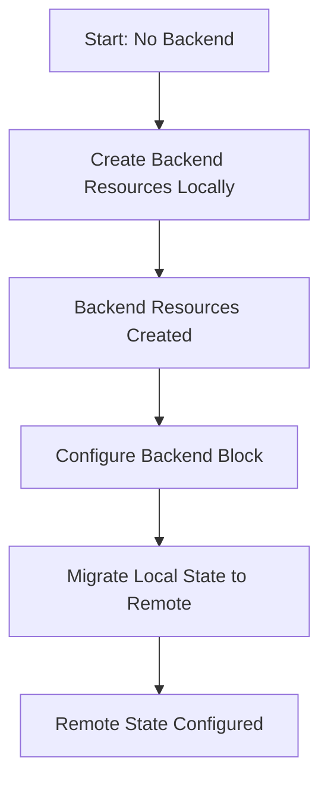

# How to Set Up Initial Terraform Backend Using Terraform

Author: [nawazdhandala](https://www.github.com/nawazdhandala)

Tags: Terraform, Infrastructure as Code, AWS, S3, DynamoDB, Backend

Description: Learn how to bootstrap your Terraform backend infrastructure using Terraform itself, solving the chicken-and-egg problem of creating remote state storage before you can use it.

One of the most common challenges when starting with Terraform is the chicken-and-egg problem: you need a backend to store Terraform state, but you want to create that backend using Terraform. This guide walks you through a practical approach to bootstrap your Terraform backend infrastructure.

## Understanding the Bootstrap Problem

When you run `terraform apply` for the first time, Terraform needs somewhere to store its state file. By default, it stores state locally, but for team collaboration, you need remote state storage. The challenge is creating that remote storage infrastructure without having remote state configured yet.



## The Two-Phase Approach

The solution involves two phases:

1. **Phase 1**: Create backend resources with local state
2. **Phase 2**: Migrate the local state to the newly created backend

### Phase 1: Bootstrap Module

Create a dedicated bootstrap module that creates the necessary backend infrastructure.

```hcl
# bootstrap/main.tf

terraform {
  required_version = ">= 1.0.0"
  required_providers {
    aws = {
      source  = "hashicorp/aws"
      version = "~> 5.0"
    }
  }
}

provider "aws" {
  region = var.aws_region
}

variable "aws_region" {
  description = "AWS region for backend resources"
  type        = string
  default     = "us-east-1"
}

variable "project_name" {
  description = "Project name for resource naming"
  type        = string
}

variable "environment" {
  description = "Environment name"
  type        = string
  default     = "shared"
}

# S3 bucket for Terraform state
resource "aws_s3_bucket" "terraform_state" {
  bucket = "${var.project_name}-terraform-state-${var.environment}"

  lifecycle {
    prevent_destroy = true
  }

  tags = {
    Name        = "Terraform State"
    Environment = var.environment
    ManagedBy   = "terraform-bootstrap"
  }
}

# Enable versioning for state history
resource "aws_s3_bucket_versioning" "terraform_state" {
  bucket = aws_s3_bucket.terraform_state.id
  versioning_configuration {
    status = "Enabled"
  }
}

# Enable server-side encryption
resource "aws_s3_bucket_server_side_encryption_configuration" "terraform_state" {
  bucket = aws_s3_bucket.terraform_state.id

  rule {
    apply_server_side_encryption_by_default {
      sse_algorithm = "aws:kms"
    }
  }
}

# Block public access
resource "aws_s3_bucket_public_access_block" "terraform_state" {
  bucket = aws_s3_bucket.terraform_state.id

  block_public_acls       = true
  block_public_policy     = true
  ignore_public_acls      = true
  restrict_public_buckets = true
}

# DynamoDB table for state locking
resource "aws_dynamodb_table" "terraform_locks" {
  name         = "${var.project_name}-terraform-locks-${var.environment}"
  billing_mode = "PAY_PER_REQUEST"
  hash_key     = "LockID"

  attribute {
    name = "LockID"
    type = "S"
  }

  tags = {
    Name        = "Terraform Lock Table"
    Environment = var.environment
    ManagedBy   = "terraform-bootstrap"
  }
}

# Outputs needed for backend configuration
output "s3_bucket_name" {
  description = "S3 bucket name for Terraform state"
  value       = aws_s3_bucket.terraform_state.id
}

output "s3_bucket_arn" {
  description = "S3 bucket ARN"
  value       = aws_s3_bucket.terraform_state.arn
}

output "dynamodb_table_name" {
  description = "DynamoDB table name for state locking"
  value       = aws_dynamodb_table.terraform_locks.name
}

output "backend_config" {
  description = "Backend configuration block to copy"
  value = <<-EOT
    backend "s3" {
      bucket         = "${aws_s3_bucket.terraform_state.id}"
      key            = "terraform.tfstate"
      region         = "${var.aws_region}"
      encrypt        = true
      dynamodb_table = "${aws_dynamodb_table.terraform_locks.name}"
    }
  EOT
}
```

### Running the Bootstrap

Execute the bootstrap module with local state:

```bash
cd bootstrap
terraform init
terraform plan -var="project_name=myproject"
terraform apply -var="project_name=myproject"
```

After applying, note the output `backend_config` which provides the exact configuration to use.

## Phase 2: Migrating to Remote State

Now create your main Terraform configuration with the backend block:

```hcl
# main.tf

terraform {
  required_version = ">= 1.0.0"

  backend "s3" {
    bucket         = "myproject-terraform-state-shared"
    key            = "main/terraform.tfstate"
    region         = "us-east-1"
    encrypt        = true
    dynamodb_table = "myproject-terraform-locks-shared"
  }

  required_providers {
    aws = {
      source  = "hashicorp/aws"
      version = "~> 5.0"
    }
  }
}

provider "aws" {
  region = "us-east-1"
}

# Your infrastructure resources go here
```

### Migrating Bootstrap State to Remote

To also manage your bootstrap infrastructure with remote state, you can migrate it:

```bash
cd bootstrap

# Add backend configuration
cat >> backend.tf << 'EOF'
terraform {
  backend "s3" {
    bucket         = "myproject-terraform-state-shared"
    key            = "bootstrap/terraform.tfstate"
    region         = "us-east-1"
    encrypt        = true
    dynamodb_table = "myproject-terraform-locks-shared"
  }
}
EOF

# Re-initialize and migrate state
terraform init -migrate-state
```

Terraform will ask if you want to copy the existing state to the new backend - confirm with "yes".

## Advanced: Self-Referencing Backend Module

For more sophisticated setups, you can create a module that manages its own state migration:

```hcl
# backend-self-manage/main.tf

locals {
  bucket_name = "${var.project_name}-terraform-state"
  table_name  = "${var.project_name}-terraform-locks"
}

resource "aws_s3_bucket" "state" {
  bucket = local.bucket_name

  lifecycle {
    prevent_destroy = true
  }
}

resource "aws_s3_bucket_versioning" "state" {
  bucket = aws_s3_bucket.state.id
  versioning_configuration {
    status = "Enabled"
  }
}

resource "aws_dynamodb_table" "locks" {
  name         = local.table_name
  billing_mode = "PAY_PER_REQUEST"
  hash_key     = "LockID"

  attribute {
    name = "LockID"
    type = "S"
  }
}

# Generate backend configuration file
resource "local_file" "backend_config" {
  filename = "${path.module}/generated-backend.tf"
  content  = <<-EOT
    terraform {
      backend "s3" {
        bucket         = "${local.bucket_name}"
        key            = "backend/terraform.tfstate"
        region         = "${var.aws_region}"
        encrypt        = true
        dynamodb_table = "${local.table_name}"
      }
    }
  EOT
}

output "migration_command" {
  value = "Run 'terraform init -migrate-state' to migrate to remote backend"
}
```

## Best Practices

### 1. Separate State Files by Environment

Use different state file keys for different environments:

```hcl
backend "s3" {
  bucket         = "company-terraform-state"
  key            = "environments/production/terraform.tfstate"
  region         = "us-east-1"
  encrypt        = true
  dynamodb_table = "company-terraform-locks"
}
```

### 2. Use Workspaces for Similar Environments

```bash
terraform workspace new staging
terraform workspace new production
terraform workspace select staging
```

### 3. Implement State Bucket Policies

Add IAM policies to restrict who can access state:

```hcl
resource "aws_s3_bucket_policy" "terraform_state" {
  bucket = aws_s3_bucket.terraform_state.id

  policy = jsonencode({
    Version = "2012-10-17"
    Statement = [
      {
        Sid       = "EnforceTLS"
        Effect    = "Deny"
        Principal = "*"
        Action    = "s3:*"
        Resource = [
          aws_s3_bucket.terraform_state.arn,
          "${aws_s3_bucket.terraform_state.arn}/*"
        ]
        Condition = {
          Bool = {
            "aws:SecureTransport" = "false"
          }
        }
      }
    ]
  })
}
```

### 4. Enable Bucket Logging

```hcl
resource "aws_s3_bucket_logging" "terraform_state" {
  bucket = aws_s3_bucket.terraform_state.id

  target_bucket = aws_s3_bucket.logs.id
  target_prefix = "terraform-state-logs/"
}
```

## Automating with a Makefile

Create a Makefile to simplify the bootstrap process:

```makefile
PROJECT_NAME ?= myproject
AWS_REGION ?= us-east-1

.PHONY: bootstrap migrate clean

bootstrap:
	cd bootstrap && \
	terraform init && \
	terraform apply -var="project_name=$(PROJECT_NAME)" -var="aws_region=$(AWS_REGION)" -auto-approve

migrate:
	cd bootstrap && \
	terraform init -migrate-state -force-copy

clean:
	rm -rf bootstrap/.terraform
	rm -f bootstrap/terraform.tfstate*
```

## Troubleshooting Common Issues

### State Lock Error

If you encounter a state lock error:

```bash
terraform force-unlock LOCK_ID
```

### Bucket Already Exists

If the bucket name is taken, modify your naming convention to include a random suffix or account ID:

```hcl
data "aws_caller_identity" "current" {}

resource "aws_s3_bucket" "terraform_state" {
  bucket = "${var.project_name}-tfstate-${data.aws_caller_identity.current.account_id}"
}
```

## Conclusion

Setting up a Terraform backend using Terraform itself requires a two-phase approach but provides a fully automated and reproducible way to bootstrap your infrastructure. By following this pattern, you ensure your backend infrastructure is managed as code and can be easily replicated across different projects or accounts. Remember to always enable versioning and encryption on your state bucket, and use DynamoDB for state locking in team environments.
