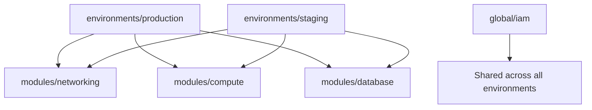

# How to Follow Terraform Best Practices

Author: [nawazdhandala](https://www.github.com/nawazdhandala)

Tags: Terraform, Best Practices, Infrastructure as Code, DevOps, Code Quality

Description: A comprehensive guide to Terraform best practices covering code organization, state management, security, testing, and team collaboration patterns for production-ready infrastructure.

Terraform is powerful but becomes complex quickly. Following established best practices helps maintain readable, secure, and maintainable infrastructure code. This guide covers essential patterns for production-ready Terraform deployments.

## Project Structure

Organize your Terraform code for clarity and reusability:

```
terraform/
├── modules/                    # Reusable modules
│   ├── networking/
│   │   ├── main.tf
│   │   ├── variables.tf
│   │   ├── outputs.tf
│   │   └── README.md
│   ├── compute/
│   └── database/
├── environments/               # Environment-specific configs
│   ├── production/
│   │   ├── main.tf
│   │   ├── variables.tf
│   │   ├── terraform.tfvars
│   │   └── backend.tf
│   ├── staging/
│   └── development/
├── global/                     # Shared resources (IAM, DNS)
│   └── iam/
└── scripts/                    # Helper scripts
```



## File Naming Conventions

Use consistent file naming within each module or environment:

```
module/
├── main.tf           # Primary resources
├── variables.tf      # Input variable declarations
├── outputs.tf        # Output declarations
├── providers.tf      # Provider configurations
├── versions.tf       # Required provider versions
├── data.tf           # Data sources
├── locals.tf         # Local values
└── README.md         # Documentation
```

## Version Constraints

Always pin provider and module versions:

```hcl
# versions.tf
terraform {
  required_version = ">= 1.5.0, < 2.0.0"

  required_providers {
    aws = {
      source  = "hashicorp/aws"
      version = "~> 5.0"  # Allows 5.x but not 6.x
    }
    random = {
      source  = "hashicorp/random"
      version = "~> 3.5"
    }
  }
}
```

Commit the lock file:

```bash
# Always commit this file
git add .terraform.lock.hcl
```

## Variable Best Practices

### Declare Types and Descriptions

```hcl
variable "environment" {
  type        = string
  description = "Deployment environment (development, staging, production)"

  validation {
    condition     = contains(["development", "staging", "production"], var.environment)
    error_message = "Environment must be development, staging, or production."
  }
}

variable "instance_config" {
  type = object({
    instance_type = string
    volume_size   = number
    volume_type   = optional(string, "gp3")
  })
  description = "EC2 instance configuration"

  validation {
    condition     = var.instance_config.volume_size >= 20
    error_message = "Volume size must be at least 20 GB."
  }
}

variable "tags" {
  type        = map(string)
  default     = {}
  description = "Additional tags to apply to all resources"
}
```

### Use Sensitive Flag

```hcl
variable "database_password" {
  type        = string
  sensitive   = true
  description = "Database master password"
}
```

### Provide Defaults Where Appropriate

```hcl
variable "log_retention_days" {
  type        = number
  default     = 30
  description = "CloudWatch log retention in days"
}
```

## Output Best Practices

Document outputs and mark sensitive ones:

```hcl
output "vpc_id" {
  description = "The ID of the VPC"
  value       = aws_vpc.main.id
}

output "database_endpoint" {
  description = "The connection endpoint for the database"
  value       = aws_db_instance.main.endpoint
}

output "database_password" {
  description = "The database master password"
  value       = aws_db_instance.main.password
  sensitive   = true
}
```

## Resource Naming

Use consistent naming patterns:

```hcl
locals {
  name_prefix = "${var.project}-${var.environment}"
}

resource "aws_vpc" "main" {
  cidr_block = var.vpc_cidr

  tags = {
    Name        = "${local.name_prefix}-vpc"
    Environment = var.environment
    Project     = var.project
    ManagedBy   = "terraform"
  }
}

resource "aws_subnet" "private" {
  count             = length(var.availability_zones)
  vpc_id            = aws_vpc.main.id
  cidr_block        = cidrsubnet(var.vpc_cidr, 4, count.index)
  availability_zone = var.availability_zones[count.index]

  tags = {
    Name = "${local.name_prefix}-private-${var.availability_zones[count.index]}"
    Type = "private"
  }
}
```

## Use for_each Over count

Prefer `for_each` for more stable resource addressing:

```hcl
# Avoid: Using count with dynamic lists
resource "aws_subnet" "private" {
  count = length(var.availability_zones)
  # Removing an AZ from the middle causes recreation of others
}

# Better: Using for_each
resource "aws_subnet" "private" {
  for_each = toset(var.availability_zones)

  vpc_id            = aws_vpc.main.id
  cidr_block        = cidrsubnet(var.vpc_cidr, 4, index(var.availability_zones, each.value))
  availability_zone = each.value

  tags = {
    Name = "${local.name_prefix}-private-${each.key}"
  }
}
```

## State Management

### Remote State with Locking

```hcl
terraform {
  backend "s3" {
    bucket         = "company-terraform-state"
    key            = "${var.project}/${var.environment}/terraform.tfstate"
    region         = "us-east-1"
    encrypt        = true
    dynamodb_table = "terraform-locks"
    kms_key_id     = "alias/terraform-state"
  }
}
```

### Organize State by Blast Radius

Split state to limit the impact of changes:

```
states/
├── network/        # VPC, subnets (changes rarely)
├── security/       # IAM, security groups
├── database/       # RDS, ElastiCache
├── compute/        # EC2, ECS, Lambda
└── application/    # App-specific resources
```

## Module Design

### Keep Modules Focused

```hcl
# Good: Single responsibility
module "vpc" {
  source = "./modules/vpc"
  # Only VPC-related variables
}

module "rds" {
  source = "./modules/rds"
  # Only RDS-related variables
}

# Avoid: Kitchen sink modules
module "infrastructure" {
  source = "./modules/infrastructure"
  # Everything mixed together
}
```

### Use Module Composition

```hcl
# Parent module composes child modules
module "networking" {
  source = "./modules/networking"
  # ...
}

module "database" {
  source = "./modules/database"

  vpc_id             = module.networking.vpc_id
  subnet_ids         = module.networking.private_subnet_ids
  security_group_ids = [module.networking.database_security_group_id]
}

module "application" {
  source = "./modules/application"

  vpc_id          = module.networking.vpc_id
  subnet_ids      = module.networking.private_subnet_ids
  database_url    = module.database.connection_string
}
```

## Security Best Practices

### Never Hardcode Secrets

```hcl
# Bad
resource "aws_db_instance" "main" {
  password = "hardcoded-password"  # Never do this
}

# Good
resource "aws_db_instance" "main" {
  manage_master_user_password = true  # AWS manages the password
}

# Or reference from secrets manager
data "aws_secretsmanager_secret_version" "db" {
  secret_id = aws_secretsmanager_secret.db.id
}
```

### Use Least Privilege IAM

```hcl
# Specific permissions, not admin
resource "aws_iam_role_policy" "lambda" {
  name = "lambda-execution-policy"
  role = aws_iam_role.lambda.id

  policy = jsonencode({
    Version = "2012-10-17"
    Statement = [
      {
        Effect = "Allow"
        Action = [
          "s3:GetObject",
          "s3:PutObject"
        ]
        Resource = "${aws_s3_bucket.data.arn}/*"
      }
    ]
  })
}
```

### Enable Encryption by Default

```hcl
resource "aws_s3_bucket_server_side_encryption_configuration" "main" {
  bucket = aws_s3_bucket.main.id

  rule {
    apply_server_side_encryption_by_default {
      sse_algorithm     = "aws:kms"
      kms_master_key_id = aws_kms_key.main.arn
    }
    bucket_key_enabled = true
  }
}
```

## Testing and Validation

### Use terraform validate

```bash
terraform validate
```

### Implement Pre-commit Hooks

```yaml
# .pre-commit-config.yaml
repos:
  - repo: https://github.com/antonbabenko/pre-commit-terraform
    rev: v1.83.5
    hooks:
      - id: terraform_fmt
      - id: terraform_validate
      - id: terraform_tflint
      - id: terraform_docs
      - id: terraform_checkov
```

### Use tflint for Linting

```hcl
# .tflint.hcl
plugin "aws" {
  enabled = true
  version = "0.27.0"
  source  = "github.com/terraform-linters/tflint-ruleset-aws"
}

rule "terraform_naming_convention" {
  enabled = true
}

rule "terraform_documented_variables" {
  enabled = true
}
```

### Write Tests with Terratest

```go
func TestVPCModule(t *testing.T) {
    terraformOptions := &terraform.Options{
        TerraformDir: "../modules/vpc",
        Vars: map[string]interface{}{
            "vpc_cidr":    "10.0.0.0/16",
            "environment": "test",
        },
    }

    defer terraform.Destroy(t, terraformOptions)
    terraform.InitAndApply(t, terraformOptions)

    vpcId := terraform.Output(t, terraformOptions, "vpc_id")
    assert.Regexp(t, "^vpc-", vpcId)
}
```

## Documentation

### Document Modules with terraform-docs

```bash
terraform-docs markdown table ./modules/vpc > ./modules/vpc/README.md
```

Example output:

```markdown
## Requirements

| Name | Version |
|------|---------|
| terraform | >= 1.5.0 |
| aws | ~> 5.0 |

## Inputs

| Name | Description | Type | Default | Required |
|------|-------------|------|---------|:--------:|
| vpc_cidr | CIDR block for VPC | `string` | n/a | yes |

## Outputs

| Name | Description |
|------|-------------|
| vpc_id | The ID of the VPC |
```

## CI/CD Integration

### GitHub Actions Example

```yaml
name: Terraform

on:
  pull_request:
    branches: [main]
  push:
    branches: [main]

jobs:
  terraform:
    runs-on: ubuntu-latest
    steps:
      - uses: actions/checkout@v4

      - uses: hashicorp/setup-terraform@v3
        with:
          terraform_version: 1.6.0

      - name: Terraform Format
        run: terraform fmt -check -recursive

      - name: Terraform Init
        run: terraform init -backend=false

      - name: Terraform Validate
        run: terraform validate

      - name: Run tflint
        uses: terraform-linters/setup-tflint@v4
      - run: tflint --init && tflint

      - name: Terraform Plan
        if: github.event_name == 'pull_request'
        run: terraform plan -no-color
        env:
          AWS_ACCESS_KEY_ID: ${{ secrets.AWS_ACCESS_KEY_ID }}
          AWS_SECRET_ACCESS_KEY: ${{ secrets.AWS_SECRET_ACCESS_KEY }}
```

## Summary Checklist

- [ ] Pin Terraform and provider versions
- [ ] Use remote state with locking
- [ ] Organize code into focused modules
- [ ] Document variables and outputs
- [ ] Never hardcode secrets
- [ ] Use for_each over count where possible
- [ ] Implement consistent naming conventions
- [ ] Enable encryption on all resources
- [ ] Set up pre-commit hooks
- [ ] Include terraform-docs in modules
- [ ] Use CI/CD for validation and deployment

Following these best practices leads to Terraform code that is maintainable, secure, and scales with your team. Start with the basics and gradually adopt more advanced patterns as your infrastructure grows.
